# SQL Handbook for Interviews
## File 01 — Database Fundamentals

### Covers: Data, Database, DBMS, RDBMS, SQL, Architecture, Tables, Rows, Columns, Schema, Relationships, ER Diagrams, SQL Categories

---

# Table of Contents

1. [What is Data?](#1-what-is-data)
2. [What is a Database?](#2-what-is-a-database)
3. [What is a DBMS?](#3-what-is-a-dbms)
4. [What is an RDBMS?](#4-what-is-an-rdbms)
5. [What is SQL?](#5-what-is-sql)
6. [Database Architecture](#6-database-architecture)
7. [Tables, Rows and Columns](#7-tables-rows-and-columns)
8. [Schema](#8-schema)
9. [Relationships](#9-relationships)
10. [ER Diagram](#10-er-diagram)
11. [SQL Categories](#11-sql-categories)
12. [Practice Questions](#12-practice-questions)

---

# 1. What is Data?

### Definition

**Data** is any raw, unprocessed fact, figure, symbol, or value that on its own may or may not carry meaning.

- Data becomes **information** when it is processed, organized, and given context.
- In SQL, we deal almost exclusively with **structured data** — data that fits neatly into rows and columns.

> Example: `45000` is data. `"Employee salary is 45000"` is information.

---

### Why Do We Use It?

| Reason | Explanation |
|---|---|
| Decision Making | Businesses use data to make strategic decisions |
| Automation | Systems use data to trigger automated workflows |
| Machine Learning | ML models train on large datasets |
| Analytics | Data reveals patterns, trends, and insights |
| Storage & Retrieval | Applications store and fetch data constantly |

---

### Types of Data

#### Based on Structure

| Type | Description | Example |
|---|---|---|
| Structured | Organized in rows and columns | SQL tables, Excel sheets |
| Semi-Structured | Partially organized | JSON, XML, CSV |
| Unstructured | No fixed format | Images, videos, PDFs, emails |

#### Based on Nature

| Type | Description | Example |
|---|---|---|
| Quantitative | Numeric and measurable | Salary, age, price |
| Qualitative | Descriptive and categorical | Name, gender, city |

#### Based on Time

| Type | Description | Example |
|---|---|---|
| Static | Rarely changes | Date of birth, country code |
| Dynamic | Frequently changes | Stock price, order status |

---

### Real-World Example

**Banking System**

| Column | Value | Type |
|---|---|---|
| `account_id` | 10023 | Quantitative |
| `account_holder` | Jane Doe | Qualitative |
| `balance` | 52000.75 | Quantitative |
| `account_type` | Savings | Qualitative |
| `is_active` | TRUE | Boolean |
| `created_at` | 2021-06-15 | Date |

---

### Data vs Information vs Knowledge

| Term | Definition | Example |
|---|---|---|
| Data | Raw facts | `45000` |
| Information | Processed data with context | Salary is 45,000 |
| Knowledge | Understanding derived from information | This salary is above market average |

---

### Common Mistakes

- Confusing **data** with **information** — they are not the same.
- Assuming SQL only stores text and numbers — it also stores JSON, XML, and BLOBs.
- Forgetting that `NULL` is valid data, representing missing or unknown values.
- Treating all data as static — most real-world data is dynamic.

---

# 2. What is a Database?

### Definition

A **database** is an organized collection of structured data stored electronically so that it can be easily accessed, managed, and updated.

- It is not just a file or spreadsheet.
- It is a **system** designed for reliable, consistent, and efficient data storage at scale.
- Databases are managed by software called a **Database Management System (DBMS)**.

---

### Why Do We Use a Database?

| Problem Without a Database | How a Database Solves It |
|---|---|
| Data scattered across files | Centralized and organized storage |
| No multi-user access | Concurrent access with access control |
| Data duplication | Normalization removes redundancy |
| No data validation | Constraints enforce integrity |
| Hard to search large files | Indexes enable fast queries |
| No crash recovery | Transactions and backups protect data |
| No security | Role-based access control |

---

### Types of Databases

| Type | Description | Examples |
|---|---|---|
| Relational (SQL) | Data in tables with relationships | MySQL, PostgreSQL, Oracle |
| Document | Data as JSON/BSON documents | MongoDB, CouchDB |
| Key-Value | Simple key-value pairs | Redis, DynamoDB |
| Columnar | Data stored column by column | Cassandra, BigQuery |
| Graph | Data as nodes and edges | Neo4j, Amazon Neptune |
| Time-Series | Optimized for time-stamped data | InfluxDB, TimescaleDB |

---

### OLTP vs OLAP

This is one of the most common distinctions tested in interviews.

| Feature | OLTP | OLAP |
|---|---|---|
| Purpose | Day-to-day transactions | Analytics and reporting |
| Query Type | Simple INSERT, UPDATE, SELECT | Complex aggregations |
| Data Volume | Thousands of rows | Millions to billions of rows |
| Response Time | Milliseconds | Seconds to minutes |
| Example | Order placement | Monthly sales report |
| Database | MySQL, PostgreSQL | BigQuery, Redshift, Snowflake |
| Normalization | Highly normalized | Denormalized |

---

### Database Lifecycle

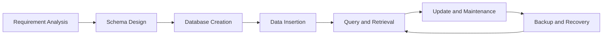

---

# 3. What is a DBMS?

### Definition

A **Database Management System (DBMS)** is software that acts as an interface between the user or application and the database.

- It handles storage, security, concurrency, backup, and recovery.
- Without a DBMS, applications would need to manage raw files on disk manually.

> The database stores the data. The DBMS is the engine that manages it.

---

### Core Functions of a DBMS

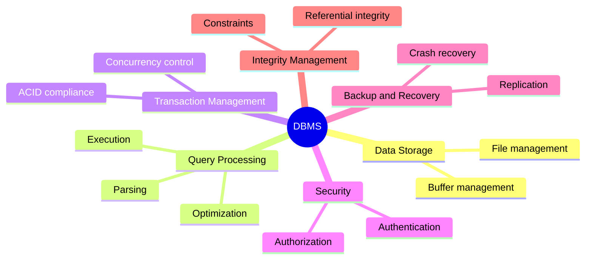

---

### DBMS Architecture

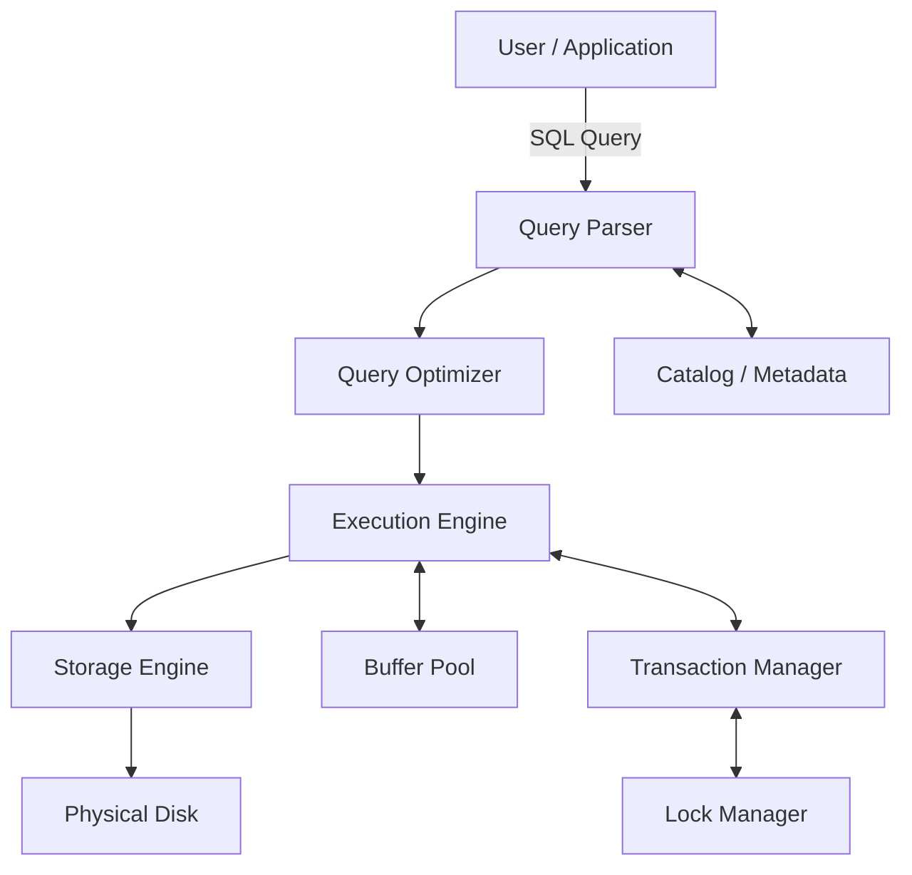

---

### DBMS vs File System

| Feature | File System | DBMS |
|---|---|---|
| Data Storage | Flat files | Structured tables |
| Querying | Manual code | SQL |
| Concurrency | No built-in support | Built-in locking |
| Data Integrity | No constraints | Constraints enforced |
| Security | OS-level only | Role-based access |
| Crash Recovery | Risk of data loss | Transaction rollback |

---

### Popular DBMS Software

| DBMS | Type | Best Used For |
|---|---|---|
| MySQL | RDBMS | Web apps, OLTP |
| PostgreSQL | RDBMS | Advanced SQL, analytics |
| Oracle DB | RDBMS | Enterprise, banking |
| SQL Server | RDBMS | Microsoft ecosystem |
| SQLite | RDBMS | Mobile, embedded systems |
| MongoDB | Document | Flexible schema |
| Redis | Key-Value | Caching, sessions |
| BigQuery | Columnar/Cloud | Data warehouse |

---

# 4. What is an RDBMS?

### Definition

A **Relational Database Management System (RDBMS)** is a type of DBMS that stores data in **tables** (relations) and enforces relationships between them using **keys**.

- Invented by **Edgar F. Codd** in 1970.
- Based on **Relational Model** — data is represented as mathematical relations (tables).
- All interaction happens through **SQL**.

---

### DBMS vs RDBMS

| Feature | DBMS | RDBMS |
|---|---|---|
| Data Model | Any model | Strictly relational (tables) |
| Relationships | Not enforced | Enforced via foreign keys |
| SQL Support | May not support SQL | Always supports SQL |
| Normalization | Optional | Core principle |
| ACID Compliance | Partial or none | Full ACID support |
| Examples | File-based, IMS | MySQL, PostgreSQL, Oracle |

> All RDBMS are DBMS, but not all DBMS are RDBMS.

---

### Core Properties of an RDBMS

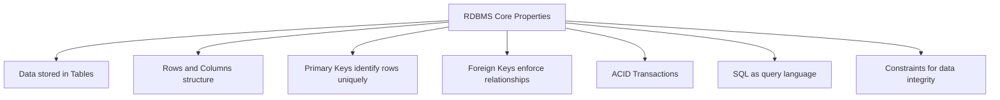

---

### Codd's 12 Rules (Simplified)

Edgar Codd defined 12 rules that a true RDBMS must follow. The most important ones for interviews:

| Rule | Description |
|---|---|
| Rule 1 — Information Rule | All data must be stored in tables |
| Rule 2 — Guaranteed Access | Every data item accessible by table name + primary key + column name |
| Rule 3 — Null Treatment | NULL must be supported for missing data |
| Rule 6 — View Updating | Views must be updatable where possible |
| Rule 8 — Physical Independence | Physical storage can change without affecting queries |
| Rule 9 — Logical Independence | Schema can change without affecting applications |

---

### Real-World Example

**E-commerce RDBMS Structure**

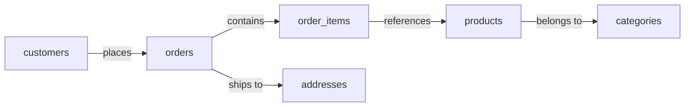

Each box is a **table**. Each arrow is a **relationship** enforced by keys.

---

# 5. What is SQL?

### Definition

**SQL (Structured Query Language)** is the standard language used to communicate with a relational database.

- Pronounced **"S-Q-L"** or **"sequel"** — both are accepted.
- SQL is **declarative** — you describe *what* you want, not *how* to get it.
- The DBMS figures out the most efficient way to retrieve or manipulate the data.

---

### Why Do We Use SQL?

| Reason | Explanation |
|---|---|
| Standard language | Works across MySQL, PostgreSQL, Oracle, SQL Server |
| Declarative | Simple to write and understand |
| Powerful | Handles everything from simple lookups to complex analytics |
| Universal | Used by developers, analysts, data engineers, and ML engineers |

---

### SQL vs Other Languages

| Feature | SQL | Python / Java |
|---|---|---|
| Type | Declarative | Imperative |
| Purpose | Query and manipulate data | General-purpose programming |
| Learning Curve | Low | Medium to High |
| Execution | Handled by DBMS | Handled by runtime |
| Best For | Data retrieval, transformation | Application logic, algorithms |

---

### Basic SQL Syntax

```sql
-- Retrieve all employees in the Engineering department
SELECT name, salary
FROM employees
WHERE department = 'Engineering'
ORDER BY salary DESC;
```

**Syntax Breakdown:**

| Keyword | Purpose |
|---|---|
| `SELECT` | Specifies which columns to return |
| `FROM` | Specifies the source table |
| `WHERE` | Filters rows based on a condition |
| `ORDER BY` | Sorts the result set |
| `DESC` | Sorts in descending order |

---

### SQL Flavors — Key Differences

| Feature | MySQL | PostgreSQL | SQL Server | Oracle |
|---|---|---|---|---|
| Auto Increment | `AUTO_INCREMENT` | `SERIAL` or `GENERATED` | `IDENTITY` | `SEQUENCE` |
| String concat | `CONCAT()` | `\|\|` or `CONCAT()` | `+` or `CONCAT()` | `\|\|` |
| Limit rows | `LIMIT n` | `LIMIT n` | `TOP n` | `ROWNUM` / `FETCH` |
| Case sensitive | No (default) | Yes (default) | No (default) | No (default) |
| JSON support | Yes (5.7+) | Advanced | Yes | Yes |

---

# 6. Database Architecture

### Definition

**Database architecture** refers to how a database system is structured internally and how it communicates with users, applications, and storage.

---

### Three-Schema Architecture (ANSI/SPARC)

This is the standard architecture for understanding how a DBMS abstracts data at different levels.

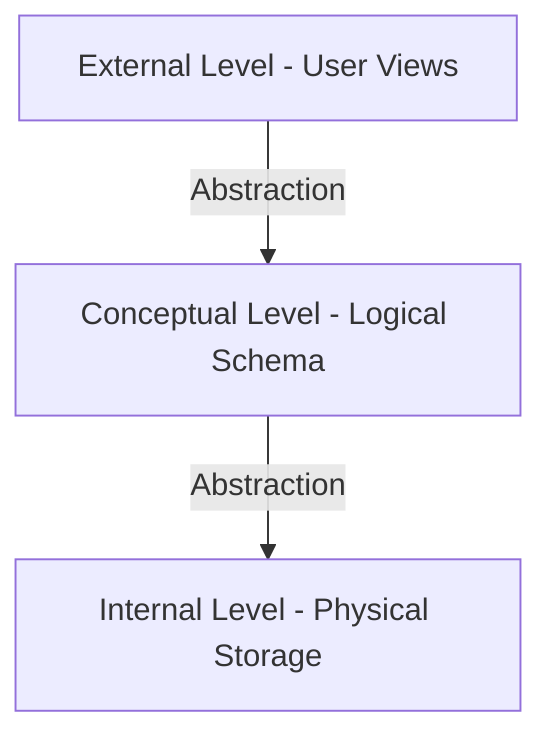

| Level | Also Called | Description |
|---|---|---|
| External | View Level | What each user or application sees |
| Conceptual | Logical Level | The full logical schema — all tables, relationships, constraints |
| Internal | Physical Level | How data is physically stored on disk |

---

### Why Three Levels?

- **Data Independence** — Changes at the physical level (e.g., moving to SSD) should not affect the logical level.
- **Security** — Different users see only the views relevant to them.
- **Abstraction** — Developers work at the logical level without worrying about disk pages.

---

### Two-Tier vs Three-Tier Architecture

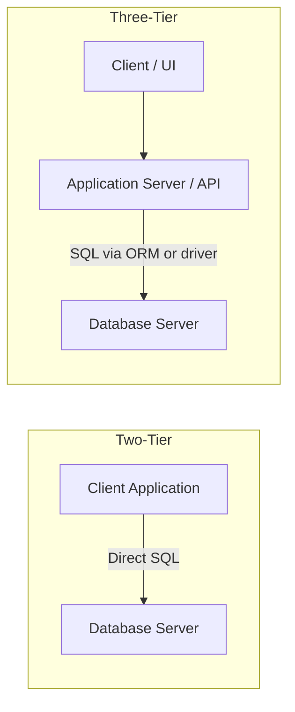

| Feature | Two-Tier | Three-Tier |
|---|---|---|
| Architecture | Client talks directly to DB | Client → App Server → DB |
| Security | Lower | Higher |
| Scalability | Limited | High |
| Used In | Desktop apps, tools | Web apps, APIs, microservices |
| Example | SQL client tool | React → Node.js → PostgreSQL |

---

### Client-Server Database Architecture

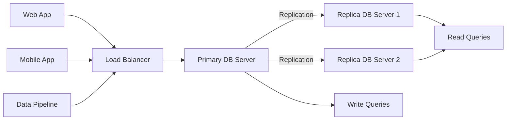

- **Primary server** handles all **writes**.
- **Replica servers** handle **reads** — distributes load.
- This is the standard architecture for high-traffic production systems.

---

# 7. Tables, Rows and Columns

### Definition

| Term | Definition |
|---|---|
| **Table** | A structured collection of related data organized in rows and columns |
| **Row** | A single record in a table (also called a tuple) |
| **Column** | A single attribute or field in a table (also called an attribute) |
| **Cell** | The intersection of a row and a column — holds a single value |

---

### Visual Representation

```
Table: employees

+-------------+-------------+-------------+---------+------------+
| employee_id | name        | department  | salary  | hire_date  |
+-------------+-------------+-------------+---------+------------+  <- Column Headers
| 1           | Alice Brown | Engineering | 95000   | 2020-03-15 |  <- Row 1
| 2           | Bob Smith   | Marketing   | 72000   | 2019-07-01 |  <- Row 2
| 3           | Carol White | Engineering | 105000  | 2018-11-20 |  <- Row 3
+-------------+-------------+-------------+---------+------------+
     ^                ^             ^           ^          ^
  Column 1         Column 2     Column 3    Column 4   Column 5
```

---

### Terminology Reference

| Term | SQL Standard | Also Called |
|---|---|---|
| Table | Table | Relation |
| Row | Row | Record, Tuple |
| Column | Column | Field, Attribute |
| Value | Cell value | Data item |

---

### Creating a Table

```sql
-- MySQL
CREATE TABLE employees (
    employee_id   INT PRIMARY KEY AUTO_INCREMENT,
    name          VARCHAR(100)   NOT NULL,
    department    VARCHAR(50),
    salary        DECIMAL(10, 2) DEFAULT 0.00,
    hire_date     DATE
);
```

```sql
-- PostgreSQL
CREATE TABLE employees (
    employee_id   SERIAL PRIMARY KEY,
    name          VARCHAR(100)   NOT NULL,
    department    VARCHAR(50),
    salary        NUMERIC(10, 2) DEFAULT 0.00,
    hire_date     DATE
);
```

---

### Inserting Rows

```sql
INSERT INTO employees (name, department, salary, hire_date)
VALUES
    ('Alice Brown', 'Engineering', 95000, '2020-03-15'),
    ('Bob Smith',   'Marketing',   72000, '2019-07-01'),
    ('Carol White', 'Engineering', 105000, '2018-11-20');
```

---

### Querying Columns and Rows

```sql
-- Select specific columns (not SELECT *)
SELECT name, salary
FROM employees
WHERE department = 'Engineering';
```

**Output:**

| name | salary |
|---|---|
| Alice Brown | 95000 |
| Carol White | 105000 |

---

### Best Practices for Tables

- Always define a **primary key** for every table.
- Use **singular nouns** for table names: `employee` or `employees` — be consistent.
- Use `snake_case` for column names: `hire_date`, `employee_id`.
- Avoid using **reserved SQL keywords** as column names (`name`, `date`, `order` are risky).
- Never use `SELECT *` in production queries — always specify columns explicitly.

---

# 8. Schema

### Definition

A **schema** is a logical container or namespace inside a database that groups related tables, views, indexes, procedures, and other objects together.

- Think of it as a **folder** inside the database.
- A single database can have **multiple schemas**.
- Schemas help with **organization, access control, and avoiding naming conflicts**.

---

### Database → Schema → Table Hierarchy

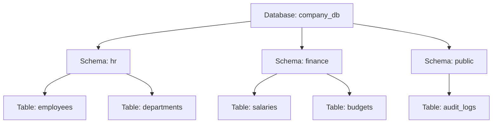

---

### Syntax

```sql
-- Create a schema
CREATE SCHEMA hr;

-- Create a table inside a schema
CREATE TABLE hr.employees (
    employee_id INT PRIMARY KEY,
    name        VARCHAR(100)
);

-- Query using schema prefix
SELECT * FROM hr.employees;
```

---

### Schema vs Database

| Feature | Schema | Database |
|---|---|---|
| Level | Inside a database | Top-level container |
| Purpose | Logical grouping of objects | Physical storage container |
| Multiple | Yes — one DB can have many schemas | Yes — one server can have many databases |
| Access Control | Can restrict per schema | Can restrict per database |

---

### Default Schemas by DBMS

| DBMS | Default Schema |
|---|---|
| MySQL | No formal schema — database = schema |
| PostgreSQL | `public` |
| SQL Server | `dbo` |
| Oracle | Schema = username |

> In MySQL, the terms "database" and "schema" are interchangeable. In PostgreSQL and SQL Server, they are distinct.

---

### Real-World Example

**Hospital Database**

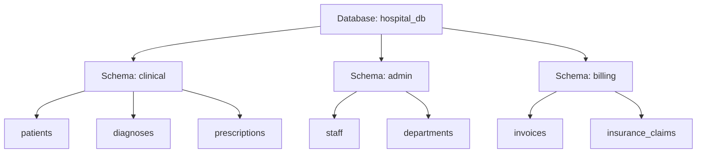

Different teams own different schemas — billing team cannot accidentally drop clinical tables.

---

# 9. Relationships

### Definition

A **relationship** in a relational database defines how data in one table is connected to data in another table.

- Relationships are enforced using **Primary Keys** and **Foreign Keys**.
- They prevent **orphan records** and maintain **referential integrity**.

---

### Types of Relationships

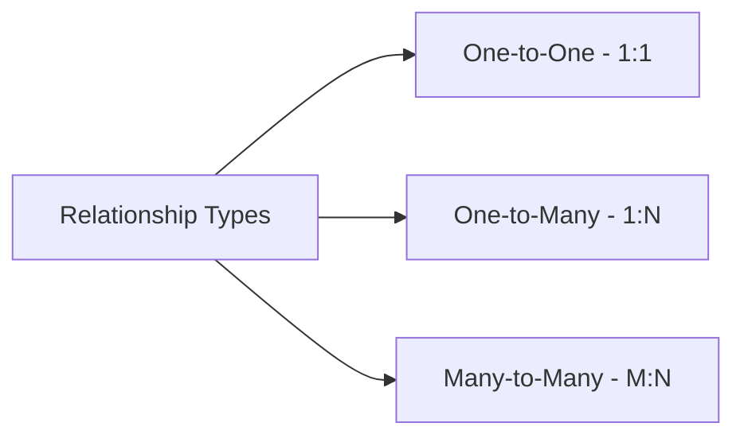

---

#### 1. One-to-One (1:1)

Each record in Table A relates to **exactly one** record in Table B, and vice versa.

**Example:** Each employee has exactly one passport.

```sql
CREATE TABLE employees (
    employee_id INT PRIMARY KEY,
    name        VARCHAR(100)
);

CREATE TABLE passports (
    passport_id  INT PRIMARY KEY,
    employee_id  INT UNIQUE,           -- UNIQUE enforces 1:1
    passport_no  VARCHAR(50),
    FOREIGN KEY (employee_id) REFERENCES employees(employee_id)
);
```

---

#### 2. One-to-Many (1:N)

One record in Table A relates to **many** records in Table B. This is the most common relationship.

**Example:** One customer places many orders.

```sql
CREATE TABLE customers (
    customer_id INT PRIMARY KEY,
    name        VARCHAR(100)
);

CREATE TABLE orders (
    order_id    INT PRIMARY KEY,
    customer_id INT,
    order_date  DATE,
    FOREIGN KEY (customer_id) REFERENCES customers(customer_id)
);
```

---

#### 3. Many-to-Many (M:N)

Many records in Table A relate to many records in Table B. Requires a **junction table** (also called a bridge or associative table).

**Example:** Students enroll in many courses. Courses have many students.

```sql
CREATE TABLE students (
    student_id INT PRIMARY KEY,
    name       VARCHAR(100)
);

CREATE TABLE courses (
    course_id  INT PRIMARY KEY,
    title      VARCHAR(100)
);

-- Junction table
CREATE TABLE enrollments (
    student_id INT,
    course_id  INT,
    enrolled_at DATE,
    PRIMARY KEY (student_id, course_id),
    FOREIGN KEY (student_id) REFERENCES students(student_id),
    FOREIGN KEY (course_id)  REFERENCES courses(course_id)
);
```

---

### Referential Integrity

Referential integrity ensures that a **foreign key value always points to a valid primary key**.

```sql
-- ON DELETE CASCADE: delete child rows when parent is deleted
-- ON DELETE SET NULL: set foreign key to NULL when parent is deleted
-- ON DELETE RESTRICT: prevent deleting parent if child rows exist

CREATE TABLE orders (
    order_id    INT PRIMARY KEY,
    customer_id INT,
    FOREIGN KEY (customer_id) REFERENCES customers(customer_id)
        ON DELETE CASCADE
        ON UPDATE CASCADE
);
```

| Option | Behavior |
|---|---|
| `CASCADE` | Delete/update child rows automatically |
| `SET NULL` | Set FK to NULL when parent is deleted |
| `RESTRICT` | Block delete if child rows exist |
| `NO ACTION` | Similar to RESTRICT (default in most DBMS) |

---

# 10. ER Diagram

### Definition

An **Entity-Relationship (ER) Diagram** is a visual representation of the entities (tables) in a database and the relationships between them.

- Used during the **database design phase** before writing any SQL.
- Helps communicate schema design to the entire team.

---

### ER Diagram Components

| Symbol | Represents |
|---|---|
| Rectangle | Entity (Table) |
| Ellipse | Attribute (Column) |
| Diamond | Relationship |
| Line | Connection between entity and relationship |
| Double Rectangle | Weak Entity |
| Underlined Attribute | Primary Key |

---

### Cardinality Notation (Crow's Foot)

```
One and only one  ---|---
Zero or one       ---O---
One or many       ---|<--
Zero or many      ---O<--
```

---

### ER Diagram — E-commerce Example

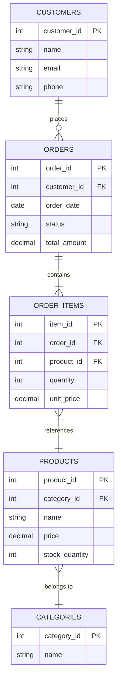

---

### ER Diagram — Hospital Example

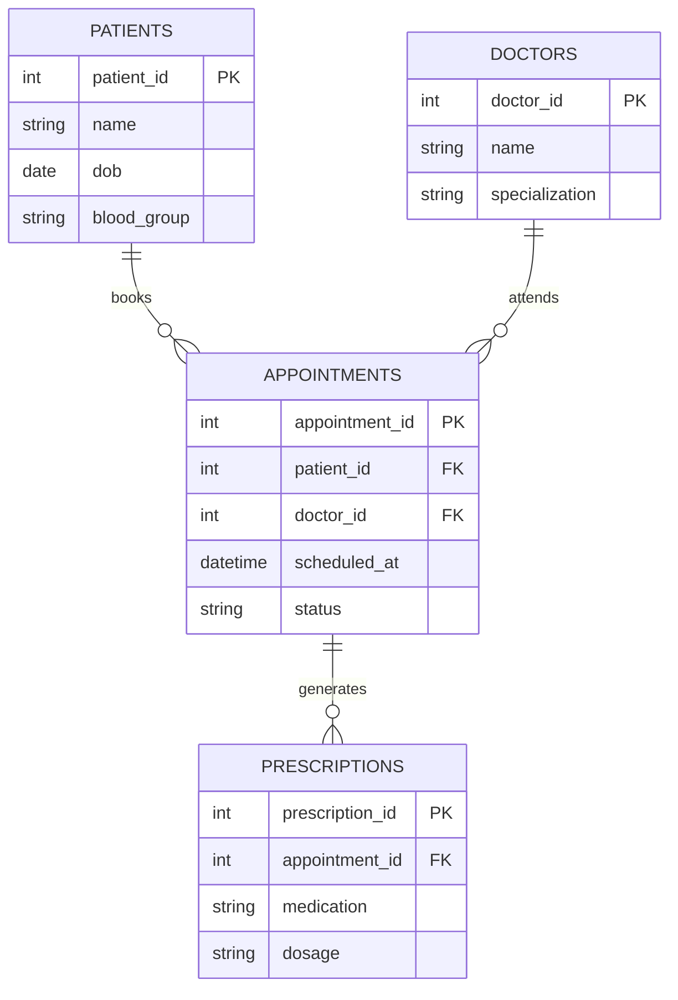

---

### Steps to Design an ER Diagram

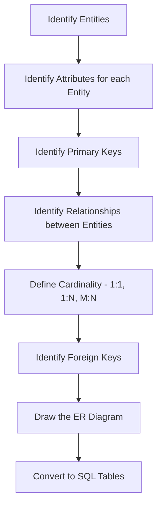

---

# 11. SQL Categories

### Definition

SQL commands are grouped into **five categories** based on their purpose.

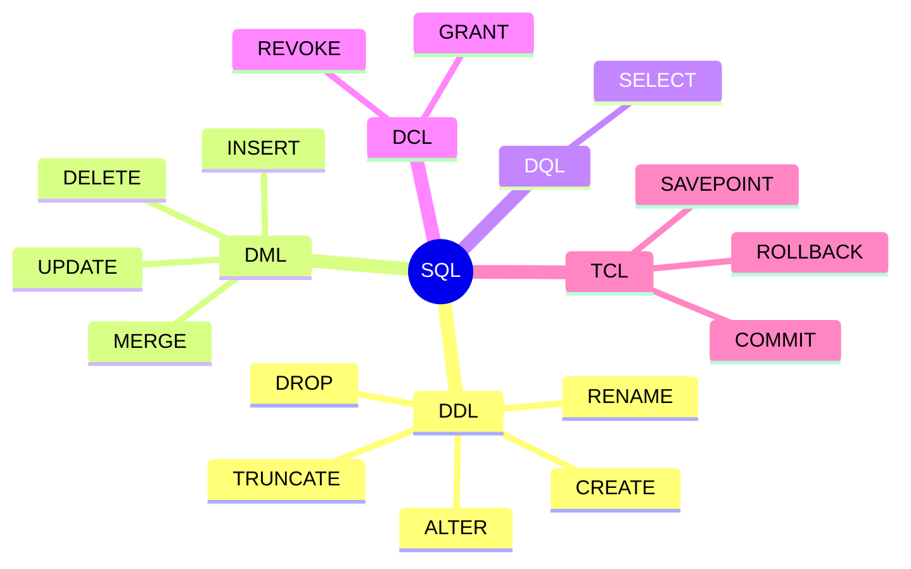

---

### DDL — Data Definition Language

**DDL** commands define and modify the **structure** of database objects.

- Changes are **auto-committed** — they cannot be rolled back in most DBMS.

| Command | Purpose |
|---|---|
| `CREATE` | Create a new table, view, index, or database |
| `ALTER` | Modify an existing table structure |
| `DROP` | Delete a table or database permanently |
| `TRUNCATE` | Remove all rows from a table, keep structure |
| `RENAME` | Rename a table or column |

```sql
-- CREATE
CREATE TABLE products (
    product_id   INT PRIMARY KEY AUTO_INCREMENT,
    name         VARCHAR(100) NOT NULL,
    price        DECIMAL(10, 2),
    created_at   TIMESTAMP DEFAULT CURRENT_TIMESTAMP
);

-- ALTER: add a column
ALTER TABLE products ADD COLUMN category VARCHAR(50);

-- ALTER: modify a column
ALTER TABLE products MODIFY COLUMN price DECIMAL(12, 2);

-- RENAME
ALTER TABLE products RENAME TO inventory;

-- TRUNCATE
TRUNCATE TABLE inventory;

-- DROP
DROP TABLE inventory;
```

---

### DML — Data Manipulation Language

**DML** commands manipulate the **data inside tables**.

- Changes can be **rolled back** if inside a transaction.

| Command | Purpose |
|---|---|
| `INSERT` | Add new rows |
| `UPDATE` | Modify existing rows |
| `DELETE` | Remove specific rows |
| `MERGE` | Insert or update based on condition (upsert) |

```sql
-- INSERT
INSERT INTO products (name, price, category)
VALUES ('Wireless Keyboard', 49.99, 'Electronics');

-- UPDATE
UPDATE products
SET price = 44.99
WHERE name = 'Wireless Keyboard';

-- DELETE
DELETE FROM products
WHERE price < 5.00;
```

---

### DQL — Data Query Language

**DQL** is used to **retrieve data** from the database.

| Command | Purpose |
|---|---|
| `SELECT` | Query data from one or more tables |

```sql
-- Basic SELECT
SELECT name, price
FROM products
WHERE category = 'Electronics'
ORDER BY price ASC
LIMIT 10;
```

> Some references include `SELECT` under DML. In interviews, if asked separately, DQL refers specifically to `SELECT`.

---

### DCL — Data Control Language

**DCL** commands control **access and permissions** on database objects.

| Command | Purpose |
|---|---|
| `GRANT` | Give a user permission to perform operations |
| `REVOKE` | Remove a previously granted permission |

```sql
-- Grant SELECT and INSERT to a user
GRANT SELECT, INSERT ON employees TO 'analyst_user'@'localhost';

-- Revoke INSERT permission
REVOKE INSERT ON employees FROM 'analyst_user'@'localhost';
```

**Common Permissions:**

| Permission | Allows |
|---|---|
| `SELECT` | Read data |
| `INSERT` | Add rows |
| `UPDATE` | Modify rows |
| `DELETE` | Remove rows |
| `ALL PRIVILEGES` | Full access |
| `CREATE` | Create tables/databases |
| `DROP` | Drop tables/databases |

---

### TCL — Transaction Control Language

**TCL** commands manage **transactions** — groups of SQL operations that must succeed or fail together.

| Command | Purpose |
|---|---|
| `COMMIT` | Save all changes in the current transaction |
| `ROLLBACK` | Undo all changes since the last commit |
| `SAVEPOINT` | Set a point within a transaction to roll back to |

```sql
-- Transaction example: Bank transfer
START TRANSACTION;

UPDATE accounts SET balance = balance - 5000 WHERE account_id = 101;
UPDATE accounts SET balance = balance + 5000 WHERE account_id = 202;

-- If both succeed:
COMMIT;

-- If anything fails:
ROLLBACK;
```

```sql
-- Using SAVEPOINT
START TRANSACTION;

INSERT INTO orders (customer_id, total) VALUES (1, 500);
SAVEPOINT after_order;

INSERT INTO order_items (order_id, product_id) VALUES (1, 99);

-- Only roll back the last insert, keep the order
ROLLBACK TO SAVEPOINT after_order;

COMMIT;
```

---

### SQL Categories — Summary Table

| Category | Full Name | Commands | Auto-commit? | Rollback? |
|---|---|---|---|---|
| DDL | Data Definition Language | CREATE, ALTER, DROP, TRUNCATE, RENAME | Yes | No |
| DML | Data Manipulation Language | INSERT, UPDATE, DELETE, MERGE | No | Yes |
| DQL | Data Query Language | SELECT | N/A | N/A |
| DCL | Data Control Language | GRANT, REVOKE | Yes | No |
| TCL | Transaction Control Language | COMMIT, ROLLBACK, SAVEPOINT | N/A | Yes |

---

### Common Interview Questions — Full File

1. What is the difference between data and information?
2. What is a database? How is it different from a spreadsheet?
3. What is the difference between a DBMS and an RDBMS?
4. What are the core functions of a DBMS?
5. What is the difference between OLTP and OLAP?
6. Explain the three-schema architecture of a DBMS.
7. What are Codd's 12 rules? Name the most important ones.
8. What is the difference between a schema and a database?
9. What is a primary key? What is a foreign key?
10. What are the three types of relationships in a relational database?
11. What is referential integrity? How is it enforced?
12. What is an ER diagram? What are its components?
13. What is the difference between DDL and DML?
14. Can DDL statements be rolled back?
15. What is the difference between DELETE and TRUNCATE?
16. What is the difference between DROP and TRUNCATE?
17. What is GRANT and REVOKE used for?
18. What is a transaction? Why do we need TCL?
19. What is a SAVEPOINT and when would you use it?
20. What is the difference between DQL and DML?

---

### Common Mistakes

- Confusing DBMS with the database itself — the DBMS is the software, the database is the data.
- Assuming MySQL schema and PostgreSQL schema mean the same thing — in MySQL, schema = database.
- Thinking DDL commands can be rolled back — in most DBMS they auto-commit.
- Forgetting that `TRUNCATE` is DDL, not DML — it cannot be rolled back in MySQL.
- Using `DELETE` without a `WHERE` clause in production — deletes all rows.
- Confusing `DROP` (deletes structure + data) with `TRUNCATE` (deletes only data, keeps structure).
- Not defining a primary key — every table should have one.
- Treating `SELECT` as DML — it is DQL (read-only, no data modification).

---

### Best Practices

- Always design your ER diagram before writing SQL.
- Use schemas to logically separate different domains within the same database.
- Always use transactions for multi-step DML operations.
- Grant only the **minimum required permissions** to each user or role.
- Prefer `TRUNCATE` over `DELETE` when removing all rows for performance.
- Document your schema using a data dictionary or ER diagram in your repository.
- Use consistent naming conventions (`snake_case`, singular or plural — pick one and stick with it).

---

### Performance Tips

- `TRUNCATE` is significantly faster than `DELETE` for removing all rows — it does not log individual row deletions.
- `DROP` and `CREATE` are faster than `ALTER` for large structural changes in development.
- Limit `GRANT` usage at the column level only when truly needed — table-level grants are simpler to manage.
- Always run schema changes (DDL) during low-traffic windows in production — they can lock tables.

---

### Summary

| Concept | Key Takeaway |
|---|---|
| Data | Raw facts — the foundation of everything |
| Database | Organized, electronic collection of structured data |
| DBMS | Software that manages the database |
| RDBMS | DBMS using relational model with SQL |
| SQL | Standard language for relational databases |
| Table | Data organized in rows and columns |
| Schema | Logical namespace grouping related tables |
| Relationships | 1:1, 1:N, M:N — enforced by keys |
| ER Diagram | Visual blueprint of database design |
| DDL | Defines structure — CREATE, ALTER, DROP |
| DML | Manipulates data — INSERT, UPDATE, DELETE |
| DQL | Queries data — SELECT |
| DCL | Controls access — GRANT, REVOKE |
| TCL | Controls transactions — COMMIT, ROLLBACK |

---

# 12. Practice Questions

1. Define data, information, and knowledge with an example from a social media platform.
2. What are the differences between structured, semi-structured, and unstructured data? Give two examples of each.
3. You are designing a database for a hospital. Identify at least 6 entities and define the relationship between them.
4. What is the difference between a DBMS and a file system? Why would a startup choose a DBMS over storing data in CSV files?
5. Explain the three-schema architecture with a real-world example.
6. Draw an ER diagram (or describe in text) for a university system with students, professors, courses, and enrollments.
7. What is the difference between `DROP`, `DELETE`, and `TRUNCATE`? When would you use each?
8. A junior developer runs `DELETE FROM orders;` in production without a WHERE clause. What happens? How would you recover?
9. Explain the difference between DDL and DML with two examples of each.
10. What is referential integrity? What happens if you try to delete a customer who has existing orders with `ON DELETE RESTRICT`?
11. Write SQL to create a `students` table and a `courses` table with a many-to-many relationship using a junction table.
12. What is the difference between `COMMIT` and `ROLLBACK`? Write a transaction example for a fund transfer between two bank accounts.
13. What permissions would you grant to a read-only reporting user in SQL?
14. Explain the difference between a schema in MySQL vs a schema in PostgreSQL.
15. What is the purpose of a SAVEPOINT? Write an example where SAVEPOINT is useful.

---

> **File 01 Complete — Database Fundamentals**
> **Next: File 02 — Data Types and Constraints**
