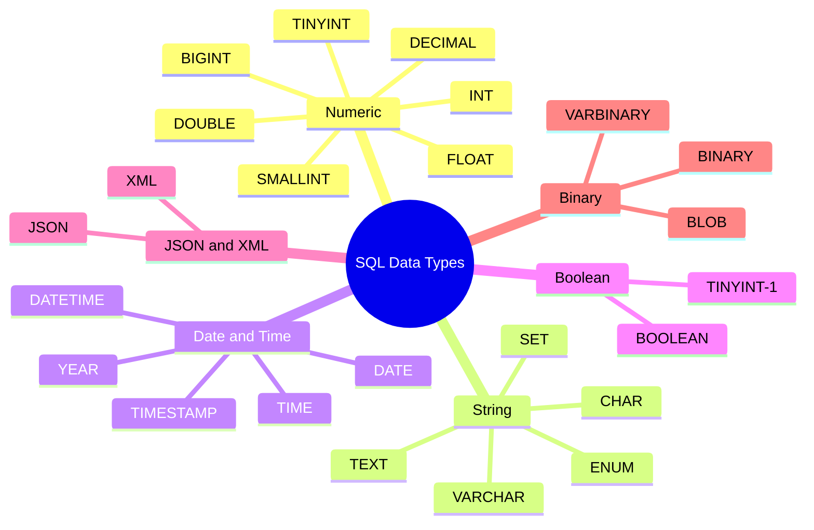
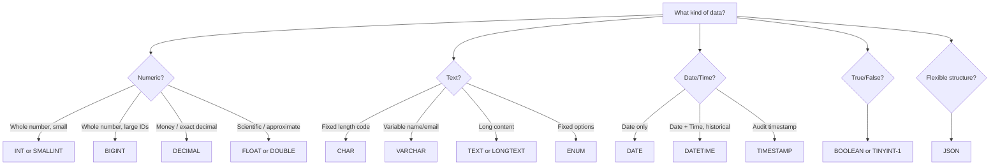
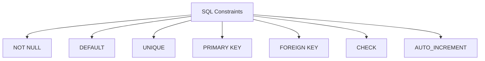
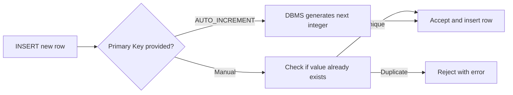
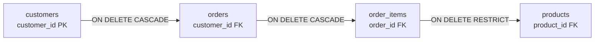
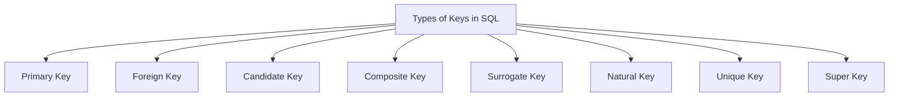

# SQL Handbook for Interviews
## File 02 — Data Types and Constraints

### Covers: All SQL Data Types, All Constraints, PRIMARY KEY, FOREIGN KEY, UNIQUE, CHECK, DEFAULT, NOT NULL, AUTO_INCREMENT, Composite Keys, Candidate Keys, Surrogate Keys, Natural Keys

---

# Table of Contents

1. [SQL Data Types Overview](#1-sql-data-types-overview)
2. [Numeric Data Types](#2-numeric-data-types)
3. [String Data Types](#3-string-data-types)
4. [Date and Time Data Types](#4-date-and-time-data-types)
5. [Boolean Data Type](#5-boolean-data-type)
6. [JSON and XML Data Types](#6-json-and-xml-data-types)
7. [Binary Data Types](#7-binary-data-types)
8. [Choosing the Right Data Type](#8-choosing-the-right-data-type)
9. [What are Constraints?](#9-what-are-constraints)
10. [NOT NULL](#10-not-null)
11. [DEFAULT](#11-default)
12. [UNIQUE](#12-unique)
13. [PRIMARY KEY](#13-primary-key)
14. [FOREIGN KEY](#14-foreign-key)
15. [CHECK](#15-check)
16. [AUTO_INCREMENT / IDENTITY / SERIAL](#16-auto_increment--identity--serial)
17. [Types of Keys](#17-types-of-keys)
18. [Practice Questions](#18-practice-questions)

---

# 1. SQL Data Types Overview

### Definition

A **data type** defines the kind of value a column can store in a table.

- Every column in a SQL table must have a data type declared at creation time.
- Choosing the correct data type affects **storage size, performance, data integrity, and query behavior**.

---

### Data Type Categories



---

# 2. Numeric Data Types

### Integer Types

| Data Type | Storage | Range (Signed) | Range (Unsigned) | Use Case |
|---|---|---|---|---|
| `TINYINT` | 1 byte | -128 to 127 | 0 to 255 | Flags, boolean-like values, age |
| `SMALLINT` | 2 bytes | -32,768 to 32,767 | 0 to 65,535 | Small counters, zip codes |
| `MEDIUMINT` | 3 bytes | -8M to 8M | 0 to 16M | Medium-range counts |
| `INT` / `INTEGER` | 4 bytes | -2.1B to 2.1B | 0 to 4.2B | IDs, counts, general integers |
| `BIGINT` | 8 bytes | -9.2Q to 9.2Q | 0 to 18.4Q | Large IDs, timestamps in ms, financial totals |

> Q = Quintillion. Use `BIGINT` for user IDs in systems that may scale to millions of users.

---

### Decimal / Exact Numeric Types

| Data Type | Description | Use Case |
|---|---|---|
| `DECIMAL(p, s)` | Exact precision. p = total digits, s = decimal places | Money, financial data |
| `NUMERIC(p, s)` | Same as DECIMAL in most DBMS | Financial calculations |

```sql
-- DECIMAL(10, 2) stores up to 10 digits total, 2 after the decimal point
-- Example: 99999999.99

CREATE TABLE products (
    price DECIMAL(10, 2) NOT NULL
);
```

> Always use `DECIMAL` for money. Never use `FLOAT` or `DOUBLE` for financial data.

---

### Approximate Numeric Types

| Data Type | Storage | Precision | Use Case |
|---|---|---|---|
| `FLOAT` | 4 bytes | ~7 decimal digits | Scientific data, ML features |
| `DOUBLE` | 8 bytes | ~15 decimal digits | High-precision scientific data |
| `REAL` | 4 bytes | Same as FLOAT | PostgreSQL equivalent of FLOAT |

---

### Why Not Use FLOAT for Money?

```sql
-- Demonstration of floating point imprecision
SELECT 0.1 + 0.2;
-- Output: 0.30000000000000004  (NOT 0.30)

-- Correct approach for money
SELECT CAST(0.1 AS DECIMAL(10,2)) + CAST(0.2 AS DECIMAL(10,2));
-- Output: 0.30
```

---

### Numeric Types — Comparison Table

| Type | Exact? | Storage | Best For |
|---|---|---|---|
| `INT` | Yes | 4 bytes | IDs, counts |
| `BIGINT` | Yes | 8 bytes | Large IDs, epoch timestamps |
| `DECIMAL` | Yes | Variable | Money, precise calculations |
| `FLOAT` | No | 4 bytes | Scientific data |
| `DOUBLE` | No | 8 bytes | High-range scientific data |

---

# 3. String Data Types

### CHAR vs VARCHAR

| Feature | `CHAR(n)` | `VARCHAR(n)` |
|---|---|---|
| Length | Fixed — always n characters | Variable — up to n characters |
| Storage | Pads with spaces if shorter | Stores only actual length + 1-2 bytes overhead |
| Performance | Faster for fixed-length data | Slightly slower due to variable length |
| Best For | Country codes, phone codes, fixed IDs | Names, emails, addresses |
| Max Length | 255 characters | 65,535 characters (MySQL) |

```sql
CREATE TABLE countries (
    country_code CHAR(2)       NOT NULL,   -- Always exactly 2: 'IN', 'US', 'UK'
    country_name VARCHAR(100)  NOT NULL    -- Variable length
);
```

---

### TEXT Types

Used for large blocks of text where `VARCHAR` is insufficient.

| Type | Max Size | Use Case |
|---|---|---|
| `TINYTEXT` | 255 bytes | Short notes |
| `TEXT` | 65 KB | Blog posts, descriptions |
| `MEDIUMTEXT` | 16 MB | Articles, long content |
| `LONGTEXT` | 4 GB | Full documents, logs |

```sql
CREATE TABLE blog_posts (
    post_id   INT PRIMARY KEY AUTO_INCREMENT,
    title     VARCHAR(255) NOT NULL,
    content   LONGTEXT,
    summary   TEXT
);
```

> `TEXT` columns cannot have default values and cannot be indexed in full (only prefix indexing).

---

### ENUM and SET

| Type | Description | Use Case |
|---|---|---|
| `ENUM` | Stores one value from a predefined list | Status, gender, category |
| `SET` | Stores zero or more values from a list | Tags, multi-select options |

```sql
CREATE TABLE orders (
    order_id INT PRIMARY KEY,
    status   ENUM('pending', 'processing', 'shipped', 'delivered', 'cancelled') DEFAULT 'pending'
);

CREATE TABLE users (
    user_id      INT PRIMARY KEY,
    preferences  SET('email', 'sms', 'push', 'whatsapp')
);
```

**Advantages of ENUM:**
- Enforces valid values at the database level.
- Stored as integers internally — efficient storage.

**Disadvantages of ENUM:**
- Adding a new value requires `ALTER TABLE` — expensive on large tables.
- Not portable across all DBMS (PostgreSQL handles ENUM differently).

---

### String Types — Comparison Table

| Type | Max Size | Fixed? | Indexable? | Best For |
|---|---|---|---|---|
| `CHAR(n)` | 255 chars | Yes | Yes | Fixed codes |
| `VARCHAR(n)` | 65,535 chars | No | Yes | General text |
| `TEXT` | 65 KB | No | Prefix only | Long descriptions |
| `LONGTEXT` | 4 GB | No | Prefix only | Documents |
| `ENUM` | 65,535 options | N/A | Yes | Fixed categories |

---

# 4. Date and Time Data Types

| Type | Format | Range | Use Case |
|---|---|---|---|
| `DATE` | `YYYY-MM-DD` | 1000-01-01 to 9999-12-31 | Birth dates, event dates |
| `TIME` | `HH:MM:SS` | -838:59:59 to 838:59:59 | Durations, shift times |
| `DATETIME` | `YYYY-MM-DD HH:MM:SS` | 1000-01-01 to 9999-12-31 | Event timestamps, logs |
| `TIMESTAMP` | `YYYY-MM-DD HH:MM:SS` | 1970-01-01 to 2038-01-19 | Created/updated timestamps |
| `YEAR` | `YYYY` | 1901 to 2155 | Year of manufacture, graduation year |

---

### DATETIME vs TIMESTAMP

| Feature | `DATETIME` | `TIMESTAMP` |
|---|---|---|
| Timezone | No timezone conversion | Converts to/from UTC |
| Range | 1000 to 9999 | 1970 to 2038 |
| Storage | 8 bytes | 4 bytes |
| Auto-update | No | Yes (`ON UPDATE CURRENT_TIMESTAMP`) |
| Best For | Historical dates, birthdays | Audit fields, created_at, updated_at |

```sql
CREATE TABLE orders (
    order_id    INT PRIMARY KEY AUTO_INCREMENT,
    order_date  DATETIME     NOT NULL,
    created_at  TIMESTAMP    DEFAULT CURRENT_TIMESTAMP,
    updated_at  TIMESTAMP    DEFAULT CURRENT_TIMESTAMP ON UPDATE CURRENT_TIMESTAMP
);
```

---

### PostgreSQL Date/Time Differences

```sql
-- PostgreSQL uses TIMESTAMPTZ for timezone-aware timestamps
CREATE TABLE events (
    event_id    SERIAL PRIMARY KEY,
    event_name  VARCHAR(100),
    starts_at   TIMESTAMPTZ DEFAULT NOW()
);
```

---

# 5. Boolean Data Type

| DBMS | Boolean Type | Storage |
|---|---|---|
| MySQL | `TINYINT(1)` | 1 byte (0 = false, 1 = true) |
| PostgreSQL | `BOOLEAN` | 1 byte (TRUE / FALSE) |
| SQL Server | `BIT` | 1 bit |

```sql
-- MySQL
CREATE TABLE users (
    user_id    INT PRIMARY KEY AUTO_INCREMENT,
    is_active  TINYINT(1) DEFAULT 1,
    is_verified BOOLEAN DEFAULT FALSE
);

-- PostgreSQL
CREATE TABLE users (
    user_id     SERIAL PRIMARY KEY,
    is_active   BOOLEAN DEFAULT TRUE,
    is_verified BOOLEAN DEFAULT FALSE
);
```

> In MySQL, `BOOLEAN` is an alias for `TINYINT(1)`. Use `1` and `0` for true and false.

---

# 6. JSON and XML Data Types

### JSON

Supported in MySQL 5.7+, PostgreSQL 9.2+, and SQL Server 2016+.

```sql
-- MySQL / PostgreSQL
CREATE TABLE user_profiles (
    user_id    INT PRIMARY KEY AUTO_INCREMENT,
    name       VARCHAR(100),
    settings   JSON
);

-- Insert JSON
INSERT INTO user_profiles (name, settings)
VALUES ('Alice', '{"theme": "dark", "language": "en", "notifications": true}');

-- Query JSON field (MySQL)
SELECT name, JSON_EXTRACT(settings, '$.theme') AS theme
FROM user_profiles;

-- Query JSON field (PostgreSQL)
SELECT name, settings->>'theme' AS theme
FROM user_profiles;
```

---

### When to Use JSON in SQL

| Use Case | Appropriate? |
|---|---|
| Storing flexible, schema-less attributes | Yes |
| Frequently queried and filtered fields | No — use a proper column |
| Config, preferences, metadata | Yes |
| Core business data (price, date, status) | No — use typed columns |

---

# 7. Binary Data Types

| Type | Description | Use Case |
|---|---|---|
| `BINARY(n)` | Fixed-length binary | Hashes, UUIDs in binary |
| `VARBINARY(n)` | Variable-length binary | Encrypted values |
| `TINYBLOB` | Up to 255 bytes | Small binary |
| `BLOB` | Up to 65 KB | Small files |
| `MEDIUMBLOB` | Up to 16 MB | Images, audio |
| `LONGBLOB` | Up to 4 GB | Video, large files |

> In production, **never store large files (images, videos) in the database**. Store them in object storage (AWS S3, GCS) and store only the file URL in the database.

---

# 8. Choosing the Right Data Type



---

### Data Type Best Practices

- Use `DECIMAL` for all monetary values — never `FLOAT`.
- Use `TIMESTAMP` for `created_at` and `updated_at` audit columns.
- Use `VARCHAR` instead of `TEXT` when the length is reasonably bounded.
- Use `CHAR` only for truly fixed-length strings like country codes or currency codes.
- Use `BIGINT` for primary keys on tables that will grow beyond 2 billion rows.
- Avoid storing files in `BLOB` — use object storage instead.
- Use `BOOLEAN` (or `TINYINT(1)` in MySQL) for true/false flags.
- Use `ENUM` carefully — schema changes are costly when options need to be added.

---

# 9. What are Constraints?

### Definition

**Constraints** are rules applied to columns or tables that restrict the type of data that can be stored.

- They enforce **data integrity** at the database level.
- Constraints are checked automatically by the DBMS on every `INSERT`, `UPDATE`, and `DELETE`.
- If a constraint is violated, the operation is **rejected** and an error is returned.

---

### Types of Constraints



---

### Column-Level vs Table-Level Constraints

| Level | Description | Example |
|---|---|---|
| Column-level | Defined inline with the column | `name VARCHAR(100) NOT NULL` |
| Table-level | Defined separately after all columns | `CONSTRAINT pk PRIMARY KEY (id)` |

```sql
-- Column-level constraints
CREATE TABLE employees (
    employee_id INT         PRIMARY KEY,
    name        VARCHAR(100) NOT NULL,
    email       VARCHAR(150) UNIQUE,
    salary      DECIMAL(10,2) CHECK (salary > 0)
);

-- Table-level constraints (same result, different syntax)
CREATE TABLE employees (
    employee_id INT,
    name        VARCHAR(100),
    email       VARCHAR(150),
    salary      DECIMAL(10,2),
    CONSTRAINT pk_employee    PRIMARY KEY (employee_id),
    CONSTRAINT uq_email       UNIQUE (email),
    CONSTRAINT chk_salary     CHECK (salary > 0)
);
```

---

# 10. NOT NULL

### Definition

The `NOT NULL` constraint ensures that a column **cannot store a NULL value**.

Every row must provide a value for that column.

---

### Why Do We Use It?

- Prevents missing critical data at the database level.
- Forces the application to always supply a value.
- Avoids subtle bugs caused by unexpected NULL comparisons in queries.

---

### Syntax

```sql
column_name datatype NOT NULL
```

---

### Example

```sql
CREATE TABLE customers (
    customer_id  INT          PRIMARY KEY AUTO_INCREMENT,
    first_name   VARCHAR(50)  NOT NULL,
    last_name    VARCHAR(50)  NOT NULL,
    email        VARCHAR(150) NOT NULL,
    phone        VARCHAR(20)             -- NULL allowed: phone is optional
);
```

```sql
-- This will succeed
INSERT INTO customers (first_name, last_name, email)
VALUES ('Alice', 'Brown', 'alice@example.com');

-- This will FAIL — email is NOT NULL
INSERT INTO customers (first_name, last_name)
VALUES ('Bob', 'Smith');
-- Error: Column 'email' cannot be null
```

---

### Adding NOT NULL to Existing Column

```sql
-- MySQL
ALTER TABLE customers MODIFY COLUMN phone VARCHAR(20) NOT NULL;

-- PostgreSQL
ALTER TABLE customers ALTER COLUMN phone SET NOT NULL;
```

---

### Important Notes

- `NOT NULL` does not prevent **empty strings** (`''`) — only prevents `NULL`.
- Use `CHECK` alongside `NOT NULL` if you also want to prevent empty strings.
- `NULL` means **unknown or missing** — it is not the same as `0`, `''`, or `'NULL'`.

---

# 11. DEFAULT

### Definition

The `DEFAULT` constraint assigns a **default value** to a column when no value is explicitly provided during `INSERT`.

---

### Syntax

```sql
column_name datatype DEFAULT default_value
```

---

### Example

```sql
CREATE TABLE orders (
    order_id     INT           PRIMARY KEY AUTO_INCREMENT,
    customer_id  INT           NOT NULL,
    status       VARCHAR(20)   DEFAULT 'pending',
    created_at   TIMESTAMP     DEFAULT CURRENT_TIMESTAMP,
    is_paid      BOOLEAN       DEFAULT FALSE,
    discount     DECIMAL(5,2)  DEFAULT 0.00
);
```

```sql
-- Insert without specifying status, created_at, is_paid, or discount
INSERT INTO orders (customer_id) VALUES (101);

-- Result:
-- order_id: 1, customer_id: 101, status: 'pending',
-- created_at: <current time>, is_paid: 0, discount: 0.00
```

---

### Common DEFAULT Values

| Column | Default Value |
|---|---|
| `status` | `'pending'`, `'active'`, `'inactive'` |
| `created_at` | `CURRENT_TIMESTAMP` |
| `updated_at` | `CURRENT_TIMESTAMP ON UPDATE CURRENT_TIMESTAMP` |
| `is_active` | `TRUE` or `1` |
| `quantity` | `1` |
| `discount` | `0.00` |

---

### Important Notes

- `DEFAULT` and `NOT NULL` can be combined — a column with both will use the default value when none is provided, but will never allow explicit NULL.
- `TEXT` and `BLOB` columns in MySQL cannot have DEFAULT values.
- In PostgreSQL, you can use functions as defaults: `DEFAULT gen_random_uuid()`.

---

# 12. UNIQUE

### Definition

The `UNIQUE` constraint ensures that all values in a column (or combination of columns) are **distinct across all rows**.

- Unlike `PRIMARY KEY`, a `UNIQUE` column **can contain NULL values**.
- Multiple `UNIQUE` constraints can exist on one table.

---

### Syntax

```sql
-- Column level
column_name datatype UNIQUE

-- Table level
CONSTRAINT constraint_name UNIQUE (column1, column2)
```

---

### Example

```sql
CREATE TABLE users (
    user_id   INT          PRIMARY KEY AUTO_INCREMENT,
    username  VARCHAR(50)  NOT NULL UNIQUE,
    email     VARCHAR(150) NOT NULL UNIQUE,
    phone     VARCHAR(20)  UNIQUE       -- Can be NULL, but if provided must be unique
);
```

```sql
-- This succeeds
INSERT INTO users (username, email) VALUES ('alice99', 'alice@example.com');

-- This FAILS — email already exists
INSERT INTO users (username, email) VALUES ('alice_new', 'alice@example.com');
-- Error: Duplicate entry 'alice@example.com' for key 'email'
```

---

### Composite UNIQUE Constraint

```sql
-- A student can enroll in a course only once
CREATE TABLE enrollments (
    student_id  INT,
    course_id   INT,
    enrolled_at DATE,
    CONSTRAINT uq_enrollment UNIQUE (student_id, course_id)
);
```

---

### UNIQUE vs PRIMARY KEY

| Feature | PRIMARY KEY | UNIQUE |
|---|---|---|
| NULL allowed | No | Yes (one NULL per column in most DBMS) |
| Count per table | Only one | Multiple allowed |
| Creates index | Clustered index | Non-clustered index |
| Purpose | Row identifier | Enforce uniqueness |

---

# 13. PRIMARY KEY

### Definition

A `PRIMARY KEY` is a column or combination of columns that **uniquely identifies each row** in a table.

- A table can have **only one** primary key.
- Primary key columns are automatically `NOT NULL` and `UNIQUE`.
- The DBMS creates a **clustered index** on the primary key automatically.

---

### Syntax

```sql
-- Column level
column_name datatype PRIMARY KEY

-- Table level
CONSTRAINT constraint_name PRIMARY KEY (column1, column2)
```

---

### Example — Single Column Primary Key

```sql
CREATE TABLE products (
    product_id  INT          PRIMARY KEY AUTO_INCREMENT,
    name        VARCHAR(100) NOT NULL,
    price       DECIMAL(10,2)
);
```

---

### Example — Composite Primary Key

```sql
-- Junction table for many-to-many: no single column uniquely identifies a row
CREATE TABLE order_items (
    order_id    INT,
    product_id  INT,
    quantity    INT          NOT NULL DEFAULT 1,
    unit_price  DECIMAL(10,2),
    PRIMARY KEY (order_id, product_id)
);
```

---

### Primary Key Best Practices

- Always define a primary key on every table.
- Use `INT AUTO_INCREMENT` (MySQL) or `SERIAL` (PostgreSQL) for simple surrogate keys.
- Use `BIGINT` for tables expected to grow very large (user tables, transaction tables).
- Avoid using business data (like email or phone) as a primary key — it can change.
- Use composite primary keys on junction tables in many-to-many relationships.

---

### Primary Key Data Flow



---

# 14. FOREIGN KEY

### Definition

A `FOREIGN KEY` is a column in one table that refers to the `PRIMARY KEY` of another table.

- It enforces **referential integrity** — you cannot have a child row pointing to a non-existent parent.
- It defines the **relationship** between two tables.

---

### Syntax

```sql
FOREIGN KEY (column_name) REFERENCES parent_table(parent_column)
    ON DELETE [CASCADE | SET NULL | RESTRICT | NO ACTION]
    ON UPDATE [CASCADE | SET NULL | RESTRICT | NO ACTION]
```

---

### Example

```sql
CREATE TABLE customers (
    customer_id  INT PRIMARY KEY AUTO_INCREMENT,
    name         VARCHAR(100) NOT NULL
);

CREATE TABLE orders (
    order_id     INT PRIMARY KEY AUTO_INCREMENT,
    customer_id  INT NOT NULL,
    order_date   DATE,
    total        DECIMAL(10,2),
    FOREIGN KEY (customer_id) REFERENCES customers(customer_id)
        ON DELETE RESTRICT
        ON UPDATE CASCADE
);
```

```sql
-- This FAILS if customer_id 999 does not exist in customers table
INSERT INTO orders (customer_id, order_date, total)
VALUES (999, '2024-01-01', 500.00);
-- Error: Cannot add or update a child row: a foreign key constraint fails
```

---

### ON DELETE / ON UPDATE Behavior

| Option | On Delete | On Update |
|---|---|---|
| `CASCADE` | Delete child rows automatically | Update FK value automatically |
| `SET NULL` | Set FK column to NULL | Set FK column to NULL |
| `RESTRICT` | Block the delete | Block the update |
| `NO ACTION` | Same as RESTRICT (checked at end of transaction) | Same as RESTRICT |
| `SET DEFAULT` | Set FK to default value (PostgreSQL only) | Set FK to default value |

---

### Real-World Example



If a customer is deleted:
- Their orders are deleted automatically (CASCADE).
- Their order items are deleted automatically (CASCADE).
- Products are protected and cannot be deleted while order_items reference them (RESTRICT).

---

### Disabling Foreign Key Checks (Use with Caution)

```sql
-- MySQL: temporarily disable FK checks for bulk loading
SET FOREIGN_KEY_CHECKS = 0;
-- ... bulk insert ...
SET FOREIGN_KEY_CHECKS = 1;

-- PostgreSQL
SET session_replication_role = 'replica';
-- ... bulk insert ...
SET session_replication_role = 'DEFAULT';
```

---

# 15. CHECK

### Definition

The `CHECK` constraint ensures that all values in a column satisfy a **specific condition (predicate)**.

- If the condition evaluates to `FALSE`, the operation is rejected.
- If the condition evaluates to `TRUE` or `NULL`, the operation is accepted.

---

### Syntax

```sql
column_name datatype CHECK (condition)

-- Table-level with name
CONSTRAINT constraint_name CHECK (condition)
```

---

### Examples

```sql
CREATE TABLE employees (
    employee_id  INT           PRIMARY KEY AUTO_INCREMENT,
    name         VARCHAR(100)  NOT NULL,
    age          INT           CHECK (age >= 18 AND age <= 65),
    salary       DECIMAL(10,2) CHECK (salary > 0),
    gender       CHAR(1)       CHECK (gender IN ('M', 'F', 'O')),
    hire_date    DATE,
    end_date     DATE,
    CONSTRAINT chk_dates CHECK (end_date IS NULL OR end_date > hire_date)
);
```

---

### Real-World CHECK Constraints

```sql
CREATE TABLE products (
    product_id    INT PRIMARY KEY AUTO_INCREMENT,
    name          VARCHAR(100) NOT NULL,
    price         DECIMAL(10,2) CHECK (price >= 0),
    stock         INT           CHECK (stock >= 0),
    discount_pct  DECIMAL(5,2)  CHECK (discount_pct BETWEEN 0 AND 100)
);

CREATE TABLE bank_accounts (
    account_id  INT PRIMARY KEY,
    balance     DECIMAL(15,2) CHECK (balance >= 0),
    account_type VARCHAR(20)  CHECK (account_type IN ('savings', 'current', 'fixed'))
);
```

---

### CHECK Constraint — DBMS Support

| DBMS | CHECK Support |
|---|---|
| PostgreSQL | Full support |
| SQL Server | Full support |
| Oracle | Full support |
| MySQL 8.0+ | Full support (enforced) |
| MySQL < 8.0 | Parsed but NOT enforced |

> If you use MySQL versions before 8.0, CHECK constraints are silently ignored. Use application-level validation or triggers instead.

---

# 16. AUTO_INCREMENT / IDENTITY / SERIAL

### Definition

These are mechanisms to **automatically generate a unique integer value** for a column every time a new row is inserted.

Most commonly used for **primary key columns**.

---

### Syntax by DBMS

```sql
-- MySQL
CREATE TABLE users (
    user_id INT PRIMARY KEY AUTO_INCREMENT
);

-- PostgreSQL (older style)
CREATE TABLE users (
    user_id SERIAL PRIMARY KEY
);

-- PostgreSQL (modern style — recommended)
CREATE TABLE users (
    user_id INT GENERATED ALWAYS AS IDENTITY PRIMARY KEY
);

-- SQL Server
CREATE TABLE users (
    user_id INT PRIMARY KEY IDENTITY(1,1)
    -- IDENTITY(start_value, increment)
);

-- Oracle
CREATE TABLE users (
    user_id NUMBER GENERATED ALWAYS AS IDENTITY PRIMARY KEY
);
```

---

### AUTO_INCREMENT Behavior

```sql
CREATE TABLE categories (
    category_id INT PRIMARY KEY AUTO_INCREMENT,
    name        VARCHAR(50) NOT NULL
);

INSERT INTO categories (name) VALUES ('Electronics');  -- category_id = 1
INSERT INTO categories (name) VALUES ('Clothing');     -- category_id = 2
INSERT INTO categories (name) VALUES ('Books');        -- category_id = 3

-- If row 3 is deleted and a new row is inserted:
DELETE FROM categories WHERE category_id = 3;
INSERT INTO categories (name) VALUES ('Sports');       -- category_id = 4 (NOT 3)
```

> AUTO_INCREMENT never reuses a deleted ID by default. This is intentional — it prevents referential integrity issues in related tables.

---

### Reset AUTO_INCREMENT

```sql
-- MySQL: reset to a specific value
ALTER TABLE categories AUTO_INCREMENT = 1;

-- Note: Cannot set to a value lower than the current max ID
```

---

### Sequence in PostgreSQL

```sql
-- PostgreSQL sequences (underlying mechanism for SERIAL)
CREATE SEQUENCE order_seq START 1000 INCREMENT 1;

CREATE TABLE orders (
    order_id INT DEFAULT NEXTVAL('order_seq') PRIMARY KEY
);
```

---

# 17. Types of Keys

### Overview



---

### Primary Key

- Uniquely identifies each row.
- NOT NULL + UNIQUE.
- Only one per table.
- Covered in detail in Section 13.

---

### Foreign Key

- References the primary key of another table.
- Enforces referential integrity.
- Covered in detail in Section 14.

---

### Candidate Key

A **candidate key** is any column (or set of columns) that **could serve as the primary key** — it is unique and not null.

- A table may have multiple candidate keys.
- One candidate key is chosen as the primary key; the rest become **alternate keys**.

```sql
-- In a users table, all three could be candidate keys:
-- user_id (chosen as PK)
-- email    (alternate key — enforced with UNIQUE)
-- username (alternate key — enforced with UNIQUE)

CREATE TABLE users (
    user_id   INT          PRIMARY KEY AUTO_INCREMENT,  -- Chosen candidate
    email     VARCHAR(150) NOT NULL UNIQUE,              -- Alternate candidate
    username  VARCHAR(50)  NOT NULL UNIQUE               -- Alternate candidate
);
```

---

### Composite Key

A **composite key** is a primary key made up of **two or more columns** together.

- Neither column alone uniquely identifies a row.
- The **combination** is unique.

```sql
CREATE TABLE flight_seats (
    flight_id  INT,
    seat_no    VARCHAR(5),
    passenger  VARCHAR(100),
    PRIMARY KEY (flight_id, seat_no)  -- Composite key
);
-- flight_id alone: not unique (many seats per flight)
-- seat_no alone: not unique (same seat on different flights)
-- Together: unique (one seat per flight)
```

---

### Surrogate Key

A **surrogate key** is an **artificially generated key** with no business meaning, used solely to uniquely identify a row.

- Typically `AUTO_INCREMENT` integers or `UUID` values.
- Preferred in most production systems.

```sql
CREATE TABLE customers (
    customer_id INT PRIMARY KEY AUTO_INCREMENT,  -- Surrogate key
    name        VARCHAR(100),
    email       VARCHAR(150)
);
```

**Advantages:**
- Stable — never changes.
- No business logic embedded in the key.
- Simple joins and relationships.

**Disadvantages:**
- Carries no business meaning.
- Requires additional unique constraints on business fields.

---

### Natural Key

A **natural key** is a key made up of **real-world business data** that already uniquely identifies a record.

```sql
CREATE TABLE countries (
    country_code CHAR(2) PRIMARY KEY,   -- Natural key: 'US', 'IN', 'UK'
    country_name VARCHAR(100)
);

CREATE TABLE employees (
    national_id  VARCHAR(20) PRIMARY KEY,  -- Natural key: government-issued ID
    name         VARCHAR(100)
);
```

**Advantages:**
- Carries meaningful, readable business information.
- No need for a separate auto-generated column.

**Disadvantages:**
- Can change over time (e.g., a person changes their national ID).
- May be longer and slower for joins.
- Sensitive data (SSN, passport number) should not be used as a key.

---

### Surrogate Key vs Natural Key

| Feature | Surrogate Key | Natural Key |
|---|---|---|
| Meaning | No business meaning | Has real-world meaning |
| Stability | Always stable | Can change |
| Examples | `AUTO_INCREMENT INT`, `UUID` | Email, SSN, country code |
| Join performance | Fast (integer joins) | Slower for long strings |
| Privacy | No sensitive data | May expose sensitive data |
| Preferred in production | Yes | Only for stable, short codes |

---

### Super Key

A **super key** is any set of columns that can **uniquely identify a row** — including combinations that contain redundant columns.

- Every candidate key is a super key.
- Not every super key is a candidate key.

```sql
-- In an employees table:
-- Super keys:
-- (employee_id)                         <- minimal, candidate key
-- (employee_id, name)                   <- super key, not minimal
-- (employee_id, name, email)            <- super key, not minimal
-- (email)                               <- minimal, candidate key
```

---

### Keys Summary Table

| Key Type | Definition | NULL Allowed | Count per Table | Example |
|---|---|---|---|---|
| Primary Key | Unique row identifier | No | 1 | `employee_id` |
| Foreign Key | References another table's PK | Yes | Many | `customer_id` in orders |
| Candidate Key | Eligible to be PK | No | Many | `email`, `username` |
| Composite Key | PK from 2+ columns | No | 1 | `(flight_id, seat_no)` |
| Surrogate Key | Auto-generated, no meaning | No | 1 | `AUTO_INCREMENT INT` |
| Natural Key | Real-world business attribute | No | 1 | `country_code` |
| Unique Key | Unique but not PK | Yes | Many | `email` with UNIQUE |
| Super Key | Any unique combination | No | Many | `(id, email, name)` |

---

### Common Interview Questions

1. What is the difference between `CHAR` and `VARCHAR`?
2. Why should you never use `FLOAT` for storing money?
3. What is the difference between `DATETIME` and `TIMESTAMP`?
4. What is a constraint? Why are constraints important?
5. What is the difference between `NOT NULL` and `DEFAULT`?
6. Can a `UNIQUE` column have NULL values?
7. What is the difference between `PRIMARY KEY` and `UNIQUE`?
8. Can a table have multiple `UNIQUE` constraints?
9. What is a `FOREIGN KEY`? What is referential integrity?
10. What is the difference between `ON DELETE CASCADE` and `ON DELETE RESTRICT`?
11. What does `AUTO_INCREMENT` do? Can it reuse a deleted ID?
12. What is the difference between a surrogate key and a natural key?
13. What is a composite key? When do you use it?
14. What is a candidate key?
15. What is a super key?
16. What is the difference between `ENUM` and `VARCHAR`?
17. Can `CHECK` constraints reference other tables? (No — use triggers for that.)
18. What is `SERIAL` in PostgreSQL?
19. What is `IDENTITY` in SQL Server?
20. What happens if a `CHECK` constraint receives a `NULL` value?

---

### Common Mistakes

- Using `FLOAT` or `DOUBLE` for monetary values — always use `DECIMAL`.
- Using `TEXT` for short fields where `VARCHAR` is more appropriate and indexable.
- Forgetting that `NOT NULL` does not prevent empty strings.
- Assuming `UNIQUE` prevents NULL — it allows NULL in most DBMS (one NULL per column in MySQL, multiple NULLs allowed in PostgreSQL and SQL Server).
- Using email or phone as a primary key — these can change and are sensitive.
- Relying on CHECK constraints in MySQL versions below 8.0 — they are not enforced.
- Using `AUTO_INCREMENT` and expecting it to fill gaps after deletions — it does not.
- Forgetting to add a `NOT NULL` constraint on `FOREIGN KEY` columns when a null reference does not make business sense.

---

### Best Practices

- Always define a `PRIMARY KEY` on every table.
- Use `DECIMAL(p, s)` for any column storing money or financial data.
- Use `TIMESTAMP` with `DEFAULT CURRENT_TIMESTAMP` for audit columns (`created_at`, `updated_at`).
- Use `NOT NULL` on every column that must always have a value.
- Use `UNIQUE` on business identifiers like `email`, `username`, `phone`.
- Use `CHECK` to enforce domain rules at the database level — do not rely solely on application validation.
- Use surrogate keys (AUTO_INCREMENT / SERIAL) as primary keys in most cases.
- Name all constraints explicitly — it makes error messages readable and schema changes easier.
- Use `ON DELETE CASCADE` only when child data has no meaning without the parent.
- Use `ON DELETE RESTRICT` when child data must be explicitly cleaned up first.

---

### Performance Tips

- `CHAR` is faster than `VARCHAR` for truly fixed-length data — the DBMS does not need to compute length.
- Smaller data types = smaller indexes = faster queries. Use `TINYINT` instead of `INT` for flags.
- Primary key indexes are automatically created — no need to add a separate index.
- `FOREIGN KEY` columns should also be indexed explicitly for faster join performance.
- `ENUM` is stored as an integer internally — it is more efficient than `VARCHAR` for fixed-option fields.
- Avoid large `TEXT` or `BLOB` columns in tables with many rows — store references (URLs) instead.

---

### Summary

| Concept | Key Takeaway |
|---|---|
| Data Types | Define what kind of value a column holds |
| DECIMAL | Always use for money — never FLOAT |
| CHAR vs VARCHAR | CHAR for fixed length, VARCHAR for variable |
| TIMESTAMP | Best for audit fields — timezone-aware |
| NOT NULL | Column must always have a value |
| DEFAULT | Automatically assigned value when none is provided |
| UNIQUE | All values must be distinct — NULL allowed |
| PRIMARY KEY | Unique row identifier — NOT NULL + UNIQUE |
| FOREIGN KEY | Enforces referential integrity between tables |
| CHECK | Enforces business rules on column values |
| AUTO_INCREMENT | Auto-generates sequential integers for PKs |
| Surrogate Key | Auto-generated, stable, no business meaning |
| Natural Key | Real-world attribute — can change |
| Composite Key | Primary key from two or more columns |
| Candidate Key | Any column that could serve as a primary key |

---

# 18. Practice Questions

1. What data type would you use for each of the following columns and why?
   - Product price
   - Customer email
   - Order status (pending, shipped, delivered)
   - Employee date of birth
   - Profile photo
   - Is the account active?
   - Number of items in cart
   - Country code (US, IN, UK)

2. A developer stores bank account balances as `FLOAT`. What problem will this cause? Rewrite the column definition correctly.

3. Create a complete `employees` table with at least 8 columns using appropriate data types and constraints for each column.

4. What is referential integrity? Write a SQL example where deleting a parent record automatically deletes all related child records.

5. Explain the difference between `ON DELETE CASCADE` and `ON DELETE RESTRICT` with a real-world scenario for each.

6. A `users` table has both `email` and `username` as UNIQUE columns. Is `email` a candidate key? Is `username`? Explain.

7. Create a `flight_bookings` table that uses a composite primary key. Explain why a composite key is needed here.

8. What is the difference between a surrogate key and a natural key? Give a scenario where you would use a natural key.

9. Write a `CHECK` constraint to ensure that an employee's `end_date` is always after their `hire_date`.

10. A table has the following constraint:
    ```sql
    CHECK (discount_pct BETWEEN 0 AND 100)
    ```
    What happens if you try to insert `NULL` into `discount_pct`? Why?

11. Why does `AUTO_INCREMENT` not reuse deleted IDs? What problems would arise if it did?

12. Write the equivalent of `AUTO_INCREMENT` for MySQL, PostgreSQL, and SQL Server.

13. A junior engineer defines an `orders` table with `customer_email` as the foreign key instead of `customer_id`. What problems will this cause?

14. Explain the difference between a `UNIQUE` constraint and a `PRIMARY KEY` constraint with three specific differences.

15. Design a schema for a social media platform with users, posts, comments, and likes. Define appropriate primary keys, foreign keys, and constraints for each table.

---

> **File 02 Complete — Data Types and Constraints**
> **Next: File 03 — CRUD, Filtering, and Sorting**
