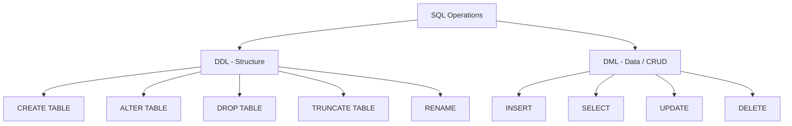
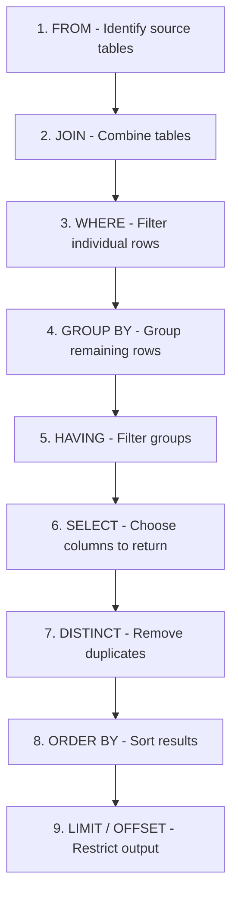
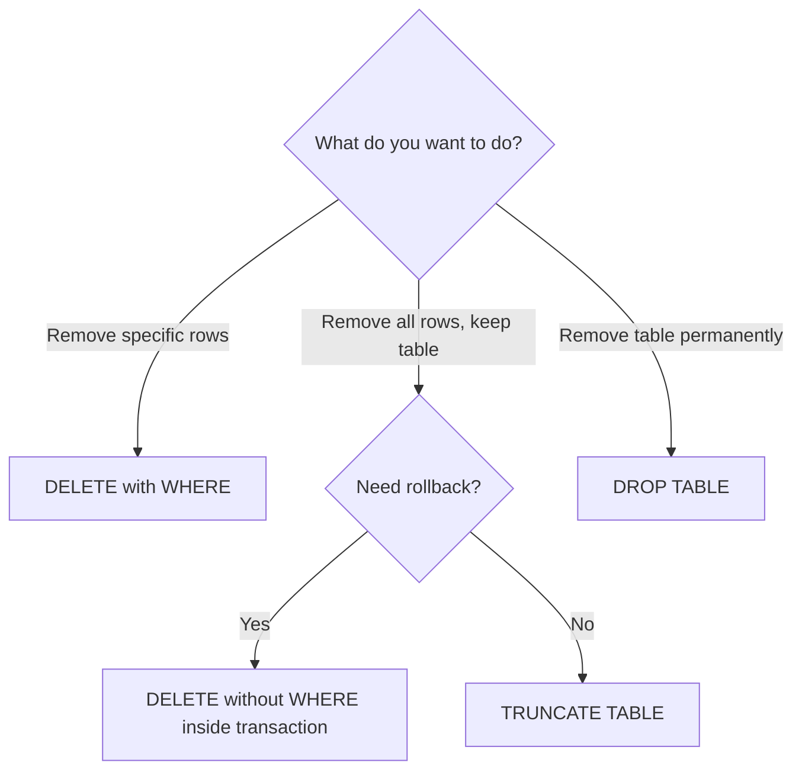

# SQL Handbook for Interviews
## File 03 — CRUD Operations, Filtering, and Sorting

### Covers: CREATE, INSERT, SELECT, UPDATE, DELETE, TRUNCATE, DROP, ALTER, RENAME, WHERE, AND, OR, NOT, LIKE, IN, BETWEEN, IS NULL, IS NOT NULL, EXISTS, ANY, ALL, ORDER BY, ASC, DESC, LIMIT, OFFSET, TOP, FETCH

---

# Table of Contents

1. [CRUD Overview](#1-crud-overview)
2. [CREATE TABLE](#2-create-table)
3. [INSERT](#3-insert)
4. [SELECT](#4-select)
5. [UPDATE](#5-update)
6. [DELETE](#6-delete)
7. [TRUNCATE](#7-truncate)
8. [DROP](#8-drop)
9. [ALTER](#9-alter)
10. [RENAME](#10-rename)
11. [DELETE vs TRUNCATE vs DROP](#11-delete-vs-truncate-vs-drop)
12. [Filtering with WHERE](#12-filtering-with-where)
13. [AND, OR, NOT](#13-and-or-not)
14. [LIKE](#14-like)
15. [IN](#15-in)
16. [BETWEEN](#16-between)
17. [IS NULL and IS NOT NULL](#17-is-null-and-is-not-null)
18. [EXISTS](#18-exists)
19. [ANY and ALL](#19-any-and-all)
20. [ORDER BY — ASC and DESC](#20-order-by--asc-and-desc)
21. [LIMIT and OFFSET](#21-limit-and-offset)
22. [TOP and FETCH](#22-top-and-fetch)
23. [Practice Questions](#23-practice-questions)

---

# 1. CRUD Overview

### Definition

**CRUD** stands for the four fundamental operations performed on data in any database system.

| Letter | Operation | SQL Command |
|---|---|---|
| C | Create | `INSERT` |
| R | Read | `SELECT` |
| U | Update | `UPDATE` |
| D | Delete | `DELETE` |

Beyond CRUD, **DDL** commands manage the structure of the database itself.

---

### CRUD vs DDL



---

### Sample Database Used in This File

All examples in this file use the following tables.

```sql
CREATE TABLE departments (
    department_id   INT          PRIMARY KEY AUTO_INCREMENT,
    department_name VARCHAR(100) NOT NULL,
    location        VARCHAR(100)
);

CREATE TABLE employees (
    employee_id   INT            PRIMARY KEY AUTO_INCREMENT,
    first_name    VARCHAR(50)    NOT NULL,
    last_name     VARCHAR(50)    NOT NULL,
    email         VARCHAR(150)   NOT NULL UNIQUE,
    department_id INT,
    salary        DECIMAL(10,2)  NOT NULL CHECK (salary > 0),
    hire_date     DATE           NOT NULL,
    is_active     BOOLEAN        DEFAULT TRUE,
    FOREIGN KEY (department_id) REFERENCES departments(department_id)
);

CREATE TABLE orders (
    order_id    INT           PRIMARY KEY AUTO_INCREMENT,
    customer_id INT           NOT NULL,
    status      VARCHAR(20)   DEFAULT 'pending',
    total       DECIMAL(10,2),
    order_date  DATE          NOT NULL
);
```

---

# 2. CREATE TABLE

### Definition

`CREATE TABLE` defines a new table in the database with its columns, data types, and constraints.

---

### Syntax

```sql
CREATE TABLE table_name (
    column1 datatype [constraints],
    column2 datatype [constraints],
    ...
    [table_level_constraints]
);
```

---

### Syntax Breakdown

| Keyword | Purpose |
|---|---|
| `CREATE TABLE` | Defines a new table |
| `table_name` | Name of the table being created |
| `column_name` | Name of each column |
| `datatype` | Data type of the column |
| `constraints` | Rules like NOT NULL, UNIQUE, DEFAULT |

---

### Example

```sql
CREATE TABLE products (
    product_id   INT            PRIMARY KEY AUTO_INCREMENT,
    name         VARCHAR(100)   NOT NULL,
    category     VARCHAR(50)    DEFAULT 'Uncategorized',
    price        DECIMAL(10,2)  NOT NULL CHECK (price >= 0),
    stock        INT            DEFAULT 0 CHECK (stock >= 0),
    created_at   TIMESTAMP      DEFAULT CURRENT_TIMESTAMP
);
```

---

### CREATE TABLE IF NOT EXISTS

Prevents an error if the table already exists.

```sql
CREATE TABLE IF NOT EXISTS products (
    product_id INT PRIMARY KEY AUTO_INCREMENT,
    name       VARCHAR(100) NOT NULL
);
```

---

### CREATE TABLE from SELECT (Copy Structure + Data)

```sql
-- MySQL / PostgreSQL: copy structure and data
CREATE TABLE employees_backup AS
SELECT * FROM employees;

-- Copy structure only (no data)
CREATE TABLE employees_backup AS
SELECT * FROM employees WHERE 1 = 0;
```

---

### DBMS Differences

| Feature | MySQL | PostgreSQL | SQL Server |
|---|---|---|---|
| Auto increment | `AUTO_INCREMENT` | `SERIAL` or `GENERATED ALWAYS AS IDENTITY` | `IDENTITY(1,1)` |
| IF NOT EXISTS | Supported | Supported | Not supported (use `IF NOT EXISTS` in SQL Server 2016+) |
| Copy from SELECT | `CREATE TABLE ... AS SELECT` | `CREATE TABLE ... AS SELECT` | `SELECT INTO new_table FROM source` |

---

# 3. INSERT

### Definition

`INSERT` adds new rows of data into a table.

---

### Syntax — Single Row

```sql
INSERT INTO table_name (column1, column2, ...)
VALUES (value1, value2, ...);
```

---

### Syntax — Multiple Rows

```sql
INSERT INTO table_name (column1, column2, ...)
VALUES
    (value1a, value2a, ...),
    (value1b, value2b, ...),
    (value1c, value2c, ...);
```

---

### Syntax Breakdown

| Keyword | Purpose |
|---|---|
| `INSERT INTO` | Specifies the target table |
| `(columns)` | Lists the columns being populated |
| `VALUES` | Provides the actual data |

---

### Example

```sql
-- Insert departments first (parent table)
INSERT INTO departments (department_name, location)
VALUES
    ('Engineering',  'Bangalore'),
    ('Marketing',    'Mumbai'),
    ('Finance',      'Delhi'),
    ('HR',           'Bangalore');

-- Insert employees
INSERT INTO employees (first_name, last_name, email, department_id, salary, hire_date)
VALUES
    ('Alice',  'Brown',  'alice@company.com',  1, 95000.00, '2020-03-15'),
    ('Bob',    'Smith',  'bob@company.com',    2, 72000.00, '2019-07-01'),
    ('Carol',  'White',  'carol@company.com',  1, 105000.00,'2018-11-20'),
    ('David',  'Jones',  'david@company.com',  3, 88000.00, '2021-01-10'),
    ('Eva',    'Green',  'eva@company.com',    1, 91000.00, '2022-06-01'),
    ('Frank',  'Black',  'frank@company.com',  4, 67000.00, '2020-09-15'),
    ('Grace',  'Hall',   'grace@company.com',  2, 74000.00, '2021-03-22'),
    ('Henry',  'Adams',  'henry@company.com',  3, 95000.00, '2017-05-30'),
    ('Irene',  'Clark',  'irene@company.com',  NULL, 62000.00, '2023-01-05'),
    ('James',  'Wilson', 'james@company.com',  1, 110000.00,'2016-08-19');
```

---

### INSERT with SELECT (Insert from Another Table)

```sql
-- Copy active employees into an archive table
INSERT INTO employees_archive (first_name, last_name, email, salary)
SELECT first_name, last_name, email, salary
FROM employees
WHERE is_active = FALSE;
```

---

### INSERT IGNORE (MySQL)

Skips the row if a duplicate key constraint is violated — no error thrown.

```sql
INSERT IGNORE INTO employees (first_name, last_name, email, salary, hire_date)
VALUES ('Alice', 'Brown', 'alice@company.com', 95000, '2020-03-15');
-- Skips silently if email already exists
```

---

### INSERT ON DUPLICATE KEY UPDATE (MySQL — Upsert)

```sql
INSERT INTO products (product_id, name, price, stock)
VALUES (1, 'Wireless Keyboard', 49.99, 100)
ON DUPLICATE KEY UPDATE
    price = VALUES(price),
    stock = stock + VALUES(stock);
```

---

### INSERT ON CONFLICT (PostgreSQL — Upsert)

```sql
INSERT INTO products (product_id, name, price, stock)
VALUES (1, 'Wireless Keyboard', 49.99, 100)
ON CONFLICT (product_id)
DO UPDATE SET
    price = EXCLUDED.price,
    stock  = products.stock + EXCLUDED.stock;
```

---

### Common INSERT Mistakes

- Inserting a child row before the parent row exists — violates foreign key constraint.
- Omitting column names and relying on column order — breaks when schema changes.
- Not handling `ON DUPLICATE KEY` in upsert scenarios — causes silent failures.
- Inserting wrong data types — implicit conversion can cause unexpected behavior.

---

# 4. SELECT

### Definition

`SELECT` retrieves data from one or more tables. It is the most frequently used SQL command.

---

### Syntax

```sql
SELECT [DISTINCT] column1, column2, ...
FROM table_name
[WHERE condition]
[GROUP BY columns]
[HAVING condition]
[ORDER BY columns [ASC | DESC]]
[LIMIT n OFFSET m];
```

---

### Syntax Breakdown

| Clause | Purpose |
|---|---|
| `SELECT` | Specifies columns to return |
| `DISTINCT` | Removes duplicate rows from result |
| `FROM` | Specifies the source table |
| `WHERE` | Filters rows before grouping |
| `GROUP BY` | Groups rows by column value |
| `HAVING` | Filters groups after aggregation |
| `ORDER BY` | Sorts the result set |
| `LIMIT` | Restricts number of rows returned |

---

### SQL Execution Order

This is one of the most important concepts for interviews.
SQL does **not** execute in the order it is written.



> This is why you **cannot** use a column alias defined in `SELECT` inside a `WHERE` clause — `WHERE` runs before `SELECT`.

---

### Examples

```sql
-- Select all columns (avoid in production)
SELECT * FROM employees;

-- Select specific columns
SELECT first_name, last_name, salary
FROM employees;

-- Using column aliases
SELECT
    first_name                          AS first,
    last_name                           AS last,
    salary * 12                         AS annual_salary,
    CONCAT(first_name, ' ', last_name)  AS full_name
FROM employees;
```

**Output:**

| first | last | annual_salary | full_name |
|---|---|---|---|
| Alice | Brown | 1140000.00 | Alice Brown |
| Bob | Smith | 864000.00 | Bob Smith |
| Carol | White | 1260000.00 | Carol White |

---

### SELECT DISTINCT

Removes duplicate values from the result set.

```sql
-- All departments represented in employees table (including duplicates)
SELECT department_id FROM employees;

-- Unique department IDs only
SELECT DISTINCT department_id FROM employees;

-- DISTINCT across multiple columns
SELECT DISTINCT department_id, is_active FROM employees;
-- Only unique combinations of department_id and is_active
```

---

### SELECT with Expressions

```sql
SELECT
    first_name,
    salary,
    salary * 0.10              AS bonus,
    salary + (salary * 0.10)   AS total_compensation,
    YEAR(hire_date)            AS hire_year,
    DATEDIFF(NOW(), hire_date) AS days_employed
FROM employees;
```

---

### Best Practices for SELECT

- Never use `SELECT *` in production — always specify columns explicitly.
- Use meaningful aliases to make output readable.
- Understand execution order — it affects how you write and debug queries.
- Filter as early as possible using `WHERE` to reduce rows before processing.

---

# 5. UPDATE

### Definition

`UPDATE` modifies existing rows in a table.

---

### Syntax

```sql
UPDATE table_name
SET column1 = value1,
    column2 = value2,
    ...
[WHERE condition];
```

---

### Syntax Breakdown

| Keyword | Purpose |
|---|---|
| `UPDATE` | Specifies the target table |
| `SET` | Defines which columns to change and to what value |
| `WHERE` | Restricts which rows are updated |

---

### Examples

```sql
-- Update a single employee's salary
UPDATE employees
SET salary = 100000.00
WHERE employee_id = 1;

-- Update multiple columns at once
UPDATE employees
SET salary    = 98000.00,
    is_active = TRUE
WHERE employee_id = 3;

-- Give all Engineering employees a 10% raise
UPDATE employees
SET salary = salary * 1.10
WHERE department_id = 1;

-- Deactivate employees who have not been assigned to a department
UPDATE employees
SET is_active = FALSE
WHERE department_id IS NULL;
```

---

### UPDATE with JOIN (MySQL)

```sql
-- Give employees in Bangalore departments a 5% raise
UPDATE employees e
JOIN departments d ON e.department_id = d.department_id
SET e.salary = e.salary * 1.05
WHERE d.location = 'Bangalore';
```

---

### UPDATE with JOIN (PostgreSQL)

```sql
UPDATE employees e
SET salary = e.salary * 1.05
FROM departments d
WHERE e.department_id = d.department_id
  AND d.location = 'Bangalore';
```

---

### UPDATE with Subquery

```sql
-- Update employees whose salary is below the company average
UPDATE employees
SET salary = salary * 1.15
WHERE salary < (SELECT AVG(salary) FROM employees);
```

> In MySQL, you cannot reference the same table in a subquery directly inside `UPDATE`. Use a derived table:

```sql
-- MySQL workaround
UPDATE employees
SET salary = salary * 1.15
WHERE salary < (
    SELECT avg_sal FROM (
        SELECT AVG(salary) AS avg_sal FROM employees
    ) AS temp
);
```

---

### Critical Warning

```sql
-- NEVER run UPDATE without a WHERE clause unless you intend to update all rows
UPDATE employees SET salary = 0;
-- This sets EVERY employee's salary to 0
```

- Always test your `WHERE` clause with a `SELECT` first before running `UPDATE`.
- Use transactions so you can `ROLLBACK` if something goes wrong.

```sql
START TRANSACTION;

UPDATE employees SET salary = 100000 WHERE employee_id = 5;

-- Verify
SELECT salary FROM employees WHERE employee_id = 5;

-- If correct
COMMIT;

-- If wrong
ROLLBACK;
```

---

# 6. DELETE

### Definition

`DELETE` removes one or more rows from a table based on a condition.

---

### Syntax

```sql
DELETE FROM table_name
[WHERE condition];
```

---

### Syntax Breakdown

| Keyword | Purpose |
|---|---|
| `DELETE FROM` | Specifies the target table |
| `WHERE` | Restricts which rows are deleted |

---

### Examples

```sql
-- Delete a specific employee
DELETE FROM employees
WHERE employee_id = 10;

-- Delete all inactive employees
DELETE FROM employees
WHERE is_active = FALSE;

-- Delete employees hired before 2018
DELETE FROM employees
WHERE hire_date < '2018-01-01';

-- Delete employees with no department assigned
DELETE FROM employees
WHERE department_id IS NULL;
```

---

### DELETE with JOIN (MySQL)

```sql
-- Delete employees who belong to departments in Mumbai
DELETE e
FROM employees e
JOIN departments d ON e.department_id = d.department_id
WHERE d.location = 'Mumbai';
```

---

### DELETE with Subquery

```sql
-- Delete employees earning less than the company average
DELETE FROM employees
WHERE salary < (
    SELECT avg_sal FROM (
        SELECT AVG(salary) AS avg_sal FROM employees
    ) AS temp
);
```

---

### DELETE All Rows (Use TRUNCATE Instead)

```sql
-- Deletes all rows one by one — slow and logged
DELETE FROM employees;

-- Better for clearing all rows:
TRUNCATE TABLE employees;
```

---

# 7. TRUNCATE

### Definition

`TRUNCATE` removes **all rows** from a table instantly, but keeps the table structure intact.

- It is a DDL command in most DBMS — auto-commits and cannot be rolled back in MySQL.
- Much faster than `DELETE` for clearing entire tables.
- Resets `AUTO_INCREMENT` counter back to 1.

---

### Syntax

```sql
TRUNCATE TABLE table_name;
```

---

### Example

```sql
-- Remove all rows from the orders table
TRUNCATE TABLE orders;

-- After TRUNCATE, the table still exists but is empty
SELECT COUNT(*) FROM orders;
-- Output: 0
```

---

### TRUNCATE Behavior by DBMS

| Behavior | MySQL | PostgreSQL | SQL Server |
|---|---|---|---|
| Can be rolled back | No (auto-commits) | Yes (inside transaction) | Yes |
| Resets AUTO_INCREMENT | Yes | Yes (RESTART IDENTITY) | Yes |
| Fires triggers | No | No | No |
| Respects FK constraints | No by default | Yes | Yes |

```sql
-- PostgreSQL TRUNCATE with options
TRUNCATE TABLE orders RESTART IDENTITY CASCADE;
-- RESTART IDENTITY: resets sequence
-- CASCADE: also truncates tables with FK references to orders
```

---

# 8. DROP

### Definition

`DROP` permanently deletes a **database object** (table, database, index, view, etc.) including its structure and all data.

- Cannot be undone — always irreversible.
- All dependent objects (indexes, constraints, triggers) are removed automatically.

---

### Syntax

```sql
-- Drop a table
DROP TABLE table_name;

-- Drop only if it exists (no error if not found)
DROP TABLE IF EXISTS table_name;

-- Drop a database
DROP DATABASE database_name;

-- Drop an index
DROP INDEX index_name ON table_name;

-- Drop a view
DROP VIEW view_name;
```

---

### Example

```sql
-- Drop the employees table entirely
DROP TABLE IF EXISTS employees;

-- Drop a database
DROP DATABASE IF EXISTS company_db;
```

---

# 9. ALTER

### Definition

`ALTER TABLE` modifies the structure of an existing table — adding, removing, or changing columns and constraints.

---

### Syntax and Examples

```sql
-- Add a new column
ALTER TABLE employees
ADD COLUMN middle_name VARCHAR(50);

-- Add column with constraint
ALTER TABLE employees
ADD COLUMN phone VARCHAR(20) UNIQUE;

-- Modify an existing column's data type
ALTER TABLE employees
MODIFY COLUMN salary DECIMAL(12, 2);

-- PostgreSQL syntax for modifying column
ALTER TABLE employees
ALTER COLUMN salary TYPE DECIMAL(12, 2);

-- Rename a column (MySQL 8.0+)
ALTER TABLE employees
RENAME COLUMN middle_name TO middle_initial;

-- Rename a column (PostgreSQL)
ALTER TABLE employees
RENAME COLUMN middle_name TO middle_initial;

-- Drop a column
ALTER TABLE employees
DROP COLUMN phone;

-- Add a constraint
ALTER TABLE employees
ADD CONSTRAINT chk_salary CHECK (salary > 0);

-- Drop a constraint
ALTER TABLE employees
DROP CONSTRAINT chk_salary;

-- Add a foreign key
ALTER TABLE employees
ADD CONSTRAINT fk_department
FOREIGN KEY (department_id) REFERENCES departments(department_id);

-- Change column default
ALTER TABLE employees
ALTER COLUMN is_active SET DEFAULT TRUE;     -- PostgreSQL
ALTER TABLE employees
MODIFY COLUMN is_active BOOLEAN DEFAULT TRUE; -- MySQL
```

---

### ALTER TABLE — DBMS Comparison

| Operation | MySQL | PostgreSQL |
|---|---|---|
| Add column | `ADD COLUMN` | `ADD COLUMN` |
| Modify column type | `MODIFY COLUMN col TYPE` | `ALTER COLUMN col TYPE` |
| Rename column | `RENAME COLUMN old TO new` | `RENAME COLUMN old TO new` |
| Drop column | `DROP COLUMN` | `DROP COLUMN` |
| Set default | `MODIFY COLUMN col DEFAULT val` | `ALTER COLUMN col SET DEFAULT val` |

---

# 10. RENAME

### Definition

`RENAME` changes the name of a table or column.

---

### Syntax

```sql
-- MySQL: rename a table
RENAME TABLE old_table_name TO new_table_name;

-- MySQL (alternative via ALTER)
ALTER TABLE old_table_name RENAME TO new_table_name;

-- PostgreSQL
ALTER TABLE old_table_name RENAME TO new_table_name;

-- SQL Server
EXEC sp_rename 'old_table_name', 'new_table_name';
```

---

### Example

```sql
-- Rename employees table to staff
RENAME TABLE employees TO staff;

-- Rename a column
ALTER TABLE staff RENAME COLUMN hire_date TO joining_date;
```

---

# 11. DELETE vs TRUNCATE vs DROP

This is one of the most commonly asked comparison questions in SQL interviews.

| Feature | DELETE | TRUNCATE | DROP |
|---|---|---|---|
| Type | DML | DDL | DDL |
| Purpose | Remove specific rows | Remove all rows | Remove entire table |
| WHERE clause | Yes | No | No |
| Rollback | Yes | MySQL: No / PostgreSQL: Yes | No |
| Fires triggers | Yes | No | No |
| Resets AUTO_INCREMENT | No | Yes | N/A — table gone |
| Speed | Slow (logs each row) | Fast | Fast |
| Keeps table structure | Yes | Yes | No |
| Affects indexes | No | Yes (rebuilds) | Yes (removes) |

---

### Decision Flowchart



---

# 12. Filtering with WHERE

### Definition

The `WHERE` clause filters rows returned by a query, keeping only rows where the condition evaluates to `TRUE`.

---

### Syntax

```sql
SELECT columns
FROM table_name
WHERE condition;
```

---

### How WHERE Evaluates

| Condition Result | Row Included? |
|---|---|
| TRUE | Yes |
| FALSE | No |
| NULL | No — NULL is never TRUE |

---

### Examples

```sql
-- Employees in Engineering department (department_id = 1)
SELECT first_name, last_name, salary
FROM employees
WHERE department_id = 1;

-- Employees with salary above 90000
SELECT first_name, salary
FROM employees
WHERE salary > 90000;

-- Employees hired in 2020
SELECT first_name, hire_date
FROM employees
WHERE hire_date >= '2020-01-01'
  AND hire_date <= '2020-12-31';

-- Active employees
SELECT first_name, is_active
FROM employees
WHERE is_active = TRUE;
```

---

### Comparison Operators in WHERE

| Operator | Meaning | Example |
|---|---|---|
| `=` | Equal | `salary = 90000` |
| `<>` or `!=` | Not equal | `status <> 'cancelled'` |
| `>` | Greater than | `salary > 80000` |
| `<` | Less than | `salary < 50000` |
| `>=` | Greater than or equal | `hire_date >= '2020-01-01'` |
| `<=` | Less than or equal | `price <= 100` |

---

# 13. AND, OR, NOT

### Definition

Logical operators combine or negate multiple conditions in a `WHERE` clause.

---

### AND

All conditions must be TRUE for the row to be included.

```sql
-- Employees in Engineering with salary above 90000
SELECT first_name, salary, department_id
FROM employees
WHERE department_id = 1
  AND salary > 90000;
```

---

### OR

At least one condition must be TRUE.

```sql
-- Employees in Engineering OR Finance
SELECT first_name, department_id
FROM employees
WHERE department_id = 1
   OR department_id = 3;
```

---

### NOT

Negates a condition.

```sql
-- All employees NOT in Engineering
SELECT first_name, department_id
FROM employees
WHERE NOT department_id = 1;

-- Equivalent
SELECT first_name, department_id
FROM employees
WHERE department_id <> 1;
```

---

### Combining AND, OR, NOT — Operator Precedence

SQL evaluates `NOT` first, then `AND`, then `OR`.
Always use **parentheses** to make intent explicit.

```sql
-- Without parentheses — potentially wrong logic
SELECT * FROM employees
WHERE department_id = 1
   OR department_id = 2
  AND salary > 90000;
-- Interpreted as: department_id = 1 OR (department_id = 2 AND salary > 90000)

-- With parentheses — explicit and correct
SELECT * FROM employees
WHERE (department_id = 1 OR department_id = 2)
  AND salary > 90000;
-- Employees in Dept 1 or 2 who earn more than 90000
```

---

### Operator Precedence Table

| Priority | Operator |
|---|---|
| 1 (Highest) | `NOT` |
| 2 | `AND` |
| 3 (Lowest) | `OR` |

> Always use parentheses when combining `AND` and `OR` — never rely on implicit precedence.

---

# 14. LIKE

### Definition

`LIKE` performs **pattern matching** on string values using wildcard characters.

---

### Wildcards

| Wildcard | Meaning | Example |
|---|---|---|
| `%` | Matches zero or more characters | `'A%'` matches `Alice`, `A`, `Abc` |
| `_` | Matches exactly one character | `'A_i'` matches `Ali`, `Aci` |

---

### Syntax

```sql
column_name LIKE 'pattern'
column_name NOT LIKE 'pattern'
```

---

### Examples

```sql
-- Names starting with 'A'
SELECT first_name FROM employees
WHERE first_name LIKE 'A%';

-- Names ending with 'n'
SELECT first_name FROM employees
WHERE first_name LIKE '%n';

-- Names containing 'ar'
SELECT first_name FROM employees
WHERE first_name LIKE '%ar%';

-- Names with exactly 5 characters
SELECT first_name FROM employees
WHERE first_name LIKE '_____';

-- Names starting with 'A' and exactly 5 characters long
SELECT first_name FROM employees
WHERE first_name LIKE 'A____';

-- Emails from gmail
SELECT email FROM employees
WHERE email LIKE '%@gmail.com';

-- Names NOT starting with 'A'
SELECT first_name FROM employees
WHERE first_name NOT LIKE 'A%';
```

---

### LIKE Performance Note

- `LIKE 'A%'` — can use an index (prefix search).
- `LIKE '%ar%'` — cannot use a standard index (full scan).
- `LIKE '%ar'` — cannot use a standard index (full scan).

> For full-text search requirements, use `FULLTEXT INDEX` in MySQL or `tsvector` in PostgreSQL instead of `LIKE`.

---

### Case Sensitivity

| DBMS | LIKE Case Sensitive? |
|---|---|
| MySQL (utf8mb4) | No — case insensitive by default |
| PostgreSQL | Yes — use `ILIKE` for case-insensitive matching |
| SQL Server | Depends on collation — usually case insensitive |

```sql
-- PostgreSQL case-insensitive LIKE
SELECT first_name FROM employees
WHERE first_name ILIKE 'a%';
```

---

# 15. IN

### Definition

`IN` checks whether a column value matches **any value in a provided list**.

- A cleaner alternative to multiple `OR` conditions.
- Can also be used with a subquery.

---

### Syntax

```sql
column_name IN (value1, value2, ...)
column_name NOT IN (value1, value2, ...)
```

---

### Examples

```sql
-- Employees in department 1, 2, or 3
SELECT first_name, department_id
FROM employees
WHERE department_id IN (1, 2, 3);

-- Equivalent with OR (less readable)
SELECT first_name, department_id
FROM employees
WHERE department_id = 1
   OR department_id = 2
   OR department_id = 3;

-- Employees NOT in Engineering or Finance
SELECT first_name, department_id
FROM employees
WHERE department_id NOT IN (1, 3);

-- Employees with specific email addresses
SELECT first_name, email
FROM employees
WHERE email IN ('alice@company.com', 'carol@company.com', 'james@company.com');
```

---

### IN with Subquery

```sql
-- Employees who belong to departments located in Bangalore
SELECT first_name, department_id
FROM employees
WHERE department_id IN (
    SELECT department_id
    FROM departments
    WHERE location = 'Bangalore'
);
```

---

### IN vs OR — Performance

- For **small, fixed lists** — `IN` and `OR` perform similarly.
- For **large lists** — `IN` is generally more readable and often better optimized by the query planner.
- For **subqueries** — consider using `EXISTS` instead of `IN` for correlated scenarios (covered in Section 18).

---

### Critical Note: NOT IN with NULL

```sql
-- If the subquery returns any NULL value, NOT IN returns no rows

-- Example
SELECT * FROM employees
WHERE department_id NOT IN (1, 2, NULL);
-- Returns EMPTY result — because NOT IN NULL is always UNKNOWN

-- Safe alternative: use NOT EXISTS
```

> This is a very common interview trap. If there is any chance of NULL values in the list, use `NOT EXISTS` instead of `NOT IN`.

---

# 16. BETWEEN

### Definition

`BETWEEN` filters rows where a column value falls within an **inclusive range**.

- `BETWEEN a AND b` is equivalent to `>= a AND <= b`.
- Works for numbers, dates, and strings.

---

### Syntax

```sql
column_name BETWEEN value1 AND value2
column_name NOT BETWEEN value1 AND value2
```

---

### Examples

```sql
-- Employees with salary between 70000 and 100000 (inclusive)
SELECT first_name, salary
FROM employees
WHERE salary BETWEEN 70000 AND 100000;

-- Employees hired between 2019 and 2021
SELECT first_name, hire_date
FROM employees
WHERE hire_date BETWEEN '2019-01-01' AND '2021-12-31';

-- Employees with salary NOT in this range
SELECT first_name, salary
FROM employees
WHERE salary NOT BETWEEN 70000 AND 100000;

-- Products with price between 10 and 50
SELECT name, price
FROM products
WHERE price BETWEEN 10.00 AND 50.00;
```

---

### BETWEEN with Strings (Alphabetical Range)

```sql
-- Employees whose last name falls alphabetically between Brown and Smith
SELECT first_name, last_name
FROM employees
WHERE last_name BETWEEN 'Brown' AND 'Smith';
```

---

### BETWEEN — Important Notes

- `BETWEEN` is **inclusive** on both ends — `a` and `b` are included.
- For dates, use full date range to capture all records in a day:

```sql
-- To capture all orders on 2024-01-15 including time
WHERE order_date BETWEEN '2024-01-15 00:00:00' AND '2024-01-15 23:59:59'

-- Better approach with DATETIME
WHERE order_date >= '2024-01-15' AND order_date < '2024-01-16'
```

---

# 17. IS NULL and IS NOT NULL

### Definition

`IS NULL` checks whether a column contains a `NULL` value.
`IS NOT NULL` checks whether a column contains any non-NULL value.

- You **cannot** use `= NULL` or `<> NULL` — they will never match. Always use `IS NULL`.

---

### Syntax

```sql
column_name IS NULL
column_name IS NOT NULL
```

---

### Examples

```sql
-- Employees with no department assigned
SELECT first_name, department_id
FROM employees
WHERE department_id IS NULL;

-- Employees who have been assigned a department
SELECT first_name, department_id
FROM employees
WHERE department_id IS NOT NULL;

-- Orders with no total recorded
SELECT order_id, total
FROM orders
WHERE total IS NULL;
```

---

### Why = NULL Does Not Work

```sql
-- This returns NO rows — incorrect approach
SELECT * FROM employees WHERE department_id = NULL;

-- This works correctly
SELECT * FROM employees WHERE department_id IS NULL;
```

> In SQL, `NULL = NULL` evaluates to `NULL`, not `TRUE`.
> The only correct way to check for NULL is `IS NULL`.

---

### Handling NULL in Output with COALESCE

`COALESCE` returns the first non-NULL value in a list — very useful for replacing NULLs in output.

```sql
SELECT
    first_name,
    COALESCE(department_id, 0)       AS dept_id,
    COALESCE(CAST(department_id AS CHAR), 'Unassigned') AS dept_label
FROM employees;
```

---

### NULLIF

`NULLIF(a, b)` returns `NULL` if `a = b`, otherwise returns `a`. Useful to avoid division by zero.

```sql
-- Avoid division by zero
SELECT
    total_sales,
    total_orders,
    total_sales / NULLIF(total_orders, 0) AS avg_order_value
FROM sales_summary;
```

---

# 18. EXISTS

### Definition

`EXISTS` checks whether a **subquery returns at least one row**.

- Returns `TRUE` if the subquery produces any result.
- Returns `FALSE` if the subquery produces no result.
- Typically used with **correlated subqueries**.

---

### Syntax

```sql
WHERE EXISTS (subquery)
WHERE NOT EXISTS (subquery)
```

---

### Examples

```sql
-- Departments that have at least one employee assigned
SELECT department_name
FROM departments d
WHERE EXISTS (
    SELECT 1
    FROM employees e
    WHERE e.department_id = d.department_id
);

-- Departments with NO employees
SELECT department_name
FROM departments d
WHERE NOT EXISTS (
    SELECT 1
    FROM employees e
    WHERE e.department_id = d.department_id
);

-- Customers who have placed at least one order
SELECT customer_id
FROM customers c
WHERE EXISTS (
    SELECT 1
    FROM orders o
    WHERE o.customer_id = c.customer_id
);
```

---

### EXISTS vs IN

| Feature | EXISTS | IN |
|---|---|---|
| Returns | TRUE / FALSE | Matches value in list |
| Stops at first match | Yes — short circuits | No — evaluates all |
| Performance with large sets | Generally faster | Can be slower |
| Handles NULL safely | Yes | No — NOT IN with NULLs breaks |
| Correlated subquery | Natural fit | Less natural |
| Use when | Checking existence | Matching against a value list |

```sql
-- IN approach
SELECT first_name FROM employees
WHERE department_id IN (
    SELECT department_id FROM departments WHERE location = 'Bangalore'
);

-- EXISTS approach (preferred when subquery is large)
SELECT first_name FROM employees e
WHERE EXISTS (
    SELECT 1 FROM departments d
    WHERE d.department_id = e.department_id
      AND d.location = 'Bangalore'
);
```

---

# 19. ANY and ALL

### Definition

`ANY` and `ALL` compare a value against a **set of values returned by a subquery**.

---

### ANY (also SOME)

Returns `TRUE` if the condition is true for **at least one** value in the subquery result.

```sql
-- Employees earning more than at least one Marketing employee
SELECT first_name, salary
FROM employees
WHERE salary > ANY (
    SELECT salary
    FROM employees
    WHERE department_id = 2
);
```

---

### ALL

Returns `TRUE` if the condition is true for **every** value in the subquery result.

```sql
-- Employees earning more than ALL Marketing employees
SELECT first_name, salary
FROM employees
WHERE salary > ALL (
    SELECT salary
    FROM employees
    WHERE department_id = 2
);
```

---

### ANY vs ALL — Behavior Summary

| Operator | TRUE when | Equivalent to |
|---|---|---|
| `> ANY` | Greater than at least one value | Greater than MIN |
| `> ALL` | Greater than every value | Greater than MAX |
| `< ANY` | Less than at least one value | Less than MAX |
| `< ALL` | Less than every value | Less than MIN |
| `= ANY` | Equal to at least one value | Same as `IN` |
| `<> ALL` | Not equal to any value | Same as `NOT IN` |

```sql
-- These are equivalent
WHERE salary > ANY (SELECT salary FROM ...)
WHERE salary > (SELECT MIN(salary) FROM ...)

WHERE salary > ALL (SELECT salary FROM ...)
WHERE salary > (SELECT MAX(salary) FROM ...)
```

---

### ANY and ALL with NULL

- If the subquery returns any NULL and you use `ALL`, the result is `UNKNOWN` (no rows returned).
- Use `WHERE salary IS NOT NULL` inside the subquery to avoid this.

---

# 20. ORDER BY — ASC and DESC

### Definition

`ORDER BY` sorts the result set by one or more columns in ascending or descending order.

- Default sort order is `ASC` (ascending) if not specified.
- `ORDER BY` is always applied near the end of query execution.

---

### Syntax

```sql
SELECT columns
FROM table_name
ORDER BY column1 [ASC | DESC], column2 [ASC | DESC], ...;
```

---

### Examples

```sql
-- Sort by salary ascending (lowest first)
SELECT first_name, salary
FROM employees
ORDER BY salary ASC;

-- Sort by salary descending (highest first)
SELECT first_name, salary
FROM employees
ORDER BY salary DESC;

-- Sort by department, then salary descending within each department
SELECT first_name, department_id, salary
FROM employees
ORDER BY department_id ASC, salary DESC;

-- Sort by alias (computed column)
SELECT
    first_name,
    salary * 12 AS annual_salary
FROM employees
ORDER BY annual_salary DESC;

-- Sort by column position (valid but not recommended)
SELECT first_name, salary
FROM employees
ORDER BY 2 DESC;  -- 2 refers to the second column (salary)
```

---

### NULL Sorting

- In MySQL and SQL Server: NULLs sort first in ASC, last in DESC.
- In PostgreSQL: NULLs sort last in ASC by default.

```sql
-- PostgreSQL: control NULL position
ORDER BY department_id ASC NULLS LAST;
ORDER BY department_id ASC NULLS FIRST;
```

---

### ORDER BY with CASE (Custom Sort Order)

```sql
-- Custom status sort order: pending → processing → shipped → delivered → cancelled
SELECT order_id, status
FROM orders
ORDER BY
    CASE status
        WHEN 'pending'    THEN 1
        WHEN 'processing' THEN 2
        WHEN 'shipped'    THEN 3
        WHEN 'delivered'  THEN 4
        WHEN 'cancelled'  THEN 5
        ELSE 6
    END ASC;
```

---

# 21. LIMIT and OFFSET

### Definition

- `LIMIT` restricts the number of rows returned by a query.
- `OFFSET` skips a specified number of rows before returning results.
- Together they enable **pagination**.

---

### Syntax

```sql
-- MySQL / PostgreSQL
SELECT columns
FROM table_name
ORDER BY column
LIMIT row_count OFFSET skip_count;

-- Shorthand (MySQL)
LIMIT skip_count, row_count
```

---

### Examples

```sql
-- Top 5 highest paid employees
SELECT first_name, salary
FROM employees
ORDER BY salary DESC
LIMIT 5;

-- Page 2 of results (10 per page)
-- Page 1: OFFSET 0,  LIMIT 10
-- Page 2: OFFSET 10, LIMIT 10
-- Page 3: OFFSET 20, LIMIT 10

SELECT first_name, salary
FROM employees
ORDER BY employee_id ASC
LIMIT 10 OFFSET 10;
```

---

### Pagination Formula

```
OFFSET = (page_number - 1) * page_size
LIMIT  = page_size

Page 1: LIMIT 10 OFFSET 0
Page 2: LIMIT 10 OFFSET 10
Page 3: LIMIT 10 OFFSET 20
Page N: LIMIT 10 OFFSET (N-1)*10
```

---

### Pagination in Application Code

```sql
-- Backend receives: page=3, page_size=10
-- Calculates: OFFSET = (3-1)*10 = 20

SELECT employee_id, first_name, salary
FROM employees
ORDER BY employee_id ASC
LIMIT 10 OFFSET 20;
```

---

### LIMIT OFFSET Performance Warning

`OFFSET` does not skip rows efficiently — the database scans and discards the first N rows.

For large offsets (e.g., `OFFSET 100000`), performance degrades significantly.

```sql
-- Slow for large datasets
SELECT * FROM orders ORDER BY order_id LIMIT 10 OFFSET 100000;

-- Keyset pagination (cursor-based) — much faster
SELECT * FROM orders
WHERE order_id > 100000   -- last_seen_id from previous page
ORDER BY order_id ASC
LIMIT 10;
```

> For backend engineering interviews, always mention **keyset/cursor-based pagination** as the scalable alternative to OFFSET pagination.

---

# 22. TOP and FETCH

### Definition

`TOP` is SQL Server's alternative to `LIMIT`.
`FETCH` is the SQL standard way to limit rows, supported in PostgreSQL, SQL Server, and Oracle.

---

### TOP (SQL Server)

```sql
-- SQL Server: top 5 highest paid employees
SELECT TOP 5 first_name, salary
FROM employees
ORDER BY salary DESC;

-- TOP with PERCENT
SELECT TOP 10 PERCENT first_name, salary
FROM employees
ORDER BY salary DESC;
```

---

### FETCH FIRST (SQL Standard)

```sql
-- PostgreSQL / SQL Server / Oracle
SELECT first_name, salary
FROM employees
ORDER BY salary DESC
OFFSET 0 ROWS
FETCH FIRST 5 ROWS ONLY;

-- Page 2 (skip 10, fetch 10)
SELECT first_name, salary
FROM employees
ORDER BY salary DESC
OFFSET 10 ROWS
FETCH NEXT 10 ROWS ONLY;
```

---

### LIMIT vs TOP vs FETCH — DBMS Reference

| DBMS | Syntax |
|---|---|
| MySQL | `LIMIT n` |
| PostgreSQL | `LIMIT n` or `FETCH FIRST n ROWS ONLY` |
| SQL Server | `TOP n` or `FETCH FIRST n ROWS ONLY` |
| Oracle | `FETCH FIRST n ROWS ONLY` or `ROWNUM <= n` |

---

### Common Interview Questions

1. What is the difference between `DELETE`, `TRUNCATE`, and `DROP`?
2. Can `TRUNCATE` be rolled back?
3. What is the SQL execution order? Why does it matter?
4. Why should you never use `SELECT *` in production?
5. What is the difference between `WHERE` and `HAVING`?
6. Why does `= NULL` not work in SQL? What should you use instead?
7. What is the difference between `IN` and `EXISTS`? When do you prefer one over the other?
8. Why does `NOT IN` fail when the list contains NULL?
9. What is the difference between `ANY` and `ALL`?
10. What is the difference between `LIKE 'A%'` and `LIKE '%A'` in terms of index usage?
11. What is `BETWEEN` and is it inclusive or exclusive?
12. How does `LIMIT OFFSET` pagination work? What is its performance problem at scale?
13. What is keyset pagination and why is it better than offset pagination?
14. What is the difference between `LIMIT` (MySQL) and `TOP` (SQL Server) and `FETCH` (Standard SQL)?
15. How do you handle NULL values in `ORDER BY`?
16. What is `COALESCE` and when do you use it?
17. What is `NULLIF`? Give a real-world use case.
18. What happens if you run `UPDATE employees SET salary = 0` without a `WHERE` clause?
19. How do you copy a table structure without copying the data?
20. What is `INSERT ON DUPLICATE KEY UPDATE` in MySQL?

---

### Common Mistakes

- Using `= NULL` instead of `IS NULL` — always returns no rows.
- Running `UPDATE` or `DELETE` without a `WHERE` clause in production — modifies all rows.
- Using `NOT IN` with a subquery that might return NULL — returns empty result set.
- Using `BETWEEN` with dates and forgetting it is inclusive on both ends.
- Relying on implicit column order in `INSERT` without specifying column names.
- Using `OFFSET` pagination with very large offsets — performance degrades.
- Forgetting that `LIKE '%term%'` cannot use a standard B-Tree index.
- Combining `AND` and `OR` without parentheses — ambiguous operator precedence.
- Using `SELECT *` in production queries — fragile and inefficient.
- Not using `ORDER BY` with `LIMIT` — results are non-deterministic without ordering.

---

### Best Practices

- Always specify column names explicitly in `INSERT` statements.
- Always include `ORDER BY` when using `LIMIT` or `OFFSET` — results are non-deterministic otherwise.
- Test `UPDATE` and `DELETE` conditions with `SELECT` first before executing.
- Use transactions for multi-row `UPDATE` and `DELETE` operations.
- Prefer `EXISTS` over `IN` when working with large subquery results.
- Prefer `NOT EXISTS` over `NOT IN` to safely handle NULL values.
- Use `COALESCE` to handle NULLs in output and calculations.
- Prefer keyset pagination over OFFSET for large datasets.
- Use parentheses explicitly when combining `AND` and `OR`.
- Use `ILIKE` in PostgreSQL for case-insensitive LIKE matching.

---

### Performance Tips

- `TRUNCATE` is orders of magnitude faster than `DELETE` for clearing entire tables.
- `LIKE 'prefix%'` can use an index; `LIKE '%suffix'` and `LIKE '%middle%'` cannot.
- `EXISTS` short-circuits on the first match — more efficient than `IN` for large subqueries.
- Use `LIMIT` in development queries to avoid accidentally scanning millions of rows.
- Keyset pagination (`WHERE id > last_id LIMIT n`) is O(log n) vs OFFSET which is O(n).
- Index the columns used in `WHERE`, `ORDER BY`, and `JOIN` clauses.
- Avoid functions on indexed columns in `WHERE` — they prevent index usage:

```sql
-- Cannot use index on hire_date
WHERE YEAR(hire_date) = 2020

-- Can use index on hire_date
WHERE hire_date BETWEEN '2020-01-01' AND '2020-12-31'
```

---

### Summary

| Command | Type | Purpose |
|---|---|---|
| `CREATE TABLE` | DDL | Define a new table |
| `INSERT` | DML | Add new rows |
| `SELECT` | DQL | Retrieve data |
| `UPDATE` | DML | Modify existing rows |
| `DELETE` | DML | Remove specific rows |
| `TRUNCATE` | DDL | Remove all rows, keep structure |
| `DROP` | DDL | Remove table entirely |
| `ALTER` | DDL | Modify table structure |
| `RENAME` | DDL | Rename a table or column |
| `WHERE` | Filter | Row-level filtering |
| `AND / OR / NOT` | Logical | Combine conditions |
| `LIKE` | Filter | Pattern matching |
| `IN` | Filter | Match against a value list |
| `BETWEEN` | Filter | Inclusive range filter |
| `IS NULL` | Filter | Check for missing values |
| `EXISTS` | Filter | Check for subquery results |
| `ANY / ALL` | Filter | Compare against subquery values |
| `ORDER BY` | Sort | Sort result set |
| `LIMIT / OFFSET` | Pagination | Restrict and skip rows |
| `TOP / FETCH` | Pagination | SQL Server / Standard SQL |

---

# 23. Practice Questions

1. Write a query to retrieve the top 3 highest-paid employees from each department.

2. Write a query to find all employees whose name starts with a vowel (A, E, I, O, U).

3. A table has a column `phone` that allows NULL. Write a query to find all customers who have NOT provided a phone number.

4. Write a query to update the salary of all employees in the Finance department by giving them a 12% raise. Use a transaction to make it safe.

5. A developer runs this query:
   ```sql
   SELECT * FROM employees WHERE department_id NOT IN (
       SELECT department_id FROM departments
   );
   ```
   The `departments` table has a row where `department_id` is NULL. What will happen and how do you fix it?

6. Write a paginated query that returns page 4 of employees, with 15 employees per page, ordered by `hire_date` ascending.

7. Write a query using `EXISTS` to find all departments that have at least one employee earning more than 100,000.

8. Write a query to find employees hired between January 2019 and December 2021, earning between 70,000 and 100,000, in departments 1 or 3.

9. What is the difference between these two queries? Which one is safer and why?
   ```sql
   -- Query A
   SELECT * FROM employees WHERE department_id NOT IN (SELECT department_id FROM departments);
   
   -- Query B
   SELECT * FROM employees e WHERE NOT EXISTS (
       SELECT 1 FROM departments d WHERE d.department_id = e.department_id
   );
   ```

10. Write a query to find employees whose `last_name` contains exactly 5 characters and ends with the letter `n`.

11. Write an `INSERT` statement that copies all inactive employees from the `employees` table into an `employees_archive` table.

12. You need to remove all rows from a `sessions` table that has 50 million rows. Which command do you use and why?

13. Write a query using `ANY` to find all employees who earn more than at least one employee in the HR department (department_id = 4).

14. Write a query using `ALL` to find employees who earn more than every employee in the Marketing department (department_id = 2).

15. Explain what happens at each step of SQL execution order for the following query:
    ```sql
    SELECT department_id, AVG(salary) AS avg_sal
    FROM employees
    WHERE is_active = TRUE
    GROUP BY department_id
    HAVING AVG(salary) > 80000
    ORDER BY avg_sal DESC
    LIMIT 3;
    ```

---

> **File 03 Complete — CRUD Operations, Filtering, and Sorting**
> **Next: File 04 — Aggregate Functions and Joins**
