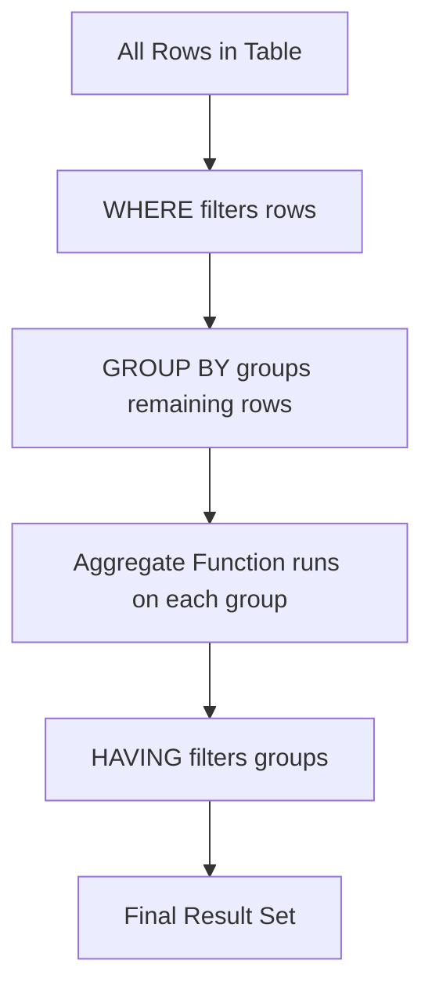
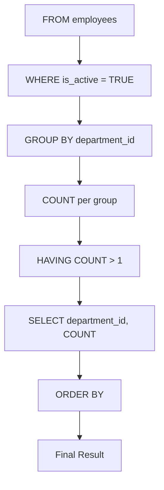
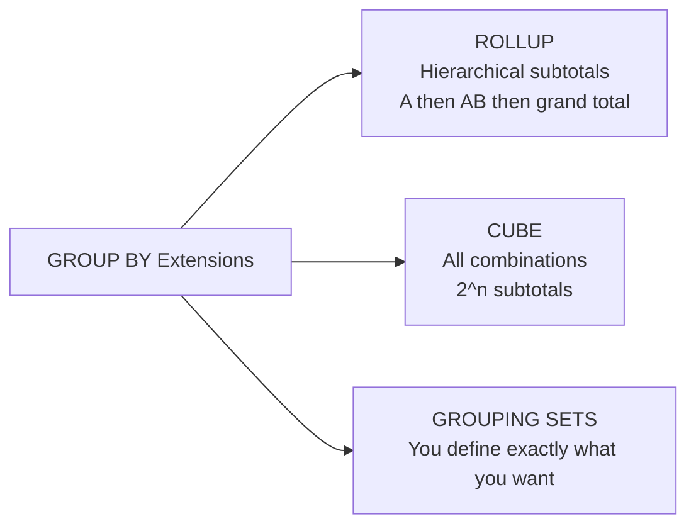
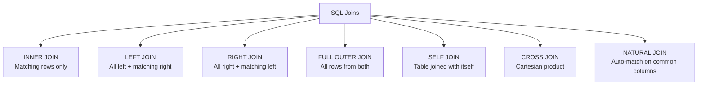
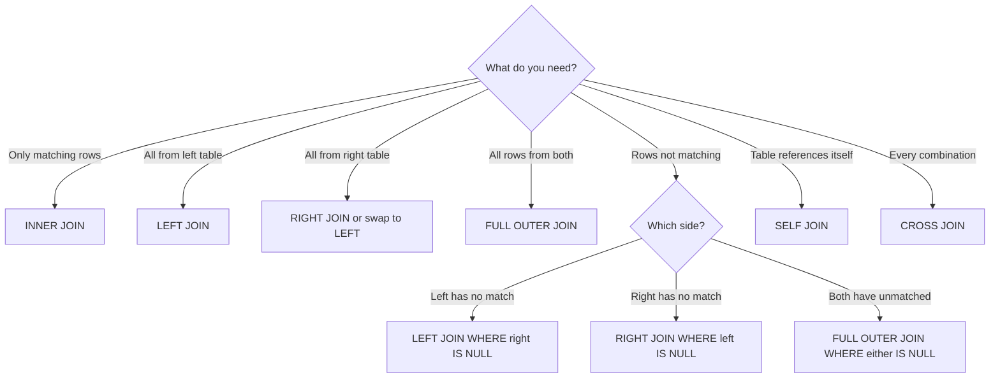

# SQL Handbook for Interviews
## File 04 — Aggregate Functions and Joins

### Covers: COUNT, SUM, AVG, MIN, MAX, GROUP BY, HAVING, ROLLUP, CUBE, GROUPING SETS, INNER JOIN, LEFT JOIN, RIGHT JOIN, FULL OUTER JOIN, SELF JOIN, CROSS JOIN, NATURAL JOIN

---

# Table of Contents

1. [Aggregate Functions Overview](#1-aggregate-functions-overview)
2. [COUNT](#2-count)
3. [SUM](#3-sum)
4. [AVG](#4-avg)
5. [MIN and MAX](#5-min-and-max)
6. [GROUP BY](#6-group-by)
7. [HAVING](#7-having)
8. [WHERE vs HAVING](#8-where-vs-having)
9. [ROLLUP](#9-rollup)
10. [CUBE](#10-cube)
11. [GROUPING SETS](#11-grouping-sets)
12. [SQL Joins Overview](#12-sql-joins-overview)
13. [INNER JOIN](#13-inner-join)
14. [LEFT JOIN](#14-left-join)
15. [RIGHT JOIN](#15-right-join)
16. [FULL OUTER JOIN](#16-full-outer-join)
17. [SELF JOIN](#17-self-join)
18. [CROSS JOIN](#18-cross-join)
19. [NATURAL JOIN](#19-natural-join)
20. [Join Comparison Table](#20-join-comparison-table)
21. [Multiple Joins](#21-multiple-joins)
22. [Join Performance](#22-join-performance)
23. [Practice Questions](#23-practice-questions)

---

# Sample Database Used in This File

```sql
CREATE TABLE departments (
    department_id   INT          PRIMARY KEY AUTO_INCREMENT,
    department_name VARCHAR(100) NOT NULL,
    location        VARCHAR(100),
    manager_id      INT
);

CREATE TABLE employees (
    employee_id   INT            PRIMARY KEY AUTO_INCREMENT,
    first_name    VARCHAR(50)    NOT NULL,
    last_name     VARCHAR(50)    NOT NULL,
    email         VARCHAR(150)   NOT NULL UNIQUE,
    department_id INT,
    salary        DECIMAL(10,2)  NOT NULL,
    hire_date     DATE           NOT NULL,
    manager_id    INT,
    is_active     BOOLEAN        DEFAULT TRUE,
    FOREIGN KEY (department_id) REFERENCES departments(department_id)
);

CREATE TABLE orders (
    order_id    INT           PRIMARY KEY AUTO_INCREMENT,
    customer_id INT           NOT NULL,
    employee_id INT,
    status      VARCHAR(20)   DEFAULT 'pending',
    total       DECIMAL(10,2),
    order_date  DATE          NOT NULL,
    FOREIGN KEY (employee_id) REFERENCES employees(employee_id)
);

CREATE TABLE customers (
    customer_id INT          PRIMARY KEY AUTO_INCREMENT,
    first_name  VARCHAR(50)  NOT NULL,
    last_name   VARCHAR(50)  NOT NULL,
    email       VARCHAR(150) UNIQUE,
    city        VARCHAR(100),
    country     VARCHAR(100) DEFAULT 'India'
);

-- Sample data
INSERT INTO departments (department_name, location, manager_id) VALUES
    ('Engineering',  'Bangalore', 10),
    ('Marketing',    'Mumbai',     2),
    ('Finance',      'Delhi',      8),
    ('HR',           'Bangalore',  6),
    ('Operations',   'Chennai',   NULL);

INSERT INTO employees
    (first_name, last_name, email, department_id, salary, hire_date, manager_id) VALUES
    ('Alice',  'Brown',  'alice@co.com',  1, 95000,  '2020-03-15', NULL),
    ('Bob',    'Smith',  'bob@co.com',    2, 72000,  '2019-07-01', NULL),
    ('Carol',  'White',  'carol@co.com',  1, 105000, '2018-11-20', 1),
    ('David',  'Jones',  'david@co.com',  3, 88000,  '2021-01-10', NULL),
    ('Eva',    'Green',  'eva@co.com',    1, 91000,  '2022-06-01', 1),
    ('Frank',  'Black',  'frank@co.com',  4, 67000,  '2020-09-15', NULL),
    ('Grace',  'Hall',   'grace@co.com',  2, 74000,  '2021-03-22', 2),
    ('Henry',  'Adams',  'henry@co.com',  3, 95000,  '2017-05-30', 4),
    ('Irene',  'Clark',  'irene@co.com',  NULL,62000,'2023-01-05', NULL),
    ('James',  'Wilson', 'james@co.com',  1, 110000, '2016-08-19', 1);
```

---

# 1. Aggregate Functions Overview

### Definition

**Aggregate functions** perform a calculation on a set of rows and return a **single summary value**.

- They operate on a group of rows — either the entire table or a subset defined by `GROUP BY`.
- They are used in the `SELECT` and `HAVING` clauses.
- They **ignore NULL values** in their calculation (except `COUNT(*)`).

---

### Aggregate Functions Reference

| Function | Purpose | NULL Handling |
|---|---|---|
| `COUNT(*)` | Count all rows including NULLs | Includes NULLs |
| `COUNT(col)` | Count non-NULL values in a column | Ignores NULLs |
| `COUNT(DISTINCT col)` | Count distinct non-NULL values | Ignores NULLs |
| `SUM(col)` | Sum of all non-NULL values | Ignores NULLs |
| `AVG(col)` | Average of non-NULL values | Ignores NULLs |
| `MIN(col)` | Minimum non-NULL value | Ignores NULLs |
| `MAX(col)` | Maximum non-NULL value | Ignores NULLs |

---

### Aggregate Function Execution



---

# 2. COUNT

### Definition

`COUNT` returns the **number of rows** that match a condition.

---

### Syntax

```sql
COUNT(*)            -- Counts all rows including NULLs
COUNT(column_name)  -- Counts non-NULL values only
COUNT(DISTINCT col) -- Counts unique non-NULL values
```

---

### Examples

```sql
-- Total number of employees
SELECT COUNT(*) AS total_employees
FROM employees;
-- Output: 10

-- Employees who have a department assigned (non-NULL department_id)
SELECT COUNT(department_id) AS assigned_employees
FROM employees;
-- Output: 9 (Irene has NULL department_id)

-- Total number of employees
SELECT COUNT(*) AS total
FROM employees;
-- Output: 10 (includes Irene even though dept is NULL)

-- Number of distinct departments that have employees
SELECT COUNT(DISTINCT department_id) AS active_departments
FROM employees;
-- Output: 3 (1, 2, 3, 4 — excludes NULL)

-- Employees per department
SELECT department_id, COUNT(*) AS headcount
FROM employees
GROUP BY department_id;
```

**Output:**

| department_id | headcount |
|---|---|
| 1 | 4 |
| 2 | 2 |
| 3 | 2 |
| 4 | 1 |
| NULL | 1 |

---

### COUNT(*) vs COUNT(column)

```sql
SELECT
    COUNT(*)              AS total_rows,       -- 10
    COUNT(department_id)  AS with_department,  -- 9
    COUNT(manager_id)     AS with_manager      -- 6
FROM employees;
```

> `COUNT(*)` always counts all rows.
> `COUNT(column)` skips rows where that column is NULL.

---

# 3. SUM

### Definition

`SUM` returns the **total sum** of all non-NULL values in a numeric column.

---

### Syntax

```sql
SUM(column_name)
SUM(DISTINCT column_name)
```

---

### Examples

```sql
-- Total salary expenditure
SELECT SUM(salary) AS total_salary_cost
FROM employees;
-- Output: 859000.00

-- Total salary per department
SELECT
    department_id,
    SUM(salary) AS department_salary
FROM employees
WHERE department_id IS NOT NULL
GROUP BY department_id
ORDER BY department_salary DESC;
```

**Output:**

| department_id | department_salary |
|---|---|
| 1 | 401000.00 |
| 3 | 183000.00 |
| 2 | 146000.00 |
| 4 | 67000.00 |

---

### SUM with Expressions

```sql
-- Total annual salary cost (monthly * 12)
SELECT
    department_id,
    SUM(salary)       AS monthly_cost,
    SUM(salary) * 12  AS annual_cost
FROM employees
GROUP BY department_id;

-- Total salary of active employees only
SELECT SUM(salary) AS active_salary_cost
FROM employees
WHERE is_active = TRUE;
```

---

### SUM Returns NULL When All Values Are NULL

```sql
-- If all values in the column are NULL, SUM returns NULL
SELECT SUM(salary) FROM employees WHERE department_id = 99;
-- Output: NULL (no rows matched)

-- Use COALESCE to default to 0
SELECT COALESCE(SUM(salary), 0) AS total
FROM employees WHERE department_id = 99;
-- Output: 0
```

---

# 4. AVG

### Definition

`AVG` returns the **average (arithmetic mean)** of all non-NULL values in a numeric column.

- `AVG(col)` = `SUM(col)` / `COUNT(col)` — NULLs are excluded from both numerator and denominator.

---

### Syntax

```sql
AVG(column_name)
AVG(DISTINCT column_name)
```

---

### Examples

```sql
-- Company-wide average salary
SELECT ROUND(AVG(salary), 2) AS avg_salary
FROM employees;
-- Output: 85900.00 (sum of 9 non-NULL / 9... wait, all 10 have salary)

-- Average salary per department
SELECT
    department_id,
    ROUND(AVG(salary), 2) AS avg_salary,
    COUNT(*)              AS headcount
FROM employees
GROUP BY department_id
ORDER BY avg_salary DESC;
```

**Output:**

| department_id | avg_salary | headcount |
|---|---|---|
| 1 | 100250.00 | 4 |
| 3 | 91500.00 | 2 |
| 2 | 73000.00 | 2 |
| 4 | 67000.00 | 1 |
| NULL | 62000.00 | 1 |

---

### AVG NULL Trap

```sql
-- Column: bonus (some employees have no bonus — NULL)
-- bonus values: 5000, NULL, 3000, NULL, 4000

SELECT AVG(bonus) FROM employees;
-- Result: (5000 + 3000 + 4000) / 3 = 4000.00
-- NOT (5000 + 3000 + 4000) / 5

-- If you want NULLs treated as 0:
SELECT AVG(COALESCE(bonus, 0)) FROM employees;
-- Result: (5000 + 0 + 3000 + 0 + 4000) / 5 = 2400.00
```

> This is a common interview trap — clarify whether NULLs should be excluded or treated as zero.

---

# 5. MIN and MAX

### Definition

- `MIN` returns the **smallest** non-NULL value in a column.
- `MAX` returns the **largest** non-NULL value in a column.
- Both work on **numbers, strings, and dates**.

---

### Syntax

```sql
MIN(column_name)
MAX(column_name)
```

---

### Examples

```sql
-- Salary range across the company
SELECT
    MIN(salary) AS lowest_salary,
    MAX(salary) AS highest_salary,
    MAX(salary) - MIN(salary) AS salary_range
FROM employees;
```

**Output:**

| lowest_salary | highest_salary | salary_range |
|---|---|---|
| 62000.00 | 110000.00 | 48000.00 |

```sql
-- Earliest and latest hire date
SELECT
    MIN(hire_date) AS first_hire,
    MAX(hire_date) AS latest_hire
FROM employees;

-- Min and Max salary per department
SELECT
    department_id,
    MIN(salary) AS min_salary,
    MAX(salary) AS max_salary
FROM employees
GROUP BY department_id;

-- Most recent order per customer
SELECT
    customer_id,
    MAX(order_date) AS last_order_date
FROM orders
GROUP BY customer_id;
```

---

### MIN / MAX on Strings

```sql
-- Alphabetically first and last employee names
SELECT
    MIN(first_name) AS first_alphabetically,
    MAX(first_name) AS last_alphabetically
FROM employees;
-- MIN: Alice, MAX: James
```

---

# 6. GROUP BY

### Definition

`GROUP BY` groups rows that share the same value in one or more columns, so that aggregate functions can be applied to each group independently.

---

### Syntax

```sql
SELECT column1, aggregate_function(column2)
FROM table_name
[WHERE condition]
GROUP BY column1 [, column2, ...]
[HAVING condition]
[ORDER BY column];
```

---

### Syntax Breakdown

| Keyword | Purpose |
|---|---|
| `GROUP BY col` | Groups rows by the unique values of col |
| `aggregate_function` | Applied to each group independently |
| `HAVING` | Filters groups after aggregation |

---

### Rules of GROUP BY

- Every column in `SELECT` that is **not** inside an aggregate function **must** appear in `GROUP BY`.
- `WHERE` filters rows **before** grouping.
- `HAVING` filters **after** grouping.

---

### Examples

```sql
-- Number of employees per department
SELECT
    department_id,
    COUNT(*)          AS headcount,
    SUM(salary)       AS total_salary,
    ROUND(AVG(salary),2) AS avg_salary,
    MIN(salary)       AS min_salary,
    MAX(salary)       AS max_salary
FROM employees
GROUP BY department_id;

-- Number of employees hired per year
SELECT
    YEAR(hire_date) AS hire_year,
    COUNT(*)        AS employees_hired
FROM employees
GROUP BY YEAR(hire_date)
ORDER BY hire_year;

-- Employee count per location (joining departments)
SELECT
    d.location,
    COUNT(e.employee_id) AS headcount
FROM employees e
JOIN departments d ON e.department_id = d.department_id
GROUP BY d.location
ORDER BY headcount DESC;
```

---

### GROUP BY with Multiple Columns

```sql
-- Employee count grouped by department AND active status
SELECT
    department_id,
    is_active,
    COUNT(*) AS count
FROM employees
GROUP BY department_id, is_active
ORDER BY department_id, is_active;
```

---

### GROUP BY — MySQL Non-Standard Behavior

MySQL (with `sql_mode` not including `ONLY_FULL_GROUP_BY`) historically allowed selecting columns not in GROUP BY — this is non-standard and produces unpredictable results.

```sql
-- Non-standard (avoid this)
SELECT department_id, first_name, COUNT(*)
FROM employees
GROUP BY department_id;
-- first_name value is arbitrary — not deterministic

-- Correct approach
SELECT department_id, COUNT(*) FROM employees GROUP BY department_id;
```

> Always set `sql_mode = 'ONLY_FULL_GROUP_BY'` in MySQL to enforce standard behavior.

---

# 7. HAVING

### Definition

`HAVING` filters **groups** produced by `GROUP BY`, based on aggregate function results.

- `HAVING` is to `GROUP BY` what `WHERE` is to `SELECT`.
- `HAVING` runs **after** aggregation.
- You can use aggregate functions directly in `HAVING`.

---

### Syntax

```sql
SELECT column, aggregate_function(col)
FROM table_name
GROUP BY column
HAVING aggregate_condition;
```

---

### Examples

```sql
-- Departments with more than 1 employee
SELECT
    department_id,
    COUNT(*) AS headcount
FROM employees
GROUP BY department_id
HAVING COUNT(*) > 1;

-- Departments where average salary exceeds 80000
SELECT
    department_id,
    ROUND(AVG(salary), 2) AS avg_salary
FROM employees
GROUP BY department_id
HAVING AVG(salary) > 80000
ORDER BY avg_salary DESC;

-- Departments with total salary cost above 100000
SELECT
    department_id,
    SUM(salary) AS total_salary
FROM employees
GROUP BY department_id
HAVING SUM(salary) > 100000;

-- Departments with both: more than 1 employee AND avg salary > 80000
SELECT
    department_id,
    COUNT(*)              AS headcount,
    ROUND(AVG(salary), 2) AS avg_salary
FROM employees
GROUP BY department_id
HAVING COUNT(*) > 1
   AND AVG(salary) > 80000;
```

---

# 8. WHERE vs HAVING

This is one of the most commonly asked interview questions in SQL.

| Feature | WHERE | HAVING |
|---|---|---|
| Filters | Individual rows | Groups |
| Runs | Before GROUP BY | After GROUP BY |
| Aggregate functions | Cannot use | Can use |
| Works without GROUP BY | Yes | Rarely (acts on whole table as one group) |
| Performance | Reduces rows early — faster | Runs after grouping |

---

### Example Illustrating the Difference

```sql
-- WHERE filters rows BEFORE grouping
-- Only consider active employees, then group
SELECT department_id, COUNT(*) AS headcount
FROM employees
WHERE is_active = TRUE          -- filters rows first
GROUP BY department_id;

-- HAVING filters groups AFTER aggregation
-- Group all employees, then keep only large departments
SELECT department_id, COUNT(*) AS headcount
FROM employees
GROUP BY department_id
HAVING COUNT(*) > 1;            -- filters groups after

-- Using BOTH together
-- Active employees only, grouped by department, with more than 1 member
SELECT department_id, COUNT(*) AS headcount
FROM employees
WHERE is_active = TRUE          -- row filter
GROUP BY department_id
HAVING COUNT(*) > 1;            -- group filter
```

---

### Execution Flow



---

# 9. ROLLUP

### Definition

`ROLLUP` is an extension of `GROUP BY` that generates **subtotals and a grand total** automatically.

- It creates additional summary rows for each level of grouping.
- The grand total row has `NULL` in the grouped columns.

---

### Syntax

```sql
-- MySQL
GROUP BY column1, column2 WITH ROLLUP

-- PostgreSQL / SQL Server
GROUP BY ROLLUP(column1, column2)
```

---

### Example

```sql
-- Total salary per department with grand total (MySQL)
SELECT
    department_id,
    ROUND(AVG(salary), 2) AS avg_salary,
    SUM(salary)           AS total_salary,
    COUNT(*)              AS headcount
FROM employees
GROUP BY department_id WITH ROLLUP;
```

**Output:**

| department_id | avg_salary | total_salary | headcount |
|---|---|---|---|
| 1 | 100250.00 | 401000.00 | 4 |
| 2 | 73000.00 | 146000.00 | 2 |
| 3 | 91500.00 | 183000.00 | 2 |
| 4 | 67000.00 | 67000.00 | 1 |
| NULL | 62000.00 | 62000.00 | 1 |
| **NULL** | **85900.00** | **859000.00** | **10** |

> The last row (all NULLs in GROUP BY columns) is the **grand total**.

---

### Distinguish ROLLUP NULL from Real NULL

```sql
-- Use GROUPING() to detect ROLLUP-generated NULLs
SELECT
    CASE WHEN GROUPING(department_id) = 1
         THEN 'Grand Total'
         ELSE CAST(department_id AS CHAR)
    END AS department,
    SUM(salary) AS total_salary
FROM employees
GROUP BY department_id WITH ROLLUP;
```

---

### Multi-level ROLLUP

```sql
-- PostgreSQL / SQL Server
SELECT
    location,
    department_name,
    SUM(e.salary) AS total_salary
FROM employees e
JOIN departments d ON e.department_id = d.department_id
GROUP BY ROLLUP(d.location, d.department_name);
-- Subtotals per location, then grand total
```

---

# 10. CUBE

### Definition

`CUBE` generates subtotals for **every possible combination** of the grouped columns.

- While `ROLLUP` generates a hierarchy (one direction), `CUBE` generates all combinations.
- Primarily used in data warehousing and OLAP analytics.

---

### Syntax

```sql
-- PostgreSQL / SQL Server
GROUP BY CUBE(column1, column2)

-- MySQL does not natively support CUBE (simulate with UNION)
```

---

### ROLLUP vs CUBE

| Feature | ROLLUP | CUBE |
|---|---|---|
| Subtotals | Hierarchical | All combinations |
| Rows generated | n+1 levels | 2^n combinations |
| Use case | Totals by hierarchy | Cross-dimensional analysis |
| Support | MySQL, PostgreSQL, SQL Server | PostgreSQL, SQL Server (not MySQL natively) |

---

### Example

```sql
-- PostgreSQL
SELECT
    d.location,
    d.department_name,
    SUM(e.salary) AS total_salary
FROM employees e
JOIN departments d ON e.department_id = d.department_id
GROUP BY CUBE(d.location, d.department_name);

-- Produces:
-- Per location + department
-- Per location (all departments)
-- Per department (all locations)
-- Grand total
```

---

# 11. GROUPING SETS

### Definition

`GROUPING SETS` allows you to define **exactly which grouping combinations** you want — more flexible than ROLLUP or CUBE.

---

### Syntax

```sql
GROUP BY GROUPING SETS (
    (column1, column2),
    (column1),
    (column2),
    ()
)
```

---

### Example

```sql
-- PostgreSQL / SQL Server
SELECT
    department_id,
    YEAR(hire_date) AS hire_year,
    COUNT(*)        AS headcount
FROM employees
GROUP BY GROUPING SETS (
    (department_id, YEAR(hire_date)),  -- Per dept per year
    (department_id),                   -- Per dept total
    (YEAR(hire_date)),                 -- Per year total
    ()                                 -- Grand total
);
```

---

### ROLLUP vs CUBE vs GROUPING SETS



---

# 12. SQL Joins Overview

### Definition

A **JOIN** combines rows from two or more tables based on a related column — usually a foreign key relationship.

---

### Types of Joins



---

### Venn Diagram Representation (ASCII)

```
INNER JOIN           LEFT JOIN            RIGHT JOIN
  A   B                A   B                A   B
 ___________          ___________          ___________
|   | X |   |        |XXX|XX|   |        |   |XX|XXX|
|___|___|___|        |___|__|___|        |___|__|___|
Only overlap         All of A            All of B


FULL OUTER JOIN      
  A   B              
 ___________         
|XXX|XX|XXX|        
|___|___|___|        
All rows from both   
```

---

### Join Syntax Template

```sql
SELECT columns
FROM table_a [alias]
JOIN_TYPE table_b [alias]
    ON table_a.key = table_b.key
[WHERE condition];
```

---

# 13. INNER JOIN

### Definition

`INNER JOIN` returns only the rows where the join condition is **TRUE in both tables**.

- Rows with no match in either table are excluded.
- The most common type of join.

---

### Syntax

```sql
SELECT columns
FROM table_a a
INNER JOIN table_b b
    ON a.key = b.key;
```

`INNER` keyword is optional — `JOIN` alone defaults to `INNER JOIN`.

---

### Example

```sql
-- Employee names with their department names
SELECT
    e.first_name,
    e.last_name,
    e.salary,
    d.department_name,
    d.location
FROM employees e
INNER JOIN departments d
    ON e.department_id = d.department_id;
```

**Output — only employees WITH a department (Irene excluded because department_id is NULL):**

| first_name | last_name | salary | department_name | location |
|---|---|---|---|---|
| Alice | Brown | 95000 | Engineering | Bangalore |
| Bob | Smith | 72000 | Marketing | Mumbai |
| Carol | White | 105000 | Engineering | Bangalore |
| David | Jones | 88000 | Finance | Delhi |
| Eva | Green | 91000 | Engineering | Bangalore |
| Frank | Black | 67000 | HR | Bangalore |
| Grace | Hall | 74000 | Marketing | Mumbai |
| Henry | Adams | 95000 | Finance | Delhi |
| James | Wilson | 110000 | Engineering | Bangalore |

> Irene (NULL department_id) is excluded. Operations department (no employees) is excluded.

---

### Real-World Example

```sql
-- Orders with customer details
SELECT
    o.order_id,
    o.order_date,
    o.total,
    o.status,
    c.first_name  AS customer_first,
    c.last_name   AS customer_last,
    c.city
FROM orders o
INNER JOIN customers c
    ON o.customer_id = c.customer_id
WHERE o.status = 'delivered'
ORDER BY o.order_date DESC;
```

---

# 14. LEFT JOIN

### Definition

`LEFT JOIN` (also called `LEFT OUTER JOIN`) returns:
- **All rows** from the **left table**.
- The **matched rows** from the right table.
- `NULL` in right table columns where no match exists.

---

### Syntax

```sql
SELECT columns
FROM table_a a
LEFT JOIN table_b b
    ON a.key = b.key;
```

---

### Example

```sql
-- All employees including those with no department
SELECT
    e.first_name,
    e.last_name,
    e.salary,
    d.department_name
FROM employees e
LEFT JOIN departments d
    ON e.department_id = d.department_id;
```

**Output — Irene appears with NULL in department_name:**

| first_name | last_name | salary | department_name |
|---|---|---|---|
| Alice | Brown | 95000 | Engineering |
| Bob | Smith | 72000 | Marketing |
| Carol | White | 105000 | Engineering |
| David | Jones | 88000 | Finance |
| Eva | Green | 91000 | Engineering |
| Frank | Black | 67000 | HR |
| Grace | Hall | 74000 | Marketing |
| Henry | Adams | 95000 | Finance |
| **Irene** | **Clark** | **62000** | **NULL** |
| James | Wilson | 110000 | Engineering |

---

### Finding Unmatched Rows (Anti-Join Pattern)

```sql
-- Employees with NO department assigned
SELECT
    e.first_name,
    e.last_name,
    e.department_id
FROM employees e
LEFT JOIN departments d
    ON e.department_id = d.department_id
WHERE d.department_id IS NULL;
```

> This is called a **LEFT ANTI-JOIN** — one of the most useful patterns in SQL.

---

### Real-World Use Cases for LEFT JOIN

```sql
-- All customers and their orders (include customers with no orders)
SELECT
    c.customer_id,
    c.first_name,
    COUNT(o.order_id)     AS total_orders,
    COALESCE(SUM(o.total), 0) AS total_spent
FROM customers c
LEFT JOIN orders o ON c.customer_id = o.customer_id
GROUP BY c.customer_id, c.first_name
ORDER BY total_spent DESC;
```

---

# 15. RIGHT JOIN

### Definition

`RIGHT JOIN` (also called `RIGHT OUTER JOIN`) returns:
- **All rows** from the **right table**.
- The **matched rows** from the left table.
- `NULL` in left table columns where no match exists.

---

### Syntax

```sql
SELECT columns
FROM table_a a
RIGHT JOIN table_b b
    ON a.key = b.key;
```

---

### Example

```sql
-- All departments including those with no employees
SELECT
    e.first_name,
    e.salary,
    d.department_name,
    d.location
FROM employees e
RIGHT JOIN departments d
    ON e.department_id = d.department_id;
```

**Output — Operations department appears with NULL employee data:**

| first_name | salary | department_name | location |
|---|---|---|---|
| Alice | 95000 | Engineering | Bangalore |
| Carol | 105000 | Engineering | Bangalore |
| Eva | 91000 | Engineering | Bangalore |
| James | 110000 | Engineering | Bangalore |
| Bob | 72000 | Marketing | Mumbai |
| Grace | 74000 | Marketing | Mumbai |
| David | 88000 | Finance | Delhi |
| Henry | 95000 | Finance | Delhi |
| Frank | 67000 | HR | Bangalore |
| **NULL** | **NULL** | **Operations** | **Chennai** |

---

### RIGHT JOIN is Rarely Necessary

A `RIGHT JOIN` can always be rewritten as a `LEFT JOIN` by swapping the table order:

```sql
-- These are equivalent
SELECT * FROM employees e RIGHT JOIN departments d ON e.department_id = d.department_id;
SELECT * FROM departments d LEFT JOIN employees e ON d.department_id = e.department_id;
```

> In practice, most developers use only `LEFT JOIN` and swap table order when needed. This improves readability.

---

# 16. FULL OUTER JOIN

### Definition

`FULL OUTER JOIN` returns:
- **All rows from both tables**.
- Matched rows have data from both sides.
- Unmatched rows have `NULL` in the columns from the other table.

---

### Syntax

```sql
-- PostgreSQL / SQL Server
SELECT columns
FROM table_a a
FULL OUTER JOIN table_b b
    ON a.key = b.key;
```

---

### MySQL Does Not Support FULL OUTER JOIN

Simulate it using `UNION` of LEFT JOIN and RIGHT JOIN:

```sql
-- MySQL simulation of FULL OUTER JOIN
SELECT
    e.first_name,
    e.salary,
    d.department_name
FROM employees e
LEFT JOIN departments d ON e.department_id = d.department_id

UNION

SELECT
    e.first_name,
    e.salary,
    d.department_name
FROM employees e
RIGHT JOIN departments d ON e.department_id = d.department_id;
```

---

### Example (PostgreSQL)

```sql
-- All employees AND all departments, matched where possible
SELECT
    e.first_name,
    e.salary,
    d.department_name
FROM employees e
FULL OUTER JOIN departments d
    ON e.department_id = d.department_id;
```

**Output — Irene (no dept) and Operations (no employees) both appear:**

| first_name | salary | department_name |
|---|---|---|
| Alice | 95000 | Engineering |
| ... | ... | ... |
| Irene | 62000 | NULL |
| NULL | NULL | Operations |

---

### Full Outer Join Anti-Join

```sql
-- Rows that exist in EITHER table but not BOTH (symmetric difference)
SELECT e.first_name, d.department_name
FROM employees e
FULL OUTER JOIN departments d
    ON e.department_id = d.department_id
WHERE e.employee_id IS NULL
   OR d.department_id IS NULL;
```

---

# 17. SELF JOIN

### Definition

A **SELF JOIN** joins a table **with itself**.

- Used when a table has a column that references another row in the **same table**.
- The most common use case is **employee-manager hierarchies**.
- Requires table aliases to distinguish the two instances.

---

### Syntax

```sql
SELECT a.column, b.column
FROM table_name a
JOIN table_name b
    ON a.related_column = b.primary_key;
```

---

### Example — Employee Manager Hierarchy

```sql
-- Each employee with their manager's name
SELECT
    e.first_name                                    AS employee,
    e.salary                                        AS emp_salary,
    CONCAT(m.first_name, ' ', m.last_name)          AS manager_name
FROM employees e
LEFT JOIN employees m
    ON e.manager_id = m.employee_id;
```

**Output:**

| employee | emp_salary | manager_name |
|---|---|---|
| Alice | 95000 | NULL (top-level) |
| Bob | 72000 | NULL |
| Carol | 105000 | Alice Brown |
| Eva | 91000 | Alice Brown |
| James | 110000 | Alice Brown |
| Grace | 74000 | Bob Smith |
| Henry | 95000 | David Jones |

---

### Real-World Self Join Use Cases

```sql
-- Find pairs of employees in the same department
SELECT
    a.first_name AS employee1,
    b.first_name AS employee2,
    a.department_id
FROM employees a
JOIN employees b
    ON a.department_id = b.department_id
   AND a.employee_id < b.employee_id  -- avoid duplicates and self-pairs
ORDER BY a.department_id;

-- Employees earning more than their manager
SELECT
    e.first_name     AS employee,
    e.salary         AS emp_salary,
    m.first_name     AS manager,
    m.salary         AS mgr_salary
FROM employees e
JOIN employees m
    ON e.manager_id = m.employee_id
WHERE e.salary > m.salary;
```

---

# 18. CROSS JOIN

### Definition

A **CROSS JOIN** returns the **Cartesian product** of two tables — every row in the left table is combined with every row in the right table.

- No `ON` condition is used.
- If Table A has m rows and Table B has n rows, the result has **m × n rows**.
- Use with caution — can produce very large result sets.

---

### Syntax

```sql
SELECT columns
FROM table_a
CROSS JOIN table_b;
```

---

### Example

```sql
-- Generate all possible department-location combinations
SELECT
    d.department_name,
    l.city
FROM departments d
CROSS JOIN (
    SELECT 'Bangalore' AS city
    UNION SELECT 'Mumbai'
    UNION SELECT 'Delhi'
    UNION SELECT 'Chennai'
) l;
-- 5 departments × 4 cities = 20 rows
```

---

### Real-World Use Cases for CROSS JOIN

```sql
-- Generate a date series (every day in January 2024)
-- Combined with every department to create a report scaffold
SELECT
    d.department_name,
    dates.report_date
FROM departments d
CROSS JOIN (
    SELECT DATE('2024-01-01') + INTERVAL (n) DAY AS report_date
    FROM (SELECT 0 AS n UNION SELECT 1 UNION SELECT 2 ... UNION SELECT 30) nums
) dates
ORDER BY d.department_name, dates.report_date;
```

---

### CROSS JOIN Warning

```sql
-- 1,000 rows × 1,000 rows = 1,000,000 result rows
-- 10,000 × 10,000 = 100,000,000 rows
-- Always add WHERE or use a subquery to limit output
```

---

# 19. NATURAL JOIN

### Definition

A **NATURAL JOIN** automatically joins tables on **all columns with the same name** in both tables.

- No `ON` clause required.
- The DBMS finds matching column names automatically.

---

### Syntax

```sql
SELECT columns
FROM table_a
NATURAL JOIN table_b;
```

---

### Example

```sql
-- Automatically joins on department_id (common column name)
SELECT first_name, salary, department_name
FROM employees
NATURAL JOIN departments;
-- Equivalent to:
-- FROM employees e JOIN departments d ON e.department_id = d.department_id
```

---

### Why NATURAL JOIN is Avoided in Production

| Problem | Explanation |
|---|---|
| Implicit behavior | Easy to miss which columns are being joined on |
| Schema changes | Adding a column with the same name in both tables breaks the query silently |
| Unintended joins | Matches ALL common column names — could join on wrong columns |
| Readability | Other developers cannot tell what the join condition is |

> Never use `NATURAL JOIN` in production code. Always use explicit `ON` conditions.

---

# 20. Join Comparison Table

| Join Type | Returns | Left Unmatched | Right Unmatched | NULL in Output |
|---|---|---|---|---|
| `INNER JOIN` | Matching rows only | Excluded | Excluded | No |
| `LEFT JOIN` | All left + matched right | Included | Excluded | Yes (right cols) |
| `RIGHT JOIN` | Matched left + all right | Excluded | Included | Yes (left cols) |
| `FULL OUTER JOIN` | All rows from both | Included | Included | Yes (both sides) |
| `SELF JOIN` | Rows joined to themselves | Depends on type | Depends on type | Depends |
| `CROSS JOIN` | Cartesian product | N/A | N/A | No |
| `NATURAL JOIN` | Matching on all common cols | Excluded | Excluded | No |

---

### Choosing the Right Join



---

# 21. Multiple Joins

### Definition

You can chain multiple `JOIN` clauses to combine more than two tables in a single query.

---

### Example — Three Table Join

```sql
-- Orders with customer name and employee who handled it
SELECT
    o.order_id,
    o.order_date,
    o.total,
    o.status,
    CONCAT(c.first_name, ' ', c.last_name) AS customer_name,
    CONCAT(e.first_name, ' ', e.last_name) AS handled_by,
    d.department_name                       AS employee_dept
FROM orders o
INNER JOIN customers  c ON o.customer_id  = c.customer_id
LEFT  JOIN employees  e ON o.employee_id  = e.employee_id
LEFT  JOIN departments d ON e.department_id = d.department_id
ORDER BY o.order_date DESC;
```

---

### Example — Four Table Join

```sql
-- Full order details: order → customer → employee → department
SELECT
    o.order_id,
    c.first_name                AS customer,
    e.first_name                AS sales_rep,
    d.department_name           AS sales_dept,
    d.location                  AS sales_location,
    o.total,
    o.status
FROM orders o
INNER JOIN customers  c  ON o.customer_id  = c.customer_id
LEFT  JOIN employees  e  ON o.employee_id  = e.employee_id
LEFT  JOIN departments d ON e.department_id = d.department_id
WHERE o.status IN ('delivered', 'shipped')
ORDER BY o.total DESC;
```

---

### Joining the Same Table Twice

```sql
-- Order placed by a customer from Bangalore,
-- handled by an employee in the Engineering department
SELECT
    o.order_id,
    c.first_name AS customer,
    e.first_name AS employee
FROM orders o
INNER JOIN customers   c ON o.customer_id  = c.customer_id
INNER JOIN employees   e ON o.employee_id  = e.employee_id
INNER JOIN departments d ON e.department_id = d.department_id
WHERE c.city            = 'Bangalore'
  AND d.department_name = 'Engineering';
```

---

# 22. Join Performance

### Index Usage in Joins

- The columns used in `ON` conditions should be **indexed** in both tables.
- Primary keys are automatically indexed.
- Foreign key columns in child tables should have explicit indexes.

```sql
-- Add indexes on FK columns for faster joins
CREATE INDEX idx_employees_dept ON employees(department_id);
CREATE INDEX idx_orders_customer ON orders(customer_id);
CREATE INDEX idx_orders_employee ON orders(employee_id);
```

---

### Join Order

- The query optimizer usually determines the optimal join order automatically.
- For very complex queries with many joins, use `EXPLAIN` to verify the plan.

```sql
-- Check join execution plan
EXPLAIN SELECT e.first_name, d.department_name
FROM employees e
JOIN departments d ON e.department_id = d.department_id;
```

---

### Common Join Performance Tips

| Tip | Reason |
|---|---|
| Index FK columns | Speeds up join lookups dramatically |
| Filter early with WHERE | Reduces row count before joining |
| Avoid SELECT * in joins | Fetches unnecessary columns |
| Use INNER JOIN when possible | Smaller result set than OUTER joins |
| Avoid joining on functions | `ON YEAR(e.hire_date) = YEAR(o.order_date)` prevents index use |
| Use EXPLAIN | Reveals full/index scans that should be optimized |

---

### Avoiding Accidental Cartesian Products

```sql
-- DANGER: missing ON condition creates a CROSS JOIN
SELECT e.first_name, d.department_name
FROM employees e, departments d;
-- Returns 10 × 5 = 50 rows — almost certainly wrong

-- Always use explicit JOIN with ON condition
SELECT e.first_name, d.department_name
FROM employees e
JOIN departments d ON e.department_id = d.department_id;
```

---

### Common Interview Questions

1. What is the difference between `INNER JOIN` and `LEFT JOIN`?
2. What happens when you `LEFT JOIN` and filter on the right table's column in `WHERE`?
3. What is an anti-join? How do you write one?
4. What is a self-join? Give a real-world example.
5. What is a CROSS JOIN? When would you use one?
6. Why is `NATURAL JOIN` avoided in production?
7. What is the difference between `GROUP BY` and `ORDER BY`?
8. What is the difference between `WHERE` and `HAVING`?
9. Can you use aggregate functions in a `WHERE` clause?
10. What does `COUNT(*)` vs `COUNT(column)` return?
11. Why does `AVG` ignore NULLs? How do you include NULLs as zero?
12. What is `ROLLUP`? How is it different from a regular `GROUP BY`?
13. What is the difference between `ROLLUP` and `CUBE`?
14. What is `GROUPING SETS`?
15. How do you simulate a `FULL OUTER JOIN` in MySQL?
16. What is the result of `INNER JOIN` when a column has NULL values?
17. How do you find rows that exist in one table but not another?
18. What is the difference between `UNION` and `JOIN`?
19. How do you write a query to find employees who earn more than their manager?
20. What indexes should you create to optimize join performance?

---

### Common Mistakes

- Filtering on a right-table column in `WHERE` after a `LEFT JOIN` — converts it to `INNER JOIN`.
- Forgetting to alias tables in a `SELF JOIN` — causes ambiguous column errors.
- Using `NATURAL JOIN` in production — fragile when schema changes.
- Not indexing foreign key columns — leads to full table scans on every join.
- Using `SELECT *` in joins — returns duplicate column names (e.g., two `department_id` columns).
- Missing the `ON` condition — accidentally creates a CROSS JOIN.
- Using `HAVING` instead of `WHERE` for non-aggregate conditions — less efficient.
- Confusing `COUNT(*)` with `COUNT(col)` when NULLs are present.
- Assuming `AVG` treats NULL as zero — it excludes NULLs entirely.

---

### Best Practices

- Always use explicit `INNER JOIN`, `LEFT JOIN` etc. — avoid old comma-separated syntax.
- Always alias tables in multi-table queries for clarity.
- Always specify which table each column comes from in multi-table queries.
- Use `LEFT JOIN` + `WHERE right_col IS NULL` for anti-join patterns.
- Index all foreign key columns.
- Use `EXPLAIN` regularly during query development.
- Prefer `COALESCE(SUM(col), 0)` to handle NULL aggregate results.
- Name aggregate columns with clear aliases: `AS total_salary`, `AS headcount`.
- Use `ROLLUP` instead of multiple `UNION ALL` queries for reporting subtotals.

---

### Performance Tips

- `INNER JOIN` is generally faster than `OUTER JOIN` because it produces fewer rows.
- Filter rows with `WHERE` before joining to reduce the working set.
- Covering indexes (indexes that include all needed columns) can eliminate table lookups entirely.
- For large aggregations, consider pre-aggregating data in summary tables.
- `COUNT(*)` is slightly faster than `COUNT(col)` because it does not check for NULLs.
- Avoid using functions on join columns: `ON UPPER(a.name) = UPPER(b.name)` prevents index use.

---

### Summary

| Concept | Key Takeaway |
|---|---|
| COUNT(*) | Counts all rows including NULLs |
| COUNT(col) | Counts non-NULL values only |
| SUM / AVG / MIN / MAX | All ignore NULL values |
| AVG NULL trap | NULLs excluded from denominator — use COALESCE to treat as 0 |
| GROUP BY | Groups rows, aggregate functions apply per group |
| HAVING | Filters groups after aggregation — can use aggregate functions |
| WHERE vs HAVING | WHERE filters rows; HAVING filters groups |
| ROLLUP | Adds subtotals and grand total hierarchically |
| CUBE | All grouping combinations |
| GROUPING SETS | You define exactly which groupings you want |
| INNER JOIN | Matching rows only |
| LEFT JOIN | All left rows + matched right |
| RIGHT JOIN | All right rows + matched left |
| FULL OUTER JOIN | All rows from both tables |
| SELF JOIN | Table joined to itself — hierarchies |
| CROSS JOIN | Cartesian product — every combination |
| NATURAL JOIN | Auto-join on common column names — avoid in production |

---

# 23. Practice Questions

1. Write a query to find the department with the highest average salary. Display the department name and average salary.

2. Write a query to find all employees who earn more than the company-wide average salary.

3. Write a query to find customers who have never placed an order. Use a `LEFT JOIN` approach.

4. Write the same query using `NOT EXISTS`.

5. Write a query to display each employee's name, salary, and their manager's name. Employees with no manager should still appear.

6. Write a query to find all departments that have NO employees assigned to them.

7. Write a query using `ROLLUP` to show total salary per department, with a grand total row.

8. Write a query to find the second-highest salary in the company without using `LIMIT/OFFSET`.

9. A table `products` has a `category_id` and a table `categories` has `category_id`. Write a query to find all categories that have more than 10 products.

10. Write a query to find employees who share the same salary as at least one other employee in a different department.

11. Write a query to generate a report showing each department's: headcount, total salary, average salary, minimum salary, maximum salary. Order by average salary descending.

12. Write a query to find the top 3 departments by total salary expenditure.

13. Explain what this query does and what result it returns:
    ```sql
    SELECT c.customer_id, c.first_name, COUNT(o.order_id) AS total_orders
    FROM customers c
    LEFT JOIN orders o ON c.customer_id = o.customer_id
    WHERE o.status = 'delivered'
    GROUP BY c.customer_id, c.first_name;
    ```
    Is the LEFT JOIN behaving as expected? If not, how do you fix it?

14. Write a query to find pairs of employees in the same department using a SELF JOIN. Avoid duplicate pairs (A-B and B-A).

15. Write a CROSS JOIN query to generate a schedule: every employee paired with every weekday (Monday through Friday).

---

> **File 04 Complete — Aggregate Functions and Joins**
> **Next: File 05 — Subqueries, CTEs, and Window Functions**
