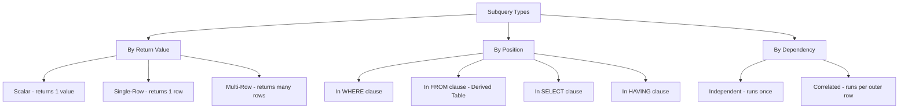
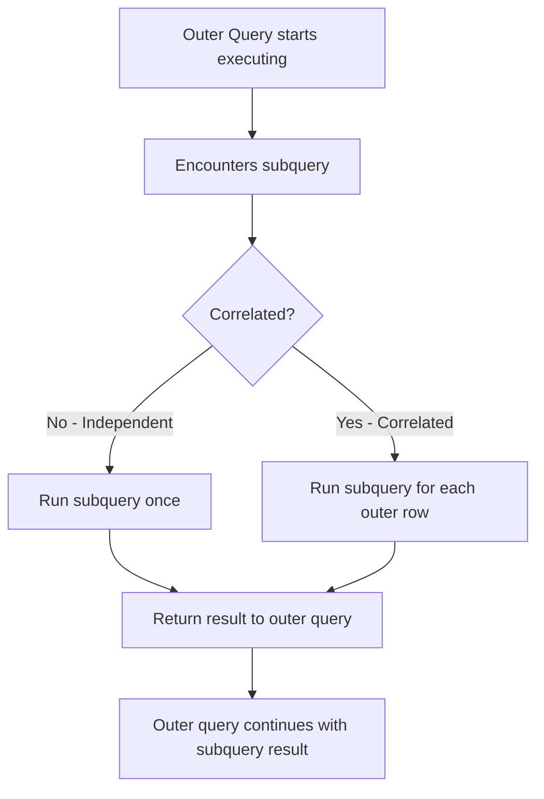
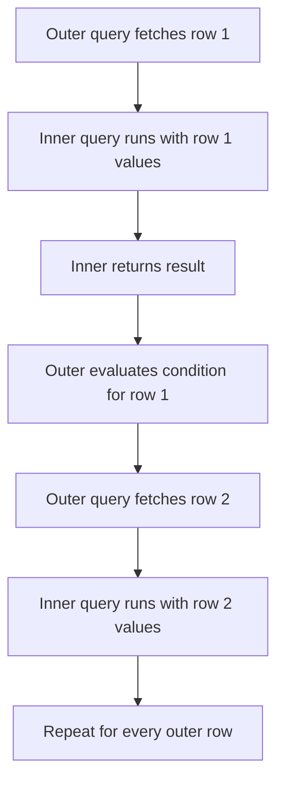
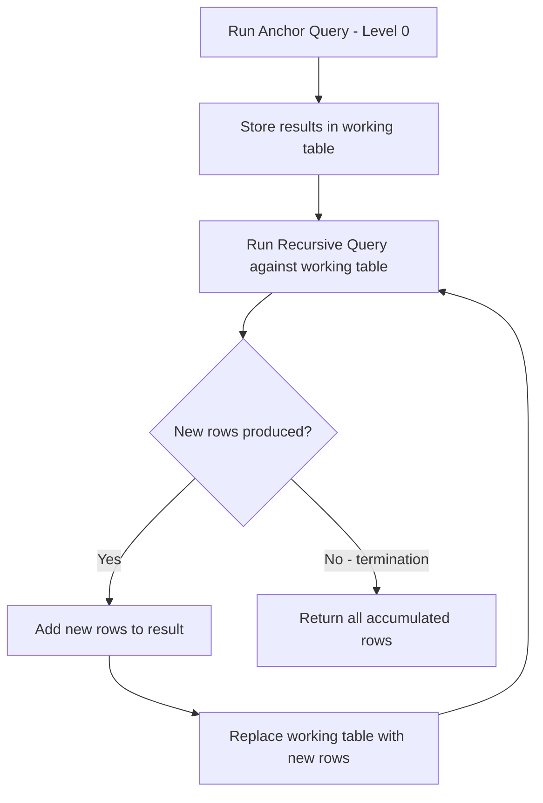
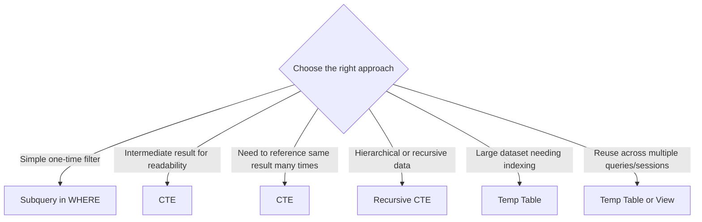
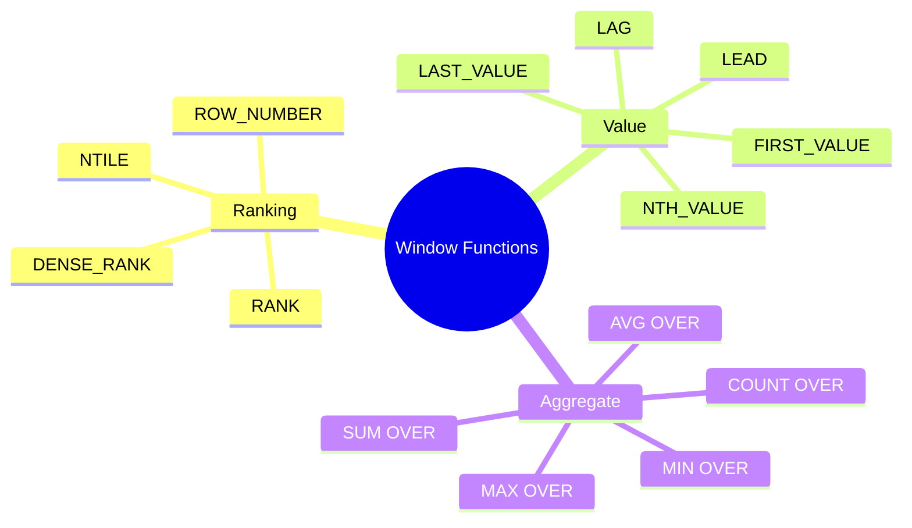

# SQL Handbook for Interviews
## File 05 — Subqueries, CTEs, and Window Functions

### Covers: Single-row, Multi-row, Correlated, Nested, Scalar Subqueries, EXISTS, IN, ANY, ALL, WITH, Recursive CTE, ROW_NUMBER, RANK, DENSE_RANK, NTILE, LEAD, LAG, FIRST_VALUE, LAST_VALUE, OVER(), PARTITION BY, Frame Clauses

---

# Table of Contents

1. [Subqueries Overview](#1-subqueries-overview)
2. [Scalar Subquery](#2-scalar-subquery)
3. [Single-Row Subquery](#3-single-row-subquery)
4. [Multi-Row Subquery](#4-multi-row-subquery)
5. [Correlated Subquery](#5-correlated-subquery)
6. [Nested Subquery](#6-nested-subquery)
7. [Subquery in FROM — Derived Table](#7-subquery-in-from--derived-table)
8. [Subquery with EXISTS](#8-subquery-with-exists)
9. [Subquery with IN, ANY, ALL](#9-subquery-with-in-any-all)
10. [Subquery vs JOIN](#10-subquery-vs-join)
11. [CTE — Common Table Expression](#11-cte--common-table-expression)
12. [Multiple CTEs](#12-multiple-ctés)
13. [Recursive CTE](#13-recursive-cte)
14. [CTE vs Subquery vs Temp Table](#14-cte-vs-subquery-vs-temp-table)
15. [Window Functions Overview](#15-window-functions-overview)
16. [OVER() and PARTITION BY](#16-over-and-partition-by)
17. [ROW_NUMBER](#17-row_number)
18. [RANK](#18-rank)
19. [DENSE_RANK](#19-dense_rank)
20. [RANK vs DENSE_RANK vs ROW_NUMBER](#20-rank-vs-dense_rank-vs-row_number)
21. [NTILE](#21-ntile)
22. [LEAD and LAG](#22-lead-and-lag)
23. [FIRST_VALUE and LAST_VALUE](#23-first_value-and-last_value)
24. [Frame Clauses](#24-frame-clauses)
25. [Window Function Practical Patterns](#25-window-function-practical-patterns)
26. [Practice Questions](#26-practice-questions)

---

# Sample Database Used in This File

```sql
-- Reusing from File 04 with additional data

CREATE TABLE departments (
    department_id   INT          PRIMARY KEY AUTO_INCREMENT,
    department_name VARCHAR(100) NOT NULL,
    location        VARCHAR(100)
);

CREATE TABLE employees (
    employee_id   INT            PRIMARY KEY AUTO_INCREMENT,
    first_name    VARCHAR(50)    NOT NULL,
    last_name     VARCHAR(50)    NOT NULL,
    department_id INT,
    salary        DECIMAL(10,2)  NOT NULL,
    hire_date     DATE           NOT NULL,
    manager_id    INT,
    FOREIGN KEY (department_id) REFERENCES departments(department_id)
);

CREATE TABLE sales (
    sale_id     INT           PRIMARY KEY AUTO_INCREMENT,
    employee_id INT           NOT NULL,
    sale_date   DATE          NOT NULL,
    amount      DECIMAL(10,2) NOT NULL,
    region      VARCHAR(50),
    FOREIGN KEY (employee_id) REFERENCES employees(employee_id)
);

INSERT INTO departments VALUES
    (1, 'Engineering',  'Bangalore'),
    (2, 'Marketing',    'Mumbai'),
    (3, 'Finance',      'Delhi'),
    (4, 'HR',           'Bangalore'),
    (5, 'Operations',   'Chennai');

INSERT INTO employees VALUES
    (1,  'Alice',  'Brown',  1, 95000,  '2020-03-15', NULL),
    (2,  'Bob',    'Smith',  2, 72000,  '2019-07-01', NULL),
    (3,  'Carol',  'White',  1, 105000, '2018-11-20', 1),
    (4,  'David',  'Jones',  3, 88000,  '2021-01-10', NULL),
    (5,  'Eva',    'Green',  1, 91000,  '2022-06-01', 1),
    (6,  'Frank',  'Black',  4, 67000,  '2020-09-15', NULL),
    (7,  'Grace',  'Hall',   2, 74000,  '2021-03-22', 2),
    (8,  'Henry',  'Adams',  3, 95000,  '2017-05-30', 4),
    (9,  'Irene',  'Clark',  NULL,62000,'2023-01-05', NULL),
    (10, 'James',  'Wilson', 1, 110000, '2016-08-19', 1);

INSERT INTO sales VALUES
    (1,  1, '2024-01-10', 15000, 'North'),
    (2,  1, '2024-01-25', 22000, 'South'),
    (3,  2, '2024-01-15', 8000,  'East'),
    (4,  3, '2024-01-20', 31000, 'North'),
    (5,  3, '2024-02-05', 27000, 'West'),
    (6,  5, '2024-02-10', 19000, 'North'),
    (7,  7, '2024-02-15', 12000, 'East'),
    (8,  1, '2024-02-20', 18000, 'South'),
    (9,  3, '2024-03-01', 35000, 'North'),
    (10, 2, '2024-03-10', 9500,  'West');
```

---

# 1. Subqueries Overview

### Definition

A **subquery** is a SQL query nested inside another SQL query.

- The inner query runs first and its result is used by the outer query.
- Subqueries can appear in `SELECT`, `FROM`, `WHERE`, and `HAVING` clauses.
- Also called an **inner query** or **nested query**.

---

### Types of Subqueries



---

### Subquery Execution Flow



---

# 2. Scalar Subquery

### Definition

A **scalar subquery** returns **exactly one row and one column** — a single value.

- Can be used anywhere a single value is expected.
- Commonly used in `SELECT`, `WHERE`, and `SET` clauses.
- If it returns more than one row, the query throws an error.

---

### Syntax

```sql
SELECT column, (SELECT single_value FROM ...) AS alias
FROM table;
```

---

### Examples

```sql
-- Display each employee's salary alongside the company average
SELECT
    first_name,
    salary,
    (SELECT ROUND(AVG(salary), 2) FROM employees) AS company_avg,
    salary - (SELECT ROUND(AVG(salary), 2) FROM employees) AS diff_from_avg
FROM employees
ORDER BY salary DESC;
```

**Output:**

| first_name | salary | company_avg | diff_from_avg |
|---|---|---|---|
| James | 110000 | 85900.00 | 24100.00 |
| Carol | 105000 | 85900.00 | 19100.00 |
| Alice | 95000 | 85900.00 | 9100.00 |
| Henry | 95000 | 85900.00 | 9100.00 |
| Eva | 91000 | 85900.00 | 5100.00 |
| David | 88000 | 85900.00 | 2100.00 |
| Grace | 74000 | 85900.00 | -11900.00 |
| Bob | 72000 | 85900.00 | -13900.00 |
| Frank | 67000 | 85900.00 | -18900.00 |
| Irene | 62000 | 85900.00 | -23900.00 |

---

```sql
-- Use scalar subquery in WHERE
SELECT first_name, salary
FROM employees
WHERE salary > (SELECT AVG(salary) FROM employees);

-- Use scalar subquery in UPDATE
UPDATE employees
SET salary = salary * 1.10
WHERE salary < (SELECT avg_sal FROM (SELECT AVG(salary) AS avg_sal FROM employees) t);
```

---

### Scalar Subquery Rules

- Must return exactly **1 row and 1 column**.
- If no rows are returned — the result is `NULL`.
- If more than 1 row is returned — the query **fails with an error**.
- Use aggregate functions (`MAX`, `MIN`, `AVG`, `COUNT`) to guarantee a single value.

---

# 3. Single-Row Subquery

### Definition

A **single-row subquery** returns **one row with one or more columns**.

- Used with single-row comparison operators: `=`, `<`, `>`, `<=`, `>=`, `<>`.
- Most commonly returns exactly one column (making it also a scalar subquery).

---

### Examples

```sql
-- Employee with the same salary as Alice Brown
SELECT first_name, salary
FROM employees
WHERE salary = (
    SELECT salary
    FROM employees
    WHERE first_name = 'Alice' AND last_name = 'Brown'
);

-- Employees hired on the same date as the earliest hire
SELECT first_name, hire_date
FROM employees
WHERE hire_date = (
    SELECT MIN(hire_date)
    FROM employees
);

-- Department with the highest average salary
SELECT department_id, department_name
FROM departments
WHERE department_id = (
    SELECT department_id
    FROM employees
    GROUP BY department_id
    ORDER BY AVG(salary) DESC
    LIMIT 1
);
```

---

# 4. Multi-Row Subquery

### Definition

A **multi-row subquery** returns **more than one row**.

- Cannot be used with single-row operators (`=`, `<`, `>`).
- Must be used with multi-row operators: `IN`, `NOT IN`, `ANY`, `ALL`, `EXISTS`.

---

### Examples

```sql
-- Employees in departments located in Bangalore
SELECT first_name, department_id
FROM employees
WHERE department_id IN (
    SELECT department_id
    FROM departments
    WHERE location = 'Bangalore'
);

-- Employees NOT in any department located in Bangalore
SELECT first_name, department_id
FROM employees
WHERE department_id NOT IN (
    SELECT department_id
    FROM departments
    WHERE location = 'Bangalore'
      AND department_id IS NOT NULL  -- safety against NULL trap
);

-- Employees earning more than at least one person in Finance
SELECT first_name, salary
FROM employees
WHERE salary > ANY (
    SELECT salary
    FROM employees
    WHERE department_id = 3
);

-- Employees earning more than everyone in Finance
SELECT first_name, salary
FROM employees
WHERE salary > ALL (
    SELECT salary
    FROM employees
    WHERE department_id = 3
);
```

---

### Multi-Row Operator Summary

| Operator | Returns TRUE when |
|---|---|
| `IN (subquery)` | Value matches any row in result |
| `NOT IN (subquery)` | Value matches no row in result (beware NULLs) |
| `= ANY (subquery)` | Equal to at least one value |
| `> ANY (subquery)` | Greater than at least one value (> MIN) |
| `> ALL (subquery)` | Greater than every value (> MAX) |
| `EXISTS (subquery)` | Subquery returns at least one row |
| `NOT EXISTS (subquery)` | Subquery returns no rows |

---

# 5. Correlated Subquery

### Definition

A **correlated subquery** references a column from the **outer query** inside the inner query.

- The inner query is re-executed **for each row** of the outer query.
- Slower than independent subqueries for large datasets.
- Often replaceable with `JOIN` or `EXISTS` for better performance.

---

### Syntax

```sql
SELECT outer_col
FROM outer_table o
WHERE outer_col operator (
    SELECT aggregate(inner_col)
    FROM inner_table i
    WHERE i.col = o.col   -- references outer query alias
);
```

---

### Examples

```sql
-- Employees earning more than the average salary of their own department
SELECT
    e.first_name,
    e.salary,
    e.department_id
FROM employees e
WHERE e.salary > (
    SELECT AVG(e2.salary)
    FROM employees e2
    WHERE e2.department_id = e.department_id  -- correlated reference
);
```

**This runs the inner query once per employee row.**

```sql
-- Employees who have made at least one sale above 20000
SELECT first_name, salary
FROM employees e
WHERE EXISTS (
    SELECT 1
    FROM sales s
    WHERE s.employee_id = e.employee_id  -- correlated
      AND s.amount > 20000
);

-- Find the most recent sale for each employee using correlated subquery
SELECT
    e.first_name,
    (
        SELECT MAX(s.sale_date)
        FROM sales s
        WHERE s.employee_id = e.employee_id
    ) AS last_sale_date
FROM employees e;
```

---

### Correlated Subquery Execution Flow



---

### When to Use Correlated Subqueries

- When the subquery needs values from the outer row.
- When comparing each row to an **aggregate of its own group**.
- When using `EXISTS` to check row-level conditions in another table.

---

### Performance Warning

A correlated subquery runs **N times** (once per outer row). For large tables, this can be very slow. Prefer `JOIN` or window functions when possible:

```sql
-- Correlated subquery (slower)
SELECT first_name, salary
FROM employees e
WHERE salary > (
    SELECT AVG(salary) FROM employees e2
    WHERE e2.department_id = e.department_id
);

-- Equivalent using window function (faster)
SELECT first_name, salary
FROM (
    SELECT
        first_name,
        salary,
        AVG(salary) OVER (PARTITION BY department_id) AS dept_avg
    FROM employees
) ranked
WHERE salary > dept_avg;
```

---

# 6. Nested Subquery

### Definition

A **nested subquery** is a subquery inside another subquery — multiple levels of nesting.

- Can go many levels deep, though more than 2-3 levels hurts readability.
- Best replaced with CTEs for complex nesting.

---

### Example

```sql
-- Employees in departments whose location has more than 1 department
SELECT first_name, department_id
FROM employees
WHERE department_id IN (
    SELECT department_id
    FROM departments
    WHERE location IN (
        SELECT location
        FROM departments
        GROUP BY location
        HAVING COUNT(*) > 1
    )
);
```

---

### When Nesting Becomes Too Complex

```sql
-- Hard to read — 3 levels of nesting
SELECT first_name FROM employees
WHERE department_id IN (
    SELECT department_id FROM departments
    WHERE location IN (
        SELECT location FROM departments
        WHERE department_id IN (
            SELECT department_id FROM employees
            WHERE salary > 90000
        )
    )
);

-- Much more readable using CTEs (see Section 11)
WITH high_earner_depts AS (
    SELECT DISTINCT department_id FROM employees WHERE salary > 90000
),
matching_locations AS (
    SELECT DISTINCT location FROM departments
    WHERE department_id IN (SELECT department_id FROM high_earner_depts)
),
target_depts AS (
    SELECT department_id FROM departments
    WHERE location IN (SELECT location FROM matching_locations)
)
SELECT first_name FROM employees
WHERE department_id IN (SELECT department_id FROM target_depts);
```

---

# 7. Subquery in FROM — Derived Table

### Definition

A subquery in the `FROM` clause creates a **temporary result set** called a **derived table** or **inline view**.

- Must be given an alias.
- Treated like a real table within the outer query.
- Useful when you need to aggregate before filtering or joining.

---

### Syntax

```sql
SELECT outer_cols
FROM (
    SELECT cols FROM table WHERE condition
) AS alias
WHERE outer_condition;
```

---

### Examples

```sql
-- Average salary per department, then filter for departments > 80000 avg
SELECT department_id, avg_salary
FROM (
    SELECT
        department_id,
        ROUND(AVG(salary), 2) AS avg_salary
    FROM employees
    GROUP BY department_id
) AS dept_averages
WHERE avg_salary > 80000;
```

```sql
-- Find employees whose salary is above their department's average
SELECT e.first_name, e.salary, d.dept_avg
FROM employees e
JOIN (
    SELECT department_id, ROUND(AVG(salary), 2) AS dept_avg
    FROM employees
    GROUP BY department_id
) AS d ON e.department_id = d.department_id
WHERE e.salary > d.dept_avg
ORDER BY e.salary DESC;
```

```sql
-- Top 3 earners per department using derived table + RANK
SELECT first_name, salary, department_id, rnk
FROM (
    SELECT
        first_name,
        salary,
        department_id,
        RANK() OVER (PARTITION BY department_id ORDER BY salary DESC) AS rnk
    FROM employees
) AS ranked
WHERE rnk <= 3;
```

---

# 8. Subquery with EXISTS

### Definition

`EXISTS` checks whether a subquery **returns any rows at all**.

- Returns `TRUE` if subquery has at least one row.
- Returns `FALSE` if subquery has zero rows.
- The subquery conventionally selects `1` or `*` — only existence matters, not the value.

---

### Examples

```sql
-- Departments that have at least one employee
SELECT department_name
FROM departments d
WHERE EXISTS (
    SELECT 1
    FROM employees e
    WHERE e.department_id = d.department_id
);

-- Departments with NO employees (NOT EXISTS anti-join)
SELECT department_name
FROM departments d
WHERE NOT EXISTS (
    SELECT 1
    FROM employees e
    WHERE e.department_id = d.department_id
);

-- Employees who have made at least one sale
SELECT first_name
FROM employees e
WHERE EXISTS (
    SELECT 1
    FROM sales s
    WHERE s.employee_id = e.employee_id
);

-- Employees who have made a sale above 25000
SELECT first_name, salary
FROM employees e
WHERE EXISTS (
    SELECT 1
    FROM sales s
    WHERE s.employee_id = e.employee_id
      AND s.amount > 25000
);
```

---

### EXISTS Performance Advantage

`EXISTS` short-circuits — the moment one matching row is found, it stops scanning.

```sql
-- This is more efficient for large tables than IN
-- Because EXISTS stops at first match; IN evaluates all

-- Prefer EXISTS when:
-- 1. Checking if related rows exist in another table
-- 2. The subquery result set could be large
-- 3. The subquery might contain NULLs (NOT IN breaks; NOT EXISTS is safe)
```

---

# 9. Subquery with IN, ANY, ALL

Already covered in detail in File 03 and Section 4 of this file. Key reminders:

```sql
-- IN: matches any value in the list
SELECT first_name FROM employees
WHERE department_id IN (1, 2, 3);

-- = ANY: same as IN for equality
SELECT first_name FROM employees
WHERE salary = ANY (SELECT salary FROM employees WHERE department_id = 3);

-- > ANY: greater than the minimum
SELECT first_name, salary FROM employees
WHERE salary > ANY (SELECT salary FROM employees WHERE department_id = 3);
-- Equivalent to: WHERE salary > (SELECT MIN(salary) FROM employees WHERE department_id = 3)

-- > ALL: greater than the maximum
SELECT first_name, salary FROM employees
WHERE salary > ALL (SELECT salary FROM employees WHERE department_id = 3);
-- Equivalent to: WHERE salary > (SELECT MAX(salary) FROM employees WHERE department_id = 3)
```

---

# 10. Subquery vs JOIN

| Factor | Subquery | JOIN |
|---|---|---|
| Readability | Often cleaner for simple checks | Better for retrieving columns from multiple tables |
| Performance | Can be slower for correlated subqueries | Generally faster with proper indexes |
| Returning columns | Cannot easily return columns from subquery table | Can return columns from all joined tables |
| Existence checks | EXISTS is very efficient | JOIN + IS NOT NULL works but less clean |
| Aggregation before filter | Derived table subquery is clean | Requires subquery in FROM anyway |
| NULL safety | NOT EXISTS is safer than NOT IN | LEFT JOIN + IS NULL is also safe |

---

### Subquery to JOIN Conversion

```sql
-- Subquery approach
SELECT first_name, salary
FROM employees
WHERE department_id IN (
    SELECT department_id FROM departments WHERE location = 'Bangalore'
);

-- JOIN approach (equivalent)
SELECT e.first_name, e.salary
FROM employees e
INNER JOIN departments d ON e.department_id = d.department_id
WHERE d.location = 'Bangalore';
```

---

# 11. CTE — Common Table Expression

### Definition

A **Common Table Expression (CTE)** is a named temporary result set defined using the `WITH` keyword.

- The CTE exists only for the duration of the query.
- Makes complex queries more readable by breaking them into named steps.
- Can be referenced multiple times within the same query.
- Replaces deeply nested subqueries with readable, named blocks.

---

### Syntax

```sql
WITH cte_name AS (
    SELECT ...
    FROM ...
    WHERE ...
)
SELECT *
FROM cte_name
[WHERE condition];
```

---

### Syntax Breakdown

| Keyword | Purpose |
|---|---|
| `WITH` | Begins the CTE definition |
| `cte_name` | Name used to reference this result set |
| `AS (...)` | The query that defines the CTE's content |
| Main query | Uses `cte_name` as if it were a table |

---

### Examples

```sql
-- CTE to find employees above company average salary
WITH company_avg AS (
    SELECT ROUND(AVG(salary), 2) AS avg_salary
    FROM employees
)
SELECT
    e.first_name,
    e.salary,
    c.avg_salary,
    e.salary - c.avg_salary AS above_avg_by
FROM employees e
CROSS JOIN company_avg c
WHERE e.salary > c.avg_salary
ORDER BY e.salary DESC;
```

```sql
-- CTE to find department salary stats, then rank departments
WITH dept_stats AS (
    SELECT
        department_id,
        COUNT(*)              AS headcount,
        ROUND(AVG(salary), 2) AS avg_salary,
        SUM(salary)           AS total_salary
    FROM employees
    WHERE department_id IS NOT NULL
    GROUP BY department_id
)
SELECT
    d.department_name,
    ds.headcount,
    ds.avg_salary,
    ds.total_salary,
    RANK() OVER (ORDER BY ds.avg_salary DESC) AS salary_rank
FROM dept_stats ds
JOIN departments d ON ds.department_id = d.department_id
ORDER BY salary_rank;
```

---

### CTE Used Multiple Times

A key advantage of CTEs — reference the same result set multiple times without recomputing:

```sql
WITH top_earners AS (
    SELECT employee_id, first_name, salary
    FROM employees
    WHERE salary > 90000
)
SELECT
    COUNT(*) AS total_top_earners,
    AVG(salary) AS avg_top_salary
FROM top_earners

UNION ALL

SELECT salary, NULL
FROM top_earners
ORDER BY salary DESC;
```

---

# 12. Multiple CTEs

You can define multiple CTEs separated by commas in a single `WITH` clause.

---

### Syntax

```sql
WITH
cte_one AS (
    SELECT ...
),
cte_two AS (
    SELECT ... FROM cte_one ...  -- can reference previous CTE
),
cte_three AS (
    SELECT ... FROM cte_two ...
)
SELECT *
FROM cte_three;
```

---

### Example

```sql
-- Step 1: Employees with above-average salary in their department
-- Step 2: Sales totals for those employees
-- Step 3: Final ranked report

WITH dept_avgs AS (
    SELECT
        department_id,
        ROUND(AVG(salary), 2) AS dept_avg_salary
    FROM employees
    GROUP BY department_id
),
above_avg_employees AS (
    SELECT
        e.employee_id,
        e.first_name,
        e.salary,
        e.department_id,
        d.dept_avg_salary
    FROM employees e
    JOIN dept_avgs d ON e.department_id = d.department_id
    WHERE e.salary > d.dept_avg_salary
),
employee_sales AS (
    SELECT
        employee_id,
        ROUND(SUM(amount), 2) AS total_sales
    FROM sales
    GROUP BY employee_id
)
SELECT
    a.first_name,
    a.salary,
    a.dept_avg_salary,
    COALESCE(s.total_sales, 0) AS total_sales
FROM above_avg_employees a
LEFT JOIN employee_sales s ON a.employee_id = s.employee_id
ORDER BY total_sales DESC;
```

---

# 13. Recursive CTE

### Definition

A **Recursive CTE** is a CTE that **references itself** — allowing it to iterate through hierarchical or sequential data.

- Used for: organizational hierarchies, tree structures, graph traversal, generating number/date sequences.
- Has two mandatory parts: an **anchor member** (base case) and a **recursive member**.
- A termination condition prevents infinite recursion.

---

### Syntax

```sql
WITH RECURSIVE cte_name AS (
    -- Anchor: base case (runs once)
    SELECT ...

    UNION ALL

    -- Recursive member: references cte_name itself
    SELECT ...
    FROM cte_name
    WHERE termination_condition
)
SELECT * FROM cte_name;
```

> MySQL uses `WITH RECURSIVE`. PostgreSQL also uses `WITH RECURSIVE`.
> SQL Server uses `WITH` (recursion is implied when the CTE references itself).

---

### Example 1 — Employee Hierarchy (Org Chart)

```sql
-- Find all employees under manager Alice (employee_id = 1), all levels deep
WITH RECURSIVE org_chart AS (
    -- Anchor: start with Alice
    SELECT
        employee_id,
        first_name,
        manager_id,
        0 AS level,
        first_name AS path
    FROM employees
    WHERE employee_id = 1

    UNION ALL

    -- Recursive: find direct reports of each employee in the CTE
    SELECT
        e.employee_id,
        e.first_name,
        e.manager_id,
        oc.level + 1,
        CONCAT(oc.path, ' -> ', e.first_name)
    FROM employees e
    INNER JOIN org_chart oc ON e.manager_id = oc.employee_id
)
SELECT
    employee_id,
    first_name,
    level,
    path
FROM org_chart
ORDER BY level, employee_id;
```

**Output:**

| employee_id | first_name | level | path |
|---|---|---|---|
| 1 | Alice | 0 | Alice |
| 3 | Carol | 1 | Alice -> Carol |
| 5 | Eva | 1 | Alice -> Eva |
| 10 | James | 1 | Alice -> James |

---

### Example 2 — Generate a Number Series

```sql
-- Generate numbers 1 to 10
WITH RECURSIVE number_series AS (
    SELECT 1 AS n         -- Anchor

    UNION ALL

    SELECT n + 1          -- Recursive
    FROM number_series
    WHERE n < 10          -- Termination condition
)
SELECT n FROM number_series;
```

---

### Example 3 — Generate a Date Series

```sql
-- Generate every date in January 2024
WITH RECURSIVE date_series AS (
    SELECT DATE('2024-01-01') AS dt   -- Anchor

    UNION ALL

    SELECT dt + INTERVAL 1 DAY        -- Recursive
    FROM date_series
    WHERE dt < '2024-01-31'           -- Termination
)
SELECT dt FROM date_series;
```

---

### Recursive CTE Execution Flow



---

### Preventing Infinite Recursion

```sql
-- MySQL: set max recursion depth
SET SESSION cte_max_recursion_depth = 100;

-- PostgreSQL: use LIMIT or depth counter
WITH RECURSIVE hierarchy AS (
    SELECT employee_id, manager_id, 1 AS depth
    FROM employees WHERE manager_id IS NULL

    UNION ALL

    SELECT e.employee_id, e.manager_id, h.depth + 1
    FROM employees e
    JOIN hierarchy h ON e.manager_id = h.employee_id
    WHERE h.depth < 10    -- safety limit
)
SELECT * FROM hierarchy;
```

---

# 14. CTE vs Subquery vs Temp Table

| Feature | Subquery | CTE | Temporary Table |
|---|---|---|---|
| Named | No | Yes | Yes |
| Reusable in same query | No | Yes | Yes |
| Readable for complex logic | No | Yes | Yes |
| Persistent across queries | No | No | Yes (session) |
| Can be indexed | No | No | Yes |
| Recursive | No | Yes | No |
| Performance (large datasets) | Variable | Variable | Better (indexed) |
| DDL required | No | No | Yes |
| Supported everywhere | Yes | Most DBMS | Yes |

---

### When to Use Each



---

# 15. Window Functions Overview

### Definition

A **window function** performs a calculation across a **set of rows related to the current row** — without collapsing the rows into a single result.

- Unlike aggregate functions, window functions **do not reduce the number of rows**.
- Each row retains its individual identity while also receiving an aggregated value.
- Defined using the `OVER()` clause.

---

### Aggregate vs Window Function

```sql
-- Aggregate function: collapses rows
SELECT department_id, AVG(salary) AS avg_salary
FROM employees
GROUP BY department_id;
-- Returns 4 rows (one per department)

-- Window function: keeps all rows
SELECT
    first_name,
    department_id,
    salary,
    AVG(salary) OVER (PARTITION BY department_id) AS dept_avg
FROM employees;
-- Returns 10 rows (all employees) with dept_avg added
```

---

### Window Function Categories



---

### Window Function Syntax

```sql
function_name() OVER (
    [PARTITION BY column1, column2, ...]
    [ORDER BY column [ASC | DESC]]
    [frame_clause]
)
```

| Clause | Purpose |
|---|---|
| `PARTITION BY` | Divides rows into groups (like GROUP BY but keeps all rows) |
| `ORDER BY` | Defines the order within each partition |
| `frame_clause` | Defines a sliding subset of rows within a partition |

---

# 16. OVER() and PARTITION BY

### OVER()

`OVER()` with no arguments applies the window function to **all rows** as one big partition.

```sql
-- Salary as percentage of total company salary
SELECT
    first_name,
    salary,
    SUM(salary) OVER ()                              AS total_salary,
    ROUND(salary * 100.0 / SUM(salary) OVER (), 2)  AS pct_of_total
FROM employees
ORDER BY pct_of_total DESC;
```

---

### PARTITION BY

`PARTITION BY` divides rows into logical groups. The window function resets for each partition.

```sql
-- Each employee's salary vs their department's total
SELECT
    first_name,
    department_id,
    salary,
    SUM(salary)   OVER (PARTITION BY department_id) AS dept_total,
    COUNT(*)      OVER (PARTITION BY department_id) AS dept_headcount,
    ROUND(AVG(salary) OVER (PARTITION BY department_id), 2) AS dept_avg,
    MIN(salary)   OVER (PARTITION BY department_id) AS dept_min,
    MAX(salary)   OVER (PARTITION BY department_id) AS dept_max
FROM employees
WHERE department_id IS NOT NULL
ORDER BY department_id, salary DESC;
```

**Output (partial):**

| first_name | dept | salary | dept_total | dept_avg | dept_min | dept_max |
|---|---|---|---|---|---|---|
| James | 1 | 110000 | 401000 | 100250 | 91000 | 110000 |
| Carol | 1 | 105000 | 401000 | 100250 | 91000 | 110000 |
| Alice | 1 | 95000 | 401000 | 100250 | 91000 | 110000 |
| Eva | 1 | 91000 | 401000 | 100250 | 91000 | 110000 |
| Grace | 2 | 74000 | 146000 | 73000 | 72000 | 74000 |
| Bob | 2 | 72000 | 146000 | 73000 | 72000 | 74000 |

---

### PARTITION BY vs GROUP BY

| Feature | GROUP BY | PARTITION BY |
|---|---|---|
| Row output | One row per group | All original rows kept |
| Use with | Aggregate functions | Window functions |
| Other columns | Must be in GROUP BY or aggregated | All columns freely available |
| Purpose | Summarize data | Enrich each row with group-level context |

---

# 17. ROW_NUMBER

### Definition

`ROW_NUMBER()` assigns a **unique sequential integer** to each row within a partition, starting at 1.

- No ties — every row gets a unique number even if values are equal.
- The number resets to 1 for each new partition.

---

### Syntax

```sql
ROW_NUMBER() OVER (
    [PARTITION BY column]
    ORDER BY column [ASC | DESC]
)
```

---

### Examples

```sql
-- Assign row numbers to all employees ordered by salary
SELECT
    ROW_NUMBER() OVER (ORDER BY salary DESC) AS row_num,
    first_name,
    salary
FROM employees;
```

**Output:**

| row_num | first_name | salary |
|---|---|---|
| 1 | James | 110000 |
| 2 | Carol | 105000 |
| 3 | Alice | 95000 |
| 4 | Henry | 95000 |
| 5 | Eva | 91000 |

> Note: Alice and Henry have the same salary but get different row numbers (3 and 4) — the order between ties is non-deterministic without a tiebreaker column.

---

```sql
-- Row number within each department (reset per dept)
SELECT
    ROW_NUMBER() OVER (PARTITION BY department_id ORDER BY salary DESC) AS dept_rank,
    first_name,
    department_id,
    salary
FROM employees
WHERE department_id IS NOT NULL;
```

---

### Most Important Use Case — Top N Per Group

```sql
-- Top 2 highest paid employees per department
SELECT dept_rank, first_name, department_id, salary
FROM (
    SELECT
        ROW_NUMBER() OVER (
            PARTITION BY department_id
            ORDER BY salary DESC
        ) AS dept_rank,
        first_name,
        department_id,
        salary
    FROM employees
    WHERE department_id IS NOT NULL
) ranked
WHERE dept_rank <= 2
ORDER BY department_id, dept_rank;
```

**Output:**

| dept_rank | first_name | department_id | salary |
|---|---|---|---|
| 1 | James | 1 | 110000 |
| 2 | Carol | 1 | 105000 |
| 1 | Grace | 2 | 74000 |
| 2 | Bob | 2 | 72000 |
| 1 | Henry | 3 | 95000 |
| 2 | David | 3 | 88000 |
| 1 | Frank | 4 | 67000 |

> This is one of the **most common SQL interview questions** — always know how to solve Top N per group.

---

### Deduplication with ROW_NUMBER

```sql
-- Remove duplicate employees keeping the one with the lowest employee_id
WITH duplicates AS (
    SELECT
        employee_id,
        email,
        ROW_NUMBER() OVER (PARTITION BY email ORDER BY employee_id ASC) AS rn
    FROM employees
)
DELETE FROM employees
WHERE employee_id IN (
    SELECT employee_id FROM duplicates WHERE rn > 1
);
```

---

# 18. RANK

### Definition

`RANK()` assigns a rank to each row within a partition.

- **Ties receive the same rank**.
- After ties, the next rank **skips** numbers equal to the number of tied rows.
- Known as **standard competition ranking** (1, 1, 3, 4, 4, 6...).

---

### Syntax

```sql
RANK() OVER (
    [PARTITION BY column]
    ORDER BY column [ASC | DESC]
)
```

---

### Example

```sql
SELECT
    RANK() OVER (ORDER BY salary DESC) AS rnk,
    first_name,
    salary
FROM employees
ORDER BY rnk;
```

**Output:**

| rnk | first_name | salary |
|---|---|---|
| 1 | James | 110000 |
| 2 | Carol | 105000 |
| 3 | Alice | 95000 |
| 3 | Henry | 95000 |
| 5 | Eva | 91000 |
| 6 | David | 88000 |

> Alice and Henry both get rank 3. Rank 4 is skipped. Eva gets rank 5.

---

### Nth Highest Salary Using RANK

```sql
-- Find the 3rd highest salary
SELECT DISTINCT salary
FROM (
    SELECT
        salary,
        RANK() OVER (ORDER BY salary DESC) AS rnk
    FROM employees
) ranked
WHERE rnk = 3;
```

---

# 19. DENSE_RANK

### Definition

`DENSE_RANK()` assigns a rank to each row within a partition.

- **Ties receive the same rank**.
- After ties, the next rank does **not skip** — it continues consecutively.
- Known as **dense ranking** (1, 1, 2, 3, 3, 4...).

---

### Syntax

```sql
DENSE_RANK() OVER (
    [PARTITION BY column]
    ORDER BY column [ASC | DESC]
)
```

---

### Example

```sql
SELECT
    DENSE_RANK() OVER (ORDER BY salary DESC) AS dense_rnk,
    first_name,
    salary
FROM employees
ORDER BY dense_rnk;
```

**Output:**

| dense_rnk | first_name | salary |
|---|---|---|
| 1 | James | 110000 |
| 2 | Carol | 105000 |
| 3 | Alice | 95000 |
| 3 | Henry | 95000 |
| 4 | Eva | 91000 |
| 5 | David | 88000 |

> Alice and Henry both get rank 3. Eva gets rank **4** (not 5).

---

# 20. RANK vs DENSE_RANK vs ROW_NUMBER

This is one of the **most frequently asked window function interview questions**.

| Feature | ROW_NUMBER | RANK | DENSE_RANK |
|---|---|---|---|
| Handles ties | Assigns different numbers | Same rank for ties | Same rank for ties |
| Skips after ties | N/A | Yes — skips numbers | No — consecutive |
| Sequence | Always 1,2,3,4,5 | 1,1,3,4,4,6 | 1,1,2,3,3,4 |
| Unique per row | Always | Not always | Not always |
| Use case | Deduplication, pagination | Competition rankings | Ordinal rankings without gaps |

---

### Side-by-Side Comparison

```sql
SELECT
    first_name,
    salary,
    ROW_NUMBER() OVER (ORDER BY salary DESC) AS row_num,
    RANK()       OVER (ORDER BY salary DESC) AS rnk,
    DENSE_RANK() OVER (ORDER BY salary DESC) AS dense_rnk
FROM employees
ORDER BY salary DESC;
```

**Output:**

| first_name | salary | row_num | rnk | dense_rnk |
|---|---|---|---|---|
| James | 110000 | 1 | 1 | 1 |
| Carol | 105000 | 2 | 2 | 2 |
| Alice | 95000 | 3 | 3 | 3 |
| Henry | 95000 | 4 | 3 | 3 |
| Eva | 91000 | 5 | 5 | 4 |
| David | 88000 | 6 | 6 | 5 |
| Grace | 74000 | 7 | 7 | 6 |
| Bob | 72000 | 8 | 8 | 7 |
| Frank | 67000 | 9 | 9 | 8 |
| Irene | 62000 | 10 | 10 | 9 |

---

# 21. NTILE

### Definition

`NTILE(n)` divides rows within a partition into **n approximately equal buckets** and assigns each row a bucket number (1 to n).

- Used to divide data into quartiles, deciles, percentiles, etc.
- Rows are distributed as evenly as possible — extra rows go into earlier buckets.

---

### Syntax

```sql
NTILE(n) OVER (
    [PARTITION BY column]
    ORDER BY column [ASC | DESC]
)
```

---

### Examples

```sql
-- Divide employees into 4 salary quartiles
SELECT
    first_name,
    salary,
    NTILE(4) OVER (ORDER BY salary DESC) AS quartile
FROM employees
ORDER BY salary DESC;
```

**Output:**

| first_name | salary | quartile |
|---|---|---|
| James | 110000 | 1 |
| Carol | 105000 | 1 |
| Alice | 95000 | 1 |
| Henry | 95000 | 2 |
| Eva | 91000 | 2 |
| David | 88000 | 3 |
| Grace | 74000 | 3 |
| Bob | 72000 | 4 |
| Frank | 67000 | 4 |
| Irene | 62000 | 4 |

---

```sql
-- Label salary tiers
SELECT
    first_name,
    salary,
    NTILE(4) OVER (ORDER BY salary DESC) AS quartile,
    CASE NTILE(4) OVER (ORDER BY salary DESC)
        WHEN 1 THEN 'Top 25%'
        WHEN 2 THEN 'Upper-Mid 25%'
        WHEN 3 THEN 'Lower-Mid 25%'
        WHEN 4 THEN 'Bottom 25%'
    END AS salary_tier
FROM employees
ORDER BY salary DESC;
```

---

```sql
-- Divide sales by region into top/bottom halves
SELECT
    employee_id,
    region,
    amount,
    NTILE(2) OVER (PARTITION BY region ORDER BY amount DESC) AS half
FROM sales;
```

---

# 22. LEAD and LAG

### Definition

- `LAG(col, n)` returns the value of `col` from **n rows before** the current row within the partition.
- `LEAD(col, n)` returns the value of `col` from **n rows after** the current row within the partition.
- Both return `NULL` if there is no row at the specified offset.

---

### Syntax

```sql
LAG(column, offset, default_value)  OVER (PARTITION BY col ORDER BY col)
LEAD(column, offset, default_value) OVER (PARTITION BY col ORDER BY col)
```

| Parameter | Description |
|---|---|
| `column` | Column to look back/forward into |
| `offset` | How many rows to look back or forward (default 1) |
| `default_value` | Value to return when no row exists at the offset (default NULL) |

---

### Examples

```sql
-- Compare each sale's amount to the previous sale by the same employee
SELECT
    employee_id,
    sale_date,
    amount,
    LAG(amount, 1, 0) OVER (
        PARTITION BY employee_id
        ORDER BY sale_date
    ) AS prev_sale_amount,
    amount - LAG(amount, 1, 0) OVER (
        PARTITION BY employee_id
        ORDER BY sale_date
    ) AS change_from_prev
FROM sales
ORDER BY employee_id, sale_date;
```

**Output (employee_id = 1):**

| employee_id | sale_date | amount | prev_sale_amount | change_from_prev |
|---|---|---|---|---|
| 1 | 2024-01-10 | 15000 | 0 | 15000 |
| 1 | 2024-01-25 | 22000 | 15000 | 7000 |
| 1 | 2024-02-20 | 18000 | 22000 | -4000 |

---

```sql
-- Month-over-month revenue comparison
WITH monthly_sales AS (
    SELECT
        DATE_FORMAT(sale_date, '%Y-%m') AS month,
        SUM(amount) AS total_sales
    FROM sales
    GROUP BY DATE_FORMAT(sale_date, '%Y-%m')
)
SELECT
    month,
    total_sales,
    LAG(total_sales) OVER (ORDER BY month)  AS prev_month_sales,
    total_sales - LAG(total_sales) OVER (ORDER BY month) AS mom_change,
    ROUND(
        (total_sales - LAG(total_sales) OVER (ORDER BY month))
        * 100.0 / NULLIF(LAG(total_sales) OVER (ORDER BY month), 0),
        2
    ) AS mom_pct_change
FROM monthly_sales;
```

---

```sql
-- LEAD: show next sale date for each employee
SELECT
    employee_id,
    sale_date,
    amount,
    LEAD(sale_date, 1) OVER (
        PARTITION BY employee_id
        ORDER BY sale_date
    ) AS next_sale_date
FROM sales
ORDER BY employee_id, sale_date;
```

---

### Real-World Use Cases for LAG and LEAD

| Use Case | Function |
|---|---|
| Month-over-month growth | `LAG(revenue)` |
| Day-over-day price change | `LAG(price)` |
| Time between consecutive events | `LEAD(event_time) - event_time` |
| Previous order value per customer | `LAG(order_total)` |
| Identifying first and last events | `LAG` / `LEAD` returning NULL |

---

# 23. FIRST_VALUE and LAST_VALUE

### Definition

- `FIRST_VALUE(col)` returns the value of `col` from the **first row** of the window frame.
- `LAST_VALUE(col)` returns the value of `col` from the **last row** of the window frame.

---

### Syntax

```sql
FIRST_VALUE(column) OVER (
    [PARTITION BY col]
    ORDER BY col
    [frame_clause]
)

LAST_VALUE(column) OVER (
    [PARTITION BY col]
    ORDER BY col
    [frame_clause]
)
```

---

### FIRST_VALUE Example

```sql
-- Show each employee's salary alongside the top earner in their department
SELECT
    first_name,
    department_id,
    salary,
    FIRST_VALUE(first_name) OVER (
        PARTITION BY department_id
        ORDER BY salary DESC
    ) AS top_earner_in_dept,
    FIRST_VALUE(salary) OVER (
        PARTITION BY department_id
        ORDER BY salary DESC
    ) AS top_salary_in_dept
FROM employees
WHERE department_id IS NOT NULL
ORDER BY department_id, salary DESC;
```

---

### LAST_VALUE — The Frame Clause Trap

`LAST_VALUE` has a critical gotcha: by default, the frame ends at the **current row**, not the end of the partition.

```sql
-- WRONG: LAST_VALUE only looks up to current row by default
SELECT
    first_name,
    salary,
    LAST_VALUE(first_name) OVER (
        PARTITION BY department_id
        ORDER BY salary DESC
    ) AS lowest_earner  -- This will return the current row's name, not the last in partition!
FROM employees;

-- CORRECT: extend the frame to the end of the partition
SELECT
    first_name,
    salary,
    LAST_VALUE(first_name) OVER (
        PARTITION BY department_id
        ORDER BY salary DESC
        ROWS BETWEEN UNBOUNDED PRECEDING AND UNBOUNDED FOLLOWING
    ) AS lowest_earner_in_dept
FROM employees
WHERE department_id IS NOT NULL;
```

---

# 24. Frame Clauses

### Definition

A **frame clause** defines the subset of rows within a partition that a window function operates on — relative to the current row.

- Only applicable when `ORDER BY` is specified in the `OVER()` clause.
- Without a frame clause, the default frame depends on the presence of `ORDER BY`.

---

### Default Frame Behavior

| OVER() clause | Default Frame |
|---|---|
| No `ORDER BY` | Entire partition |
| With `ORDER BY` | `RANGE BETWEEN UNBOUNDED PRECEDING AND CURRENT ROW` |

---

### Frame Syntax

```sql
ROWS   BETWEEN frame_start AND frame_end
RANGE  BETWEEN frame_start AND frame_end
```

### Frame Boundaries

| Boundary | Meaning |
|---|---|
| `UNBOUNDED PRECEDING` | From the very first row of the partition |
| `n PRECEDING` | n rows before the current row |
| `CURRENT ROW` | The current row itself |
| `n FOLLOWING` | n rows after the current row |
| `UNBOUNDED FOLLOWING` | To the very last row of the partition |

---

### ROWS vs RANGE

| Type | Based on | Handles Ties |
|---|---|---|
| `ROWS` | Physical row position | Each row treated individually |
| `RANGE` | Logical value range | All rows with same ORDER BY value treated as one |

---

### Frame Clause Examples

```sql
-- Running total (cumulative sum) of salary ordered by hire_date
SELECT
    first_name,
    hire_date,
    salary,
    SUM(salary) OVER (
        ORDER BY hire_date
        ROWS BETWEEN UNBOUNDED PRECEDING AND CURRENT ROW
    ) AS running_total
FROM employees
ORDER BY hire_date;
```

**Output:**

| first_name | hire_date | salary | running_total |
|---|---|---|---|
| James | 2016-08-19 | 110000 | 110000 |
| Henry | 2017-05-30 | 95000 | 205000 |
| Carol | 2018-11-20 | 105000 | 310000 |
| Bob | 2019-07-01 | 72000 | 382000 |
| Alice | 2020-03-15 | 95000 | 477000 |
| Frank | 2020-09-15 | 67000 | 544000 |
| Grace | 2021-03-22 | 74000 | 618000 |
| David | 2021-01-10 | 88000 | 706000 |
| Eva | 2022-06-01 | 91000 | 797000 |
| Irene | 2023-01-05 | 62000 | 859000 |

---

```sql
-- 3-row moving average of sales
SELECT
    employee_id,
    sale_date,
    amount,
    ROUND(AVG(amount) OVER (
        PARTITION BY employee_id
        ORDER BY sale_date
        ROWS BETWEEN 2 PRECEDING AND CURRENT ROW
    ), 2) AS moving_avg_3
FROM sales
ORDER BY employee_id, sale_date;
```

---

```sql
-- Full partition aggregate (correct LAST_VALUE fix)
SELECT
    first_name,
    salary,
    LAST_VALUE(salary) OVER (
        PARTITION BY department_id
        ORDER BY salary DESC
        ROWS BETWEEN UNBOUNDED PRECEDING AND UNBOUNDED FOLLOWING
    ) AS dept_min_salary
FROM employees
WHERE department_id IS NOT NULL;
```

---

### Common Frame Patterns

| Pattern | Frame Clause | Use Case |
|---|---|---|
| Running total | `ROWS UNBOUNDED PRECEDING AND CURRENT ROW` | Cumulative sum |
| Full partition | `ROWS UNBOUNDED PRECEDING AND UNBOUNDED FOLLOWING` | Compare to group total |
| Moving average (3 rows) | `ROWS 2 PRECEDING AND CURRENT ROW` | Rolling metrics |
| Next 2 rows included | `ROWS CURRENT ROW AND 2 FOLLOWING` | Forward-looking windows |

---

# 25. Window Function Practical Patterns

### Pattern 1 — Top N Per Group

```sql
-- Top 2 salaries per department
WITH ranked AS (
    SELECT
        first_name, department_id, salary,
        DENSE_RANK() OVER (PARTITION BY department_id ORDER BY salary DESC) AS dr
    FROM employees
    WHERE department_id IS NOT NULL
)
SELECT first_name, department_id, salary
FROM ranked
WHERE dr <= 2;
```

---

### Pattern 2 — Running Total

```sql
SELECT
    sale_date,
    amount,
    SUM(amount) OVER (ORDER BY sale_date ROWS UNBOUNDED PRECEDING AND CURRENT ROW) AS cumulative
FROM sales
ORDER BY sale_date;
```

---

### Pattern 3 — Percentage of Total

```sql
SELECT
    first_name,
    department_id,
    salary,
    ROUND(salary * 100.0 / SUM(salary) OVER (), 2)                        AS pct_of_company,
    ROUND(salary * 100.0 / SUM(salary) OVER (PARTITION BY department_id), 2) AS pct_of_dept
FROM employees
WHERE department_id IS NOT NULL;
```

---

### Pattern 4 — Period Over Period Growth

```sql
WITH monthly AS (
    SELECT
        DATE_FORMAT(sale_date, '%Y-%m') AS month,
        SUM(amount) AS revenue
    FROM sales
    GROUP BY DATE_FORMAT(sale_date, '%Y-%m')
)
SELECT
    month,
    revenue,
    LAG(revenue) OVER (ORDER BY month)              AS prev_revenue,
    revenue - LAG(revenue) OVER (ORDER BY month)    AS growth,
    ROUND(
        (revenue - LAG(revenue) OVER (ORDER BY month))
        * 100.0 / NULLIF(LAG(revenue) OVER (ORDER BY month), 0),
    2) AS growth_pct
FROM monthly;
```

---

### Pattern 5 — Deduplication

```sql
-- Keep only the most recent record per employee email
WITH deduped AS (
    SELECT *,
        ROW_NUMBER() OVER (PARTITION BY email ORDER BY hire_date DESC) AS rn
    FROM employees
)
SELECT * FROM deduped WHERE rn = 1;
```

---

### Pattern 6 — First and Last Event Per User

```sql
SELECT
    employee_id,
    FIRST_VALUE(sale_date) OVER (PARTITION BY employee_id ORDER BY sale_date
        ROWS BETWEEN UNBOUNDED PRECEDING AND UNBOUNDED FOLLOWING) AS first_sale,
    LAST_VALUE(sale_date)  OVER (PARTITION BY employee_id ORDER BY sale_date
        ROWS BETWEEN UNBOUNDED PRECEDING AND UNBOUNDED FOLLOWING) AS last_sale,
    COUNT(*) OVER (PARTITION BY employee_id) AS total_sales
FROM sales;
```

---

### Pattern 7 — Gap Detection Between Events

```sql
-- Days between consecutive sales per employee
SELECT
    employee_id,
    sale_date,
    DATEDIFF(
        sale_date,
        LAG(sale_date) OVER (PARTITION BY employee_id ORDER BY sale_date)
    ) AS days_since_last_sale
FROM sales
ORDER BY employee_id, sale_date;
```

---

### Common Interview Questions

1. What is the difference between a subquery and a CTE?
2. What is a correlated subquery? How does it differ from a regular subquery?
3. What is the difference between `EXISTS` and `IN`?
4. Why does `NOT IN` fail when the subquery returns NULL values?
5. What is a derived table? Give a real-world example.
6. What is a recursive CTE? What two parts must it have?
7. What is the difference between `ROW_NUMBER`, `RANK`, and `DENSE_RANK`?
8. What does `PARTITION BY` do in a window function?
9. What is the difference between `PARTITION BY` and `GROUP BY`?
10. What is `LEAD` and `LAG` used for? Give a real example.
11. What is the default frame for a window function with `ORDER BY`?
12. Why does `LAST_VALUE` often return unexpected results?
13. How do you solve the Top N per group problem?
14. How would you calculate a running total using SQL?
15. How would you calculate month-over-month revenue growth?
16. What is `NTILE` used for? How does it handle unequal distribution?
17. How do you remove duplicates from a table using `ROW_NUMBER`?
18. When would you use a recursive CTE instead of a regular CTE?
19. Can a CTE reference itself? What is it called?
20. What is the difference between a CTE and a temporary table?

---

### Common Mistakes

- Using `ROW_NUMBER` when ties should get the same rank — use `RANK` or `DENSE_RANK`.
- Using `LAST_VALUE` without the correct frame clause — it only looks to the current row by default.
- Using `NOT IN` with a subquery that could return NULL — results in empty set.
- Forgetting that a correlated subquery re-executes for every outer row — performance risk.
- Not aliasing derived tables in `FROM` — causes a syntax error.
- Using `ORDER BY` in a CTE — standard SQL does not guarantee CTE result ordering.
- Assuming `PARTITION BY` in window functions works like `GROUP BY` — rows are not collapsed.
- Forgetting that window functions cannot be used in `WHERE` or `HAVING` directly — wrap in a subquery or CTE.
- Infinite recursion in Recursive CTEs — always include a termination condition.
- Using deeply nested subqueries — always prefer CTEs for readability beyond 2 levels.

---

### Best Practices

- Prefer CTEs over nested subqueries for any query with more than one subquery.
- Always name CTEs descriptively — `dept_averages` is better than `cte1`.
- Use `NOT EXISTS` instead of `NOT IN` when the subquery might return NULLs.
- Always add a frame clause explicitly when using `LAST_VALUE`.
- Use `ROW_NUMBER` for deduplication and Top N problems.
- Use `DENSE_RANK` when you want ranks without gaps.
- Use `LAG`/`LEAD` for time-series comparisons instead of self-joins.
- Set a recursion depth limit in recursive CTEs as a safety measure.
- Wrap window functions in a subquery or CTE when filtering on their result.
- Always test correlated subqueries on small datasets before running on production tables.

---

### Performance Tips

- CTEs are **not always materialized** — in many DBMS they are inlined like subqueries. For guaranteed materialization use a temp table.
- Correlated subqueries that run N times are often replaceable with `JOIN` or window functions — much faster.
- Window functions run in a single pass over the data — generally faster than equivalent self-joins or correlated subqueries.
- `EXISTS` short-circuits on first match — prefer over `IN` for large tables.
- For recursive CTEs processing very large hierarchies, limit depth with a counter column.
- Indexes on `PARTITION BY` and `ORDER BY` columns significantly speed up window functions.
- Derived tables with aggregations reduce the dataset before joining — can dramatically improve performance.

---

### Summary

| Concept | Key Takeaway |
|---|---|
| Scalar Subquery | Returns exactly one value — used anywhere a single value is expected |
| Single-Row Subquery | Returns one row — used with `=`, `<`, `>` operators |
| Multi-Row Subquery | Returns many rows — used with `IN`, `ANY`, `ALL`, `EXISTS` |
| Correlated Subquery | References outer query — re-executes per outer row |
| Derived Table | Subquery in FROM clause — acts like a temporary table |
| CTE | Named temporary result set — cleaner than nested subqueries |
| Recursive CTE | CTE that references itself — for hierarchies and sequences |
| ROW_NUMBER | Unique sequential numbers — no ties |
| RANK | Ties get same rank — skips next numbers |
| DENSE_RANK | Ties get same rank — no gaps |
| NTILE(n) | Divides rows into n buckets |
| LAG | Value from a previous row |
| LEAD | Value from a following row |
| FIRST_VALUE | Value from the first row of the frame |
| LAST_VALUE | Value from the last row — requires explicit frame clause |
| PARTITION BY | Divides window into groups — rows not collapsed |
| Frame Clause | Defines which rows the window function operates on |

---

# 26. Practice Questions

1. Write a query to find all employees whose salary is greater than the average salary of their own department. Use a correlated subquery.

2. Rewrite the above query using a window function instead.

3. Write a CTE-based query to find the top 3 earners in each department.

4. Write a recursive CTE to generate all dates between `2024-01-01` and `2024-01-31`.

5. Write a recursive CTE to display the full reporting chain from each employee up to the CEO (the employee with no manager).

6. Write a query using `LAG` to calculate the month-over-month change in total sales.

7. Write a query to assign a salary quartile to each employee using `NTILE(4)`.

8. Write a query to find the employee with the second-highest salary in each department without using `LIMIT`.

9. Write a query to remove duplicate rows from an `orders` table where duplicates are identified by `(customer_id, order_date, total)`. Keep the row with the lowest `order_id`.

10. Write a query using `FIRST_VALUE` and `LAST_VALUE` to show each employee's salary alongside the highest and lowest salary in their department. Make sure `LAST_VALUE` works correctly.

11. Write a query to calculate a 3-month rolling average of sales using a frame clause.

12. Write a query using `EXISTS` to find all customers who have placed at least one order with a status of `delivered`.

13. Write the same query using `IN` and explain the difference in behavior when the subquery result contains NULL.

14. Write a query to calculate the running total of sales per employee ordered by sale date.

15. A table `logins` has columns `user_id` and `login_date`. Write a query to find users who logged in on **consecutive days** using `LAG`.

16. Write a CTE that:
    - First calculates total sales per employee.
    - Then finds which department those employees belong to.
    - Then ranks departments by their employees' total sales.

17. Explain the difference in output between `RANK` and `DENSE_RANK` for the following scenario: five employees with salaries 100k, 90k, 90k, 80k, 70k.

18. Write a query using `NTILE(10)` to assign each employee to a salary decile. Then find the average salary for each decile.

19. Write a query to find the employee in each department who was hired most recently, using `FIRST_VALUE`.

20. A `transactions` table has `user_id`, `txn_date`, and `amount`. Write a query to flag each transaction as `increase` or `decrease` compared to the previous transaction by the same user.

---

> **File 05 Complete — Subqueries, CTEs, and Window Functions**
> **Next: File 06 — String, Numeric, Date & Time Functions, and CASE Expressions**
