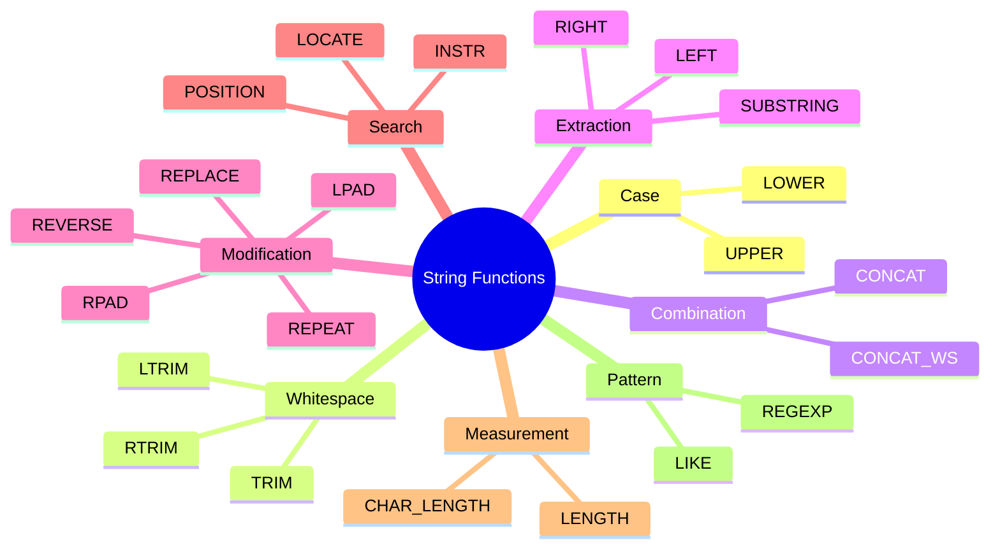
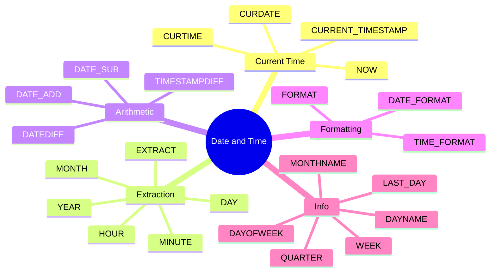
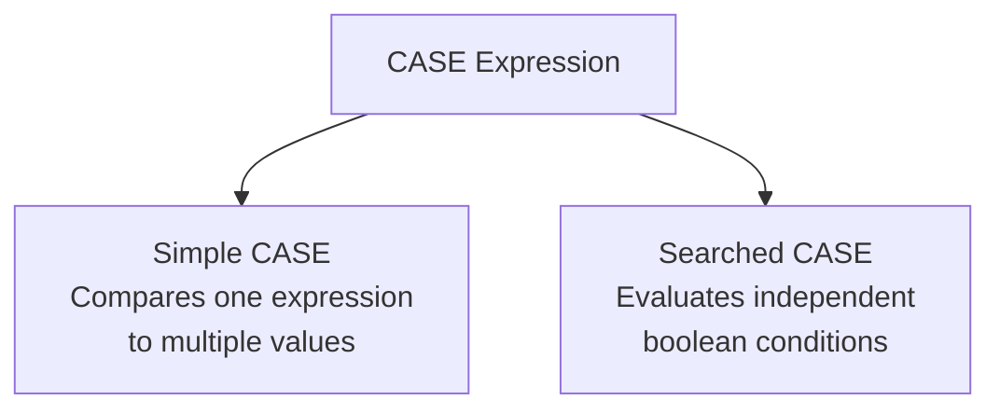

# SQL Handbook for Interviews
## File 06 — String, Numeric, Date & Time Functions, and CASE Expressions

### Covers: UPPER, LOWER, TRIM, CONCAT, SUBSTRING, REPLACE, LENGTH, CHAR_LENGTH, POSITION, REVERSE, LPAD, RPAD, REGEXP, ROUND, CEIL, FLOOR, POWER, SQRT, ABS, MOD, RAND, NOW, CURRENT_DATE, CURRENT_TIMESTAMP, DATE_ADD, DATE_SUB, DATEDIFF, TIMESTAMPDIFF, DATE_FORMAT, EXTRACT, Simple CASE, Searched CASE, Nested CASE

---

# Table of Contents

1. [String Functions Overview](#1-string-functions-overview)
2. [UPPER and LOWER](#2-upper-and-lower)
3. [TRIM, LTRIM, RTRIM](#3-trim-ltrim-rtrim)
4. [CONCAT and CONCAT_WS](#4-concat-and-concat_ws)
5. [SUBSTRING](#5-substring)
6. [REPLACE](#6-replace)
7. [LENGTH and CHAR_LENGTH](#7-length-and-char_length)
8. [POSITION and LOCATE](#8-position-and-locate)
9. [REVERSE](#9-reverse)
10. [LPAD and RPAD](#10-lpad-and-rpad)
11. [LEFT and RIGHT](#11-left-and-right)
12. [REPEAT and SPACE](#12-repeat-and-space)
13. [FORMAT](#13-format)
14. [REGEXP](#14-regexp)
15. [String Functions Comparison Table](#15-string-functions-comparison-table)
16. [Numeric Functions Overview](#16-numeric-functions-overview)
17. [ROUND](#17-round)
18. [CEIL and FLOOR](#18-ceil-and-floor)
19. [ABS](#19-abs)
20. [POWER and SQRT](#20-power-and-sqrt)
21. [MOD](#21-mod)
22. [RAND](#22-rand)
23. [TRUNCATE (Numeric)](#23-truncate-numeric)
24. [SIGN and PI](#24-sign-and-pi)
25. [Numeric Functions Comparison Table](#25-numeric-functions-comparison-table)
26. [Date and Time Functions Overview](#26-date-and-time-functions-overview)
27. [NOW, CURDATE, CURTIME, CURRENT_TIMESTAMP](#27-now-curdate-curtime-current_timestamp)
28. [DATE, TIME, YEAR, MONTH, DAY](#28-date-time-year-month-day)
29. [DATE_ADD and DATE_SUB](#29-date_add-and-date_sub)
30. [DATEDIFF and TIMESTAMPDIFF](#30-datediff-and-timestampdiff)
31. [DATE_FORMAT](#31-date_format)
32. [EXTRACT](#32-extract)
33. [DAYNAME, MONTHNAME, DAYOFWEEK](#33-dayname-monthname-dayofweek)
34. [LAST_DAY and MAKEDATE](#34-last_day-and-makedate)
35. [Date Functions DBMS Differences](#35-date-functions-dbms-differences)
36. [CASE Expression](#36-case-expression)
37. [Simple CASE](#37-simple-case)
38. [Searched CASE](#38-searched-case)
39. [Nested CASE](#39-nested-case)
40. [CASE in Different Clauses](#40-case-in-different-clauses)
41. [COALESCE, NULLIF, IFNULL, IIF](#41-coalesce-nullif-ifnull-iif)
42. [Practice Questions](#42-practice-questions)

---

# Sample Database Used in This File

```sql
CREATE TABLE employees (
    employee_id   INT            PRIMARY KEY AUTO_INCREMENT,
    first_name    VARCHAR(50)    NOT NULL,
    last_name     VARCHAR(50)    NOT NULL,
    email         VARCHAR(150)   NOT NULL UNIQUE,
    department_id INT,
    salary        DECIMAL(10,2)  NOT NULL,
    hire_date     DATE           NOT NULL,
    phone         VARCHAR(20)
);

CREATE TABLE products (
    product_id    INT            PRIMARY KEY AUTO_INCREMENT,
    product_name  VARCHAR(150)   NOT NULL,
    category      VARCHAR(50),
    price         DECIMAL(10,2),
    stock         INT            DEFAULT 0,
    created_at    TIMESTAMP      DEFAULT CURRENT_TIMESTAMP,
    description   TEXT
);

CREATE TABLE orders (
    order_id    INT           PRIMARY KEY AUTO_INCREMENT,
    customer_id INT           NOT NULL,
    order_date  DATE          NOT NULL,
    total       DECIMAL(10,2),
    status      VARCHAR(20)
);

INSERT INTO employees
    (first_name, last_name, email, department_id, salary, hire_date, phone)
VALUES
    ('Alice',  'Brown',   '  alice@company.com  ', 1, 95000,  '2020-03-15', '9876543210'),
    ('Bob',    'Smith',   'bob@company.com',        2, 72000,  '2019-07-01', NULL),
    ('Carol',  'White',   'carol@company.com',      1, 105000, '2018-11-20', '9123456789'),
    ('David',  'Jones',   'DAVID@COMPANY.COM',      3, 88000,  '2021-01-10', '9988776655'),
    ('Eva',    'Green',   'eva@company.com',         1, 91000,  '2022-06-01', '9001122334'),
    ('Frank',  'Black',   'frank@company.com',       4, 67000,  '2020-09-15', NULL),
    ('Grace',  'Hall',    'grace@company.com',       2, 74000,  '2021-03-22', '8765432109'),
    ('Henry',  'Adams',   'henry@company.com',       3, 95000,  '2017-05-30', '9654321098'),
    ('Irene',  'Clark',   'irene@company.com',       NULL,62000,'2023-01-05', '9345678901'),
    ('James',  'Wilson',  'james@company.com',       1, 110000, '2016-08-19', '9876012345');

INSERT INTO products (product_name, category, price, stock, description) VALUES
    ('Wireless Keyboard',  'Electronics', 49.99,  150, 'Compact wireless keyboard with USB receiver'),
    ('Mechanical Keyboard','Electronics', 129.99,  80, 'RGB backlit mechanical gaming keyboard'),
    ('USB-C Hub',          'Electronics', 39.99,  200, '7-in-1 USB-C hub with HDMI and ethernet'),
    ('Notebook A5',        'Stationery',   4.99,  500, 'Ruled A5 notebook, 200 pages'),
    ('Ballpoint Pen 12pk', 'Stationery',   2.49, 1000, 'Pack of 12 blue ballpoint pens'),
    ('Office Chair',       'Furniture',  299.99,   30, 'Ergonomic office chair with lumbar support'),
    ('Standing Desk',      'Furniture',  499.99,   15, 'Height-adjustable standing desk, 140cm wide'),
    ('Monitor 27inch',     'Electronics',349.99,   45, '4K UHD 27 inch IPS monitor, 144Hz');
```

---

# 1. String Functions Overview

### Definition

**String functions** manipulate text data stored in `CHAR`, `VARCHAR`, `TEXT`, and similar columns.

- They can be used in `SELECT`, `WHERE`, `ORDER BY`, `GROUP BY`, and `HAVING` clauses.
- Most string functions are **case-sensitive in PostgreSQL** and **case-insensitive in MySQL by default**.
- String indexing in SQL starts at **position 1** (not 0 like most programming languages).

---

### String Function Categories



---

# 2. UPPER and LOWER

### Definition

- `UPPER(str)` converts all characters in a string to **uppercase**.
- `LOWER(str)` converts all characters in a string to **lowercase**.

---

### Syntax

```sql
UPPER(string_expression)
LOWER(string_expression)
```

---

### Examples

```sql
-- Convert names to uppercase and lowercase
SELECT
    first_name,
    UPPER(first_name)  AS upper_name,
    LOWER(first_name)  AS lower_name,
    UPPER(email)       AS upper_email,
    LOWER(email)       AS lower_email
FROM employees;
```

**Output:**

| first_name | upper_name | lower_name | upper_email |
|---|---|---|---|
| Alice | ALICE | alice | ALICE@COMPANY.COM |
| David | DAVID | david | DAVID@COMPANY.COM |

---

```sql
-- Case-insensitive search using LOWER
SELECT first_name, email
FROM employees
WHERE LOWER(email) = 'david@company.com';
-- Matches 'DAVID@COMPANY.COM' and 'david@company.com' and 'David@Company.com'

-- Normalize emails before storing (use in INSERT/UPDATE)
UPDATE employees
SET email = LOWER(TRIM(email));

-- Clean up product names
SELECT
    product_name,
    UPPER(LEFT(product_name, 1))
        || LOWER(SUBSTRING(product_name, 2)) AS title_case_approx
FROM products;
```

---

### DBMS Differences

| Function | MySQL | PostgreSQL | SQL Server |
|---|---|---|---|
| Uppercase | `UPPER()` | `UPPER()` | `UPPER()` |
| Lowercase | `LOWER()` | `LOWER()` | `LOWER()` |
| Initcap | Not built-in | `INITCAP()` | Not built-in |

```sql
-- PostgreSQL: convert to title case
SELECT INITCAP('hello world from postgresql');
-- Output: Hello World From Postgresql
```

---

# 3. TRIM, LTRIM, RTRIM

### Definition

- `TRIM(str)` removes **leading and trailing spaces** (or specified characters).
- `LTRIM(str)` removes only **leading (left) spaces**.
- `RTRIM(str)` removes only **trailing (right) spaces**.

---

### Syntax

```sql
TRIM(string)
TRIM(LEADING  'char' FROM string)
TRIM(TRAILING 'char' FROM string)
TRIM(BOTH     'char' FROM string)
LTRIM(string)
RTRIM(string)
```

---

### Examples

```sql
-- Basic trim
SELECT
    '  alice@company.com  '                        AS raw,
    TRIM('  alice@company.com  ')                  AS trimmed,
    LTRIM('  alice@company.com  ')                 AS left_trimmed,
    RTRIM('  alice@company.com  ')                 AS right_trimmed,
    LENGTH('  alice@company.com  ')                AS raw_length,
    LENGTH(TRIM('  alice@company.com  '))           AS trimmed_length;
```

**Output:**

| raw | trimmed | left_trimmed | right_trimmed | raw_length | trimmed_length |
|---|---|---|---|---|---|
| `  alice@company.com  ` | `alice@company.com` | `alice@company.com  ` | `  alice@company.com` | 22 | 18 |

---

```sql
-- Remove specific characters (not just spaces)
SELECT TRIM(LEADING  '0' FROM '00042')  AS result;  -- '42'
SELECT TRIM(TRAILING '!' FROM 'Hello!!!') AS result; -- 'Hello'
SELECT TRIM(BOTH     '*' FROM '***text***') AS result; -- 'text'

-- Real-world: clean up email addresses before inserting
INSERT INTO employees (first_name, last_name, email, salary, hire_date)
VALUES (
    TRIM('  Kevin  '),
    TRIM('  Hart  '),
    LOWER(TRIM('  Kevin@Company.COM  ')),
    75000,
    '2024-01-01'
);

-- Find employees with untrimmed email (leading/trailing spaces)
SELECT employee_id, email
FROM employees
WHERE email != TRIM(email);
```

---

### Real-World Importance

Data imported from CSV files, forms, or external APIs frequently contains extra whitespace.
Always apply `TRIM` and `LOWER` when cleaning imported string data.

---

# 4. CONCAT and CONCAT_WS

### Definition

- `CONCAT(str1, str2, ...)` joins two or more strings together.
- `CONCAT_WS(separator, str1, str2, ...)` joins strings with a **separator**, skipping NULLs automatically.

---

### Syntax

```sql
CONCAT(value1, value2, ...)
CONCAT_WS(separator, value1, value2, ...)
```

---

### Examples

```sql
-- Basic concatenation
SELECT
    CONCAT(first_name, ' ', last_name)         AS full_name,
    CONCAT(first_name, ' <', email, '>')        AS display_email
FROM employees;
```

**Output:**

| full_name | display_email |
|---|---|
| Alice Brown | Alice <alice@company.com> |
| Bob Smith | Bob <bob@company.com> |

---

```sql
-- CONCAT with NULL: any NULL makes entire result NULL (MySQL)
SELECT CONCAT('Hello', NULL, ' World');
-- Output: NULL

-- CONCAT_WS skips NULL values
SELECT CONCAT_WS(', ', 'Alice', NULL, 'Brown', NULL, 'Engineer');
-- Output: Alice, Brown, Engineer

-- Real-world: build full address from parts (some may be NULL)
SELECT
    customer_id,
    CONCAT_WS(', ', address_line1, address_line2, city, state, country) AS full_address
FROM customers;

-- Build employee display string
SELECT
    CONCAT_WS(' | ', 
        CONCAT(first_name, ' ', last_name),
        department_id,
        CONCAT('$', FORMAT(salary, 2))
    ) AS employee_summary
FROM employees;
```

---

### PostgreSQL Concatenation

```sql
-- PostgreSQL uses || operator for string concatenation
SELECT first_name || ' ' || last_name AS full_name FROM employees;

-- CONCAT() also works in PostgreSQL (9.1+)
SELECT CONCAT(first_name, ' ', last_name) AS full_name FROM employees;
```

---

# 5. SUBSTRING

### Definition

`SUBSTRING(str, start, length)` extracts a portion of a string starting at position `start` for `length` characters.

- Position starts at **1** in SQL (not 0).
- If `length` is omitted, extracts to the end of the string.
- Also written as `SUBSTR()`.

---

### Syntax

```sql
SUBSTRING(string, start_position, length)
SUBSTRING(string FROM start FOR length)   -- SQL Standard syntax
SUBSTR(string, start, length)             -- Shorthand
```

---

### Examples

```sql
-- Extract parts of a string
SELECT
    'Hello, World!'                           AS original,
    SUBSTRING('Hello, World!', 1, 5)          AS first_5,      -- 'Hello'
    SUBSTRING('Hello, World!', 8)             AS from_pos_8,   -- 'World!'
    SUBSTRING('Hello, World!', 8, 5)          AS world,        -- 'World'
    SUBSTR('Hello, World!', -6)               AS last_6;       -- 'World!' (MySQL)
```

---

```sql
-- Extract domain from email address
SELECT
    email,
    SUBSTRING(email, POSITION('@' IN email) + 1) AS domain
FROM employees;
```

**Output:**

| email | domain |
|---|---|
| alice@company.com | company.com |
| bob@company.com | company.com |

---

```sql
-- Extract year and month from a date string
SELECT
    hire_date,
    SUBSTRING(CAST(hire_date AS CHAR), 1, 4)  AS hire_year,
    SUBSTRING(CAST(hire_date AS CHAR), 6, 2)  AS hire_month
FROM employees;

-- Extract first 3 letters of category for a code
SELECT
    product_name,
    category,
    UPPER(SUBSTRING(category, 1, 3)) AS category_code
FROM products;
```

---

# 6. REPLACE

### Definition

`REPLACE(str, from_str, to_str)` replaces **all occurrences** of `from_str` in `str` with `to_str`.

- Case-sensitive in MySQL and PostgreSQL.
- Does not use regex — for pattern-based replacement use `REGEXP_REPLACE`.

---

### Syntax

```sql
REPLACE(original_string, search_string, replacement_string)
```

---

### Examples

```sql
-- Replace underscores with spaces in product names
SELECT
    product_name,
    REPLACE(product_name, '_', ' ') AS cleaned_name
FROM products;

-- Mask phone numbers
SELECT
    first_name,
    phone,
    CONCAT(
        SUBSTRING(phone, 1, 3),
        REPLACE(SUBSTRING(phone, 4, 6), SUBSTRING(phone, 4, 6), '******'),
        SUBSTRING(phone, 10, 1)
    ) AS masked_phone
FROM employees
WHERE phone IS NOT NULL;

-- Remove all spaces from a string
SELECT REPLACE('Hello World From SQL', ' ', '');
-- Output: HelloWorldFromSQL

-- Replace domain in bulk email update
UPDATE employees
SET email = REPLACE(email, '@oldcompany.com', '@newcompany.com')
WHERE email LIKE '%@oldcompany.com';

-- Clean currency symbols from imported data
SELECT REPLACE(REPLACE('$1,299.99', '$', ''), ',', '') AS clean_price;
-- Output: 1299.99
```

---

### REGEXP_REPLACE (Advanced Replace)

```sql
-- MySQL 8.0+ / PostgreSQL
SELECT REGEXP_REPLACE('Phone: +91-98765-43210', '[^0-9]', '', 'g') AS digits_only;
-- Output: 919876543210
-- 'g' flag = replace all occurrences (PostgreSQL)
-- MySQL: REGEXP_REPLACE without flag replaces all by default
```

---

# 7. LENGTH and CHAR_LENGTH

### Definition

- `LENGTH(str)` returns the **byte length** of a string.
- `CHAR_LENGTH(str)` returns the **character length** of a string.

For ASCII characters they return the same value. For multi-byte characters (UTF-8) they differ.

---

### Syntax

```sql
LENGTH(string)
CHAR_LENGTH(string)
CHARACTER_LENGTH(string)  -- Alias for CHAR_LENGTH
```

---

### Examples

```sql
-- Length of employee names
SELECT
    first_name,
    LENGTH(first_name)      AS byte_length,
    CHAR_LENGTH(first_name) AS char_length
FROM employees;

-- Find employees with very short or very long names
SELECT first_name, CHAR_LENGTH(first_name) AS name_length
FROM employees
WHERE CHAR_LENGTH(first_name) <= 3
   OR CHAR_LENGTH(first_name) >= 8;

-- Validate phone number length
SELECT first_name, phone
FROM employees
WHERE phone IS NOT NULL
  AND CHAR_LENGTH(phone) != 10;

-- Find products with descriptions longer than 50 characters
SELECT product_name, CHAR_LENGTH(description) AS desc_length
FROM products
WHERE CHAR_LENGTH(description) > 50
ORDER BY desc_length DESC;
```

---

### LENGTH vs CHAR_LENGTH with Multi-byte Characters

```sql
-- Multi-byte UTF-8 character (e.g., Chinese, Arabic, Emoji)
SELECT
    LENGTH('café'),       -- 5 (é is 2 bytes in UTF-8)
    CHAR_LENGTH('café'),  -- 4 (4 characters)
    LENGTH('😀'),         -- 4 (emoji is 4 bytes)
    CHAR_LENGTH('😀');    -- 1 (1 character)
```

> Always use `CHAR_LENGTH` for user-facing string length validation.
> Use `LENGTH` only when you care about actual byte storage.

---

# 8. POSITION and LOCATE

### Definition

- `POSITION(substr IN str)` returns the **starting position** of the first occurrence of `substr` in `str`.
- `LOCATE(substr, str, start)` does the same but allows specifying a **start position**.
- Returns `0` if the substring is not found.
- Position is 1-based.

---

### Syntax

```sql
POSITION(substring IN string)
LOCATE(substring, string [, start_position])
INSTR(string, substring)    -- MySQL alternative
```

---

### Examples

```sql
-- Find position of @ in email
SELECT
    email,
    POSITION('@' IN email)              AS at_position,
    LOCATE('@', email)                  AS at_locate,
    SUBSTRING(email, 1, POSITION('@' IN email) - 1) AS username,
    SUBSTRING(email, POSITION('@' IN email) + 1)    AS domain
FROM employees;
```

**Output:**

| email | at_position | username | domain |
|---|---|---|---|
| alice@company.com | 6 | alice | company.com |
| bob@company.com | 4 | bob | company.com |

---

```sql
-- Find position of space in full name
SELECT
    CONCAT(first_name, ' ', last_name) AS full_name,
    POSITION(' ' IN CONCAT(first_name, ' ', last_name)) AS space_pos
FROM employees;

-- Find products containing 'keyboard' (case-insensitive in MySQL)
SELECT product_name
FROM products
WHERE LOCATE('keyboard', LOWER(product_name)) > 0;

-- LOCATE with start position: find second occurrence
SELECT LOCATE('o', 'Hello World, Good Morning', 6) AS second_o_pos;
-- Output: 8 (finds 'o' in 'World', skipping the first 'o' in 'Hello')
```

---

# 9. REVERSE

### Definition

`REVERSE(str)` returns the string with its characters in **reverse order**.

---

### Syntax

```sql
REVERSE(string)
```

---

### Examples

```sql
-- Reverse a string
SELECT REVERSE('Hello World');
-- Output: dlroW olleH

-- Palindrome check
SELECT
    product_name,
    CASE
        WHEN LOWER(product_name) = LOWER(REVERSE(product_name))
        THEN 'Palindrome'
        ELSE 'Not Palindrome'
    END AS palindrome_check
FROM products;

-- Extract file extension from filename
SELECT
    'report_2024_Q1.xlsx' AS filename,
    REVERSE(SUBSTRING(REVERSE('report_2024_Q1.xlsx'), 1,
        LOCATE('.', REVERSE('report_2024_Q1.xlsx')) - 1)) AS extension;
-- Output: xlsx

-- Interview classic: check if email username is a palindrome
SELECT
    email,
    SUBSTRING(email, 1, POSITION('@' IN email) - 1) AS username,
    CASE
        WHEN SUBSTRING(email, 1, POSITION('@' IN email) - 1) =
             REVERSE(SUBSTRING(email, 1, POSITION('@' IN email) - 1))
        THEN 'Yes'
        ELSE 'No'
    END AS is_palindrome
FROM employees;
```

---

# 10. LPAD and RPAD

### Definition

- `LPAD(str, length, pad_str)` pads the string on the **left** with `pad_str` until it reaches `length`.
- `RPAD(str, length, pad_str)` pads the string on the **right** with `pad_str` until it reaches `length`.
- If the original string is longer than `length`, it is **truncated**.

---

### Syntax

```sql
LPAD(string, total_length, pad_string)
RPAD(string, total_length, pad_string)
```

---

### Examples

```sql
-- Zero-pad order IDs for display
SELECT
    order_id,
    LPAD(order_id, 8, '0') AS padded_order_id
FROM orders;
-- Output: 1 → '00000001', 125 → '00000125'

-- Format salary with leading spaces for right-alignment
SELECT
    first_name,
    LPAD(FORMAT(salary, 0), 12, ' ') AS formatted_salary
FROM employees;

-- Create simple bar chart of salaries
SELECT
    first_name,
    salary,
    RPAD('', salary / 5000, '█') AS salary_bar
FROM employees
ORDER BY salary DESC;

-- Pad product codes to fixed length
SELECT
    product_id,
    LPAD(CAST(product_id AS CHAR), 5, '0') AS product_code
FROM products;
-- Output: 1 → 'PRD00001'

-- Generate fixed-width report fields
SELECT
    RPAD(first_name, 15, ' ')  AS name_col,
    RPAD(CAST(salary AS CHAR), 10, ' ') AS salary_col,
    LPAD(CAST(department_id AS CHAR), 5, '0') AS dept_col
FROM employees;
```

---

# 11. LEFT and RIGHT

### Definition

- `LEFT(str, n)` returns the **first n characters** from the left of a string.
- `RIGHT(str, n)` returns the **last n characters** from the right of a string.

---

### Syntax

```sql
LEFT(string, number_of_chars)
RIGHT(string, number_of_chars)
```

---

### Examples

```sql
-- First 3 characters of first name
SELECT
    first_name,
    LEFT(first_name, 3)   AS first_3,
    RIGHT(first_name, 2)  AS last_2
FROM employees;

-- Generate username from email (before the @)
SELECT
    email,
    LEFT(email, POSITION('@' IN email) - 1) AS username
FROM employees;

-- Extract last 4 digits of phone
SELECT
    phone,
    CONCAT('****', RIGHT(phone, 4)) AS masked_phone
FROM employees
WHERE phone IS NOT NULL;

-- Check file extension
SELECT
    'document.pdf' AS filename,
    RIGHT('document.pdf', 3) AS extension;
-- Output: pdf
```

---

# 12. REPEAT and SPACE

### Definition

- `REPEAT(str, n)` returns `str` repeated `n` times.
- `SPACE(n)` returns a string of `n` space characters.

---

### Examples

```sql
-- Create a separator line
SELECT REPEAT('-', 50) AS separator;
-- Output: --------------------------------------------------

-- Add spacing between columns in display output
SELECT
    CONCAT(first_name, SPACE(10), last_name) AS spaced_name
FROM employees;

-- Generate rating stars display
SELECT
    product_name,
    REPEAT('★', 4) AS rating   -- hard-coded 4 stars for demo
FROM products;
```

---

# 13. FORMAT

### Definition

`FORMAT(number, decimal_places)` formats a number with comma-separated thousands and specified decimal places.

- Returns a **string**, not a number.

---

### Examples

```sql
-- Format salary for display
SELECT
    first_name,
    salary,
    FORMAT(salary, 2)         AS formatted_salary,    -- '95,000.00'
    FORMAT(salary, 0)         AS no_decimals,          -- '95,000'
    CONCAT('$', FORMAT(salary, 2)) AS currency_display -- '$95,000.00'
FROM employees;

-- Format product prices
SELECT
    product_name,
    price,
    FORMAT(price, 2) AS display_price
FROM products;
```

---

# 14. REGEXP

### Definition

`REGEXP` (or `RLIKE`) performs **regular expression pattern matching** on string values.

- Returns `1` (TRUE) if the string matches the pattern.
- Returns `0` (FALSE) if it does not match.
- MySQL is case-insensitive by default. Use `REGEXP BINARY` for case-sensitive matching.

---

### Syntax

```sql
column REGEXP 'pattern'
column NOT REGEXP 'pattern'
column RLIKE 'pattern'        -- Alias for REGEXP in MySQL
```

---

### Common REGEXP Patterns

| Pattern | Meaning | Example Match |
|---|---|---|
| `^abc` | Starts with abc | `'abcdef'` |
| `abc$` | Ends with abc | `'xyzabc'` |
| `[abc]` | Any of a, b, c | `'apple'` |
| `[a-z]` | Any lowercase letter | `'hello'` |
| `[0-9]` | Any digit | `'abc123'` |
| `[^0-9]` | Not a digit | `'abc'` |
| `a+` | One or more a | `'aaa'` |
| `a*` | Zero or more a | `''`, `'aaa'` |
| `a?` | Zero or one a | `''`, `'a'` |
| `.` | Any single character | `'x'` |
| `a{3}` | Exactly 3 a's | `'aaa'` |

---

### Examples

```sql
-- Emails from gmail or yahoo
SELECT first_name, email
FROM employees
WHERE email REGEXP '@(gmail|yahoo)\\.com$';

-- Phone numbers that start with 98 or 99
SELECT first_name, phone
FROM employees
WHERE phone REGEXP '^9[89]';

-- Product names containing only letters and spaces
SELECT product_name
FROM products
WHERE product_name REGEXP '^[A-Za-z ]+$';

-- Names starting with a vowel
SELECT first_name
FROM employees
WHERE first_name REGEXP '^[AEIOUaeiou]';

-- Validate email format (basic)
SELECT email
FROM employees
WHERE email NOT REGEXP '^[A-Za-z0-9._%+-]+@[A-Za-z0-9.-]+\\.[A-Za-z]{2,}$';

-- Find products with numbers in the name
SELECT product_name
FROM products
WHERE product_name REGEXP '[0-9]';
```

---

### PostgreSQL REGEXP

```sql
-- PostgreSQL uses ~ for REGEXP and !~ for NOT REGEXP
SELECT first_name FROM employees WHERE email ~ '@company\.com$';
SELECT first_name FROM employees WHERE email !~ '@company\.com$';

-- Case-insensitive: ~*
SELECT first_name FROM employees WHERE first_name ~* '^a';
```

---

# 15. String Functions Comparison Table

| Function | Purpose | MySQL | PostgreSQL | SQL Server |
|---|---|---|---|---|
| `UPPER()` | To uppercase | Yes | Yes | Yes |
| `LOWER()` | To lowercase | Yes | Yes | Yes |
| `INITCAP()` | Title case | No | Yes | No |
| `TRIM()` | Remove spaces/chars | Yes | Yes | Yes |
| `CONCAT()` | Join strings | Yes | Yes | Yes |
| `\|\|` | Join strings | No | Yes | No |
| `SUBSTRING()` | Extract substring | Yes | Yes | Yes |
| `LEFT()` / `RIGHT()` | First/last N chars | Yes | Yes | Yes |
| `REPLACE()` | Replace substring | Yes | Yes | Yes |
| `REGEXP_REPLACE()` | Regex replace | 8.0+ | Yes | No (PATINDEX) |
| `LENGTH()` | Byte length | Yes | Yes | `LEN()` |
| `CHAR_LENGTH()` | Character length | Yes | Yes | `LEN()` |
| `POSITION()` | Find position | Yes | Yes | `CHARINDEX()` |
| `LOCATE()` | Find with offset | Yes | No | `CHARINDEX()` |
| `REVERSE()` | Reverse string | Yes | Yes | Yes |
| `LPAD()` / `RPAD()` | Pad string | Yes | Yes | No (use FORMAT) |
| `REPEAT()` | Repeat string | Yes | Yes | `REPLICATE()` |
| `FORMAT()` | Format number | Yes | No (`TO_CHAR`) | `FORMAT()` |
| `REGEXP` | Pattern match | Yes | `~` | `LIKE` / `PATINDEX` |

---

# 16. Numeric Functions Overview

### Definition

**Numeric functions** perform mathematical operations on numeric data types (`INT`, `DECIMAL`, `FLOAT`, etc.).


---

# 17. ROUND

### Definition

`ROUND(number, decimal_places)` rounds a number to the specified number of decimal places.

- Positive `decimal_places`: round to that many decimal places.
- Negative `decimal_places`: round to the left of the decimal point.
- If `decimal_places` is omitted, rounds to the nearest integer.

---

### Syntax

```sql
ROUND(number, decimal_places)
```

---

### Examples

```sql
-- Basic rounding
SELECT
    ROUND(95.4567)      AS round_default,   -- 95
    ROUND(95.4567, 2)   AS round_2dp,       -- 95.46
    ROUND(95.4567, 1)   AS round_1dp,       -- 95.5
    ROUND(95.4567, 0)   AS round_0dp,       -- 95
    ROUND(95.4567, -1)  AS round_tens,      -- 100
    ROUND(1234.56, -2)  AS round_hundreds;  -- 1200

-- Round average salary per department
SELECT
    department_id,
    ROUND(AVG(salary), 2) AS avg_salary
FROM employees
GROUP BY department_id;

-- Calculate tax with rounding
SELECT
    product_name,
    price,
    ROUND(price * 0.18, 2)         AS gst_18pct,
    ROUND(price + price * 0.18, 2) AS price_with_gst
FROM products;
```

---

### Banker's Rounding Note

MySQL uses standard arithmetic rounding (0.5 rounds up).
PostgreSQL uses banker's rounding (0.5 rounds to nearest even number) for `ROUND()`.

```sql
-- MySQL
SELECT ROUND(2.5);  -- 3
SELECT ROUND(3.5);  -- 4

-- PostgreSQL
SELECT ROUND(2.5);  -- 2 (banker's rounding)
SELECT ROUND(3.5);  -- 4 (banker's rounding)
```

---

# 18. CEIL and FLOOR

### Definition

- `CEIL(n)` (also `CEILING(n)`) returns the **smallest integer greater than or equal to** n (rounds up).
- `FLOOR(n)` returns the **largest integer less than or equal to** n (rounds down).

---

### Syntax

```sql
CEIL(number)
CEILING(number)
FLOOR(number)
```

---

### Examples

```sql
-- Comparison
SELECT
    4.2 AS original,
    ROUND(4.2)   AS rounded,   -- 4
    CEIL(4.2)    AS ceiling,   -- 5
    FLOOR(4.2)   AS floor_val, -- 4
    ROUND(4.7)   AS rounded2,  -- 5
    CEIL(4.7)    AS ceiling2,  -- 5
    FLOOR(4.7)   AS floor2;    -- 4

-- Negative numbers
SELECT
    CEIL(-4.2)   AS ceil_neg,  -- -4 (closer to zero)
    FLOOR(-4.2)  AS floor_neg; -- -5 (further from zero)

-- Pagination: number of pages needed for N employees with 3 per page
SELECT CEIL(COUNT(*) / 3.0) AS pages_needed FROM employees;
-- 10 employees / 3 per page = CEIL(3.33) = 4 pages

-- Distribute items into bins (round up to ensure all fit)
SELECT
    product_name,
    stock,
    CEIL(stock / 50.0) AS bins_needed   -- 50 items per bin
FROM products;

-- Price rounding for display (always round up for revenue protection)
SELECT
    product_name,
    price,
    CEIL(price)  AS price_ceil,
    FLOOR(price) AS price_floor
FROM products;
```

---

# 19. ABS

### Definition

`ABS(n)` returns the **absolute value** (non-negative value) of a number.

---

### Syntax

```sql
ABS(number)
```

---

### Examples

```sql
-- Basic absolute value
SELECT
    ABS(-95000)   AS abs_negative,  -- 95000
    ABS(95000)    AS abs_positive,  -- 95000
    ABS(0)        AS abs_zero;      -- 0

-- Find salary differences regardless of direction
SELECT
    a.first_name AS emp1,
    b.first_name AS emp2,
    ABS(a.salary - b.salary) AS salary_difference
FROM employees a
JOIN employees b ON a.employee_id < b.employee_id
ORDER BY salary_difference DESC
LIMIT 5;

-- How far is each employee's salary from the company average?
SELECT
    first_name,
    salary,
    ROUND(AVG(salary) OVER (), 2) AS company_avg,
    ABS(salary - AVG(salary) OVER ()) AS distance_from_avg
FROM employees
ORDER BY distance_from_avg DESC;

-- Flag employees whose salary differs by more than 20000 from department avg
SELECT first_name, salary, department_id
FROM (
    SELECT
        first_name,
        salary,
        department_id,
        ABS(salary - AVG(salary) OVER (PARTITION BY department_id)) AS dept_diff
    FROM employees
) t
WHERE dept_diff > 20000;
```

---

# 20. POWER and SQRT

### Definition

- `POWER(base, exponent)` returns `base` raised to the power of `exponent`.
- `SQRT(n)` returns the **square root** of n.

---

### Syntax

```sql
POWER(base, exponent)
POW(base, exponent)    -- Alias in MySQL
SQRT(number)
```

---

### Examples

```sql
-- Basic usage
SELECT
    POWER(2, 10)  AS two_to_ten,    -- 1024
    POWER(5, 3)   AS five_cubed,    -- 125
    POWER(9, 0.5) AS sqrt_nine,     -- 3 (same as SQRT(9))
    SQRT(144)     AS sqrt_144,      -- 12
    SQRT(2)       AS sqrt_2;        -- 1.4142135...

-- Calculate compound interest
-- Formula: P * (1 + r)^n
SELECT
    100000                             AS principal,
    0.08                               AS annual_rate,
    5                                  AS years,
    ROUND(100000 * POWER(1.08, 5), 2)  AS future_value;
-- Output: 146933.00

-- Euclidean distance between two points (x1,y1) and (x2,y2)
SELECT
    ROUND(SQRT(POWER(5 - 2, 2) + POWER(8 - 4, 2)), 4) AS distance;
-- SQRT((3)^2 + (4)^2) = SQRT(9+16) = SQRT(25) = 5

-- Salary growth needed to reach target
SELECT
    first_name,
    salary AS current_salary,
    200000 AS target_salary,
    3      AS years,
    ROUND(POWER(200000.0 / salary, 1.0/3) - 1, 4) AS required_annual_growth_rate
FROM employees
WHERE salary < 200000;
```

---

# 21. MOD

### Definition

`MOD(n, m)` returns the **remainder** when `n` is divided by `m`.

- Also written as `n % m` in most DBMS.

---

### Syntax

```sql
MOD(number, divisor)
number % divisor
```

---

### Examples

```sql
-- Basic modulo
SELECT
    MOD(10, 3)    AS ten_mod_3,      -- 1
    MOD(15, 5)    AS fifteen_mod_5,  -- 0
    MOD(7, 2)     AS seven_mod_2,    -- 1
    10 % 3        AS ten_pct_3;      -- 1

-- Identify even and odd employee IDs
SELECT
    employee_id,
    first_name,
    CASE WHEN MOD(employee_id, 2) = 0 THEN 'Even' ELSE 'Odd' END AS id_parity
FROM employees;

-- Find employees with salary divisible by 1000
SELECT first_name, salary
FROM employees
WHERE MOD(salary, 1000) = 0;

-- Assign employees to 3 rotation groups
SELECT
    employee_id,
    first_name,
    MOD(employee_id - 1, 3) + 1 AS rotation_group
FROM employees
ORDER BY rotation_group;

-- Cycle through weekdays (1=Monday, 5=Friday)
SELECT MOD(day_number - 1, 5) + 1 AS weekday
FROM some_sequence_table;
```

---

# 22. RAND

### Definition

`RAND()` returns a **random floating-point number** between 0 (inclusive) and 1 (exclusive).

- `RAND(seed)` returns a deterministic value for a given seed.
- Used for random sampling, shuffling, and test data generation.

---

### Syntax

```sql
RAND()          -- Random between 0 and 1
RAND(seed)      -- Seeded (reproducible) random
```

---

### Examples

```sql
-- Generate random number between 0 and 1
SELECT RAND() AS random_value;

-- Random number between 1 and 100
SELECT FLOOR(RAND() * 100) + 1 AS random_1_to_100;

-- Random integer between min and max
-- Formula: FLOOR(RAND() * (max - min + 1)) + min
SELECT FLOOR(RAND() * (500 - 100 + 1)) + 100 AS random_100_to_500;

-- Select 3 random employees
SELECT first_name, salary
FROM employees
ORDER BY RAND()
LIMIT 3;

-- Generate random discount (5% to 30%)
SELECT
    product_name,
    price,
    ROUND(FLOOR(RAND() * 26) + 5, 0) AS discount_pct,
    ROUND(price * (1 - (FLOOR(RAND() * 26) + 5) / 100.0), 2) AS discounted_price
FROM products;
```

---

### Performance Warning

`ORDER BY RAND()` is very slow on large tables — it assigns a random value to every row and then sorts all of them.

```sql
-- Slow: ORDER BY RAND() on large tables
SELECT * FROM large_table ORDER BY RAND() LIMIT 10;

-- Faster alternative (keyset random sampling)
SELECT * FROM large_table
WHERE employee_id >= (SELECT FLOOR(RAND() * (SELECT MAX(employee_id) FROM large_table)))
LIMIT 10;
```

---

# 23. TRUNCATE (Numeric)

### Definition

`TRUNCATE(number, decimal_places)` removes digits beyond the specified decimal places **without rounding**.

- Different from `ROUND` — it simply cuts off digits.
- Negative `decimal_places` truncates to the left of the decimal point.

---

### Syntax

```sql
TRUNCATE(number, decimal_places)
TRUNC(number, decimal_places)   -- PostgreSQL / Oracle
```

---

### Examples

```sql
SELECT
    TRUNCATE(95.9876, 2)    AS trunc_2dp,    -- 95.98 (not 95.99)
    ROUND(95.9876, 2)       AS round_2dp,    -- 95.99
    TRUNCATE(95.9876, 0)    AS trunc_int,    -- 95
    TRUNCATE(95.9876, -1)   AS trunc_tens,   -- 90
    TRUNCATE(95.9876, -2)   AS trunc_hunds;  -- 0

-- Strip cents from price (always show floor price)
SELECT
    product_name,
    price,
    TRUNCATE(price, 0) AS floor_price
FROM products;
```

---

# 24. SIGN and PI

### Definition

- `SIGN(n)` returns `-1`, `0`, or `1` depending on whether `n` is negative, zero, or positive.
- `PI()` returns the mathematical constant π (3.141592...).

---

### Examples

```sql
-- SIGN usage
SELECT
    SIGN(-500)  AS negative,   -- -1
    SIGN(0)     AS zero,       -- 0
    SIGN(750)   AS positive;   -- 1

-- Classify salary change direction
SELECT
    employee_id,
    salary - 85000 AS diff_from_benchmark,
    SIGN(salary - 85000) AS direction,
    CASE SIGN(salary - 85000)
        WHEN  1 THEN 'Above Benchmark'
        WHEN  0 THEN 'At Benchmark'
        WHEN -1 THEN 'Below Benchmark'
    END AS benchmark_status
FROM employees;

-- PI usage
SELECT
    PI()                           AS pi_value,
    ROUND(PI() * POWER(5, 2), 4)  AS circle_area_r5,   -- πr²
    ROUND(2 * PI() * 5, 4)        AS circumference_r5;  -- 2πr
```

---

# 25. Numeric Functions Comparison Table

| Function | Purpose | MySQL | PostgreSQL | SQL Server |
|---|---|---|---|---|
| `ROUND(n, d)` | Round to d places | Yes | Yes | Yes |
| `CEIL(n)` | Round up | Yes | Yes | `CEILING(n)` |
| `FLOOR(n)` | Round down | Yes | Yes | Yes |
| `TRUNCATE(n, d)` | Truncate digits | Yes | `TRUNC(n, d)` | No (use `ROUND(n, d, 1)`) |
| `ABS(n)` | Absolute value | Yes | Yes | Yes |
| `POWER(b, e)` | Exponentiation | Yes | Yes | Yes |
| `SQRT(n)` | Square root | Yes | Yes | Yes |
| `MOD(n, m)` | Remainder | Yes | Yes | `n % m` |
| `RAND()` | Random 0-1 | Yes | `RANDOM()` | `RAND()` |
| `SIGN(n)` | -1, 0, or 1 | Yes | Yes | Yes |
| `PI()` | Pi constant | Yes | Yes | Yes |
| `FORMAT(n, d)` | Formatted string | Yes | `TO_CHAR()` | `FORMAT()` |

---

# 26. Date and Time Functions Overview

### Definition

**Date and time functions** manipulate `DATE`, `DATETIME`, `TIMESTAMP`, and `TIME` values.

- Critical for filtering, grouping, and calculating time differences.
- Syntax varies most significantly between DBMS among all SQL function categories.

---

### Date Function Categories



---

# 27. NOW, CURDATE, CURTIME, CURRENT_TIMESTAMP

### Definition

| Function | Returns | Example Output |
|---|---|---|
| `NOW()` | Current date and time | `2024-03-15 14:30:45` |
| `CURRENT_TIMESTAMP` | Same as `NOW()` | `2024-03-15 14:30:45` |
| `CURDATE()` | Current date only | `2024-03-15` |
| `CURRENT_DATE` | Same as `CURDATE()` | `2024-03-15` |
| `CURTIME()` | Current time only | `14:30:45` |
| `CURRENT_TIME` | Same as `CURTIME()` | `14:30:45` |
| `SYSDATE()` | System date at execution moment | `2024-03-15 14:30:45` |

---

### Examples

```sql
-- Get current temporal values
SELECT
    NOW()               AS current_datetime,
    CURRENT_TIMESTAMP   AS current_ts,
    CURDATE()           AS today,
    CURRENT_DATE        AS today_alt,
    CURTIME()           AS current_time_val;

-- How many days has each employee been with the company?
SELECT
    first_name,
    hire_date,
    DATEDIFF(CURDATE(), hire_date) AS days_employed,
    FLOOR(DATEDIFF(CURDATE(), hire_date) / 365) AS years_employed
FROM employees
ORDER BY days_employed DESC;

-- Orders placed today
SELECT * FROM orders
WHERE order_date = CURDATE();

-- Insert with automatic timestamp
INSERT INTO orders (customer_id, order_date, total, status)
VALUES (1, CURDATE(), 299.99, 'pending');

-- Check if current time is within business hours
SELECT
    CURTIME() BETWEEN '09:00:00' AND '18:00:00' AS is_business_hours;
```

---

### NOW() vs SYSDATE()

| Feature | `NOW()` | `SYSDATE()` |
|---|---|---|
| Evaluated | Once at statement start | At the moment it is called |
| Replication safe | Yes | No |
| Use in production | Preferred | Avoid |

---

# 28. DATE, TIME, YEAR, MONTH, DAY

### Definition

These functions **extract individual components** from a date or datetime value.

---

### Syntax

```sql
YEAR(date)
MONTH(date)
DAY(date) / DAYOFMONTH(date)
HOUR(datetime)
MINUTE(datetime)
SECOND(datetime)
DATE(datetime)    -- Extracts only the date portion
TIME(datetime)    -- Extracts only the time portion
```

---

### Examples

```sql
-- Extract date components
SELECT
    hire_date,
    YEAR(hire_date)       AS hire_year,
    MONTH(hire_date)      AS hire_month,
    DAY(hire_date)        AS hire_day,
    DATE(NOW())           AS today_date,
    TIME(NOW())           AS current_time_part
FROM employees;

-- Count employees hired per year
SELECT
    YEAR(hire_date) AS year,
    COUNT(*)        AS hires
FROM employees
GROUP BY YEAR(hire_date)
ORDER BY year;

-- Count employees hired per month across all years
SELECT
    MONTH(hire_date)  AS month_num,
    MONTHNAME(hire_date) AS month_name,
    COUNT(*)          AS hires
FROM employees
GROUP BY MONTH(hire_date), MONTHNAME(hire_date)
ORDER BY month_num;

-- Employees hired in Q1 (Jan-Mar)
SELECT first_name, hire_date
FROM employees
WHERE MONTH(hire_date) BETWEEN 1 AND 3;

-- Filter orders from a specific year
SELECT COUNT(*), SUM(total)
FROM orders
WHERE YEAR(order_date) = 2024;
```

---

### Index Usage Warning with Date Functions

```sql
-- Cannot use index on hire_date (function on indexed column)
WHERE YEAR(hire_date) = 2020

-- Can use index on hire_date
WHERE hire_date >= '2020-01-01' AND hire_date < '2021-01-01'
```

> Always prefer range comparisons over wrapping indexed columns in functions.

---

# 29. DATE_ADD and DATE_SUB

### Definition

- `DATE_ADD(date, INTERVAL value unit)` adds a time interval to a date.
- `DATE_SUB(date, INTERVAL value unit)` subtracts a time interval from a date.

---

### Syntax

```sql
DATE_ADD(date, INTERVAL value unit)
DATE_SUB(date, INTERVAL value unit)
date + INTERVAL value unit    -- Shorthand
date - INTERVAL value unit    -- Shorthand
```

---

### Interval Units

| Unit | Description | Example |
|---|---|---|
| `SECOND` | Seconds | `INTERVAL 30 SECOND` |
| `MINUTE` | Minutes | `INTERVAL 15 MINUTE` |
| `HOUR` | Hours | `INTERVAL 2 HOUR` |
| `DAY` | Days | `INTERVAL 7 DAY` |
| `WEEK` | Weeks | `INTERVAL 2 WEEK` |
| `MONTH` | Months | `INTERVAL 3 MONTH` |
| `QUARTER` | Quarters | `INTERVAL 1 QUARTER` |
| `YEAR` | Years | `INTERVAL 1 YEAR` |

---

### Examples

```sql
-- Add and subtract intervals
SELECT
    CURDATE()                               AS today,
    DATE_ADD(CURDATE(), INTERVAL 7 DAY)     AS next_week,
    DATE_SUB(CURDATE(), INTERVAL 7 DAY)     AS last_week,
    DATE_ADD(CURDATE(), INTERVAL 1 MONTH)   AS next_month,
    DATE_ADD(CURDATE(), INTERVAL 1 YEAR)    AS next_year,
    DATE_ADD(CURDATE(), INTERVAL -1 YEAR)   AS last_year,
    DATE_ADD(NOW(), INTERVAL 90 MINUTE)     AS in_90_minutes;

-- Order expiry date (30 days from order date)
SELECT
    order_id,
    order_date,
    DATE_ADD(order_date, INTERVAL 30 DAY)   AS expiry_date,
    DATE_ADD(order_date, INTERVAL 30 DAY) < CURDATE() AS is_expired
FROM orders;

-- Orders placed in the last 30 days
SELECT *
FROM orders
WHERE order_date >= DATE_SUB(CURDATE(), INTERVAL 30 DAY);

-- Orders placed in the last 6 months
SELECT COUNT(*), SUM(total)
FROM orders
WHERE order_date >= DATE_SUB(CURDATE(), INTERVAL 6 MONTH);

-- Employees who have been with the company for more than 3 years
SELECT first_name, hire_date
FROM employees
WHERE hire_date <= DATE_SUB(CURDATE(), INTERVAL 3 YEAR);

-- Token expiry (1 hour from now)
SELECT
    NOW()                                AS created_at,
    DATE_ADD(NOW(), INTERVAL 1 HOUR)     AS expires_at;
```

---

### PostgreSQL Interval Syntax

```sql
-- PostgreSQL uses slightly different interval syntax
SELECT
    CURRENT_DATE + INTERVAL '7 days'    AS next_week,
    CURRENT_DATE - INTERVAL '1 month'   AS last_month,
    NOW() + INTERVAL '2 hours'          AS in_2_hours;
```

---

# 30. DATEDIFF and TIMESTAMPDIFF

### Definition

- `DATEDIFF(date1, date2)` returns the number of **days** between two dates (`date1 - date2`).
- `TIMESTAMPDIFF(unit, datetime1, datetime2)` returns the difference between two datetimes in the specified unit.

---

### Syntax

```sql
DATEDIFF(end_date, start_date)
TIMESTAMPDIFF(unit, start_datetime, end_datetime)
```

---

### Examples

```sql
-- Days between hire date and today
SELECT
    first_name,
    hire_date,
    DATEDIFF(CURDATE(), hire_date) AS days_employed
FROM employees
ORDER BY days_employed DESC;

-- Days between two specific dates
SELECT DATEDIFF('2024-12-31', '2024-01-01') AS days_in_2024;
-- Output: 365

-- TIMESTAMPDIFF with various units
SELECT
    first_name,
    hire_date,
    TIMESTAMPDIFF(DAY,   hire_date, CURDATE()) AS days,
    TIMESTAMPDIFF(MONTH, hire_date, CURDATE()) AS months,
    TIMESTAMPDIFF(YEAR,  hire_date, CURDATE()) AS years
FROM employees;

-- Age calculation
SELECT
    first_name,
    hire_date,
    TIMESTAMPDIFF(YEAR, hire_date, CURDATE()) AS years_at_company,
    CASE
        WHEN TIMESTAMPDIFF(YEAR, hire_date, CURDATE()) < 2 THEN 'Probation'
        WHEN TIMESTAMPDIFF(YEAR, hire_date, CURDATE()) < 5 THEN 'Mid-level'
        ELSE 'Senior'
    END AS seniority
FROM employees;

-- Order fulfillment time in hours
SELECT
    order_id,
    order_date,
    TIMESTAMPDIFF(HOUR, order_date, delivered_date) AS hours_to_deliver
FROM orders
WHERE status = 'delivered';
```

---

### PostgreSQL Date Difference

```sql
-- PostgreSQL: use AGE() or direct subtraction
SELECT
    first_name,
    hire_date,
    AGE(CURRENT_DATE, hire_date)                   AS tenure_interval,
    EXTRACT(YEAR FROM AGE(CURRENT_DATE, hire_date)) AS years_employed,
    CURRENT_DATE - hire_date                        AS days_employed
FROM employees;
```

---

# 31. DATE_FORMAT

### Definition

`DATE_FORMAT(date, format)` formats a date or datetime into a **custom string** using format specifiers.

---

### Syntax

```sql
DATE_FORMAT(date, 'format_string')
```

---

### Common Format Specifiers (MySQL)

| Specifier | Output | Example |
|---|---|---|
| `%Y` | 4-digit year | `2024` |
| `%y` | 2-digit year | `24` |
| `%m` | Month (01-12) | `03` |
| `%M` | Month name | `March` |
| `%b` | Abbreviated month | `Mar` |
| `%d` | Day (01-31) | `15` |
| `%D` | Day with suffix | `15th` |
| `%e` | Day (1-31, no leading zero) | `15` |
| `%H` | Hour (00-23) | `14` |
| `%h` | Hour (01-12) | `02` |
| `%i` | Minutes (00-59) | `30` |
| `%s` | Seconds (00-59) | `45` |
| `%p` | AM or PM | `PM` |
| `%W` | Weekday name | `Friday` |
| `%a` | Abbreviated weekday | `Fri` |
| `%w` | Day of week (0=Sunday) | `5` |
| `%j` | Day of year (001-366) | `075` |
| `%q` | Quarter (1-4) | `1` |
| `%%` | Literal % character | `%` |

---

### Examples

```sql
-- Various date formats
SELECT
    hire_date,
    DATE_FORMAT(hire_date, '%d %M %Y')          AS long_format,
    DATE_FORMAT(hire_date, '%d/%m/%Y')           AS india_format,
    DATE_FORMAT(hire_date, '%m/%d/%Y')           AS us_format,
    DATE_FORMAT(hire_date, '%Y-%m')              AS year_month,
    DATE_FORMAT(hire_date, '%W, %D %M %Y')      AS full_format,
    DATE_FORMAT(NOW(), '%d %b %Y %h:%i %p')     AS readable_datetime
FROM employees
LIMIT 3;
```

**Output:**

| hire_date | long_format | india_format | us_format | year_month |
|---|---|---|---|---|
| 2020-03-15 | 15 March 2020 | 15/03/2020 | 03/15/2020 | 2020-03 |
| 2019-07-01 | 01 July 2019 | 01/07/2019 | 07/01/2019 | 2019-07 |

---

```sql
-- Group sales by month using DATE_FORMAT
SELECT
    DATE_FORMAT(order_date, '%Y-%m') AS month,
    COUNT(*)                         AS order_count,
    SUM(total)                       AS monthly_revenue
FROM orders
GROUP BY DATE_FORMAT(order_date, '%Y-%m')
ORDER BY month;

-- Format for display in reports
SELECT
    CONCAT('Report for ', DATE_FORMAT(CURDATE(), '%M %Y')) AS report_title;
-- Output: Report for March 2024
```

---

### PostgreSQL Date Formatting

```sql
-- PostgreSQL uses TO_CHAR() instead of DATE_FORMAT()
SELECT
    hire_date,
    TO_CHAR(hire_date, 'DD Month YYYY')     AS long_format,
    TO_CHAR(hire_date, 'DD/MM/YYYY')        AS india_format,
    TO_CHAR(hire_date, 'YYYY-MM')           AS year_month,
    TO_CHAR(NOW(), 'DD Mon YYYY HH12:MI AM') AS readable
FROM employees;
```

---

# 32. EXTRACT

### Definition

`EXTRACT(unit FROM date)` is the SQL standard way to extract a component from a date.

- More portable across DBMS than MySQL-specific functions like `YEAR()`, `MONTH()`.

---

### Syntax

```sql
EXTRACT(unit FROM date_expression)
```

---

### Supported Units

| Unit | Description |
|---|---|
| `YEAR` | Year |
| `MONTH` | Month (1-12) |
| `DAY` | Day of month (1-31) |
| `HOUR` | Hour (0-23) |
| `MINUTE` | Minute (0-59) |
| `SECOND` | Second (0-59) |
| `QUARTER` | Quarter (1-4) |
| `WEEK` | Week of year |
| `DOW` | Day of week (PostgreSQL only) |
| `EPOCH` | Seconds since 1970-01-01 (PostgreSQL) |

---

### Examples

```sql
-- Extract components using EXTRACT (SQL Standard)
SELECT
    hire_date,
    EXTRACT(YEAR    FROM hire_date) AS year,
    EXTRACT(MONTH   FROM hire_date) AS month,
    EXTRACT(DAY     FROM hire_date) AS day,
    EXTRACT(QUARTER FROM hire_date) AS quarter
FROM employees;

-- Count employees hired per quarter
SELECT
    EXTRACT(YEAR    FROM hire_date) AS year,
    EXTRACT(QUARTER FROM hire_date) AS quarter,
    COUNT(*) AS hires
FROM employees
GROUP BY
    EXTRACT(YEAR FROM hire_date),
    EXTRACT(QUARTER FROM hire_date)
ORDER BY year, quarter;
```

---

# 33. DAYNAME, MONTHNAME, DAYOFWEEK

### Definition

- `DAYNAME(date)` returns the name of the day (`Monday`, `Tuesday`, etc.).
- `MONTHNAME(date)` returns the name of the month (`January`, `February`, etc.).
- `DAYOFWEEK(date)` returns the day of week as a number (1=Sunday, 7=Saturday in MySQL).

---

### Examples

```sql
-- Day and month names
SELECT
    hire_date,
    DAYNAME(hire_date)    AS day_of_hire,
    MONTHNAME(hire_date)  AS month_of_hire,
    DAYOFWEEK(hire_date)  AS day_num,
    WEEK(hire_date)       AS week_num,
    QUARTER(hire_date)    AS quarter
FROM employees;

-- Count employees hired on each weekday
SELECT
    DAYNAME(hire_date) AS weekday,
    COUNT(*) AS hires
FROM employees
GROUP BY DAYNAME(hire_date), DAYOFWEEK(hire_date)
ORDER BY DAYOFWEEK(hire_date);

-- Orders placed on weekends
SELECT order_id, order_date, total
FROM orders
WHERE DAYOFWEEK(order_date) IN (1, 7);  -- 1=Sunday, 7=Saturday
```

---

# 34. LAST_DAY and MAKEDATE

### Definition

- `LAST_DAY(date)` returns the **last day of the month** for the given date.
- `MAKEDATE(year, day_of_year)` creates a date from a year and day number.

---

### Examples

```sql
-- Last day of the month
SELECT
    hire_date,
    LAST_DAY(hire_date)             AS last_day_of_month,
    DAY(LAST_DAY(hire_date))        AS days_in_month,
    LAST_DAY(CURDATE())             AS end_of_current_month,
    DATE_ADD(LAST_DAY(CURDATE()), INTERVAL 1 DAY) AS first_of_next_month
FROM employees
LIMIT 3;

-- First and last day of current month
SELECT
    DATE_FORMAT(CURDATE(), '%Y-%m-01')   AS first_day,
    LAST_DAY(CURDATE())                  AS last_day;

-- MAKEDATE: day 100 of 2024
SELECT MAKEDATE(2024, 100) AS day_100_of_2024;
-- Output: 2024-04-09

-- Employees hired in the last month
SELECT first_name, hire_date
FROM employees
WHERE hire_date >= DATE_FORMAT(DATE_SUB(CURDATE(), INTERVAL 1 MONTH), '%Y-%m-01')
  AND hire_date <= LAST_DAY(DATE_SUB(CURDATE(), INTERVAL 1 MONTH));
```

---

# 35. Date Functions DBMS Differences

| Feature | MySQL | PostgreSQL | SQL Server |
|---|---|---|---|
| Current datetime | `NOW()` | `NOW()` | `GETDATE()` |
| Current date | `CURDATE()` | `CURRENT_DATE` | `CAST(GETDATE() AS DATE)` |
| Add interval | `DATE_ADD(d, INTERVAL n UNIT)` | `d + INTERVAL 'n unit'` | `DATEADD(unit, n, d)` |
| Date difference | `DATEDIFF(d1, d2)` | `d1 - d2` | `DATEDIFF(unit, d1, d2)` |
| Format date | `DATE_FORMAT(d, fmt)` | `TO_CHAR(d, fmt)` | `FORMAT(d, fmt)` |
| Extract part | `YEAR(d)` / `EXTRACT` | `EXTRACT` / `DATE_PART` | `DATEPART(unit, d)` |
| Last day of month | `LAST_DAY(d)` | `DATE_TRUNC('month', d + INTERVAL '1 month') - 1` | `EOMONTH(d)` |
| Age / tenure | `TIMESTAMPDIFF` | `AGE()` | `DATEDIFF` |

---

# 36. CASE Expression

### Definition

The `CASE` expression provides **conditional logic** in SQL — similar to `if-else` or `switch-case` in programming languages.

- Can be used in `SELECT`, `WHERE`, `ORDER BY`, `GROUP BY`, `HAVING`, and `UPDATE SET` clauses.
- Always ends with `END`.
- Optionally includes an `ELSE` clause for unmatched conditions.

---

### Two Forms of CASE



---

# 37. Simple CASE

### Definition

**Simple CASE** compares a single expression against multiple possible values — like a `switch` statement.

---

### Syntax

```sql
CASE expression
    WHEN value1 THEN result1
    WHEN value2 THEN result2
    ...
    [ELSE default_result]
END [AS alias]
```

---

### Syntax Breakdown

| Keyword | Purpose |
|---|---|
| `CASE` | Starts the expression |
| `expression` | The value being tested |
| `WHEN value` | The value to compare against |
| `THEN result` | The result to return if matched |
| `ELSE` | Result when no WHEN matches |
| `END` | Closes the CASE expression |

---

### Examples

```sql
-- Map department_id to department name
SELECT
    first_name,
    department_id,
    CASE department_id
        WHEN 1 THEN 'Engineering'
        WHEN 2 THEN 'Marketing'
        WHEN 3 THEN 'Finance'
        WHEN 4 THEN 'HR'
        ELSE 'Unknown / Unassigned'
    END AS department_name
FROM employees;
```

**Output:**

| first_name | department_id | department_name |
|---|---|---|
| Alice | 1 | Engineering |
| Bob | 2 | Marketing |
| Irene | NULL | Unknown / Unassigned |

---

```sql
-- Map numeric month to quarter label
SELECT
    MONTH(hire_date) AS month_num,
    CASE MONTH(hire_date)
        WHEN 1  THEN 'Q1 - January'
        WHEN 2  THEN 'Q1 - February'
        WHEN 3  THEN 'Q1 - March'
        WHEN 4  THEN 'Q2 - April'
        WHEN 5  THEN 'Q2 - May'
        WHEN 6  THEN 'Q2 - June'
        WHEN 7  THEN 'Q3 - July'
        WHEN 8  THEN 'Q3 - August'
        WHEN 9  THEN 'Q3 - September'
        WHEN 10 THEN 'Q4 - October'
        WHEN 11 THEN 'Q4 - November'
        WHEN 12 THEN 'Q4 - December'
    END AS quarter_label,
    COUNT(*) AS hires
FROM employees
GROUP BY MONTH(hire_date), quarter_label
ORDER BY month_num;

-- Status label with icon prefix
SELECT
    order_id,
    status,
    CASE status
        WHEN 'pending'    THEN 'PENDING'
        WHEN 'processing' THEN 'PROCESSING'
        WHEN 'shipped'    THEN 'SHIPPED'
        WHEN 'delivered'  THEN 'DELIVERED'
        WHEN 'cancelled'  THEN 'CANCELLED'
        ELSE 'UNKNOWN'
    END AS status_label
FROM orders;
```

---

# 38. Searched CASE

### Definition

**Searched CASE** evaluates a series of independent boolean conditions — like an `if-elseif-else` chain.

- More flexible than Simple CASE.
- Each `WHEN` clause can have a completely different condition.
- Most commonly used form in practice.

---

### Syntax

```sql
CASE
    WHEN condition1 THEN result1
    WHEN condition2 THEN result2
    ...
    [ELSE default_result]
END [AS alias]
```

---

### Examples

```sql
-- Salary bands
SELECT
    first_name,
    salary,
    CASE
        WHEN salary >= 100000 THEN 'Band A: 100k+'
        WHEN salary >= 85000  THEN 'Band B: 85k-99k'
        WHEN salary >= 70000  THEN 'Band C: 70k-84k'
        ELSE                       'Band D: Below 70k'
    END AS salary_band
FROM employees
ORDER BY salary DESC;
```

**Output:**

| first_name | salary | salary_band |
|---|---|---|
| James | 110000 | Band A: 100k+ |
| Carol | 105000 | Band A: 100k+ |
| Alice | 95000 | Band B: 85k-99k |
| Henry | 95000 | Band B: 85k-99k |
| Eva | 91000 | Band B: 85k-99k |
| David | 88000 | Band B: 85k-99k |
| Grace | 74000 | Band C: 70k-84k |
| Bob | 72000 | Band C: 70k-84k |
| Frank | 67000 | Band D: Below 70k |
| Irene | 62000 | Band D: Below 70k |

---

```sql
-- Seniority based on years of service
SELECT
    first_name,
    hire_date,
    TIMESTAMPDIFF(YEAR, hire_date, CURDATE()) AS years_at_company,
    CASE
        WHEN TIMESTAMPDIFF(YEAR, hire_date, CURDATE()) >= 7 THEN 'Principal'
        WHEN TIMESTAMPDIFF(YEAR, hire_date, CURDATE()) >= 5 THEN 'Senior'
        WHEN TIMESTAMPDIFF(YEAR, hire_date, CURDATE()) >= 2 THEN 'Mid-level'
        ELSE 'Junior'
    END AS seniority_level
FROM employees
ORDER BY years_at_company DESC;

-- Discount tier based on total order value
SELECT
    customer_id,
    SUM(total) AS lifetime_value,
    CASE
        WHEN SUM(total) >= 10000 THEN 'Platinum (15% discount)'
        WHEN SUM(total) >= 5000  THEN 'Gold (10% discount)'
        WHEN SUM(total) >= 1000  THEN 'Silver (5% discount)'
        ELSE                          'Standard (no discount)'
    END AS customer_tier
FROM orders
GROUP BY customer_id
ORDER BY lifetime_value DESC;

-- Product stock status
SELECT
    product_name,
    stock,
    CASE
        WHEN stock = 0          THEN 'Out of Stock'
        WHEN stock < 10         THEN 'Critical — Reorder Now'
        WHEN stock < 50         THEN 'Low Stock'
        WHEN stock < 200        THEN 'Adequate'
        ELSE                         'Well Stocked'
    END AS stock_status
FROM products
ORDER BY stock ASC;
```

---

# 39. Nested CASE

### Definition

A **nested CASE** is a `CASE` expression inside another `CASE` expression.

- Used when the result depends on multiple layered conditions.
- Can quickly become hard to read — prefer multiple `WHEN` conditions or CTEs for complex logic.

---

### Example

```sql
-- Performance rating based on salary band AND department
SELECT
    first_name,
    department_id,
    salary,
    CASE
        WHEN department_id = 1 THEN
            CASE
                WHEN salary >= 100000 THEN 'Engineering: Top Performer'
                WHEN salary >= 90000  THEN 'Engineering: Strong Performer'
                ELSE                       'Engineering: Standard'
            END
        WHEN department_id = 2 THEN
            CASE
                WHEN salary >= 75000 THEN 'Marketing: Top Performer'
                ELSE                      'Marketing: Standard'
            END
        ELSE
            CASE
                WHEN salary >= 90000 THEN 'Other Dept: High Earner'
                ELSE                      'Other Dept: Standard'
            END
    END AS performance_label
FROM employees;
```

---

```sql
-- Shipping cost based on weight and destination
SELECT
    order_id,
    total,
    CASE
        WHEN total > 500 THEN
            CASE
                WHEN status = 'international' THEN 0      -- Free intl shipping
                ELSE 0                                     -- Free domestic
            END
        WHEN total > 100 THEN
            CASE
                WHEN status = 'international' THEN 25
                ELSE 10
            END
        ELSE
            CASE
                WHEN status = 'international' THEN 50
                ELSE 25
            END
    END AS shipping_cost
FROM orders;
```

---

# 40. CASE in Different Clauses

### CASE in SELECT (most common)

```sql
SELECT
    first_name,
    CASE WHEN salary > 90000 THEN 'High' ELSE 'Standard' END AS salary_tier
FROM employees;
```

---

### CASE in WHERE

```sql
-- Filter based on dynamic condition
SELECT first_name, salary, department_id
FROM employees
WHERE
    CASE
        WHEN department_id = 1 THEN salary > 90000  -- Engineering: high threshold
        WHEN department_id = 2 THEN salary > 70000  -- Marketing: lower threshold
        ELSE salary > 60000                          -- Others: minimum threshold
    END;
```

---

### CASE in ORDER BY (Custom Sort)

```sql
-- Sort by custom priority: Engineering first, then Finance, then others
SELECT first_name, department_id, salary
FROM employees
ORDER BY
    CASE department_id
        WHEN 1 THEN 1   -- Engineering first
        WHEN 3 THEN 2   -- Finance second
        ELSE 3          -- Everything else last
    END ASC,
    salary DESC;

-- Sort order status by urgency
SELECT order_id, status, total
FROM orders
ORDER BY
    CASE status
        WHEN 'pending'    THEN 1
        WHEN 'processing' THEN 2
        WHEN 'shipped'    THEN 3
        WHEN 'delivered'  THEN 4
        WHEN 'cancelled'  THEN 5
    END ASC;
```

---

### CASE in GROUP BY

```sql
-- Group employees into salary bands and count each band
SELECT
    CASE
        WHEN salary >= 100000 THEN 'Band A'
        WHEN salary >= 85000  THEN 'Band B'
        WHEN salary >= 70000  THEN 'Band C'
        ELSE                       'Band D'
    END AS salary_band,
    COUNT(*) AS employee_count,
    ROUND(AVG(salary), 2) AS avg_in_band
FROM employees
GROUP BY
    CASE
        WHEN salary >= 100000 THEN 'Band A'
        WHEN salary >= 85000  THEN 'Band B'
        WHEN salary >= 70000  THEN 'Band C'
        ELSE                       'Band D'
    END
ORDER BY salary_band;
```

---

### CASE in HAVING

```sql
-- Departments where junior employees (< 85k avg) outnumber seniors
SELECT department_id, AVG(salary) AS avg_salary, COUNT(*) AS headcount
FROM employees
GROUP BY department_id
HAVING
    CASE
        WHEN AVG(salary) < 85000 THEN 1
        ELSE 0
    END = 1;
```

---

### CASE in UPDATE SET

```sql
-- Give different raises based on current salary tier
UPDATE employees
SET salary = salary * CASE
    WHEN salary >= 100000 THEN 1.05   -- 5% raise for top earners
    WHEN salary >= 80000  THEN 1.08   -- 8% raise for mid earners
    ELSE                       1.12   -- 12% raise for lower earners
END;
```

---

### Conditional Aggregation with CASE

This is one of the most powerful and common patterns:

```sql
-- Count employees in each salary band in a single row (pivot)
SELECT
    COUNT(CASE WHEN salary >= 100000 THEN 1 END) AS band_a_count,
    COUNT(CASE WHEN salary >= 85000 AND salary < 100000 THEN 1 END) AS band_b_count,
    COUNT(CASE WHEN salary >= 70000 AND salary < 85000 THEN 1 END) AS band_c_count,
    COUNT(CASE WHEN salary < 70000 THEN 1 END) AS band_d_count
FROM employees;

-- Sum of salary per department in one row (manual PIVOT)
SELECT
    SUM(CASE WHEN department_id = 1 THEN salary ELSE 0 END) AS engineering_salary,
    SUM(CASE WHEN department_id = 2 THEN salary ELSE 0 END) AS marketing_salary,
    SUM(CASE WHEN department_id = 3 THEN salary ELSE 0 END) AS finance_salary,
    SUM(CASE WHEN department_id = 4 THEN salary ELSE 0 END) AS hr_salary
FROM employees;
```

---

# 41. COALESCE, NULLIF, IFNULL, IIF

### COALESCE

`COALESCE(val1, val2, ..., valN)` returns the **first non-NULL value** from the list.

```sql
-- Return department_id or 0 if NULL
SELECT first_name, COALESCE(department_id, 0) AS dept_id FROM employees;

-- Return first available contact method
SELECT
    customer_id,
    COALESCE(mobile, phone, email, 'No contact info') AS contact
FROM customers;

-- Replace NULL salary with department average
SELECT
    first_name,
    COALESCE(salary, (SELECT AVG(salary) FROM employees)) AS effective_salary
FROM employees;
```

---

### NULLIF

`NULLIF(a, b)` returns `NULL` if `a = b`, otherwise returns `a`.

Primary use: **prevent division by zero**.

```sql
-- Avoid division by zero
SELECT
    department_id,
    SUM(salary) / NULLIF(COUNT(*), 0) AS avg_salary_safe
FROM employees
GROUP BY department_id;

-- Treat empty string as NULL
SELECT NULLIF(TRIM(description), '') AS clean_description
FROM products;

-- Convert zero ratings to NULL for accurate averaging
SELECT AVG(NULLIF(rating, 0)) AS true_avg_rating FROM reviews;
```

---

### IFNULL (MySQL only)

`IFNULL(val, replacement)` returns `replacement` if `val` is NULL, otherwise returns `val`.

```sql
-- MySQL only
SELECT first_name, IFNULL(phone, 'No phone') AS phone_display FROM employees;

-- Equivalent cross-DBMS alternative
SELECT first_name, COALESCE(phone, 'No phone') AS phone_display FROM employees;
```

---

### IIF (SQL Server) / IF (MySQL inline)

```sql
-- SQL Server: IIF(condition, true_value, false_value)
SELECT first_name, IIF(salary > 90000, 'High', 'Standard') AS salary_tier FROM employees;

-- MySQL: IF(condition, true_value, false_value)
SELECT first_name, IF(salary > 90000, 'High', 'Standard') AS salary_tier FROM employees;

-- Cross-DBMS equivalent using CASE
SELECT first_name,
    CASE WHEN salary > 90000 THEN 'High' ELSE 'Standard' END AS salary_tier
FROM employees;
```

---

### NULL Handling Functions Summary

| Function | Purpose | DBMS |
|---|---|---|
| `COALESCE(a, b, c)` | First non-NULL value | All |
| `NULLIF(a, b)` | NULL if a=b, else a | All |
| `IFNULL(a, b)` | b if a is NULL | MySQL only |
| `ISNULL(a, b)` | b if a is NULL | SQL Server only |
| `NVL(a, b)` | b if a is NULL | Oracle only |
| `IF(cond, t, f)` | Inline conditional | MySQL only |
| `IIF(cond, t, f)` | Inline conditional | SQL Server only |

> Always use `COALESCE` and `NULLIF` for cross-DBMS compatibility.

---

### Common Interview Questions

1. What is the difference between `LENGTH` and `CHAR_LENGTH`?
2. What does `CONCAT` return if any argument is NULL? How do you fix this?
3. How do you extract the username from an email address using SQL string functions?
4. What is the difference between `ROUND`, `CEIL`, `FLOOR`, and `TRUNCATE`?
5. Why should you never use `FLOAT` for financial calculations?
6. What does `RAND()` return? Why is `ORDER BY RAND()` slow?
7. What is the difference between `NOW()` and `CURDATE()`?
8. How do you find all orders placed in the last 30 days?
9. What is the difference between `DATEDIFF` and `TIMESTAMPDIFF`?
10. Why should you avoid wrapping indexed columns in functions in `WHERE`?
11. What is a Simple CASE vs a Searched CASE? When do you use each?
12. What is conditional aggregation? Write an example.
13. How do you use `CASE` in an `ORDER BY` clause?
14. What is the difference between `COALESCE`, `NULLIF`, and `IFNULL`?
15. How do you prevent division by zero in SQL?
16. What does `NULLIF` return if both arguments are equal?
17. What is `DATE_FORMAT` used for in MySQL? What is the PostgreSQL equivalent?
18. How do you extract the quarter from a date?
19. What is `REGEXP` and how is it different from `LIKE`?
20. How do you use `LPAD` to format order IDs with leading zeros?

---

### Common Mistakes

- Using `LENGTH` when you need character count for multi-byte strings — use `CHAR_LENGTH`.
- Using `CONCAT` with NULL — the result becomes NULL in MySQL. Use `CONCAT_WS` or `COALESCE`.
- Using `FLOAT` for financial calculations — always use `DECIMAL`.
- Using `ORDER BY RAND()` on large tables — extremely slow.
- Wrapping indexed date columns in `YEAR()` or `MONTH()` in `WHERE` — prevents index use.
- Forgetting `ELSE` in a `CASE` — if no condition matches and ELSE is absent, the result is `NULL`.
- Using `IFNULL` in cross-DBMS code — not portable. Use `COALESCE` instead.
- Dividing by a column without guarding against zero — always use `NULLIF(col, 0)`.
- Using `DATEDIFF` in MySQL and expecting results in a specific unit — MySQL `DATEDIFF` always returns days.
- Confusing Simple CASE and Searched CASE syntax — Simple CASE uses the expression after `CASE`; Searched CASE does not.

---

### Best Practices

- Always `TRIM` and `LOWER` string input from external sources before storing or comparing.
- Use `CONCAT_WS` instead of `CONCAT` when combining nullable columns.
- Use `COALESCE` universally for NULL replacement — not IFNULL or NVL.
- Use `DECIMAL` for all monetary and precise numeric calculations.
- Use `EXTRACT` instead of `YEAR()` / `MONTH()` for cross-DBMS portability.
- Use range filters (`BETWEEN`, `>=`, `<`) instead of date functions in `WHERE` for index usage.
- Always include an `ELSE` clause in `CASE` to handle unexpected values explicitly.
- Use `NULLIF(denominator, 0)` to protect all division operations.
- Use `TO_CHAR` (PostgreSQL) or `DATE_FORMAT` (MySQL) for report-ready date formatting.
- Use `REGEXP_REPLACE` to clean messy imported data instead of multiple nested `REPLACE` calls.

---

### Performance Tips

- String functions (`LOWER`, `UPPER`, `TRIM`, `REPLACE`) on indexed columns in `WHERE` prevent index usage.
  - Apply them at write time (normalize on `INSERT`/`UPDATE`) rather than read time.
- `REGEXP` is significantly slower than `LIKE` — avoid on large unindexed columns.
- `RAND()` in `ORDER BY` forces a full table scan and sort — avoid on large tables.
- `DATE_FORMAT` and `YEAR()` / `MONTH()` in `WHERE` break index usage — use range conditions instead.
- `CASE` expressions in `SELECT` are evaluated row by row — keep them simple for large result sets.
- Conditional aggregation (`SUM(CASE WHEN ...)`) runs in a single pass — much faster than multiple queries.
- Pre-compute and store formatted or derived values in additional columns when queries on them are frequent.

---

### Summary

| Function Category | Key Functions | Key Gotcha |
|---|---|---|
| String — Case | `UPPER`, `LOWER`, `INITCAP` | MySQL LIKE is case-insensitive by default |
| String — Whitespace | `TRIM`, `LTRIM`, `RTRIM` | Does not remove internal spaces |
| String — Combination | `CONCAT`, `CONCAT_WS` | `CONCAT` returns NULL if any arg is NULL |
| String — Extraction | `SUBSTRING`, `LEFT`, `RIGHT` | SQL string index starts at 1, not 0 |
| String — Search | `POSITION`, `LOCATE`, `INSTR` | Returns 0 if not found, not -1 |
| String — Modification | `REPLACE`, `REVERSE`, `LPAD`, `RPAD` | `REPLACE` is not regex-based |
| String — Pattern | `REGEXP`, `LIKE` | REGEXP is slower than LIKE |
| Numeric — Rounding | `ROUND`, `CEIL`, `FLOOR`, `TRUNCATE` | TRUNCATE does not round — it cuts |
| Numeric — Math | `ABS`, `POWER`, `SQRT`, `MOD` | MOD with negative values behaves differently per DBMS |
| Numeric — Random | `RAND()` | `ORDER BY RAND()` is very slow on large tables |
| Date — Current | `NOW()`, `CURDATE()` | `NOW()` vs `SYSDATE()` — use `NOW()` |
| Date — Arithmetic | `DATE_ADD`, `DATE_SUB` | INTERVAL syntax differs across DBMS |
| Date — Difference | `DATEDIFF`, `TIMESTAMPDIFF` | MySQL `DATEDIFF` always returns days |
| Date — Formatting | `DATE_FORMAT`, `TO_CHAR` | Not portable across DBMS |
| Date — Extract | `EXTRACT`, `YEAR()`, `MONTH()` | Functions on indexed columns break index usage |
| CASE — Simple | `CASE col WHEN val THEN ...` | Like a switch statement |
| CASE — Searched | `CASE WHEN condition THEN ...` | Like if-elseif chain — most common form |
| CASE — Nested | CASE inside CASE | Hurts readability — prefer CTEs |
| NULL Handling | `COALESCE`, `NULLIF`, `IFNULL` | Use `COALESCE` for cross-DBMS code |

---

# 42. Practice Questions

1. Write a query to extract the username (before `@`) and domain (after `@`) from every employee's email address.

2. Write a query to clean up the `employees` table by trimming whitespace and converting all emails to lowercase in a single `UPDATE` statement.

3. Write a query to generate a padded employee code for each employee in the format `EMP-00001`, `EMP-00002`, etc.

4. Write a query to find all products whose name contains a number.

5. Write a query to validate email addresses — find any that do NOT match the basic pattern `xxx@xxx.xxx` using `REGEXP`.

6. Write a query to display each employee's salary formatted as `$95,000.00` using SQL string functions.

7. Write a query using `ROUND`, `CEIL`, and `FLOOR` to show three different rounding behaviors for product prices.

8. Write a query to select 5 random products from the products table. Explain the performance concern.

9. Write a query to find all orders placed in the last 90 days, the last 6 months, and the last year — in a single query using `CASE`.

10. Write a query to calculate each employee's exact tenure as years, months, and days since their hire date.

11. Write a query using `DATE_FORMAT` to group orders by `YYYY-MM` and show monthly revenue totals.

12. Write a query to find employees hired on a Monday.

13. Write a query to find orders placed in Q4 (October, November, December) of any year.

14. Write a query to classify each employee into a seniority level (Junior / Mid-level / Senior / Principal) based on years at the company using `CASE`.

15. Write a query using conditional aggregation to count how many employees fall into each salary band in a single result row.

16. Write a query that assigns a discount percentage to each product using CASE:
    - Electronics over $200: 15% discount
    - Electronics under $200: 10% discount
    - Furniture: 20% discount
    - Everything else: 5% discount

17. Write a query to pivot order counts by status into a single row with columns: `pending_count`, `processing_count`, `shipped_count`, `delivered_count`, `cancelled_count`.

18. Write a query using `COALESCE` to display each employee's phone number, or `'Not Provided'` if it is NULL.

19. Write a query using `NULLIF` to calculate the average order value per customer without dividing by zero for customers with zero orders.

20. Write a query to calculate the compound annual growth rate (CAGR) of a product's price using `POWER`, given `start_price`, `end_price`, and `years` as columns in a `price_history` table.

---

> **File 06 Complete — String, Numeric, Date & Time Functions and CASE Expressions**
> **Next: File 07 — Views, Indexes, and Transactions**
