# SQL Handbook for Interviews
## File 07 — Views, Indexes, and Transactions

### Covers: Views, Materialized Views, Clustered Index, Non-clustered Index, Composite Index, Unique Index, Covering Index, Bitmap Index, Hash Index, B+ Tree, EXPLAIN, Query Plans, COMMIT, ROLLBACK, SAVEPOINT, ACID, Isolation Levels, Locks, Deadlocks, MVCC, Concurrency

---

# Table of Contents

1. [Views Overview](#1-views-overview)
2. [Creating and Using Views](#2-creating-and-using-views)
3. [Updatable Views](#3-updatable-views)
4. [View Advantages and Disadvantages](#4-view-advantages-and-disadvantages)
5. [Materialized Views](#5-materialized-views)
6. [View vs Materialized View](#6-view-vs-materialized-view)
7. [Index Overview](#7-index-overview)
8. [How Indexes Work — B+ Tree](#8-how-indexes-work--b-tree)
9. [Clustered Index](#9-clustered-index)
10. [Non-Clustered Index](#10-non-clustered-index)
11. [Clustered vs Non-Clustered Index](#11-clustered-vs-non-clustered-index)
12. [Composite Index](#12-composite-index)
13. [Unique Index](#13-unique-index)
14. [Covering Index](#14-covering-index)
15. [Bitmap Index](#15-bitmap-index)
16. [Hash Index](#16-hash-index)
17. [Full-Text Index](#17-full-text-index)
18. [Index Management](#18-index-management)
19. [EXPLAIN and Query Plans](#19-explain-and-query-plans)
20. [Index Optimization Rules](#20-index-optimization-rules)
21. [When Not to Use Indexes](#21-when-not-to-use-indexes)
22. [Transaction Overview](#22-transaction-overview)
23. [COMMIT and ROLLBACK](#23-commit-and-rollback)
24. [SAVEPOINT](#24-savepoint)
25. [ACID Properties](#25-acid-properties)
26. [Isolation Levels](#26-isolation-levels)
27. [Concurrency Problems](#27-concurrency-problems)
28. [Locks](#28-locks)
29. [Deadlocks](#29-deadlocks)
30. [MVCC — Multi-Version Concurrency Control](#30-mvcc--multi-version-concurrency-control)
31. [Practice Questions](#31-practice-questions)

---

# Sample Database Used in This File

```sql
CREATE TABLE departments (
    department_id   INT          PRIMARY KEY AUTO_INCREMENT,
    department_name VARCHAR(100) NOT NULL,
    location        VARCHAR(100),
    budget          DECIMAL(15,2)
);

CREATE TABLE employees (
    employee_id   INT            PRIMARY KEY AUTO_INCREMENT,
    first_name    VARCHAR(50)    NOT NULL,
    last_name     VARCHAR(50)    NOT NULL,
    email         VARCHAR(150)   NOT NULL UNIQUE,
    department_id INT,
    salary        DECIMAL(10,2)  NOT NULL,
    hire_date     DATE           NOT NULL,
    manager_id    INT,
    is_active     BOOLEAN        DEFAULT TRUE,
    FOREIGN KEY (department_id) REFERENCES departments(department_id)
);

CREATE TABLE orders (
    order_id    INT           PRIMARY KEY AUTO_INCREMENT,
    customer_id INT           NOT NULL,
    employee_id INT,
    status      VARCHAR(20)   DEFAULT 'pending',
    total       DECIMAL(10,2),
    order_date  DATE          NOT NULL,
    region      VARCHAR(50),
    FOREIGN KEY (employee_id) REFERENCES employees(employee_id)
);

CREATE TABLE accounts (
    account_id   INT            PRIMARY KEY AUTO_INCREMENT,
    customer_id  INT            NOT NULL,
    balance      DECIMAL(15,2)  NOT NULL DEFAULT 0.00,
    account_type VARCHAR(20)    NOT NULL,
    is_active    BOOLEAN        DEFAULT TRUE
);

INSERT INTO departments VALUES
    (1, 'Engineering',  'Bangalore', 5000000),
    (2, 'Marketing',    'Mumbai',    2000000),
    (3, 'Finance',      'Delhi',     3000000),
    (4, 'HR',           'Bangalore', 1500000),
    (5, 'Operations',   'Chennai',   2500000);

INSERT INTO employees VALUES
    (1,  'Alice',  'Brown',  'alice@co.com',  1, 95000,  '2020-03-15', NULL,  TRUE),
    (2,  'Bob',    'Smith',  'bob@co.com',    2, 72000,  '2019-07-01', NULL,  TRUE),
    (3,  'Carol',  'White',  'carol@co.com',  1, 105000, '2018-11-20', 1,     TRUE),
    (4,  'David',  'Jones',  'david@co.com',  3, 88000,  '2021-01-10', NULL,  TRUE),
    (5,  'Eva',    'Green',  'eva@co.com',    1, 91000,  '2022-06-01', 1,     TRUE),
    (6,  'Frank',  'Black',  'frank@co.com',  4, 67000,  '2020-09-15', NULL,  FALSE),
    (7,  'Grace',  'Hall',   'grace@co.com',  2, 74000,  '2021-03-22', 2,     TRUE),
    (8,  'Henry',  'Adams',  'henry@co.com',  3, 95000,  '2017-05-30', 4,     TRUE),
    (9,  'Irene',  'Clark',  'irene@co.com',  NULL,62000,'2023-01-05', NULL,  TRUE),
    (10, 'James',  'Wilson', 'james@co.com',  1, 110000, '2016-08-19', 1,     TRUE);
```

---

# 1. Views Overview

### Definition

A **view** is a **named virtual table** defined by a `SELECT` query stored in the database.

- A view does not store data itself — it stores only the query definition.
- Every time you query a view, the underlying query is executed against the base tables.
- Views look and behave like regular tables from the user's perspective.

---

### Why Do We Use Views?

| Reason | Explanation |
|---|---|
| Simplify complex queries | Encapsulate joins, subqueries, and filters behind a simple name |
| Security and access control | Expose only specific columns or rows to certain users |
| Consistency | Enforce a single definition of business logic across multiple queries |
| Backward compatibility | If base table schema changes, the view can adapt without changing application queries |
| Code reuse | Define once, reference many times |

---

### View Architecture

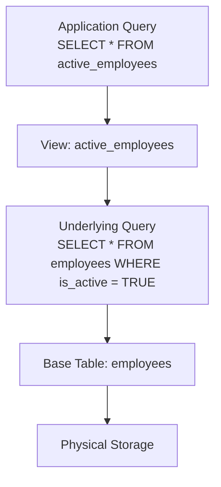

---

# 2. Creating and Using Views

### Syntax

```sql
-- Create a view
CREATE VIEW view_name AS
SELECT column1, column2, ...
FROM table_name
[WHERE condition]
[JOIN ...]
[GROUP BY ...];

-- Replace an existing view
CREATE OR REPLACE VIEW view_name AS
SELECT ...;

-- Drop a view
DROP VIEW view_name;
DROP VIEW IF EXISTS view_name;

-- View definition
ALTER VIEW view_name AS
SELECT ...;
```

---

### Example 1 — Simple Filter View

```sql
-- View: only active employees
CREATE VIEW active_employees AS
SELECT
    employee_id,
    first_name,
    last_name,
    email,
    department_id,
    salary,
    hire_date
FROM employees
WHERE is_active = TRUE;

-- Query the view like a table
SELECT * FROM active_employees WHERE department_id = 1;

-- Count using the view
SELECT COUNT(*) AS active_count FROM active_employees;
```

---

### Example 2 — View with Joins

```sql
-- View: employee details with department name
CREATE VIEW employee_details AS
SELECT
    e.employee_id,
    CONCAT(e.first_name, ' ', e.last_name) AS full_name,
    e.email,
    e.salary,
    e.hire_date,
    d.department_name,
    d.location,
    CONCAT(m.first_name, ' ', m.last_name) AS manager_name
FROM employees e
LEFT JOIN departments d ON e.department_id = d.department_id
LEFT JOIN employees m   ON e.manager_id   = m.employee_id
WHERE e.is_active = TRUE;

-- Now applications query this simple view instead of writing complex joins
SELECT full_name, department_name, salary
FROM employee_details
WHERE location = 'Bangalore'
ORDER BY salary DESC;
```

---

### Example 3 — Security View (Column Restriction)

```sql
-- Public-facing view that hides salary and personal email
CREATE VIEW employee_directory AS
SELECT
    employee_id,
    CONCAT(first_name, ' ', last_name) AS name,
    department_id,
    hire_date
FROM employees
WHERE is_active = TRUE;

-- Grant SELECT only on this view to the public role
GRANT SELECT ON employee_directory TO 'readonly_user'@'%';
-- The user cannot see salary or email
```

---

### Example 4 — Aggregate View

```sql
-- View: department salary statistics
CREATE VIEW department_salary_stats AS
SELECT
    d.department_id,
    d.department_name,
    d.location,
    COUNT(e.employee_id)           AS headcount,
    ROUND(AVG(e.salary), 2)        AS avg_salary,
    MIN(e.salary)                  AS min_salary,
    MAX(e.salary)                  AS max_salary,
    SUM(e.salary)                  AS total_salary_cost
FROM departments d
LEFT JOIN employees e ON d.department_id = e.department_id
                      AND e.is_active = TRUE
GROUP BY d.department_id, d.department_name, d.location;

-- Instantly query summary statistics
SELECT * FROM department_salary_stats
ORDER BY avg_salary DESC;
```

---

### Viewing Existing View Definitions

```sql
-- MySQL: show view definition
SHOW CREATE VIEW employee_details;

-- MySQL: list all views
SELECT table_name, view_definition
FROM information_schema.views
WHERE table_schema = 'company_db';

-- PostgreSQL: list views
SELECT viewname, definition FROM pg_views WHERE schemaname = 'public';
```

---

# 3. Updatable Views

### Definition

An **updatable view** allows `INSERT`, `UPDATE`, and `DELETE` operations that pass through to the underlying base table.

---

### Rules for a View to be Updatable

A view is updatable if it meets ALL of the following conditions:

| Condition | Required |
|---|---|
| Derived from a single base table | Yes |
| No `DISTINCT` clause | Yes |
| No aggregate functions | Yes |
| No `GROUP BY` or `HAVING` | Yes |
| No subqueries in `SELECT` | Yes |
| No `UNION` or `UNION ALL` | Yes |
| All NOT NULL columns without defaults are included | Yes |

---

### Example — Updatable View

```sql
-- This view is updatable (single table, no aggregates)
CREATE VIEW engineering_employees AS
SELECT employee_id, first_name, last_name, salary, is_active
FROM employees
WHERE department_id = 1;

-- UPDATE through the view (updates the base table)
UPDATE engineering_employees
SET salary = 100000
WHERE employee_id = 1;

-- INSERT through the view (inserts into base table)
-- Note: department_id defaults or must be set — this can fail if NOT NULL
INSERT INTO engineering_employees (first_name, last_name, salary, is_active)
VALUES ('New', 'Engineer', 80000, TRUE);
```

---

### WITH CHECK OPTION

Prevents updates or inserts through a view that would make the row disappear from the view.

```sql
CREATE VIEW engineering_employees AS
SELECT employee_id, first_name, salary, department_id
FROM employees
WHERE department_id = 1
WITH CHECK OPTION;

-- This UPDATE would move the employee OUT of Engineering — rejected by CHECK OPTION
UPDATE engineering_employees
SET department_id = 2
WHERE employee_id = 1;
-- Error: CHECK OPTION failed for 'engineering_employees'
```

---

# 4. View Advantages and Disadvantages

### Advantages

| Advantage | Detail |
|---|---|
| Simplification | Hides complexity of joins and subqueries |
| Security | Restrict columns and rows for specific users |
| Consistency | Single source of truth for business logic |
| Abstraction | Applications are decoupled from schema changes |
| Reusability | Define once, query many times |

---

### Disadvantages

| Disadvantage | Detail |
|---|---|
| No data storage | Re-executes the query every time — no caching |
| Performance overhead | Complex view queries can be slow on large tables |
| No indexing | Cannot create indexes directly on a standard view |
| Limited updatability | Most complex views are not updatable |
| Hidden complexity | Deeply nested views are hard to debug |
| Dependency tracking | Dropping or altering base tables can break views silently |

---

# 5. Materialized Views

### Definition

A **materialized view** is a view that **physically stores the result** of its query on disk.

- Data is precomputed and stored — queries against it are fast.
- Must be **refreshed** when the underlying data changes.
- Supported natively in **PostgreSQL** and **Oracle**.
- MySQL does not have native materialized views — use tables + triggers or scheduled jobs to simulate.

---

### Syntax (PostgreSQL)

```sql
-- Create a materialized view
CREATE MATERIALIZED VIEW dept_salary_summary AS
SELECT
    d.department_id,
    d.department_name,
    COUNT(e.employee_id)      AS headcount,
    ROUND(AVG(e.salary), 2)   AS avg_salary,
    SUM(e.salary)             AS total_salary
FROM departments d
LEFT JOIN employees e ON d.department_id = e.department_id
GROUP BY d.department_id, d.department_name;

-- Query it (uses stored data — very fast)
SELECT * FROM dept_salary_summary ORDER BY avg_salary DESC;

-- Refresh the materialized view (recompute from base tables)
REFRESH MATERIALIZED VIEW dept_salary_summary;

-- Refresh without locking (PostgreSQL 9.4+)
REFRESH MATERIALIZED VIEW CONCURRENTLY dept_salary_summary;

-- Drop
DROP MATERIALIZED VIEW dept_salary_summary;
```

---

### Index on Materialized View (PostgreSQL)

```sql
-- You can create indexes on a materialized view — this is its key advantage
CREATE INDEX idx_mv_dept ON dept_salary_summary(department_id);
CREATE INDEX idx_mv_avg_sal ON dept_salary_summary(avg_salary DESC);
```

---

### Simulating Materialized Views in MySQL

```sql
-- MySQL: create a summary table manually
CREATE TABLE dept_salary_summary (
    department_id    INT PRIMARY KEY,
    department_name  VARCHAR(100),
    headcount        INT,
    avg_salary       DECIMAL(10,2),
    total_salary     DECIMAL(15,2),
    last_refreshed   TIMESTAMP DEFAULT CURRENT_TIMESTAMP
);

-- Refresh procedure
CREATE PROCEDURE refresh_dept_summary()
BEGIN
    TRUNCATE TABLE dept_salary_summary;
    INSERT INTO dept_salary_summary
    SELECT
        d.department_id,
        d.department_name,
        COUNT(e.employee_id),
        ROUND(AVG(e.salary), 2),
        SUM(e.salary),
        NOW()
    FROM departments d
    LEFT JOIN employees e ON d.department_id = e.department_id
    GROUP BY d.department_id, d.department_name;
END;

-- Schedule with MySQL Event Scheduler
CREATE EVENT refresh_summary_daily
ON SCHEDULE EVERY 1 DAY
DO CALL refresh_dept_summary();
```

---

# 6. View vs Materialized View

| Feature | View | Materialized View |
|---|---|---|
| Data stored | No — virtual | Yes — physically stored |
| Query speed | Slower — re-executes each time | Faster — reads stored data |
| Data freshness | Always current | Stale until refreshed |
| Index support | No | Yes |
| Storage cost | None | Yes — disk space |
| Refresh needed | Never | Yes — manual or scheduled |
| DBMS support | All DBMS | PostgreSQL, Oracle (not MySQL natively) |
| Best for | Real-time, up-to-date data | Expensive aggregations, reporting |

---

### Choosing Between View and Materialized View

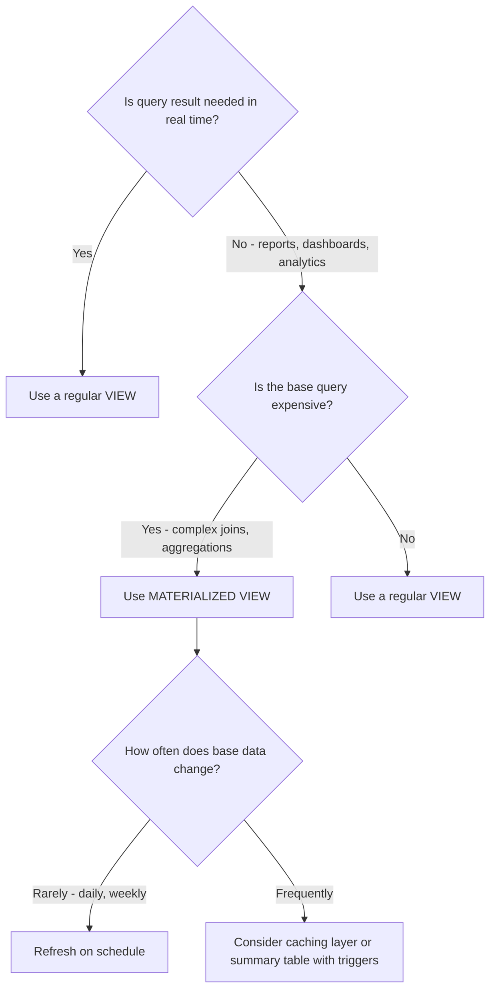

---

# 7. Index Overview

### Definition

An **index** is a separate data structure maintained by the DBMS that allows it to find rows quickly without scanning every row in a table.

- Analogous to the index at the back of a book — you look up the keyword and find the page number directly.
- Speeds up `SELECT` queries on indexed columns.
- Slows down `INSERT`, `UPDATE`, and `DELETE` because the index must also be maintained.
- Requires additional disk space.

---

### Without Index vs With Index

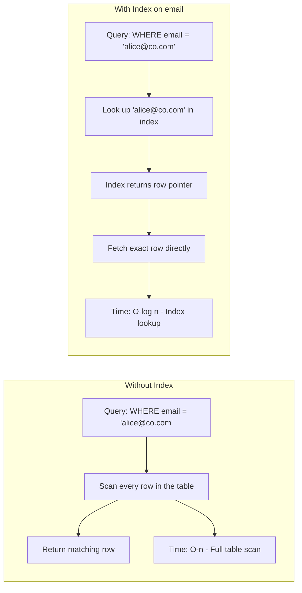

---

### Index Trade-offs

| Factor | Benefit | Cost |
|---|---|---|
| Read performance | Much faster SELECT | N/A |
| Write performance | N/A | Slower INSERT, UPDATE, DELETE |
| Storage | N/A | Extra disk space per index |
| Maintenance | N/A | Index must stay consistent with data |

---

### Index Types Overview

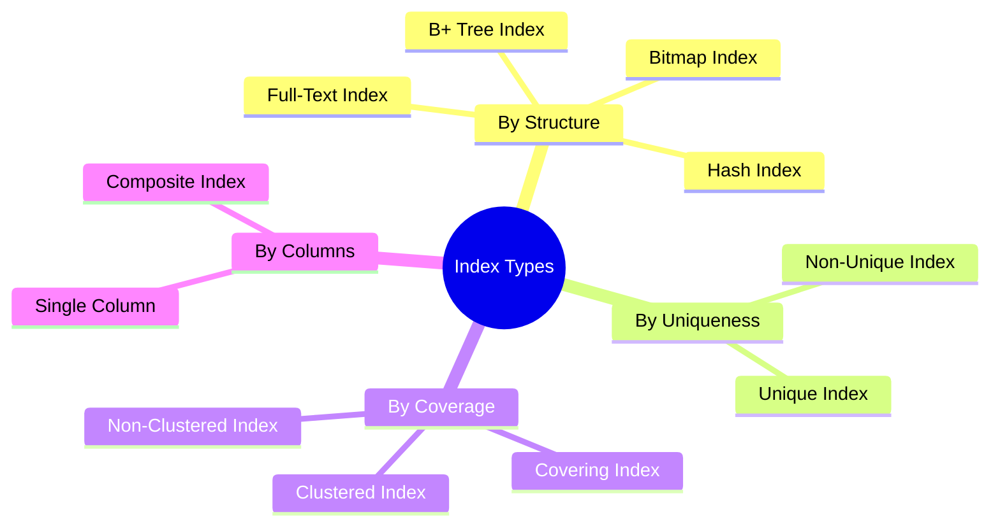

---

# 8. How Indexes Work — B+ Tree

### Definition

A **B+ Tree (Balanced Plus Tree)** is the most common index structure used in relational databases.

- All data values are stored at the **leaf nodes** of the tree.
- Internal nodes contain only keys used for navigation.
- All leaf nodes are connected in a **doubly-linked list** — enables efficient range scans.
- The tree is always **balanced** — all leaf nodes are at the same depth.

---

### B+ Tree Structure

```
                    [50]
                   /    \
            [20, 35]    [65, 80]
           /   |   \    /   |   \
        [10] [25] [40] [55] [70] [90]
          |    |    |    |    |    |
        data data data data data data  <- Leaf nodes (linked list)
```

- Searching for `salary = 95000`:
  - Start at root → navigate internal nodes → reach leaf node → return row pointer.
  - Time complexity: **O(log n)**.

- Range scan `salary BETWEEN 80000 AND 100000`:
  - Find the start leaf node → follow the linked list until the end of the range.
  - Much faster than scanning the entire table.

---

### Why B+ Tree for Indexes?

| Property | Benefit |
|---|---|
| Balanced | Guarantees O(log n) search time |
| Leaf linked list | Efficient range scans |
| High fanout | Fewer disk I/O operations — tree stays shallow |
| Sorted order | Supports ORDER BY and BETWEEN efficiently |

---

# 9. Clustered Index

### Definition

A **clustered index** determines the **physical order** of rows stored on disk.

- The table data itself is stored in the order of the clustered index key.
- A table can have **only one** clustered index.
- In MySQL (InnoDB), the **primary key is always the clustered index**.
- If no primary key is defined, InnoDB picks the first UNIQUE NOT NULL column.
- If neither exists, InnoDB creates a hidden 6-byte row ID as the clustered index.

---

### How Clustered Index Stores Data

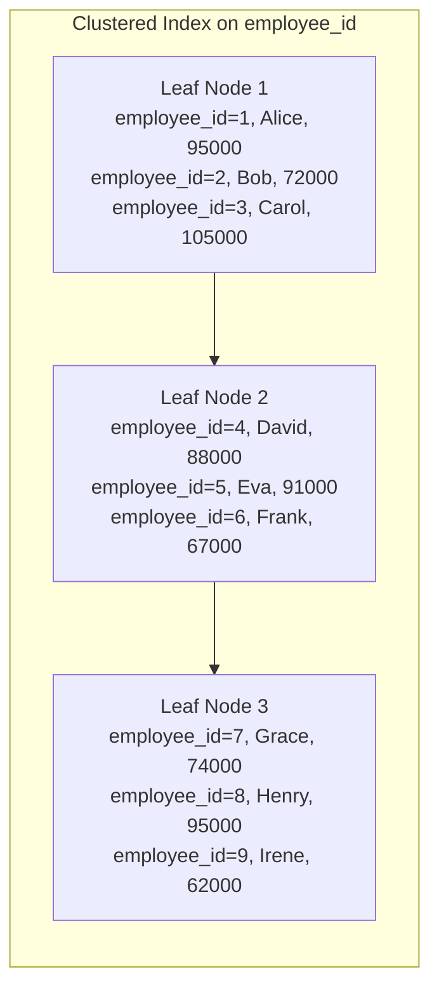

The actual row data lives in the leaf nodes — there is no separate "row lookup" step.

---

### Clustered Index Performance

```sql
-- Very fast: primary key lookup (clustered index)
SELECT * FROM employees WHERE employee_id = 5;
-- Direct B+ tree traversal to leaf → row data is right there

-- Very fast: range scan on primary key
SELECT * FROM employees WHERE employee_id BETWEEN 3 AND 7;
-- Traverse to start leaf → follow linked list

-- Slower: non-indexed column lookup
SELECT * FROM employees WHERE salary = 95000;
-- Full table scan (unless salary has a separate index)
```

---

### Clustered Index Best Practices

- Always define a primary key — InnoDB uses it as the clustered index.
- Use a **narrow, monotonically increasing** column (`INT AUTO_INCREMENT`) for the clustered index.
- Avoid wide or random clustered index keys (like `UUID`) — they cause **page splits** and fragmentation.
- Foreign keys in child tables should reference the parent's clustered index.

---

### UUID as Primary Key — Why It Is Problematic

```sql
-- Bad: UUID primary key (clustered index)
CREATE TABLE orders (
    order_id CHAR(36) PRIMARY KEY DEFAULT (UUID()),  -- Random, wide, non-sequential
    ...
);
-- Problem: UUIDs are random → every INSERT goes to a random leaf page
-- → causes constant page splits → index fragmentation → poor performance

-- Better: INT AUTO_INCREMENT (sequential, narrow)
CREATE TABLE orders (
    order_id INT PRIMARY KEY AUTO_INCREMENT,
    ...
);
```

---

# 10. Non-Clustered Index

### Definition

A **non-clustered index** (also called a secondary index) is a **separate structure** from the actual table data.

- Leaf nodes of a non-clustered index contain the **indexed column value** and a **pointer to the actual row**.
- In InnoDB, the pointer is the **primary key value** (not a physical address).
- A table can have **many** non-clustered indexes (up to 64 in MySQL InnoDB).

---

### How Non-Clustered Index Works

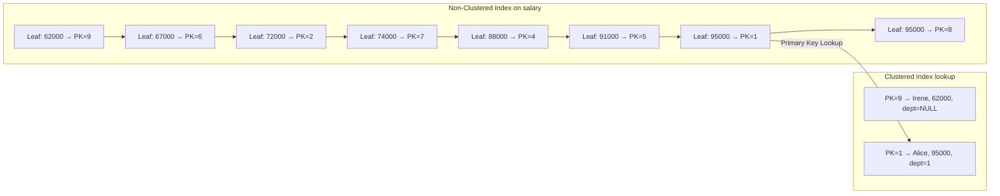

When the query needs columns not in the index:
1. Find the salary value in the non-clustered index → get the primary key.
2. Go back to the clustered index using the primary key → fetch the full row.

This second step is called a **bookmark lookup** or **key lookup**.

---

### Creating Non-Clustered Indexes

```sql
-- Single column non-clustered index
CREATE INDEX idx_employees_salary ON employees(salary);
CREATE INDEX idx_employees_dept   ON employees(department_id);
CREATE INDEX idx_employees_email  ON employees(email);
CREATE INDEX idx_orders_date      ON orders(order_date);

-- View indexes on a table (MySQL)
SHOW INDEXES FROM employees;

-- View indexes (PostgreSQL)
SELECT indexname, indexdef
FROM pg_indexes
WHERE tablename = 'employees';
```

---

# 11. Clustered vs Non-Clustered Index

| Feature | Clustered Index | Non-Clustered Index |
|---|---|---|
| Data storage | Table data IS the index (leaf nodes hold actual rows) | Separate structure — leaf nodes hold key + PK pointer |
| Count per table | Only 1 | Up to 64 (MySQL InnoDB) |
| Speed for PK lookup | Fastest — no extra lookup | Requires key lookup back to clustered index |
| Speed for range scan | Very fast | Fast on index; key lookup adds overhead |
| Physical order | Determines row order on disk | Does not affect physical order |
| In MySQL InnoDB | Primary Key | All other indexes |
| In SQL Server | Explicitly created or PK | All other indexes |

---

# 12. Composite Index

### Definition

A **composite index** (also called a multi-column index) is an index on **two or more columns**.

- The order of columns in a composite index is critically important.
- The index can be used efficiently only when the query filters on the **leftmost prefix** of the index columns.

---

### Syntax

```sql
CREATE INDEX idx_name ON table_name(column1, column2, column3);
```

---

### The Leftmost Prefix Rule

```sql
-- Index: (department_id, is_active, salary)
CREATE INDEX idx_dept_active_salary ON employees(department_id, is_active, salary);

-- Uses index fully: filters on all three columns
SELECT * FROM employees WHERE department_id = 1 AND is_active = TRUE AND salary > 90000;

-- Uses index on first two columns
SELECT * FROM employees WHERE department_id = 1 AND is_active = TRUE;

-- Uses index on first column only
SELECT * FROM employees WHERE department_id = 1;

-- Cannot use this index: skips department_id (leftmost column)
SELECT * FROM employees WHERE is_active = TRUE AND salary > 90000;

-- Cannot use this index: skips department_id
SELECT * FROM employees WHERE salary > 90000;
```

---

### Composite Index Column Order Strategy

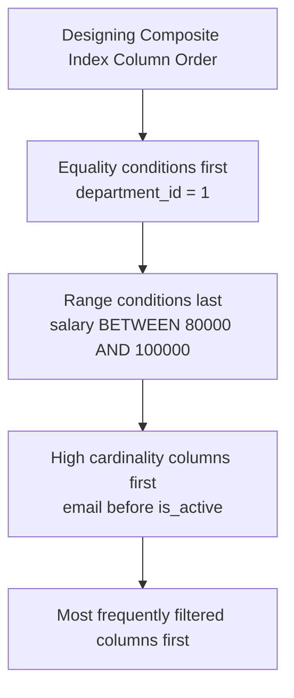

---

### Example — Optimizing a Common Query

```sql
-- Common query pattern
SELECT first_name, salary
FROM employees
WHERE department_id = 1
  AND is_active = TRUE
  AND hire_date >= '2020-01-01';

-- Optimal composite index for this query
-- Equality columns first, range column last
CREATE INDEX idx_dept_active_hire ON employees(department_id, is_active, hire_date);

-- Column order explanation:
-- department_id: equality filter → first
-- is_active: equality filter → second
-- hire_date: range filter → last
```

---

### Composite Index vs Multiple Single Indexes

| Scenario | Recommendation |
|---|---|
| Query filters on col1 AND col2 together frequently | Composite index (col1, col2) |
| Queries filter on col1 alone AND col2 alone separately | Two single-column indexes |
| Query filters on col1, col2 together AND col1 alone | Composite (col1, col2) — covers both cases via leftmost prefix |

---

# 13. Unique Index

### Definition

A **unique index** enforces that all values in the indexed column (or combination of columns) are distinct.

- A `PRIMARY KEY` creates a unique clustered index automatically.
- A `UNIQUE` constraint creates a unique non-clustered index automatically.
- NULL values are treated as distinct — multiple NULLs are allowed in a UNIQUE index (in most DBMS).

---

### Syntax

```sql
-- Via UNIQUE constraint (preferred — self-documenting)
CREATE TABLE employees (
    email VARCHAR(150) UNIQUE
);

-- Via explicit index
CREATE UNIQUE INDEX idx_unique_email ON employees(email);

-- Composite unique index
CREATE UNIQUE INDEX idx_unique_dept_emp ON enrollments(student_id, course_id);
```

---

### Example

```sql
-- Unique index on email
CREATE UNIQUE INDEX idx_employees_email ON employees(email);

-- This succeeds
INSERT INTO employees (first_name, email, salary, hire_date)
VALUES ('New', 'new@co.com', 70000, CURDATE());

-- This fails — email already exists
INSERT INTO employees (first_name, email, salary, hire_date)
VALUES ('Dup', 'alice@co.com', 70000, CURDATE());
-- Error: Duplicate entry 'alice@co.com' for key 'idx_employees_email'
```

---

# 14. Covering Index

### Definition

A **covering index** is an index that contains **all the columns** needed by a query — so the query can be answered entirely from the index without accessing the actual table rows.

- Eliminates the expensive "key lookup" back to the clustered index.
- Query execution shows `Using index` in MySQL `EXPLAIN` output.

---

### Example

```sql
-- Query: fetch first_name and salary for department 1
SELECT first_name, salary
FROM employees
WHERE department_id = 1;

-- Non-covering index on department_id alone:
-- 1. Look up department_id = 1 in index → get primary keys
-- 2. Look up each primary key in clustered index → fetch first_name, salary
-- Two lookups per row

-- Covering index: include all queried columns
CREATE INDEX idx_covering_dept_name_salary
ON employees(department_id, first_name, salary);

-- Now the query is fully answered from the index alone — no table lookup
-- EXPLAIN shows: Using index (covering index)
```

---

### When to Create a Covering Index

```sql
-- Frequently run report query
SELECT department_id, COUNT(*), AVG(salary)
FROM employees
WHERE is_active = TRUE
GROUP BY department_id;

-- Covering index for this query
CREATE INDEX idx_cover_active_dept_salary
ON employees(is_active, department_id, salary);
-- Contains is_active (WHERE), department_id (GROUP BY), salary (AVG)
-- No table access needed
```

---

### Covering Index in EXPLAIN

```sql
EXPLAIN SELECT first_name, salary
FROM employees
WHERE department_id = 1;

-- Without covering index: Extra = "Using index condition"
-- With covering index:    Extra = "Using index"  ← much better
```

---

# 15. Bitmap Index

### Definition

A **bitmap index** stores a **bitmap (array of bits)** for each distinct value of a column.

- Each bit represents one row — `1` if the row has that value, `0` if not.
- Extremely efficient for columns with **very low cardinality** (few distinct values).
- Very efficient for combining multiple conditions with `AND`/`OR` (bitwise operations).
- Used primarily in **data warehouse and OLAP systems** (Oracle, Redshift).
- **Not supported natively in MySQL or PostgreSQL**.

---

### How Bitmap Index Works

```
Column: is_active (values: TRUE, FALSE)

TRUE  bitmap:  1 1 1 1 1 0 1 1 1 1  (rows 1-5,7-10 are active)
FALSE bitmap:  0 0 0 0 0 1 0 0 0 0  (row 6 is inactive)

Query: WHERE is_active = TRUE
→ Use TRUE bitmap directly → fetch rows with bit=1
→ No B+ tree traversal needed

Query: WHERE is_active = TRUE AND department_id = 1
→ AND the two bitmaps together (bitwise AND)
→ Result bitmap shows matching rows instantly
```

---

### Bitmap Index Use Cases

| Use Case | Why Bitmap is Good |
|---|---|
| `is_active` (TRUE/FALSE) | Only 2 distinct values — tiny bitmap |
| `gender` (M/F/O) | Only 3 values |
| `order_status` (5 values) | Few values, many rows per value |
| `region` (10 regions) | Low cardinality, analytical queries |
| OLAP: `WHERE region = 'North' AND year = 2024` | Bitwise AND is instant |

---

### Why Bitmap Indexes Are Not Used in OLTP

- Very expensive to update — every `INSERT`, `UPDATE`, `DELETE` requires rebuilding the affected bitmaps.
- Lock contention is severe in write-heavy systems.
- In OLTP systems, use B+ Tree indexes instead.

---

# 16. Hash Index

### Definition

A **hash index** uses a hash function to map column values to positions in a hash table.

- Provides **O(1)** exact equality lookups — extremely fast.
- Does **not** support range queries (`>`, `<`, `BETWEEN`) — hash functions do not preserve order.
- Supported in MySQL MEMORY engine and PostgreSQL.

---

### Hash Index Behavior

```
Hash function: hash(email) → bucket_index

'alice@co.com' → hash → bucket 42 → row pointer
'bob@co.com'   → hash → bucket 17 → row pointer

-- O(1) lookup:
WHERE email = 'alice@co.com'
→ hash('alice@co.com') → bucket 42 → return row

-- Cannot use hash for range:
WHERE salary > 80000
→ Hash index is useless — must fall back to full scan
```

---

### Hash Index in MySQL

```sql
-- MySQL MEMORY engine supports hash indexes
CREATE TABLE session_cache (
    session_id  VARCHAR(64) PRIMARY KEY,
    user_id     INT,
    data        TEXT,
    expires_at  DATETIME
) ENGINE=MEMORY;
-- MEMORY engine uses hash indexes by default for equality lookups

-- InnoDB does NOT support explicit hash indexes
-- InnoDB has an internal Adaptive Hash Index (AHI) — automatic, not user-controlled
```

---

### Hash Index in PostgreSQL

```sql
-- PostgreSQL supports explicit hash indexes
CREATE INDEX idx_hash_email ON employees USING HASH (email);

-- Good for: WHERE email = 'alice@co.com'
-- Bad for:  WHERE email LIKE 'alice%' or ORDER BY email
```

---

### B+ Tree vs Hash Index

| Feature | B+ Tree Index | Hash Index |
|---|---|---|
| Lookup speed | O(log n) | O(1) |
| Range queries | Yes | No |
| ORDER BY support | Yes | No |
| LIKE prefix search | Yes | No |
| DBMS support | All | MySQL MEMORY, PostgreSQL |
| Best for | General purpose | Equality-only lookups |

---

# 17. Full-Text Index

### Definition

A **full-text index** enables efficient **keyword searching** within large text columns.

- Faster than `LIKE '%keyword%'` for text searches.
- Supports natural language search, boolean search, and relevance ranking.
- Available in MySQL for `CHAR`, `VARCHAR`, `TEXT` columns.

---

### Syntax

```sql
-- Create full-text index
CREATE FULLTEXT INDEX idx_ft_description ON products(description);

-- Or inline
CREATE TABLE products (
    product_id  INT PRIMARY KEY,
    name        VARCHAR(150),
    description TEXT,
    FULLTEXT(name, description)
);

-- Natural language mode search
SELECT product_name, description
FROM products
WHERE MATCH(description) AGAINST('keyboard wireless' IN NATURAL LANGUAGE MODE);

-- Boolean mode search
SELECT product_name
FROM products
WHERE MATCH(description) AGAINST('+keyboard -wired' IN BOOLEAN MODE);
-- + means must include, - means must exclude

-- With relevance score
SELECT
    product_name,
    MATCH(description) AGAINST('keyboard') AS relevance
FROM products
WHERE MATCH(description) AGAINST('keyboard')
ORDER BY relevance DESC;
```

---

# 18. Index Management

### Creating Indexes

```sql
-- Basic index
CREATE INDEX idx_name ON table_name(column);

-- Unique index
CREATE UNIQUE INDEX idx_name ON table_name(column);

-- Composite index
CREATE INDEX idx_name ON table_name(col1, col2, col3);

-- Full-text index
CREATE FULLTEXT INDEX idx_name ON table_name(col);

-- Add index via ALTER TABLE
ALTER TABLE employees ADD INDEX idx_salary (salary);
ALTER TABLE employees ADD UNIQUE INDEX idx_email (email);
```

---

### Dropping Indexes

```sql
-- MySQL
DROP INDEX idx_salary ON employees;
ALTER TABLE employees DROP INDEX idx_salary;

-- PostgreSQL
DROP INDEX idx_salary;
DROP INDEX IF EXISTS idx_salary;
```

---

### Viewing Indexes

```sql
-- MySQL: show indexes
SHOW INDEXES FROM employees;
SHOW INDEX FROM employees\G  -- vertical output

-- MySQL: index info from information_schema
SELECT
    INDEX_NAME,
    COLUMN_NAME,
    NON_UNIQUE,
    SEQ_IN_INDEX,
    CARDINALITY
FROM information_schema.STATISTICS
WHERE TABLE_SCHEMA = 'company_db'
  AND TABLE_NAME   = 'employees';

-- PostgreSQL
SELECT indexname, indexdef FROM pg_indexes
WHERE tablename = 'employees';

-- SQL Server
SELECT name, type_desc FROM sys.indexes
WHERE object_id = OBJECT_ID('employees');
```

---

# 19. EXPLAIN and Query Plans

### Definition

`EXPLAIN` shows how the database **plans to execute** a query — which indexes it uses, how many rows it scans, and the join method.

- Use `EXPLAIN` to identify performance bottlenecks.
- Understanding the output is essential for query optimization interviews.

---

### Syntax

```sql
-- MySQL
EXPLAIN SELECT * FROM employees WHERE department_id = 1;
EXPLAIN FORMAT=JSON SELECT * FROM employees WHERE department_id = 1;

-- MySQL 8.0+: EXPLAIN ANALYZE (executes and shows actual stats)
EXPLAIN ANALYZE SELECT * FROM employees WHERE department_id = 1;

-- PostgreSQL
EXPLAIN SELECT * FROM employees WHERE department_id = 1;
EXPLAIN ANALYZE SELECT * FROM employees WHERE department_id = 1;
EXPLAIN (ANALYZE, BUFFERS) SELECT * FROM employees WHERE department_id = 1;
```

---

### MySQL EXPLAIN Output Columns

| Column | Meaning |
|---|---|
| `id` | Query step identifier |
| `select_type` | Type of SELECT (SIMPLE, SUBQUERY, UNION) |
| `table` | Table being accessed |
| `type` | Join/access type — most important column |
| `possible_keys` | Indexes that could be used |
| `key` | Index actually used (NULL = full scan) |
| `key_len` | Bytes of index used |
| `rows` | Estimated rows to scan |
| `Extra` | Additional information |

---

### The `type` Column — Access Types (Best to Worst)

| Type | Description | Performance |
|---|---|---|
| `system` | Table has exactly 1 row | Best |
| `const` | PK or UNIQUE with constant value | Excellent |
| `eq_ref` | PK/UNIQUE used in JOIN | Excellent |
| `ref` | Non-unique index lookup | Good |
| `range` | Index range scan (BETWEEN, >, <) | Good |
| `index` | Full index scan | Fair |
| `ALL` | Full table scan | Worst |

---

### EXPLAIN Examples

```sql
-- Without index on department_id
EXPLAIN SELECT * FROM employees WHERE department_id = 1;
-- type: ALL, rows: 10, Extra: Using where
-- Full table scan — bad for large tables

-- After adding index
CREATE INDEX idx_dept ON employees(department_id);

EXPLAIN SELECT * FROM employees WHERE department_id = 1;
-- type: ref, key: idx_dept, rows: 4
-- Index used — much better

-- Primary key lookup
EXPLAIN SELECT * FROM employees WHERE employee_id = 5;
-- type: const, key: PRIMARY, rows: 1
-- Best possible — const access

-- Range scan with index
EXPLAIN SELECT * FROM employees WHERE salary BETWEEN 80000 AND 100000;
-- type: range (if salary is indexed)

-- Full scan because function wraps indexed column
EXPLAIN SELECT * FROM employees WHERE YEAR(hire_date) = 2020;
-- type: ALL — function prevents index use

-- Use range instead
EXPLAIN SELECT * FROM employees
WHERE hire_date >= '2020-01-01' AND hire_date < '2021-01-01';
-- type: range — index used
```

---

### Important `Extra` Values

| Extra Value | Meaning |
|---|---|
| `Using where` | Filter applied after index lookup or scan |
| `Using index` | Covering index — no table access needed (good) |
| `Using filesort` | Extra sort step — ORDER BY not served by index |
| `Using temporary` | Temp table used — GROUP BY / ORDER BY on non-indexed col |
| `Using index condition` | Index condition pushdown |
| `NULL` | Simple index lookup with no special notes |

---

# 20. Index Optimization Rules

### Rules for Effective Index Usage

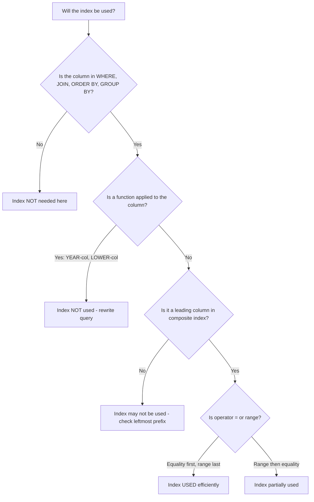

---

### Top Index Optimization Rules

```sql
-- RULE 1: Do not apply functions to indexed columns in WHERE
-- BAD
WHERE YEAR(hire_date) = 2020
WHERE LOWER(email) = 'alice@co.com'
WHERE salary + 1000 > 90000

-- GOOD
WHERE hire_date >= '2020-01-01' AND hire_date < '2021-01-01'
WHERE email = 'alice@co.com'  -- store email already lowercased
WHERE salary > 89000

-- RULE 2: Avoid leading wildcards with LIKE
WHERE first_name LIKE '%alice'  -- no index
WHERE first_name LIKE 'alice%'  -- index used (prefix scan)

-- RULE 3: Avoid implicit type conversion
WHERE employee_id = '5'  -- employee_id is INT — string causes conversion
WHERE employee_id = 5    -- correct

-- RULE 4: Use covering indexes for frequently run reports
CREATE INDEX idx_cover ON employees(department_id, first_name, salary);

-- RULE 5: Put equality conditions before range conditions in composite index
-- BAD index order for: WHERE dept = 1 AND salary > 80000
CREATE INDEX idx_bad  ON employees(salary, department_id);  -- wrong order

-- GOOD index order
CREATE INDEX idx_good ON employees(department_id, salary);  -- equality first

-- RULE 6: Index foreign key columns in child tables
CREATE INDEX idx_fk_dept ON employees(department_id);
CREATE INDEX idx_fk_mgr  ON employees(manager_id);
```

---

# 21. When Not to Use Indexes

| Situation | Reason |
|---|---|
| Very small tables | Full scan is faster than index overhead |
| Columns with very low cardinality | e.g., `is_active` — index rarely helps B+ Tree |
| Columns rarely used in WHERE / JOIN | Index is never used — wastes space |
| Very write-heavy tables | Index maintenance slows INSERT / UPDATE / DELETE |
| Columns frequently updated | Index must be updated constantly |
| `SELECT *` queries | If columns not covered, index may not help |

---

# 22. Transaction Overview

### Definition

A **transaction** is a sequence of one or more SQL operations that are executed as a **single logical unit of work**.

- Either all operations in a transaction succeed — or none of them take effect.
- This is the fundamental guarantee that makes databases reliable for financial and critical systems.

---

### Why Transactions Are Critical

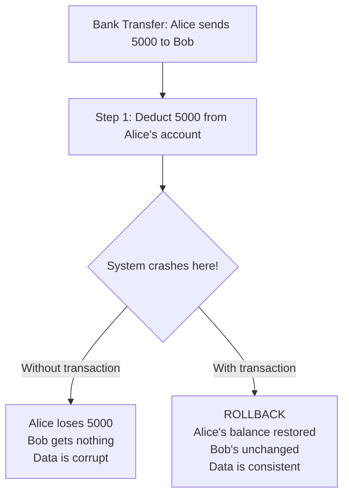

---

### Transaction Syntax

```sql
-- MySQL / PostgreSQL
START TRANSACTION;
-- or
BEGIN;

-- ... SQL statements ...

COMMIT;    -- Save all changes
-- or
ROLLBACK;  -- Undo all changes

-- SQL Server
BEGIN TRANSACTION;
-- ... statements ...
COMMIT TRANSACTION;
-- or
ROLLBACK TRANSACTION;
```

---

# 23. COMMIT and ROLLBACK

### COMMIT

`COMMIT` **permanently saves** all changes made within the current transaction to the database.

```sql
-- Bank transfer example
START TRANSACTION;

UPDATE accounts SET balance = balance - 5000 WHERE account_id = 101;
UPDATE accounts SET balance = balance + 5000 WHERE account_id = 202;

-- Verify both updates look correct
SELECT account_id, balance FROM accounts WHERE account_id IN (101, 202);

COMMIT;  -- Permanently saves both updates
```

---

### ROLLBACK

`ROLLBACK` **undoes all changes** made since the transaction began, restoring data to its pre-transaction state.

```sql
START TRANSACTION;

UPDATE accounts SET balance = balance - 5000 WHERE account_id = 101;

-- Simulating an error condition
-- If account 202 doesn't exist or any error occurs:
ROLLBACK;  -- Alice's deduction is reversed -- no money lost

-- Practical example with error handling
START TRANSACTION;

UPDATE accounts
SET balance = balance - 5000
WHERE account_id = 101 AND balance >= 5000;

-- Check if update actually affected a row (sufficient balance)
-- In application code: if rows_affected == 0 then ROLLBACK
-- In SQL:
IF ROW_COUNT() = 0 THEN
    ROLLBACK;
ELSE
    UPDATE accounts SET balance = balance + 5000 WHERE account_id = 202;
    COMMIT;
END IF;
```

---

### Auto-commit Mode

```sql
-- MySQL: auto-commit is ON by default
-- Every individual statement is its own transaction

-- Check auto-commit status
SELECT @@autocommit;

-- Disable auto-commit (manual transaction control)
SET autocommit = 0;

-- Re-enable
SET autocommit = 1;

-- When autocommit = 0, you must explicitly COMMIT or ROLLBACK
UPDATE employees SET salary = 100000 WHERE employee_id = 1;
COMMIT;  -- Must explicitly commit
```

---

### DDL and Transactions

```sql
-- MySQL: DDL statements (CREATE, DROP, ALTER, TRUNCATE) auto-commit
-- They cannot be rolled back in MySQL

START TRANSACTION;
INSERT INTO employees ... ;      -- Can rollback
ALTER TABLE employees ADD COLUMN ... ;  -- Auto-commits immediately in MySQL
ROLLBACK;  -- Only rolls back the INSERT, not the ALTER

-- PostgreSQL: DDL statements CAN be rolled back inside a transaction
BEGIN;
CREATE TABLE temp_test (id INT);
INSERT INTO temp_test VALUES (1);
ROLLBACK;  -- Both CREATE and INSERT are rolled back
```

---

# 24. SAVEPOINT

### Definition

A **SAVEPOINT** creates a named checkpoint within a transaction that you can roll back to — without rolling back the entire transaction.

- Allows partial rollback within a complex transaction.
- Multiple savepoints can be created within one transaction.

---

### Syntax

```sql
SAVEPOINT savepoint_name;
ROLLBACK TO SAVEPOINT savepoint_name;
RELEASE SAVEPOINT savepoint_name;  -- Remove a savepoint
```

---

### Example

```sql
START TRANSACTION;

-- Step 1: Process order
INSERT INTO orders (customer_id, total, status, order_date)
VALUES (1, 500.00, 'pending', CURDATE());

SAVEPOINT order_created;

-- Step 2: Deduct inventory
UPDATE products SET stock = stock - 2 WHERE product_id = 1;

SAVEPOINT inventory_updated;

-- Step 3: Process payment (fails)
UPDATE accounts SET balance = balance - 500
WHERE customer_id = 1 AND balance >= 500;

-- Payment failed (insufficient balance):
ROLLBACK TO SAVEPOINT inventory_updated;  -- Undo only the inventory update

-- Retry with a different payment method or mark as pending
UPDATE orders SET status = 'awaiting_payment' WHERE customer_id = 1;

COMMIT;  -- Save the order creation and status update
```

---

### SAVEPOINT Use Cases

| Use Case | How SAVEPOINT Helps |
|---|---|
| Multi-step order processing | Roll back specific steps on failure |
| Bulk imports with partial failures | Skip bad rows, keep good ones |
| Complex stored procedures | Partial rollback on error |
| Nested transaction simulation | Simulate nested transactions with savepoints |

---

# 25. ACID Properties

### Definition

**ACID** is a set of four properties that guarantee reliable transaction processing in a database.

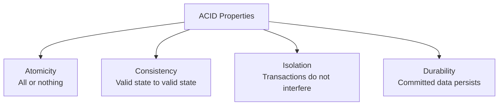

---

### Atomicity

**All operations in a transaction succeed, or none of them take effect.**

```sql
-- Transfer $5000 from account 101 to account 202
START TRANSACTION;
UPDATE accounts SET balance = balance - 5000 WHERE account_id = 101;
UPDATE accounts SET balance = balance + 5000 WHERE account_id = 202;
COMMIT;

-- If the second UPDATE fails, the ROLLBACK ensures:
-- Account 101 is NOT debited
-- Account 202 is NOT credited
-- Total money in the system remains the same
```

---

### Consistency

**A transaction brings the database from one valid state to another valid state.**

All constraints, rules, and triggers must hold before and after the transaction.

```sql
-- Consistency example: CHECK constraint
-- If salary has CHECK (salary > 0), a transaction trying to set salary = -1 is rejected
-- The database remains in a consistent state

-- If FOREIGN KEY enforces referential integrity:
-- Inserting an order with a non-existent customer_id fails
-- The database rejects the inconsistent state
```

---

### Isolation

**Concurrent transactions execute as if they were run sequentially.**

One transaction's intermediate (uncommitted) state is not visible to other concurrent transactions (depending on isolation level).

```sql
-- Session 1: long-running transaction
START TRANSACTION;
UPDATE accounts SET balance = balance - 5000 WHERE account_id = 101;
-- Not yet committed...

-- Session 2: concurrent read
SELECT balance FROM accounts WHERE account_id = 101;
-- Depending on isolation level:
-- READ UNCOMMITTED: sees the -5000 (dirty read)
-- READ COMMITTED:   sees original balance (committed data only)
-- REPEATABLE READ:  sees original balance (snapshot from start of tx)
```

---

### Durability

**Once a transaction is committed, it remains committed — even in the event of system failure (crash, power loss, etc.).**

- Achieved through **Write-Ahead Logging (WAL)** — changes are written to a log before being applied to data pages.
- On recovery after a crash, the DBMS replays the log to restore committed transactions.

```sql
-- After this COMMIT, the data persists permanently
START TRANSACTION;
UPDATE accounts SET balance = 100000 WHERE account_id = 101;
COMMIT;
-- Even if the server crashes immediately after COMMIT,
-- account 101 will have balance = 100000 when the server restarts
```

---

### ACID Summary

| Property | Question it Answers | Mechanism |
|---|---|---|
| Atomicity | Did all steps complete or none? | ROLLBACK on failure |
| Consistency | Is the database in a valid state? | Constraints, triggers, rules |
| Isolation | Do concurrent transactions interfere? | Locking, MVCC, isolation levels |
| Durability | Will committed data survive a crash? | WAL, write-ahead logging |

---

# 26. Isolation Levels

### Definition

**Isolation levels** define **how much a transaction is isolated from the effects of other concurrent transactions**.

- Higher isolation = more consistent reads, but lower concurrency and performance.
- Lower isolation = better performance, but risk of concurrency anomalies.

---

### Four Standard Isolation Levels

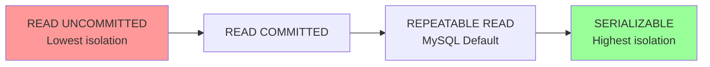

---

### Setting Isolation Level

```sql
-- MySQL: set for current session
SET SESSION TRANSACTION ISOLATION LEVEL READ COMMITTED;
SET SESSION TRANSACTION ISOLATION LEVEL REPEATABLE READ;
SET SESSION TRANSACTION ISOLATION LEVEL SERIALIZABLE;
SET SESSION TRANSACTION ISOLATION LEVEL READ UNCOMMITTED;

-- MySQL: set globally
SET GLOBAL TRANSACTION ISOLATION LEVEL READ COMMITTED;

-- PostgreSQL
SET TRANSACTION ISOLATION LEVEL READ COMMITTED;
BEGIN ISOLATION LEVEL REPEATABLE READ;

-- Check current isolation level (MySQL)
SELECT @@transaction_isolation;
```

---

### Isolation Level Details

#### READ UNCOMMITTED

- A transaction can read **uncommitted changes** from other transactions.
- Fastest, but most dangerous.
- Allows: Dirty Read, Non-Repeatable Read, Phantom Read.

```sql
-- Session 1
START TRANSACTION;
UPDATE accounts SET balance = 999999 WHERE account_id = 1;
-- NOT committed yet

-- Session 2 (READ UNCOMMITTED)
SET SESSION TRANSACTION ISOLATION LEVEL READ UNCOMMITTED;
SELECT balance FROM accounts WHERE account_id = 1;
-- Returns 999999 — a dirty read of uncommitted data!
-- If Session 1 ROLLBACKs, Session 2 read incorrect data
```

---

#### READ COMMITTED (PostgreSQL default)

- A transaction only sees **committed data**.
- Prevents dirty reads, but allows non-repeatable reads and phantom reads.

```sql
-- Session 1
START TRANSACTION;
UPDATE accounts SET balance = 5000 WHERE account_id = 1;
COMMIT;

-- Session 2 (READ COMMITTED)
START TRANSACTION;
SELECT balance FROM accounts WHERE account_id = 1;  -- Returns 5000 (committed)

-- Session 1 commits another change
UPDATE accounts SET balance = 8000 WHERE account_id = 1;
COMMIT;

-- Session 2 reads again
SELECT balance FROM accounts WHERE account_id = 1;  -- Returns 8000 (non-repeatable read!)
```

---

#### REPEATABLE READ (MySQL InnoDB default)

- Guarantees that if you read a row twice in the same transaction, you get the **same result**.
- Prevents dirty reads and non-repeatable reads.
- Phantom reads are prevented in MySQL InnoDB via gap locks (beyond standard REPEATABLE READ).

```sql
-- Session 2 (REPEATABLE READ)
START TRANSACTION;
SELECT balance FROM accounts WHERE account_id = 1;  -- Returns 5000

-- Session 1 commits a change: balance = 8000
-- Session 2 reads again
SELECT balance FROM accounts WHERE account_id = 1;  -- Still returns 5000 (snapshot from tx start)
COMMIT;
```

---

#### SERIALIZABLE

- Full transaction isolation — transactions execute as if they were run one at a time.
- Prevents all concurrency anomalies.
- Slowest — uses strict locking, severely limits concurrency.

```sql
SET SESSION TRANSACTION ISOLATION LEVEL SERIALIZABLE;
START TRANSACTION;

SELECT COUNT(*) FROM orders WHERE status = 'pending';
-- Other transactions cannot INSERT 'pending' orders until this transaction commits
-- Prevents phantom reads
```

---

### Isolation Level vs Concurrency Problems

| Isolation Level | Dirty Read | Non-Repeatable Read | Phantom Read | Performance |
|---|---|---|---|---|
| READ UNCOMMITTED | Possible | Possible | Possible | Best |
| READ COMMITTED | Prevented | Possible | Possible | Good |
| REPEATABLE READ | Prevented | Prevented | Possible* | Moderate |
| SERIALIZABLE | Prevented | Prevented | Prevented | Worst |

> *MySQL InnoDB prevents phantom reads even at REPEATABLE READ level using gap locks.

---

# 27. Concurrency Problems

### Dirty Read

A transaction reads **uncommitted data** written by another transaction that may later roll back.

```
Session 1: UPDATE salary = 200000 (not committed)
Session 2: SELECT salary → reads 200000
Session 1: ROLLBACK
Session 2 has read data that never existed → Dirty Read
```

---

### Non-Repeatable Read

A transaction reads the **same row twice** and gets **different values** because another transaction committed a change in between.

```
Session 2: SELECT balance WHERE id=1 → 5000
Session 1: UPDATE balance = 8000 WHERE id=1; COMMIT
Session 2: SELECT balance WHERE id=1 → 8000  (different!)
→ Non-Repeatable Read
```

---

### Phantom Read

A transaction re-executes a query and finds **different rows** because another transaction inserted or deleted rows matching the query's condition.

```
Session 2: SELECT COUNT(*) WHERE salary > 90000 → 4
Session 1: INSERT new employee with salary = 95000; COMMIT
Session 2: SELECT COUNT(*) WHERE salary > 90000 → 5  (extra row appeared!)
→ Phantom Read
```

---

### Lost Update

Two transactions read the same value and update it — the second update overwrites the first.

```
Session 1: SELECT balance = 1000
Session 2: SELECT balance = 1000
Session 1: UPDATE balance = 1000 + 500 = 1500; COMMIT
Session 2: UPDATE balance = 1000 + 300 = 1300; COMMIT  (overwrites 1500!)
→ Net result: 1300 instead of correct 1800 → Lost Update
```

---

# 28. Locks

### Definition

**Locks** prevent concurrent transactions from interfering with each other by controlling access to data.

---

### Types of Locks

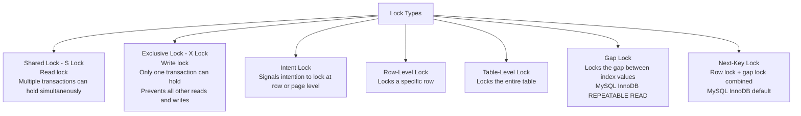

---

### Shared vs Exclusive Locks

| Scenario | Shared (S) Lock | Exclusive (X) Lock |
|---|---|---|
| Reading data | Acquired | Not acquired (unless `SELECT FOR UPDATE`) |
| Writing data | Not acquired | Acquired |
| Multiple readers | Allowed simultaneously | Not allowed |
| Writer + reader | Blocked | Blocked |
| Two writers | N/A | Blocked |

---

### Explicit Locking

```sql
-- Shared lock (lock for reading — block concurrent writes)
SELECT * FROM accounts WHERE account_id = 101 LOCK IN SHARE MODE;   -- MySQL
SELECT * FROM accounts WHERE account_id = 101 FOR SHARE;             -- SQL Standard

-- Exclusive lock (lock for writing — block concurrent reads AND writes)
SELECT * FROM accounts WHERE account_id = 101 FOR UPDATE;

-- Practical: safe read-then-update pattern
START TRANSACTION;

SELECT balance FROM accounts
WHERE account_id = 101
FOR UPDATE;  -- Acquires exclusive lock immediately

-- No other transaction can read or modify this row until we COMMIT
UPDATE accounts SET balance = balance - 5000 WHERE account_id = 101;
COMMIT;
-- Lock released on COMMIT
```

---

### Lock Granularity

| Level | Scope | Concurrency | Overhead |
|---|---|---|---|
| Row lock | Single row | Highest | Higher |
| Page lock | Data page (~16KB) | Medium | Medium |
| Table lock | Entire table | Lowest | Lowest |

> InnoDB uses **row-level locking** by default — highest concurrency for OLTP.
> MyISAM (old MySQL engine) uses table-level locking — bad for concurrency.

---

# 29. Deadlocks

### Definition

A **deadlock** occurs when two or more transactions are waiting for each other to release locks — creating a circular dependency where none can proceed.

---

### Deadlock Example

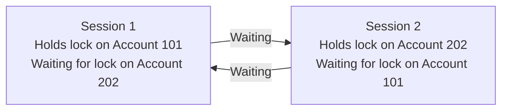

```sql
-- Session 1
START TRANSACTION;
UPDATE accounts SET balance = balance - 5000 WHERE account_id = 101;  -- locks row 101
-- Now waiting for row 202...
UPDATE accounts SET balance = balance + 5000 WHERE account_id = 202;

-- Session 2 (simultaneously)
START TRANSACTION;
UPDATE accounts SET balance = balance - 3000 WHERE account_id = 202;  -- locks row 202
-- Now waiting for row 101...
UPDATE accounts SET balance = balance + 3000 WHERE account_id = 101;

-- DEADLOCK: Session 1 holds 101, waiting for 202
--           Session 2 holds 202, waiting for 101
-- Neither can proceed → DBMS detects and kills one transaction
```

---

### How DBMS Resolves Deadlocks

- The DBMS **deadlock detector** runs periodically.
- It identifies circular wait chains.
- It automatically **rolls back one of the transactions** (the "victim" — usually the one with fewer changes).
- The victim receives a deadlock error.
- The other transaction proceeds to completion.

```sql
-- Error in the victim session:
-- ERROR 1213 (40001): Deadlock found when trying to get lock;
-- try restarting transaction
```

---

### Deadlock Prevention Strategies

```sql
-- Strategy 1: Always access tables/rows in the same order
-- BAD: Session 1 locks 101 then 202; Session 2 locks 202 then 101
-- GOOD: Both sessions always lock the lower account_id first

-- Strategy 2: Keep transactions short
-- Long transactions hold locks longer → higher deadlock risk
-- Do expensive computation BEFORE opening a transaction

-- Strategy 3: Use SELECT FOR UPDATE early
-- Acquire all needed locks at the start of the transaction
START TRANSACTION;
SELECT * FROM accounts WHERE account_id IN (101, 202) ORDER BY account_id FOR UPDATE;
UPDATE accounts SET balance = balance - 5000 WHERE account_id = 101;
UPDATE accounts SET balance = balance + 5000 WHERE account_id = 202;
COMMIT;

-- Strategy 4: Use lower isolation level when safe (READ COMMITTED)
-- Fewer locks needed → fewer deadlock opportunities

-- Strategy 5: Retry on deadlock (application-level)
-- Application catches ERROR 1213 and retries the transaction
```

---

### Detecting Deadlocks (MySQL)

```sql
-- View latest deadlock info (MySQL InnoDB)
SHOW ENGINE INNODB STATUS\G
-- Look for the LATEST DETECTED DEADLOCK section

-- View current locks
SELECT * FROM performance_schema.data_locks;
SELECT * FROM performance_schema.data_lock_waits;
```

---

# 30. MVCC — Multi-Version Concurrency Control

### Definition

**Multi-Version Concurrency Control (MVCC)** is a concurrency technique used by InnoDB (MySQL) and PostgreSQL to allow **readers and writers to not block each other**.

- Instead of locking rows when reading, the DBMS maintains **multiple versions** of each row.
- Readers see a **consistent snapshot** of the data as it existed when their transaction started.
- Writers create **new versions** of rows without overwriting old ones immediately.
- Old versions are cleaned up by a background process (**purge thread** in InnoDB, **VACUUM** in PostgreSQL).

---

### How MVCC Works

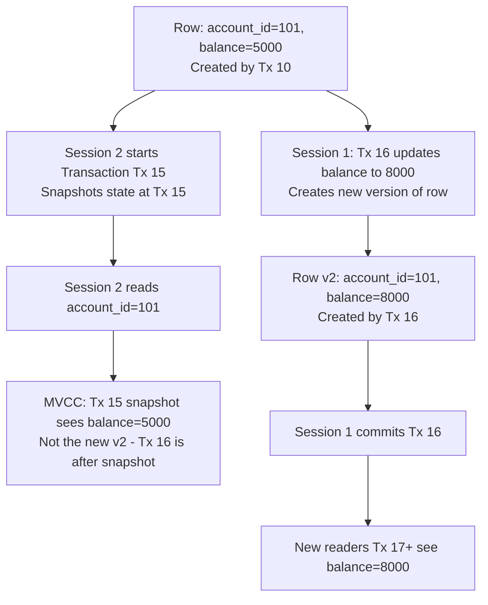

---

### MVCC Benefits

| Benefit | Detail |
|---|---|
| Readers don't block writers | SELECT never waits for UPDATE |
| Writers don't block readers | UPDATE never blocks SELECT |
| Consistent snapshots | Long queries see stable data |
| Reduced lock contention | MVCC replaces most read locks |

---

### MVCC in MySQL InnoDB

Every row in InnoDB has two hidden system columns:

| Column | Purpose |
|---|---|
| `DB_TRX_ID` | Transaction ID that last modified this row |
| `DB_ROLL_PTR` | Pointer to the undo log entry (previous version of this row) |

```sql
-- When a transaction reads a row:
-- 1. Check if DB_TRX_ID <= current transaction's snapshot ID
-- 2. If yes: this version is visible to us
-- 3. If no: follow DB_ROLL_PTR to the undo log to find the older version
-- 4. Repeat until a visible version is found
```

---

### MVCC vs Locking

| Scenario | Locking Approach | MVCC Approach |
|---|---|---|
| Read while write in progress | Reader waits for lock | Reader sees old version |
| Write while read in progress | Writer waits for lock | Writer creates new version |
| Consistent reads | Requires SERIALIZABLE locks | Free — uses snapshots |
| Overhead | Lock manager overhead | Undo log storage overhead |
| Concurrency | Lower | Higher |

---

### MVCC Cleanup

Old row versions accumulate in the undo log and must be cleaned up:

```sql
-- MySQL InnoDB: purge thread runs in background
-- It removes old row versions that are no longer needed by any active transaction
-- SHOW ENGINE INNODB STATUS\G  -- shows purge lag

-- PostgreSQL: VACUUM removes dead tuples
VACUUM employees;                -- Manual vacuum
VACUUM ANALYZE employees;        -- Vacuum + update statistics
VACUUM FULL employees;           -- Reclaims disk space (locks table)
-- Autovacuum daemon runs automatically in background
```

---

### Common Interview Questions

1. What is a view? How is it different from a table?
2. Can you INSERT or UPDATE data through a view?
3. What is `WITH CHECK OPTION` in a view?
4. What is a materialized view? How does it differ from a regular view?
5. How do you refresh a materialized view in PostgreSQL?
6. How would you simulate a materialized view in MySQL?
7. What is an index? Why do we use indexes?
8. What is the difference between a clustered and non-clustered index?
9. How many clustered indexes can a table have?
10. What is the leftmost prefix rule for composite indexes?
11. What is a covering index? Why is it beneficial?
12. What is a bitmap index? When would you use one?
13. What is the difference between a B+ Tree index and a Hash index?
14. Why is `ORDER BY RAND()` slow? How does it relate to indexes?
15. What does `EXPLAIN` show? What is the `type` column?
16. What is the difference between `type: ref` and `type: ALL` in EXPLAIN?
17. What is `Using index` vs `Using filesort` in EXPLAIN Extra?
18. What are ACID properties? Explain each with an example.
19. What is the difference between `COMMIT` and `ROLLBACK`?
20. What is a SAVEPOINT and when would you use it?
21. What are the four isolation levels? What problems does each prevent?
22. What is a dirty read? Non-repeatable read? Phantom read?
23. What is the difference between a shared lock and an exclusive lock?
24. What is a deadlock? How does MySQL handle it?
25. What is MVCC? How does it improve concurrency?

---

### Common Mistakes

- Creating indexes on every column — too many indexes hurt write performance.
- Applying functions to indexed columns in WHERE — prevents index usage.
- Using leading wildcards `LIKE '%term'` and expecting index usage.
- Creating indexes with the wrong column order for composite indexes.
- Not indexing foreign key columns in child tables.
- Assuming a view is always fresh — a standard view re-executes every time; a materialized view can be stale.
- Using `WITH CHECK OPTION` without understanding it prevents moving rows out of the view.
- Running long transactions without SAVEPOINTS — any error rolls back all work.
- Using `READ UNCOMMITTED` in production — dirty reads corrupt data.
- Not handling deadlock errors in application code — transactions should be retried on deadlock.
- Assuming `ROLLBACK` can undo DDL in MySQL — it cannot.
- Confusing isolation levels — REPEATABLE READ is MySQL default, READ COMMITTED is PostgreSQL default.

---

### Best Practices

- Every table should have a primary key — InnoDB uses it as the clustered index.
- Index all foreign key columns in child tables explicitly.
- Use composite indexes strategically — equality columns first, range columns last.
- Run `EXPLAIN` on every slow query before adding indexes.
- Use covering indexes for frequently executed report queries.
- Keep transactions short — acquire locks, do work, commit quickly.
- Always access tables in a consistent order to prevent deadlocks.
- Use `SELECT ... FOR UPDATE` to safely lock rows before modifying them.
- Use `SAVEPOINT` in complex stored procedures for granular error recovery.
- Use materialized views for expensive aggregations that do not need real-time freshness.
- Use `WITH CHECK OPTION` on updatable views to enforce data integrity.
- Rebuild or analyze indexes periodically to prevent fragmentation.

---

### Performance Tips

- Covering indexes eliminate the key lookup — the most impactful single-index optimization.
- `EXPLAIN ANALYZE` (MySQL 8.0+, PostgreSQL) shows actual row counts vs estimated — critical for tuning.
- InnoDB's Adaptive Hash Index (AHI) automatically caches hot B+ tree nodes as hash entries.
- Keep the clustered index narrow (`INT AUTO_INCREMENT`) to minimize secondary index size.
- Avoid `SELECT *` — fetching unnecessary columns prevents covering index usage.
- Partial indexes (PostgreSQL) index only a subset of rows — smaller and faster:
  ```sql
  CREATE INDEX idx_active_employees ON employees(department_id) WHERE is_active = TRUE;
  ```
- `ANALYZE TABLE` updates index statistics so the optimizer makes better decisions.
- Use `pt-query-digest` or `pg_stat_statements` in production to identify slow queries.

---

### Summary

| Concept | Key Takeaway |
|---|---|
| View | Virtual table — stores query, not data — re-executes each time |
| Updatable View | Single table, no aggregates — allows DML through it |
| WITH CHECK OPTION | Prevents DML that would remove rows from view's result set |
| Materialized View | Stores query result physically — needs refresh — supports indexes |
| View vs Materialized View | Real-time vs performance — choose based on freshness needs |
| Clustered Index | Table data IS the index — one per table — primary key in InnoDB |
| Non-Clustered Index | Separate structure — many per table — contains key + PK pointer |
| Composite Index | Multi-column — leftmost prefix rule — equality first, range last |
| Covering Index | All needed columns in index — no table lookup needed |
| Bitmap Index | Low cardinality columns — OLAP systems — not OLTP |
| Hash Index | O(1) equality lookups — no range support |
| EXPLAIN | Shows query execution plan — look for type=ALL and Using filesort |
| ACID | Atomicity, Consistency, Isolation, Durability |
| COMMIT | Permanently saves transaction changes |
| ROLLBACK | Undoes all changes since transaction start |
| SAVEPOINT | Partial rollback checkpoint within a transaction |
| Isolation Levels | READ UNCOMMITTED → READ COMMITTED → REPEATABLE READ → SERIALIZABLE |
| Dirty Read | Reading uncommitted data |
| Non-Repeatable Read | Same row returns different values in same transaction |
| Phantom Read | Same query returns different rows in same transaction |
| Deadlock | Circular lock wait — DBMS detects and kills one transaction |
| MVCC | Readers and writers don't block each other — snapshot-based reads |

---

# 31. Practice Questions

1. Create a view called `high_earners` that shows employees earning above the company average salary, including their department name. Then query it to find high earners in the Engineering department.

2. Create an updatable view on the `employees` table that shows only active Engineering employees. Add `WITH CHECK OPTION` and demonstrate what happens when you try to move an employee to another department through the view.

3. A `reports` table is queried 10,000 times per day with:
   ```sql
   SELECT department_id, SUM(revenue), AVG(revenue), COUNT(*)
   FROM reports
   WHERE report_date >= '2024-01-01'
   GROUP BY department_id;
   ```
   Should you use a view or a materialized view? Justify your answer and write the appropriate SQL.

4. Explain what happens step-by-step when this query runs and an index exists on `salary`:
   ```sql
   SELECT first_name, salary FROM employees WHERE salary BETWEEN 80000 AND 100000;
   ```

5. A table has the following index: `CREATE INDEX idx ON orders(status, region, order_date)`. Which of these queries will use the index efficiently?
   - `WHERE status = 'pending'`
   - `WHERE region = 'North'`
   - `WHERE status = 'pending' AND region = 'North'`
   - `WHERE status = 'pending' AND order_date > '2024-01-01'`
   - `WHERE region = 'North' AND order_date > '2024-01-01'`

6. Design the optimal index for this query and explain your reasoning:
   ```sql
   SELECT employee_id, first_name, salary
   FROM employees
   WHERE department_id = 1
     AND is_active = TRUE
   ORDER BY salary DESC;
   ```

7. Run `EXPLAIN` on two versions of the same query — one using `YEAR(hire_date) = 2020` and one using a date range. Describe the expected difference in the `type` and `Extra` columns.

8. Write a complete bank transfer transaction between two accounts that:
   - Uses `SELECT ... FOR UPDATE` to safely lock both accounts.
   - Checks that the sender has sufficient balance.
   - Uses `SAVEPOINT` so the sender's deduction can be rolled back independently.
   - Commits only if both operations succeed.

9. Explain dirty reads, non-repeatable reads, and phantom reads using a bank account scenario. Which isolation level prevents each?

10. Two sessions run simultaneously:
    - Session A: `UPDATE products SET stock = stock - 1 WHERE product_id = 5`
    - Session B: `UPDATE products SET stock = stock - 1 WHERE product_id = 5`
    What happens? Is this a deadlock or a different concurrency problem? How do you solve it?

11. Describe a deadlock scenario involving three tables: `orders`, `inventory`, and `payments`. How would you prevent it?

12. What is the MySQL InnoDB default isolation level? What concurrency problems does it prevent? What problems could still theoretically occur (without InnoDB's gap lock enhancement)?

13. A table `events` has 50 million rows. A nightly report runs:
    ```sql
    SELECT region, COUNT(*), SUM(revenue)
    FROM events
    WHERE event_date >= '2024-01-01'
    GROUP BY region;
    ```
    Design a complete optimization strategy using indexes, materialized views, or summary tables.

14. Explain MVCC and how it allows a `SELECT` to run without blocking a concurrent `UPDATE` in InnoDB.

15. A junior developer created 15 indexes on a high-traffic `orders` table to speed up reads. New orders are being inserted at 500/second and the system is now slow. Explain what is happening and how you would fix it.

---

> **File 07 Complete — Views, Indexes, and Transactions**
> **Next: File 08 — Normalization, Advanced SQL, and Query Optimization**
