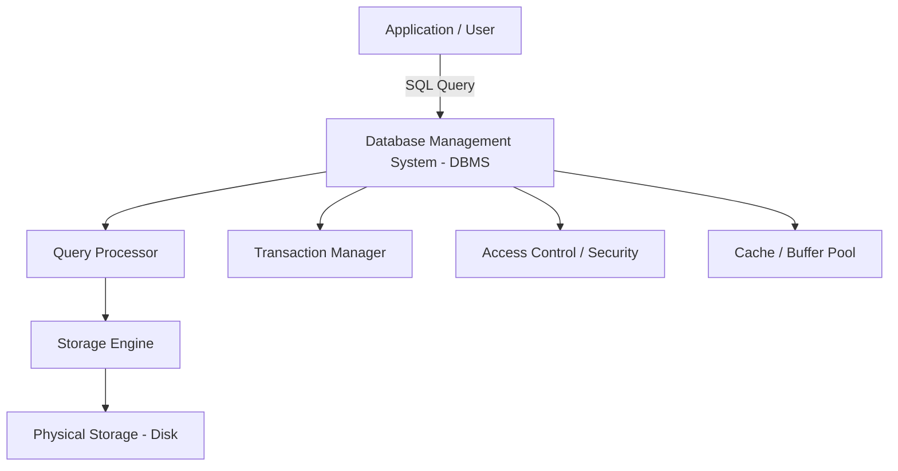
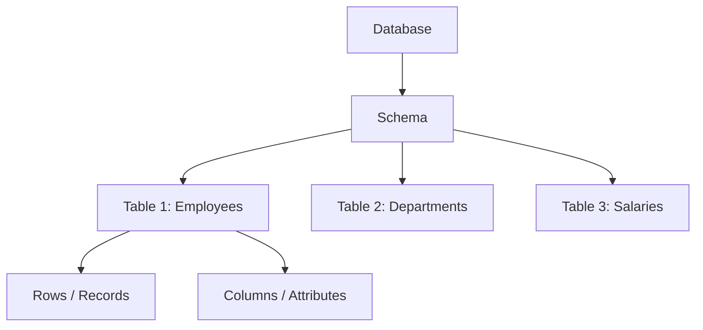
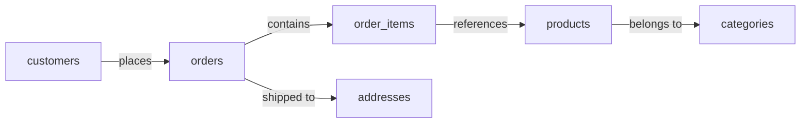
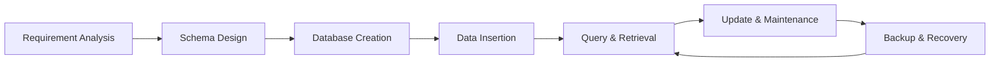

# SQL Handbook for Interviews
## Chapter 2 — What is a Database?

---

## 2. What is a Database?

---

### Definition

A **database** is an organized collection of structured data stored electronically so that it can be easily accessed, managed, and updated.

- A database is not just a file or a spreadsheet.
- It is a **system** designed to store large volumes of data reliably, consistently, and efficiently.
- Databases are managed by software called a **Database Management System (DBMS)**.

---

### Why Do We Use a Database?

Without a database, data lives in files, spreadsheets, or memory — all of which fail at scale.

| Problem Without a Database | How a Database Solves It |
|---|---|
| Data scattered across files | Centralized, organized storage |
| No multi-user access | Concurrent access with access control |
| Data duplication everywhere | Normalization removes redundancy |
| No data validation | Constraints enforce data integrity |
| Hard to search large files | Indexes enable fast queries |
| No crash recovery | Transactions and backups protect data |
| No security | Role-based access control |

---

### When Should We Use a Database?

Use a database when:

- Your application needs to **persist data** beyond a session.
- Multiple users or services need to **read/write data simultaneously**.
- You need to **search, filter, or aggregate** large amounts of data.
- Data **relationships** exist (e.g., customers have orders, orders have products).
- You need **data integrity**, **security**, or **audit trails**.
- You are building **reports, dashboards, or ML pipelines**.

---

### Types of Databases

#### 1. Based on Data Model

| Type | Description | Examples |
|---|---|---|
| **Relational (SQL)** | Data in tables with rows and columns | MySQL, PostgreSQL, SQL Server, Oracle |
| **Document** | Data stored as JSON/BSON documents | MongoDB, CouchDB |
| **Key-Value** | Simple key-value pairs | Redis, DynamoDB |
| **Columnar** | Data stored column-by-column | Apache Cassandra, BigQuery |
| **Graph** | Data as nodes and edges | Neo4j, Amazon Neptune |
| **Time-Series** | Optimized for time-stamped data | InfluxDB, TimescaleDB |
| **Search Engine** | Optimized for full-text search | Elasticsearch, Solr |

> In SQL interviews, the focus is always on **Relational Databases**.

---

#### 2. Based on Location

| Type | Description |
|---|---|
| **Centralized** | Single server holds all data |
| **Distributed** | Data spread across multiple servers/locations |
| **Cloud** | Hosted on cloud (AWS RDS, Google BigQuery, Azure SQL) |

---

#### 3. Based on Purpose

| Type | Description | Example Use Case |
|---|---|---|
| **OLTP** | Online Transaction Processing — fast reads/writes | Banking, E-commerce |
| **OLAP** | Online Analytical Processing — complex aggregations | Data Warehouse, Reporting |
| **HTAP** | Hybrid — both OLTP and OLAP | Modern cloud databases |

---

### Database Architecture



---

### How Data is Organized in a Relational Database



- A **Database** contains one or more **Schemas**.
- A **Schema** contains **Tables**.
- A **Table** contains **Rows** (records) and **Columns** (attributes).
- Each **Row** is a single data entry.
- Each **Column** defines the type of data stored.

---

### Example

A company stores employee data in a relational database:

**Database:** `company_db`  
**Table:** `employees`

| employee_id | name        | department | salary  | hire_date  |
|-------------|-------------|------------|---------|------------|
| 1           | Alice Brown | Engineering| 95000   | 2020-03-15 |
| 2           | Bob Smith   | Marketing  | 72000   | 2019-07-01 |
| 3           | Carol White | Engineering| 105000  | 2018-11-20 |

```sql
-- Querying the database
SELECT name, salary
FROM employees
WHERE department = 'Engineering';
```

**Output:**

| name        | salary |
|-------------|--------|
| Alice Brown | 95000  |
| Carol White | 105000 |

---

### Real-World Example

**E-commerce Platform (like Amazon)**



Each of these is a **table** inside the same database.  
They are connected using **keys** (Primary Key → Foreign Key).  
This is the foundation of a **Relational Database**.

---

### OLTP vs OLAP — Key Distinction

This is a very common interview topic.

| Feature | OLTP | OLAP |
|---|---|---|
| Purpose | Day-to-day transactions | Analytics and reporting |
| Query Type | Simple INSERT, UPDATE, SELECT | Complex aggregations, GROUP BY |
| Data Volume | Thousands of rows | Millions to billions of rows |
| Response Time | Milliseconds | Seconds to minutes |
| Example | Order placement | Monthly sales report |
| Database | MySQL, PostgreSQL | BigQuery, Redshift, Snowflake |
| Normalization | Highly normalized | Denormalized (Star/Snowflake Schema) |

---

### Database Lifecycle



---

### Common Interview Questions

1. What is a database? How is it different from a spreadsheet?
2. What is the difference between a database and a DBMS?
3. What are the different types of databases?
4. What is the difference between OLTP and OLAP?
5. What is a relational database? Why is it the most widely used?
6. What is a schema in a database?
7. What is the difference between SQL and NoSQL databases?
8. When would you choose a NoSQL database over a relational database?
9. What is a distributed database?
10. What are the advantages of storing data in a database vs flat files?
11. What is a cloud database? Give examples.
12. What is a data warehouse? How is it different from a regular database?

---

### Common Mistakes

- Confusing a **database** with a **DBMS** — the database is the data itself; the DBMS is the software managing it.
- Assuming all databases are relational — **MongoDB, Redis, Cassandra** are all databases but not relational.
- Mixing up **OLTP** and **OLAP** — very commonly tested in data engineering interviews.
- Thinking a **schema** and a **database** are the same thing — a database can contain multiple schemas.
- Using a database for everything — sometimes a **cache (Redis)** or **message queue (Kafka)** is more appropriate.

---

### Best Practices

- Always design your database schema **before** writing any code.
- Choose the **right type of database** based on the use case (relational vs document vs columnar).
- Separate your **OLTP** (operational) database from your **OLAP** (analytical) database in production systems.
- Use **naming conventions** consistently: `snake_case` for table and column names.
- Always plan for **backups, replication, and failover** from day one.
- Never store **application logic** inside the database unless absolutely necessary.

---

### Performance Tips

- Relational databases perform best when the schema is **well-normalized** for OLTP workloads.
- For **read-heavy analytical** workloads, consider columnar storage (BigQuery, Redshift).
- Use **connection pooling** to avoid the overhead of opening/closing database connections on every request.
- Place the database server **close to the application server** to minimize network latency.

---

### Important Notes

- In **SQL interviews**, when they say "database," they almost always mean a **relational database**.
- For **AI/ML roles**, databases are used to store training datasets, feature stores, and experiment logs.
- For **Data Engineering roles**, understanding the difference between **OLTP, OLAP, Data Lakes, and Data Warehouses** is critical.
- For **Backend roles**, focus on **OLTP databases**, **transactions**, and **query optimization**.

---

### Summary

| Concept | Key Takeaway |
|---|---|
| Database | Organized collection of structured data |
| DBMS | Software that manages the database |
| Relational Database | Data stored in tables with relationships |
| Schema | Logical container for tables |
| OLTP | Fast transactional reads/writes |
| OLAP | Complex analytics on large datasets |
| SQL Focus | Relational databases using SQL |

---

### Practice Questions

1. Define a database and give three real-world examples.
2. What are the main differences between a relational and a non-relational database?
3. You are building a ride-sharing app like Uber. What type of database would you use for trips data? What about analytics?
4. Draw or describe the structure of a simple hospital database with at least 4 tables.
5. What is the difference between a database, a schema, and a table?
6. Why would a company use both a MySQL database and a BigQuery warehouse?
7. What is the role of a DBMS? List three examples of DBMS software.
8. Explain OLTP vs OLAP with a banking example.
9. What is a distributed database? Why is it needed?
10. A startup stores all data in Excel sheets. What problems will they face as they scale?

---

> **Chapter 2 Complete.**
> **Next: Chapter 3 — What is a DBMS?**
